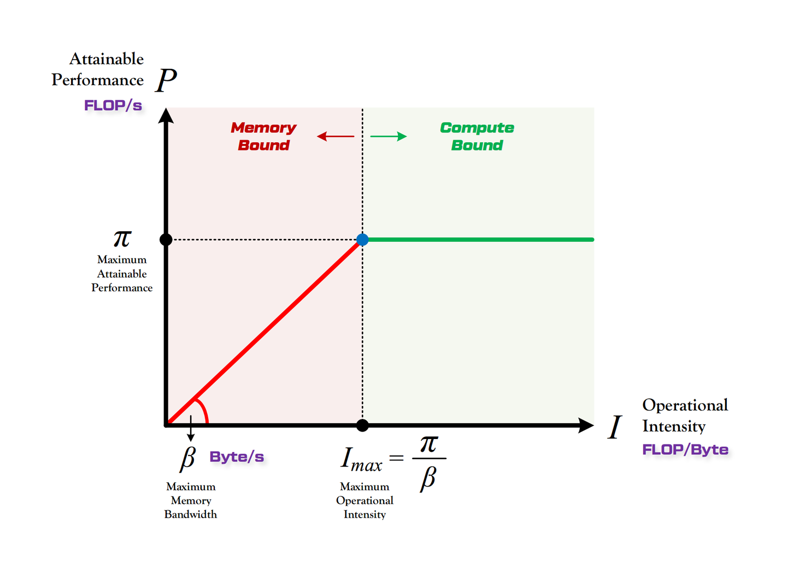
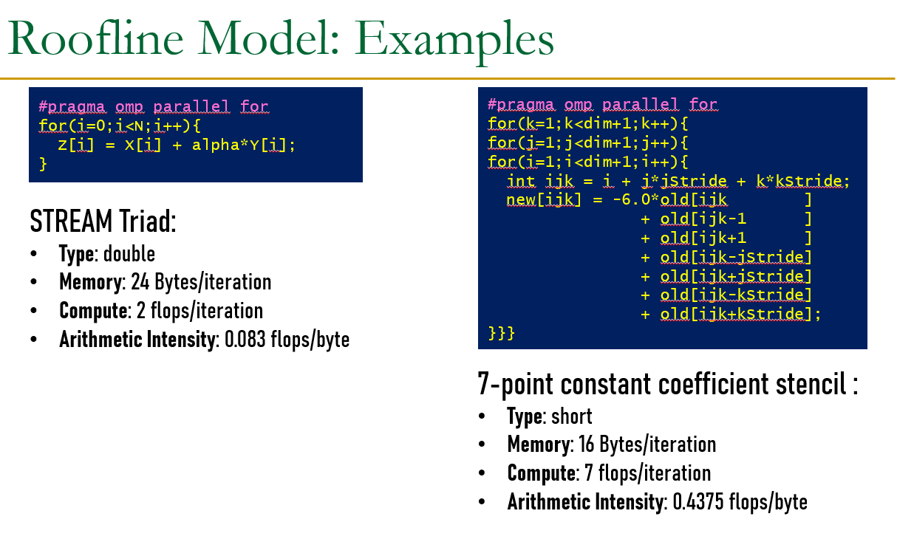
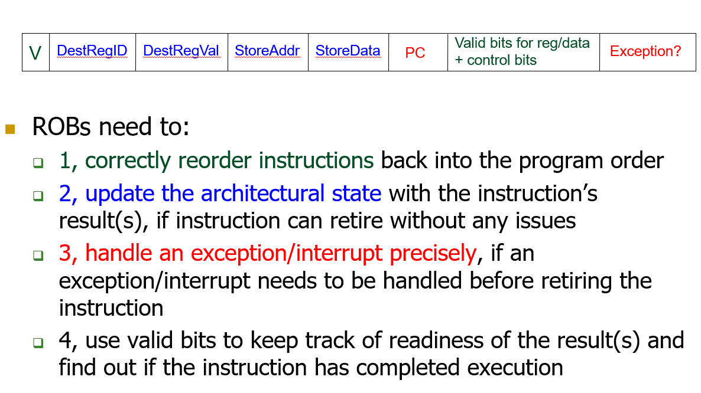
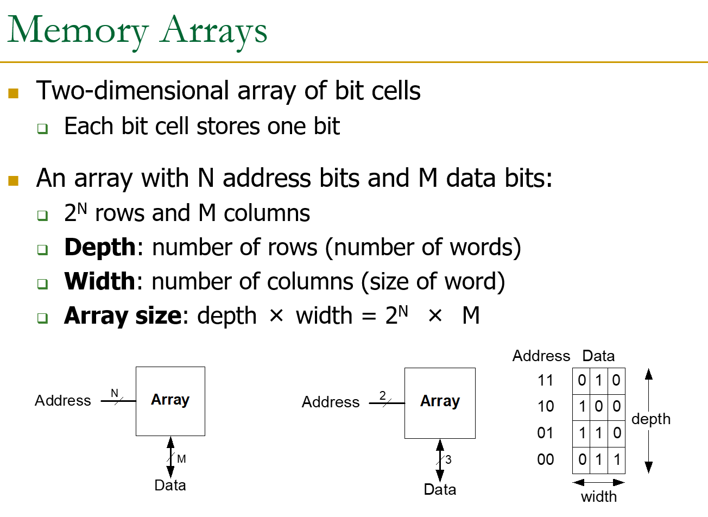
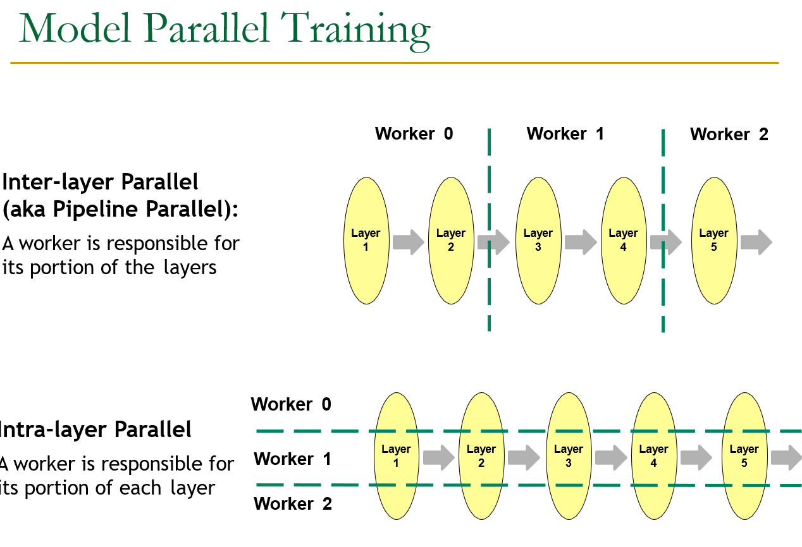
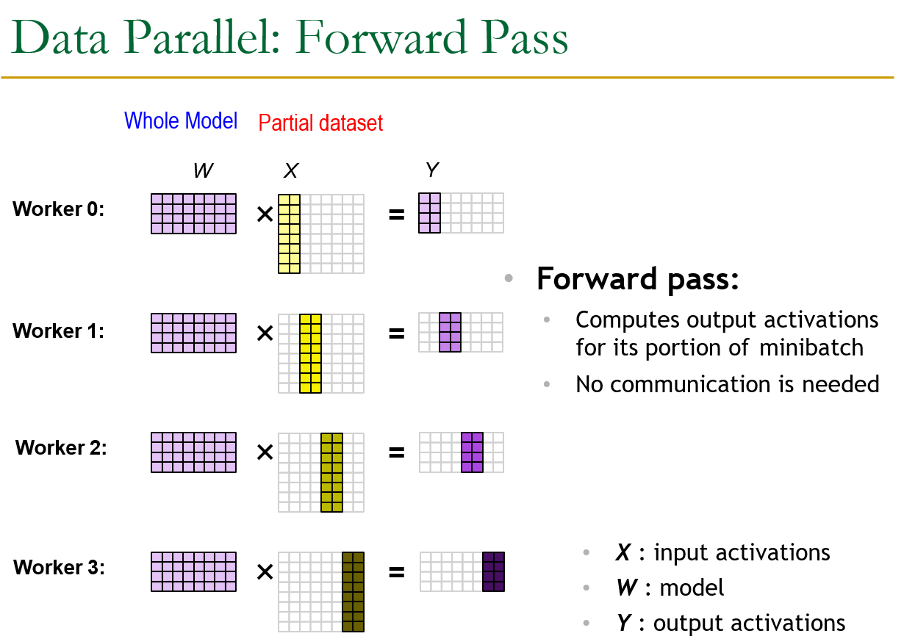

> Did I ever make it through?

# 人工智能芯片与系统

> 任课教师：王则可

## Overview

### Amdahl's Law

$$
Speedup = \frac{1}{1-f + \frac{f}{n}}
$$

- $f$ 是程序中可并行化的比例，$n$ 是处理器数量。

### Roofline Model

模型（或程序）的实际表现受制于硬件固有的计算能力上限（Roofline 中由性能上限与带宽上限计算得出）

- 性能上限（峰值算力）：$\pi$，指一个计算硬件单位时间内（每秒）能够执行的最大浮点运算次数（FLOPS）（单位为 FLOP/秒）。
- 带宽上限（内存带宽）：$\beta$，指一个计算硬件单位时间内（每秒）能够进行的内存交换量（单位为 Bytes/秒）。

计算能力（AI，Arithmetic Intensity）：$AI = \frac{\pi}{\beta}$，指在这个计算硬件上，每字节内存交换最多能用来做多少次浮点运算。

- Large AI: Computation bound，计算受限于算力。
- Small AI: Memory bound，计算受限于内存带宽。



图像中，横轴为计算能力（AI），纵轴为吞吐量（Throughput），红色区域吞吐量由带宽上限决定（也就是斜率），绿色区域吞吐量由性能上限决定，此时 $Throughput = \pi$；两个区域交点的横坐标就是最大计算能力：$\max AI = \frac{\pi}{\beta}$。

!!! example "Roofline example"
    

### Little's Law

$$
L(buffer \space size / Concurrency) = \lambda(throughput) W(Latency)
$$

### 冯诺依曼模型

- Stored Program
    - 指令存储在线性内存序列中
    - 数据和指令在内存中是 **Unified** 的
        - 即，由控制信号决定读到的 value 是指令还是数据
- Sequential instruction processing
    - 同一时间只有一条指令在执行
    - Program Counter（PC）指向当前的指令
    - 除了控制转移（Control Transfer）指令外，PC 每次 Sequentially 地向前更新

## CPU Design

定义一个计算机的 Architectural State（架构状态）（程序员可见），下面是 CPU 的设计逻辑：

- 单周期（每个指令消耗一个时钟周期）
    - AS -> Process inst in 1 cycle -> AS'
- 多周期
    - 减短时钟周期
    - 每条指令消耗多个时钟周期，多次更改 AS
    - AS -> AS + MS1 -> AS + MS2 -> ... -> AS'
    - 但从 ISA 的角度，AS 仍然是从 AS -> AS'，中间的 MS1, MS2, ... 是不可见的
        - ISA 由指令和 AS 直接决定 AS'
- 流水线 CPU（For higher throughput）
    - 我想我兄弟计算机系统了
    - Instructions consecutive in program order are processed in consecutive stages

流水线 CPU 会遇到数据依赖问题

- Flow Dependence（RAW，True data dependence）
    - 硬件 Stall
        - 插入 nop 等到寄存器中值可用时继续流动
    - 软件 Stall（Static Scheduling）
        - 由编译器编排指令，硬件按这个顺序执行指令
            - 区别于动态调度（Dynamic Scheduling），在动态调度中硬件可以不按编译器指定的顺序执行指令
        - 在运行时决定的信息（Variable-length operation latency, memory addr, branch direction），编译器不知道，导致静态调度的实现困难
            - 通过 Profiling 解决
    - Forwarding（有时候无法 Forwarding）
        - ```
            // Forwarding logic for ForwardAE (pseudo code):
            if ((rsE != 0) AND (rsE == WriteRegM) AND RegWriteM) then
                ForwardAE = 10  # forward from Memory stage
            else if ((rsE != 0) AND (rsE == WriteRegW) AND RegWriteW) then
                ForwardAE = 01  # forward from Writeback stage
            else
                ForwardAE = 00  # no forwarding
            ```
- Output Dependence（WAW）
- Anti Dependence（WAR）

后两种依赖可以通过寄存器重命名（Register Renaming）来解决，亦即接下来介绍的 ROB（Reorder Buffer）。

### Reorder Buffer

1. 不同的指令需要不一定相同的时钟周期数进行执行
    - Ans：设置不同的 Function Unit（FU），每种 FU 以不同的时钟周期数执行不同的指令
2. 如何处理 Exceptions/Interrupts
    - Exceptions：内部原因导致
    - Interrupts：外部原因导致

总的来说分为以下三步：

1. In-Order Decode：指令解码后在 ROB 中记录下顺序的 Entry
2. Out-of-Order Execution：指令在 FU 中可乱序执行，ROB 中的 Entry 记录下执行结果
3. In-Order Commit：ROB 中最早的指令完成且没有异常时，才将结果写回寄存器堆

!!! note "ROB Entry"
    

每次访问寄存器堆时，如果其不可用，就记录下当前需要的寄存器值在 ROB 中的位置。

ROB 可彻底解决 WAW 和 WAR

### Performance Analysis

- CPI：Cycles Per Instruction，每条指令平均消耗的时钟周期数。
- 每条指令的执行时间：CPI * Clock Cycle Time
- 整个程序的执行时间：CPI * AVG Clock Cycle Time * Instruction Count

单周期 CPU 的 CPI = 1，时钟周期很长；多周期 CPU 的 CPI > 1，时钟周期较短；

## 并行

### Tomasulo's Algorithm(Inter-instruction parallelism)

面对 RAW 时，即便利用 ROB 乱序执行顺序写入的特性，有些情况下也需要 Stall；Tomasulo 算法引入 Out-of-Order Dispatch（Dispatch：将一条指令发送到 FU）

> Independent inst 被与 Dependent inst 分开执行

引入 Reservation Station（RS）来解决这个问题，每个 FU 对应一个 RS，RS 记录下指令的操作数，在 FU 可用且操作数可用时，指令就可以被发送到 FU 执行。

### Superscalar(Inter-instruction parallelism)

Superscalar：在一个时钟周期 Fetch、Decode、Execute、Retire 多条指令（N-wide superscalar = N instructions per cycle）

- Pros：Higher IPC
- Cons：More hardware; 检测 Dependence 更复杂

### SIMD(Intra-instruction parallelism)

- SISD：Single Instruction operates on Single Data elem
- SIMD：Single Instruction operates on Multiple Data elems
    - Array/Vector Processor
- MISD：Multiple Instruction operates on Single Data elem
    - Systolic Array
- MIMD：Multiple Instruction operates on Multiple Data elems
    - Multi-core Processor
    - Multithreaded Processor

!!! note "Warp-based SIMD vs. Traditional SIMD"
    - Traditional SIMD:
        - 只包含一个线程
        - 指令线性执行
        - Programming Model：SIMD
        - ISA 含有 SIMD 指令
    - Warp-based SIMD:
        - 包括多个 scalar 线程，以 SIMD 方式执行
        - 每个线程可被单独处理
        - ISA 指令是 Scalar 的：SIMD 指令被动态构造
        - SPMD Model based on SIMD Hardware

## Memory

### SRAM

Relatively fast, only one data word at a time; expensive

#### Memory Arrays

如何高效地利用 Memory 存储大量数据



即每行存储一个长度为 M 比特的数据字（Data Word）

### DRAM

DRAM访问的三种状态

| 状态 | 含义 | 延迟 |
|------|------|------|
| **Page Hit** | 访问已打开的行 | 最小 |
| **Page Closed** | 访问关闭的bank中的行 | 中等（需ACTIVATE） |
| **Page Miss** | 访问的行不是bank中当前打开的行 | 最大（需PRECHARGE + ACTIVATE） |

64位数据进入一个Rank，一个 Rank 包含八个 Chip（每 8 位数据进入一个 Chip），每个 Chip 包含八个 Bank（八位数据进入每个 Bank）

!!! note "DRAM Refresh"
    DRAM 电容随时间会漏电，Memory Controller 需要定期刷新每一行来充电（Activate each row every N ms），否则数据会丢失。

    - Refresh 的缺点：
        - Refresh 期间无法访问 DRAM 的 rank/bank
        - Refresh 耗能
        - Long pause time in DRAM refresh

### SSD

### Hard-Disk

## Cache

> 本段内容由 AI 生成

两种局部性

- **时间局部性 (Temporal Locality)**: 刚访问的数据很可能再次被访问
- **空间局部性 (Spatial Locality)**: 刚访问数据附近的数据很可能被访问

### Cache 基本概念

**Cache Block（缓存行/块）**: Cache中存储的基本单元

**关键设计决策**:
1. **Placement**: 块放在哪里？（映射方式）
2. **Replacement**: 替换哪个块？（替换策略）
3. **Granularity**: 块多大？
4. **Write Policy**: 写操作怎么处理？
5. **Instructions/Data**: 指令和数据是否分开？

### 三种Cache映射方式

| 映射方式 | N（路数） | S（组数） | 特点 |
|----------|----------|----------|------|
| **直接映射 (Direct-mapped)** | N=1 | S=B | 每块只有1个位置，冲突多 |
| **组相联 (Set-associative)** | 1<N<B | S=B/N | 每组N个位置，最常用 |
| **全相联 (Fully-associative)** | N=B | S=1 | 任意位置可放，最灵活最贵 |

**Cache参数**:

    ```
    C = 总容量
    b = 块大小
    B = C/b = 总块数
    N = 相联度（每组块数）
    S = B/N = 组数
    ```

**地址划分**: `[tag | index | byte offset]`

- index: 选择哪个组
- tag: 在组中匹配
- byte offset: 块内偏移

### 三种Cache Miss

| Miss类型 | 含义 | 解决方法 |
|----------|------|---------|
| **Compulsory Miss** | 首次访问某块，必然不命中 | 增大块大小（预取） |
| **Capacity Miss** | Cache容量不够 | 增大Cache |
| **Conflict Miss** | 多个块映射到同一位置 | 提高相联度 |

### 替换策略

1. 先替换无效块
2. 若全有效: Random / FIFO / **LRU**（最近最少使用）/ 混合策略

### 写策略

Step1：如果数据不在 Cache 中，以下两种策略选其一：

| | Write-allocate | Write-no-allocate |
|---|---|---|
| **写操作** | 先将数据块读入 Cache，再写 | 直接写内存，不分配 Cache 数据 |


Step2：如果数据在 Cache 中，以下两种策略选其一：

| | Write-back | Write-through |
|---|---|---|
| **写操作** | 只写Cache | 同时写Cache和内存 |
| **优点** | 节省带宽，可合并多次写 | 简单，一致性更好 |
| **缺点** | 需要dirty bit | 更多内存带宽，不能合并写 |
| **分配策略** | Write-allocate（默认） | Write-no-allocate（PCIe/IO） |

### Cache一致性（Cache Coherence）

**问题**: 多个处理器核心各自有Cache，如何保证同一地址的数据一致？

**三个组件**:
1. **Interconnect（互联）**: Snoop（总线监听） vs Directory（目录）
2. **Updating Policy（更新策略）**: Invalidate（作废） vs Update（更新）
3. **Cache Tags（标签协议）**: MSI → MESI → MOESI

#### Snoop vs Directory

| | Snoop（监听） | Directory（目录） |
|---|---|---|
| **序列化点** | 总线（全局单点） | 每块一个（分布在各节点） |
| **通信方式** | 广播 | 点对点 |
| **扩展性** | 差（总线瓶颈） | 好 |
| **代表** | 小规模多核系统 | 大规模多核/多路系统 |

#### Invalidate vs Update

| | Invalidate | Update |
|---|---|---|
| **操作** | 使其他副本失效 | 更新所有副本 |
| **带宽** | 更少（一次失效+后续本地访问） | 更多（每次写都广播新值） |

#### MSI协议

| 状态 | 含义 | 读 | 写 |
|------|------|----|-----|
| **M (Modified)** | 仅1个Cache有，已修改 | 本地读，无需总线 | 本地写，无需总线 |
| **S (Shared)** | 多个Cache有，干净的 | 本地读，无需总线 | 需总线Invalidate |
| **I (Invalid)** | 不在Cache中 | 需从内存/其他Cache读 | 需获取M状态 |

#### MESI协议（Illinois Protocol, ISCA 1984）

在MSI基础上增加**E (Exclusive)**状态:

| 状态 | 含义 |
|------|------|
| **M** | 仅1个Cache有，已修改，可本地读写 |
| **E** | 仅1个Cache有，干净，可本地读写 |
| **S** | 多个Cache有，干净，只能本地读 |
| **I** | 不在Cache中 |

**MESI优于MSI的关键**: 
- 从E→M不需要总线Invalidate（因为只有一份副本！）
- 减少了不必要的总线流量

### 内存一致性（Memory Consistency）

> Coherence ≠ Consistency!

**Cache Coherence**: 不同处理器对**同一内存地址**的操作排序

**Memory Consistency**: 不同处理器对**所有内存地址**的操作的全局排序

**四种内存屏障（Memory Barrier / Fence）**:

| 屏障类型 | 含义 |
|----------|------|
| **Load-Load** | 屏障前的Load不能排到屏障后的Load之后 |
| **Load-Store** | 屏障前的Load不能排到屏障后的Store之后 |
| **Store-Store** | 屏障前的Store不能排到屏障后的Store之后 |
| **Store-Load** | 屏障前的Store不能排到屏障后的Load之后 |

**一致性与屏障的关系**:
| 模型 | Load-Load | Load-Store | Store-Store | Store-Load | 代表CPU |
|------|-----------|------------|-------------|------------|---------|
| **Sequential Consistency** | ✓ | ✓ | ✓ | ✓ | Dual 386 |
| **Total Store Order (TSO)** | ✓ | ✓ | ✓ | ✗ | x86/64 |
| **Partial Store Order (PSO)** | ✓ | ✓ | ✗ | ✗ | ARM |
| **Relaxed/Weak** | ✗ | ✗ | ✗ | ✗ | DEC Alpha |

- 越强的内存模型 → 性能越低/开销越大，但程序员生活越简单

## AI Chips

## Parallel Training

- Model Parallelism
    - 
- Data Parallelism
    - Forward Pass: 每个 GPU 计算不同数据的 Forward Pass
        - 
        - 权重更新：每个 Worker 根据从 N-1 个 Peers 那里收集到的梯度加和，并更新自己 Model Copy 的权重
    - **Strong Scaling**（固定batch size增加Worker）: Batch Normalization需要最小batch size（如16+）
    - **Weak Scaling**（增加Worker和batch size）: 大batch训练需调整超参数