# 人工智能逻辑

> 任课教师：廖备水

!!! note "Reference"
    我抄了很多：<https://tekhnec.github.io/categories/>

??? note "课后作业"
    - [HW1](./assets/3230105892_高玮轩_第一次课后练习.pdf)
    - [HW2](./assets/3230105892_高玮轩_第二次课后练习.pdf)
    - [HW3](./assets/3230105892_高玮轩_第三次课后练习.pdf)
    - [HW4](./assets/3230105892_高玮轩_第四次课后练习.pdf)
    - [HW5](./assets/3230105892_高玮轩_第五次课后练习.pdf)
    - [HW6](./assets/3230105892_高玮轩_第六次课后练习.pdf)
    - [HW7](./assets/3230105892_高玮轩_第七次课后练习.pdf)
    - [HW8](./assets/3230105892_高玮轩_第八次课后练习.pdf)
    - [HW9](./assets/3230105892_高玮轩_第九次课后练习.pdf)
    - [HW10](./assets/3230105892_高玮轩_第十次课后练习.pdf)
    - [HW11](./assets/3230105892_高玮轩_第十一次课后练习.pdf)
    - [HW12](./assets/3230105892_高玮轩_第十二次课后练习.pdf)
    - [HW13](./assets/3230105892_高玮轩_第13次课后练习.pdf)

> 这些文字，我看不懂

## Lec1: Introduction

### 推理形式

1. 演绎推理
    - “保真”：若前提为真，则结论必为真
        - 这也是其有效性的描述：演绎论证是**有效的**当且仅当它是保真的
        - !!! definition "论证形式"
            豆子&袋子的例子可看作演绎推理的一个实例  
            **演绎论证的形式**即用字母表示。  
            一个论证形式是有效的当且仅当对该论证形式中的变项所做的任一解释都满足保真性。
    - 从一般原理到特殊情况（类似集合中不断取子集）
2. 非单调推理
    - 对于任何命题，若依据某个知识库中的知识均可以明确判断其真假时，知识库中知识是**完备的**
    - 在上面的演绎推理中，每条命题都蕴含着知识，如果其知识不完备或不确定，则无法直接套用，得到正确结论。
        - **不确定性**：缺少准确的知识得到完全可靠的结论
        - **不完备性**：缺失部分信息
    - 为了解决这种问题，可以在演绎推理中添加**正常性假设**（基于假设的演绎推理）
        - 鸟会飞，除非证明它不正常
        - Tweety是鸟（可以被“证明Tweety不正常”推翻）
        - 所以Tweety会飞
    - 假设会被新信息推翻，从而结论也会被推翻
    - 称这种结论可被推翻的推理为**非单调推理**
    - 可以把包含例外的知识表示为**可废止规则**，可看作“常识”，可能有例外。
        - **一般情况下**，如果A则B（B可被反面证据推翻）
3. 归纳推理
    - 从特定事例观察推断出一般规律
    - 用归纳强度刻画归纳论证的好坏
4. 溯因推理
    - 观察现象寻找合理解释
5. 关于论证的推理
    - 论辩图怎么画

### AIL的主要研究方向

what is this

## Lec2: 知识的表示与推理

### 知识表示语言

- **表示**：用一个集合的元素来表示一个集合的元素
    - 一种表示知识的语言由**初始符号列表**和**语法规则**组成
- 公式表示：$\{\neg, \land, \lor, (, )\}$
- 有向图表示：$G = \{V, E\}$

用特定符号语言描述的公式或结构，由我们对公式/结构中的元素所做的不同解释，可表示现实世界中的不同知识。

### 推理

- 符号级推理：形式上的计算
    - 一阶逻辑中最基本的规则是**肯定前件式**（MP规则）：$a \rightarrow b, a \vdash b$，$\vdash$ 表示**形式可推演关系**。
- 知识级推理：推理的前提与结论在语义上的映射关系
    - 在经典演绎推理中表现为**语义蕴涵关系**：若 $a \models b$，则当前提 $a$ 为真，结论 $b$ 为真
    - 在论证推理中，不一定是语义蕴含，需要建立的是从论证图到可接受的论证集合的映射关系

### 推理系统的特性

- 系统内特性：一个逻辑系统内部各个成分具有的特定性质，如演绎系统中，包括有效的语义蕴涵模式、正确的推理形式等。
- 系统元特性：
    - 完备性：给定前提集合 $\Gamma$，若其语义蕴含（$\models$）公式 $A$，那么从形式上可以从 $\Gamma$ 推出 $A$（$\vdash$）。
    - 可靠性：给定前提集合 $\Gamma$，若其可从形式推出（$\vdash$）公式 $A$，那么其语义蕴含（$\models$）公式 $A$。

## Lec3: 命题逻辑

!!! defination "命题公式"
    1. 命题符号（就是用个字母表示的命题）是公式（原子公式）。
    2. 若 $A$ 是公式，则 $\neg A, (A \land B), (A \lor B), (A \rightarrow B), (A \leftrightarrow B)$ 也是公式。
    3. 有限次使用 1 和 2 的规则，得到的都是公式。

联结词：$\neg, \land, \lor, \rightarrow, \leftrightarrow$

真假赋值：对命题符号赋予真假值（即一个函数，定义域是命题符号集合，值域是 $\{0, 1\}$（感觉就是命题的真假））

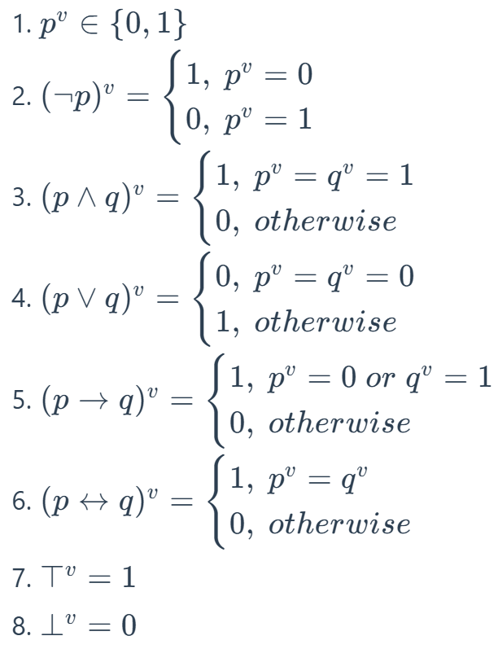

!!! defination "逻辑推论"
    给定一组命题公式集合 $\Phi$ 和一个命题公式 $\phi$，则 $\phi$ 是 $\Phi$ 的逻辑推论，当且仅当 $\forall v, \Phi^v = 1 \Rightarrow \phi^v = 1$，记作 $\Phi \models \phi$。

    类似蕴涵式，如果 $\Phi^v = 0$，则 $\phi^v$的取值无所谓

    $\Phi$ 是空集合时，$\models \phi$ 当且仅当 $\phi$ 是永真式。（此时也称 $\phi$ 具有有效性）

??? note "推论"
    - $ϕ$ 是可满足的 当且仅当 $¬ϕ$ 不是有效的；
    - $ϕ$ 是有效的 当且仅当 $¬ϕ$ 不是可满足的。
        - 这两个很显然，可以构想一个真值表
    - 即可以通过检验一个公式的可满足性来判断这个公式的有效性。

### 逻辑推论

若 $\Phi \models \phi$ 且 $\phi \models \Phi$，则称 $\Phi$ 和 $\phi$ 是等价的，记作 $\Phi \equiv(|=|) \phi$。

!!! note "常见的语义等价"
    - $p \leftrightarrow q \equiv (p \rightarrow q) \land (q \rightarrow p)$
    - $p \rightarrow q \equiv \neg p \lor q$
    - 德摩根定律：$\neg (p \land q) \equiv \neg p \lor \neg q$，$\neg (p \lor q) \equiv \neg p \land \neg q$

!!! note "定理"
    给定 $\phi \equiv \psi$，则 $\phi$ 是 $\varphi$ 的一部分。把 $\varphi$ 中的 $\phi$ 替换为 $\psi$ 得到 $\varphi'$，则 $\varphi \equiv \varphi'$

- 范式：见离散笔记
    - 合取取交，析取取并
    - 注意范式的每个子式只包含**原子命题（的否定）的析取/合取**，例如 $\neg (\neg p)$ 什么都不是

### 消解推演系统

通过形式推演（之前的推理过程）

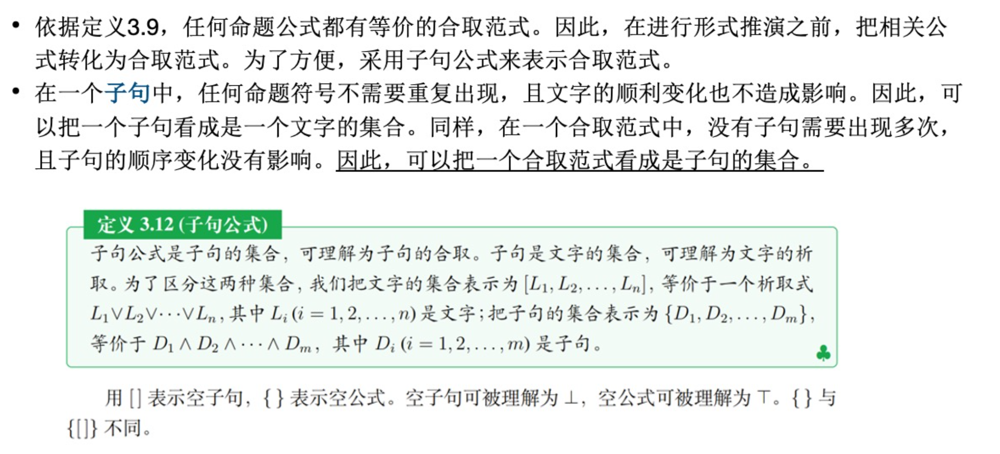

合取起来的子式记为集合的元素（放在大括号里），析取的子式放在中括号里。

$[p, q]$ 与 $[\neg p, r]$ 消解得到 $[q, r]$，类比即 $p \lor \neg p \equiv 1$

!!! example "消解推演系统"
    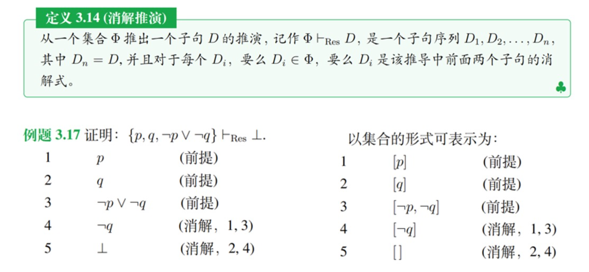

消解推演系统是可靠的，但不完备。消解可看作取交

??? note "proof"
    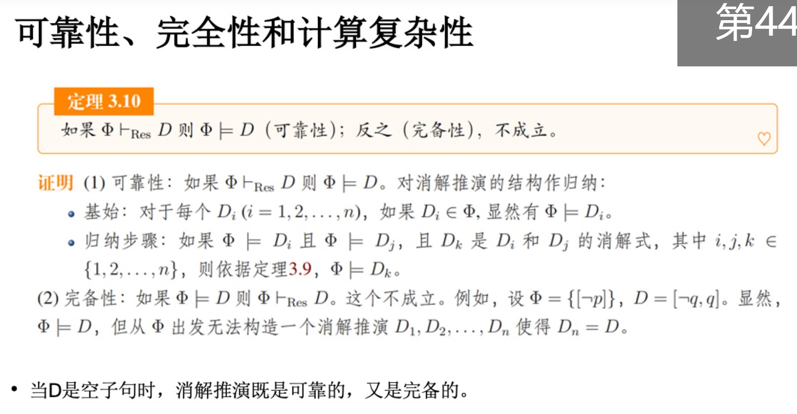

!!! definition "霍恩子句"
    对于消解系统而言，对于公式的的一些子类，对其可满足性的判断又更加有效的方法。

    霍恩子句：子句 $L_1 \land L_2 \land \cdots \land L_n$ 中如果至多包含一个正文字，那么这个子句就是霍恩子句。

    - 四种形式：
        - $p \leftarrow q_1, q_2, \cdots, q_n (n \neq 0)$
        - $p \leftarrow (n = 0)$
        - $\leftarrow q_1, q_2, \cdots, q_n (n \neq 0)$
        - $[空]$
### SAT

实现可满足性的推理引擎称为 SAT（Satisfiability）求解器：在给定一个公式的前提下，寻找一个真值赋值，使得公式为真。（即寻找真值表中某一行，使目标公式为真）

该算法是 NP 完全的

!!! note "经典算法：DPLL"
    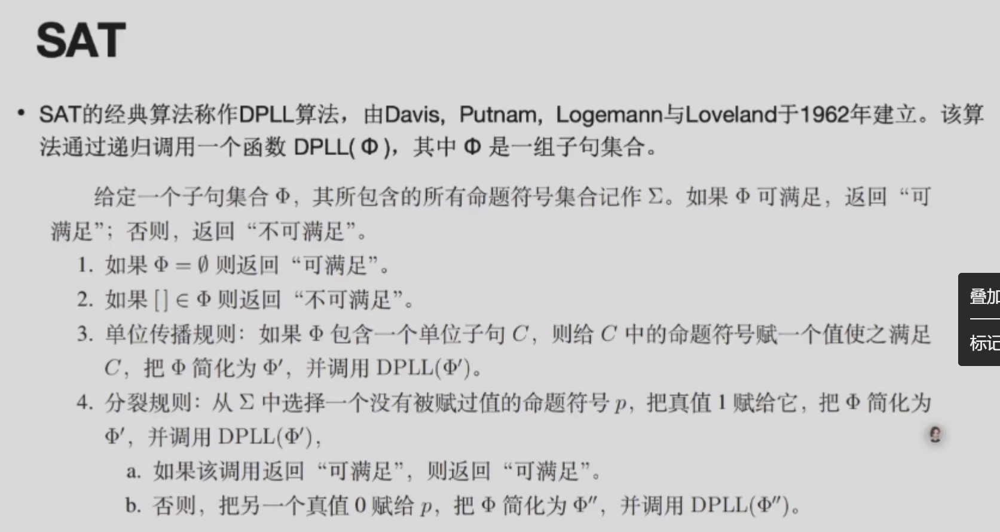

!!! example "例"
    设 $\Phi = \{[p,q, \neg r], [\neg p, \neg q], [r], [p, \neg q]\}, \Sigma = {p,q,r}$。SAT 算法的执行过程：

    + 单位传播规则：令 $r \rightarrow 1$，得到简化的字句集合 $\{[p,q], [\neg p, \neg q], [p, \neg q]\}$
    + 分裂规则
        + $p \rightarrow 0$，得到简化：$\{[q], [\neg q]\}$，令 $q \rightarrow 1$ 得到空子句，公式不成立，回溯
        + $p \rightarrow 1$，得到简化：$\{[\neg q]\}$，令 $\neg q \rightarrow 0$，即可满足

## Lec 4: 一阶逻辑

不同于 Lec 3 中的公式，为了描述更日常的命题，需要引入对象、论域、函词、谓词、量词等概念。个体常元和个体变元统称项。例如，“张三的哥哥是学生”可以表示为 $F(g(ZS))$，其中 $F$ 表示“...是学生”，$g$ 表示“是...的哥哥”。

!!! note "Definitions"
    - 论域：所有被讨论对象的集合。
    - 个体：域中的元素，即被讨论的对象。
    - 常元：用于表示确定对象的符号。
    - 变元：用于表示给定论域上的任意一个对象的符号。
    - 函词：给定一个论域，从一组个体到一个个体的映射关系。
    - 项：
        1. 个体常元和个体变元是项。
        2. 如果 $t_1, t_2, ... t_n$是项，$f$ 是 n 元函词，那么 $f(t1, t2, \cdots, t_n)$ 是项。
        3. 有限次使用(1)(2)生成的是项。
    - 谓词：描述个体之间的关系。谓词包含着可放置讨论对象的位置，即 空位。 空位的数量称为谓词的元数。用一元谓词表示的关系称为个体的性质。

### 一阶语言

- $F(t_1, t_2, \cdots, t_n)$ 是原子公式，其中 $F$ 是 n 元关系符号，$t_1, t_2, \cdots, t_n$ 是项。
- 如果 $t_1,t_2$ 是项，那么 $(t_1 \equiv t_2)$ 是原子公式。
- 如果 $\phi$ 和 $\Phi$ 是公式，且 $x$ 是出现于 $\phi$ 中的自由变元，则 $(\neg \phi), (\phi \land \Phi), (\phi \lor \Phi), (\phi \rightarrow \Phi), (\forall x \phi), (\exists x \phi)$ 都是公式。
- 有限次使用上述三条规则生成的都是公式。

!!! definition "代换"
    代换 $\theta$ 是一个有限的对子集合 $\{x_1/t_1, x_2/t_2, \cdots, x_n/t_n\}$，其中 $x_i$ 是变元，$t_i$ 是项。代换 $\theta$ 作用于公式 $\phi$，得到 $\phi\theta$，是将 $\phi$ 中的所有自由变元 $x_i$ 替换为 $t_i$ 得到的公式。

!!! note "第六周课上例题"
    - 将下列命题转化为一阶语言
    - 这朵牡丹是红的
        - 论域：全体牡丹，个体 c：这朵牡丹 $Mudan(c) \land Red(c)$
    - 张先生和李女士的丈夫是同事
        - $Colleague(张, Husband(李))$
    - 任何安全事故都有其原因
        - 论域：全体安全事故，$Accident^v \subseteq D$, $Reason^v \subseteq D \times D$, $\forall x (Accident(x) \rightarrow \exists y Reason(y, x))$
    - 任何安全事故都有共同原因
        - $\exists y \forall x (Accident(x) \rightarrow Reason(y, x))$
    - 一个人如果有私心，总难免把有些工作弄糟
    - 尽管有人自私，但未必所有人都自私

### 语义

#### 消解原理

!!! definition "前束范式"
    称一阶逻辑公式 $ϕ$ 为前束范式，当且仅当它有如下的形式：

    $Q_1 x_1 Q_2 x_2 \cdots Q_n x_n ϕ′$

    其中, $Q_1 ⋯ Q_n$ 是量词 $∀$ 或 $∃$；$x_1, ⋯ x_n$ 是变元；$ϕ′$ 是不含量词的公式。称 $Q_1 x_1 ⋯ Q_n x_n$ 为前束词，$ϕ′$ 为母式。前束范式的母式可以进一步变换为合取范式或析取范式。

    有关如何把一阶逻辑公式转化为前束范式，可见：<https://hanshuliang.blog.csdn.net/article/details/108848579>

类似命题逻辑，要把公式转化为等价的子句形式。

对包含自由变元的子句进行消解时，如果子句都是**全称量化**的，则可以去掉量词（e.g. $\forall x \forall y (F(x) \rightarrow H(x,y))$ 可简化为 $F(x) \rightarrow H(x,y)$）。

!!! note "推演规则"
    给定两个字句 $c_1 \lor \{L_1\}$ 和 $c_2 \lor \{\overline{L_2}\}$，如果它们没有公共变元，且存在一个代换 $\theta$ 使得 $L_1 \theta = L_2 \theta$,那么可以推出子句 $(c_1 \lor c_2) \theta$，$\theta$ 是 $L_1$ 和 $L_2$ 的合一。

对于包含**存在量词**的公式，可把该存在量词所管辖的变元变成确定的个体，表示该确定个体的项被称为斯科伦常元；表示受限制的该确定个体的函词被称为斯科伦函词。（就是把 $exists xF(x)$ 变成 $F(a)$，$a$ 就是满足原公式的常元）

## Lec 5: 知识图谱与描述逻辑

知识一般有一定的结构，利用三元组 prop{ind, Prop, Val} 来表示知识，分别是主动宾

可以把这种知识表示为一个有向图，其中对顶点 ind 到 Prop 的有向边标记为 Val，形成的图叫做语义网络。

!!! example "知识图谱"
    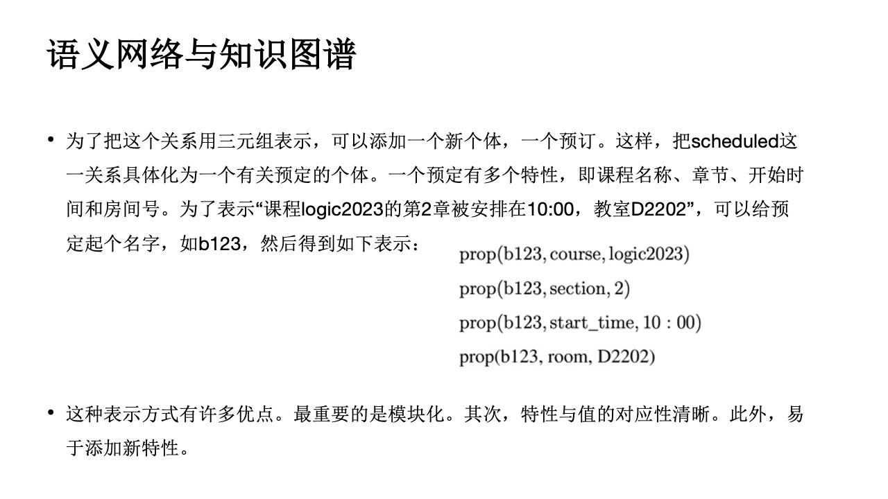

描述逻辑中，区分 TBox（术语框）和 ABox（断言框），前者描述概念层次的语句，后者描述实例层次的语句。

### 角色限制

到现在为止，我们已经看到了如何分别使用 TBox 和 RBox 公理来表达概念和角色之间的关系。然而，描述逻辑最有趣的特点是能够形成将概念和角色联系在一起的语句。例如，概念 Parent 和角色 parentOf 之间存在明显的关系，即父母是至少一个人的父母。在描述逻辑中，这种关系可以通过如下概念等价来表达：$Parent ≡ ∃parentOf.⊤$

其中，存在限制 $∃parentOf.⊤$ 是一个复杂概念，它描述了这样的个体集合：其中的每个个体都是至少一位个体（⊤ 的实例）的父母。类似地，$∃parentOf.Female$ 这个概念描述了那些至少有一个女性的父母，即那些有女儿的人。

为了表达所有孩子都是女性的个体的集合，可以使用全称限制：$∀parentOf.Female$

### ALC 语法

三元组 $\{N_C, N_R, N_I\}$，其中 $N_C$ 是概念符号集合，$N_R$ 是角色符号集合，$N_I$ 是个体名集合。

!!! example "ALC"
    在描述逻辑 ALC 中，有两个概念 Male, Female，一个角色 hasChild，那么
    
    - Person = Male or Female
    - Mother = exists hasChild.T and Female
    - Childless = not hasChild.T
    - Grandmother = Female and exists hasChild.(exists hasChild.T)

    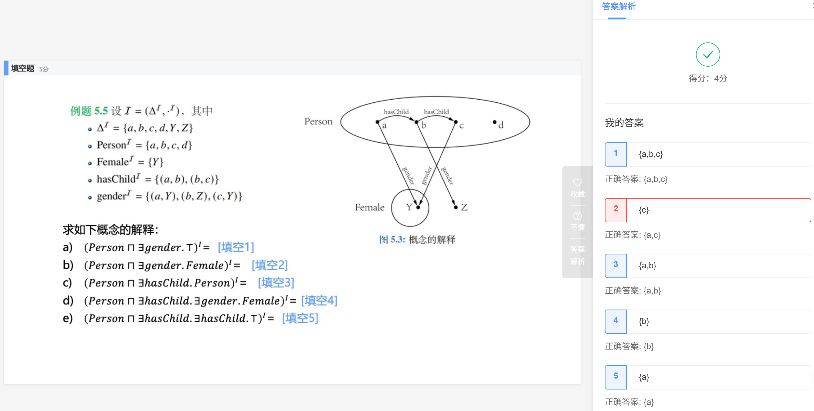

表算法：

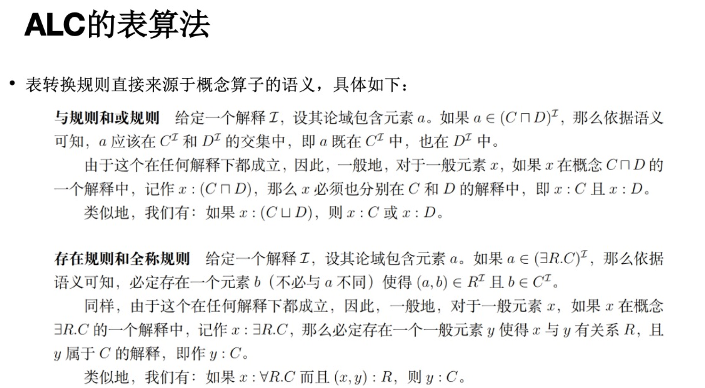

## Lec 6: 缺省逻辑

**通常情况**下，如果 $\phi$ 为真，那么 $\psi$ 为真；这里的“通常情况”说明这一规则并非在任何情况下都成立，于是引入缺省规则表示例外的情况。

### 缺省规则

$\frac{\phi : \psi}{\eta}$，其中 $\psi$ 称为缺省条件，$\eta$ 称为缺省结论。

解释为：

- 如果可以证明 $\phi$，且 $\psi$ 是一致的，那么可以推出 $\eta$。
- 如果可以证明 $\phi$，且不能证明 $\neg \psi$，那么可以推出 $\eta$。
- 如果可以证明 $\phi$，且例外 $\neg \psi$ 并未发生，那么可以推出 $\eta$。

!!! definition "缺省理论"
    一个缺省理论是一个二元组 $T = {W, D}$，其中 $W$ 是一阶逻辑公式集合，用于表示已知的或约定的事实；$D$ 是可数的缺省规则集合，用于表示缺省的知识。

### 缺省逻辑的语义

TBD

## Lec 7: 回答集编程

!!! definition "逻辑程序"
    逻辑程序由一组逻辑编程规则组成。每条逻辑编程规则形如：  
    $a_0 \leftarrow a_1, a_2, \cdots, a_n, not a_{n+1}, \cdots, not a_{n+k}$，其中 $a_i$ 是原子公式，$not a_i$ 是失败即否定 naf 公式。

    箭头左侧是头部，右侧是体部。

一些特殊情况：

- $a_0 \leftarrow .$ 称为事实
- $\leftarrow a_1, a_2, \cdots, a_n, not a_{n+1}, \cdots, not a_{n+k}$ 称为约束或目标
- $a_0 \leftarrow a_1, a_2, \cdots, a_n$ 称为肯定规则

一个语言 L 的赫布兰德域，记作 $HU_L$, 是所有可以由 L 中的**个体常元**和**函数**形成的基项的集合。一个语言 L 的赫布兰德基底，记作 $HB_L$, 是所有可以由 L 中的**谓词**和 $HU_L$ 的项形成的基原子的集合。

!!! definition "基化"
    设 𝑟 是语言 L 中的一条规则。𝑟 在 L 中的基化（grounding），记作 ground(𝑟, L)，是用 $HU_L$ 中的元素对 𝑟 中的变元进行所有可能的代换而得到的所有规则集合。

    对于程序 $\Pi$，其基化记作 $ground(\Pi, L) = \bigvee_{r \in \Pi} ground(r, L)$，即对 $\Pi$ 中的每条规则进行基化。

    !!! example "例"
        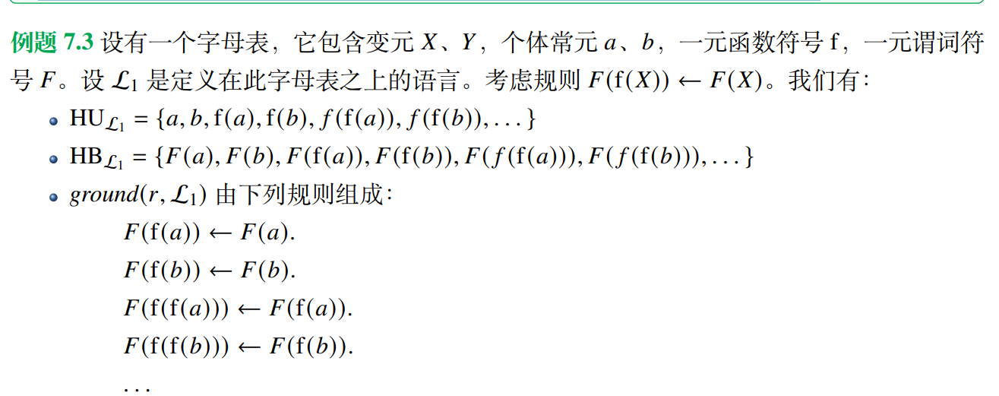

## Lec 8: 经典抽象论辩理论

!!! definition "抽象论辩框架"
    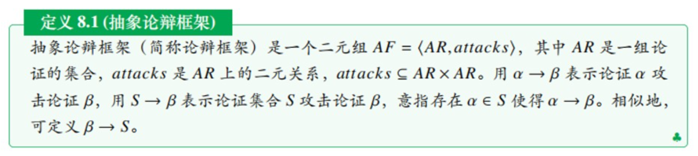

论辩框架可用有向图表示，其中顶点表示论辩者，a 到 b 的有向边表示论证 a 攻击论证 b。

如果一个论证不自我攻击，且不被其他论证攻击，则称其为**可接受的**。如果一个被接受的论证攻击另一个论证，则后者应该被拒绝。

如果一个论证遭到攻击，但所有攻击者都被拒绝，则这个论证是可接受的，称其被复原。

### 基于外延的语义

这里先介绍论证集合的两个性质：无冲突和可防御。

$E$ 无冲突：也即 $E$ 构成的论证图内不存在边

$E$ 可防御 $\alpha$：$α$ 的所有攻击者都被 $E$ 攻击

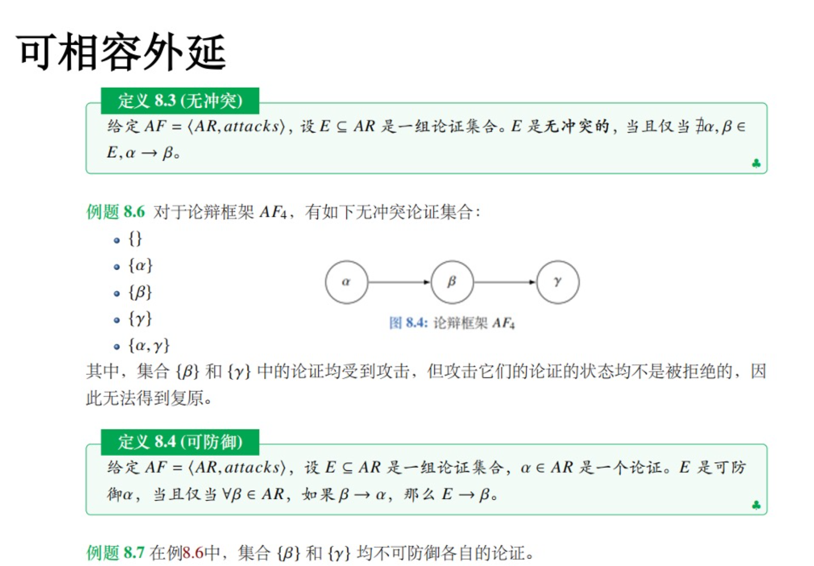

用人话讲就是，对于$E$中每个论证，要么没有受到攻击，要么受到攻击但（由于攻击者被拒绝）可复原。

满足这两个性质（E是无冲突的且E可防御E中每个论证）的论证集合$E$称为**可相容外延**。

!!! example "例"
    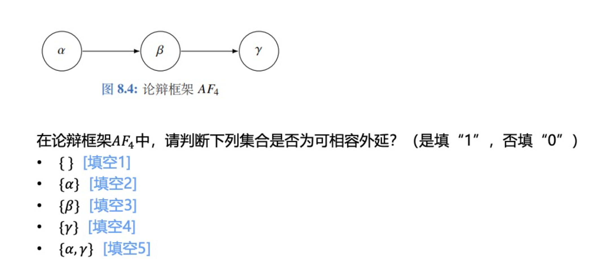

    答案是1,1,0,0,1

!!! note "定理"
    $E$ 是可相容外延，且 $E$ 可防御论证 $a$ 和 $a'$，那么 $E' = E \lor \{a\}$是可相容的，且 $E'$ 可防御 $a'$

#### 完全外延

$AF = <AR, attacks>$ 的特征函数 $F_{AF}(S)=\{\alpha | S 可防御 \alpha\}$

当 $𝐹_{𝐴𝐹}(𝑆) = 𝑆$ 时，我们称 $𝑆$ 是 $𝐹_{𝐴𝐹}$ 的不动点。这时，集合 𝑆 中包含了所有 𝑆 可防御的论证。我们把这样的集合称为完全外延。

- 对于论证集合 $E \subseteq AR$，𝐸 是基外延，当且仅当 𝐸 是最小的（关于集合包含关系）完全外延。

- 𝐸 是一个优先外延，当且仅当 𝐸 是一个极大的（关于集合包含关系）完全外延。

#### 稳定外延与半稳定外延

给定 $𝐴𝐹 = ⟨𝐴𝑅, 𝑎𝑡𝑡𝑎𝑐𝑘 𝑠⟩$，一组论证集合 𝐸 是一个稳定外延，当且仅当：𝐸 是无冲突的，且对于任意 $𝛼 ∈ 𝐴𝑅 / 𝐸$，𝐸 攻击 𝛼。

𝐸 是一个半稳定外延，当且仅当：𝐸 是完全外延，且 $𝐸 ∪ 𝐸^+$ 是极大的（关于集合包含关系），其中 $𝐸^+ = \{𝛼 ∈ 𝐴𝑅 | 𝐸攻击𝛼\}$。

### 基于标记的语义

为每个论证分配一个标签（IN：被接受的，，OUT：被拒绝的，UNDEC：未确定的）

指派的标签不一定合法，

- 合法指派：
    - IN：如果 $a$ 是 IN，则所有攻击者都必须是 OUT
    - OUT：如果 $a$ 是 OUT，则至少有一个攻击者是 IN
    - UNDEC：如果 $a$ 是 UNDEC，则所有攻击者都没有被标记为 IN，且至少有一个攻击者没有被标记为 OUT

类似上面的外延，

- 可相容**标记推外延**：设 𝐴𝐹 = ⟨𝐴𝑅, 𝑎𝑡𝑡𝑎𝑐𝑘 𝑠⟩ 是一个抽象论辩框架。如果 𝐿 是 𝐴𝐹 的一个可相容标记，那么 𝑖𝑛(𝐿) 是 𝐴𝐹 的一个可相容外延。
- 可相容**外延推标记**：设 𝐸 是 𝐴𝐹 = ⟨𝐴𝑅, 𝑎𝑡𝑡𝑎𝑐𝑘 𝑠⟩ 的一个可相容外延。那么 $𝐿 = (𝐸, 𝐸+, 𝐴𝑅 \ (𝐸 ∪ 𝐸^+))$ 是 𝐴𝐹 的一个可相容标记。其中，$𝐸^+ = \{𝛼 ∈ 𝐴𝑅 | 𝐸攻击𝛼\}$。

- 设 𝐴𝐹 = ⟨𝐴𝑅, 𝑎𝑡𝑡𝑎𝑐𝑘 𝑠⟩ 是一个论辩框架，𝐿 是 𝐴𝐹 的一个完全标记，当且仅当：𝐿 是 𝐴𝐹 的一个可相容标记，且对于任意 𝛼 ∈ 𝐴𝑅，如果 𝐿(𝛼) = UNDEC，那么 𝐿(𝛼) = UNDEC 是合法的。

- 𝐿 是 𝐴𝐹 的一个优先标记，当且仅当 𝐿 是 𝐴𝐹 的一个完全标记，且 𝑖𝑛(𝐿) 是极大的（关于集合包含关系）；
- 𝐿 是 𝐴𝐹 的一个基标记，当且仅当 𝐿 是 𝐴𝐹 的一个完全标记，且 𝑖𝑛(𝐿) 是最小的（关于集合包含关系）；
- 𝐿 是 𝐴𝐹 的一个稳定标记，当且仅当 𝐿 是 𝐴𝐹 的一个完全标记，且 𝑢𝑛𝑑𝑒𝑐(𝐿) = ∅;
- 𝐿 是 𝐴𝐹 的一个半稳定标记，当且仅当 𝐿 是 𝐴𝐹 的一个完全标记，且𝑖𝑛(𝐿) 和 𝑜𝑢𝑡(𝐿)是极大的（关于集合包含关系）。

### 抽象论辩语义的模块化

#### 局部语义

!!! definition "局部标记子框架的标记"
    把一个局部标记子框架 $( (𝐵, 𝑅_𝐵), (𝐵^−, 𝐼_𝐵)^𝐿)$ 的标记定义为：$𝐿′: 𝐵 ∪ 𝐵^− ↦ {IN, OUT, UNDEC}$，使得对于所有 $𝑎 ∈ 𝐵^−, 𝐿'(𝑎) = 𝐿(𝑎)$

## Lec9: 结构化论辩理论

### 攻击关系

### 击败关系

两个论证的强弱之比可以被定义为这两个论证所对应的两个可错元素的集合的强弱之比，有三种方法：

- 占优方式：$S_1 \geq_{Dom} S_2$ 当且仅当 $\exists x \in S_1, \exists y \in S_2$，s.t. $x \geq y$，且 $\nexists x \in S_2, \nexists y \in S_1$，s.t. $y \geq x$（S_1有一个元素比S_2的某个元素强，且S_2没有比S_1的元素强的）
- 精英方式：$S_1 \geq_{Elite} S_2$ 当且仅当 $\forall x \in S_1, \exists y \in S_2$，s.t. $x \geq y$（S_1的所有元素都比S_2的某个元素强）
- 民主方式：$S_1 \geq_{Dem} S_2$ 当且仅当 $\exists x \in S_1, \forall y \in S_2$，s.t. $x \geq y$（S_1有一个元素比S_2的所有元素强）
