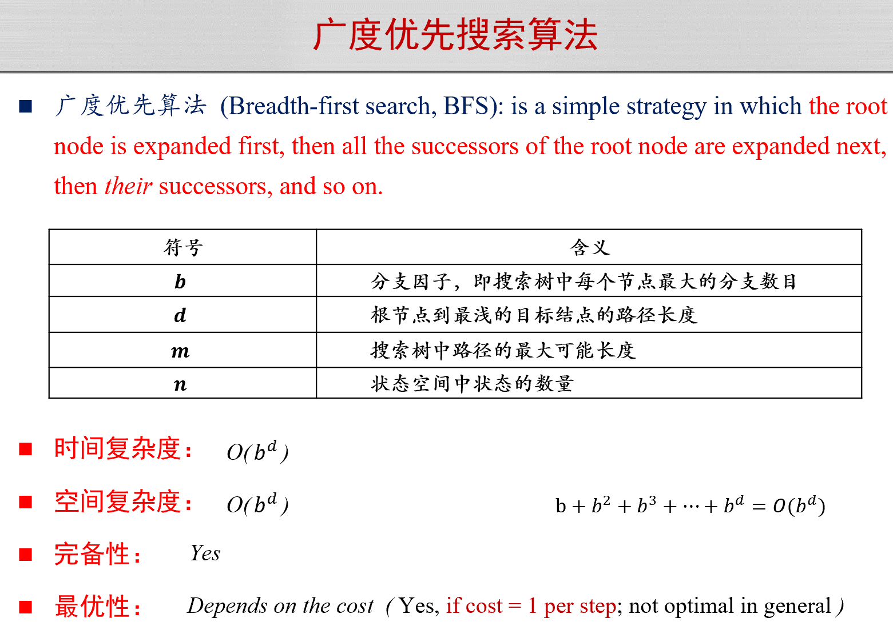
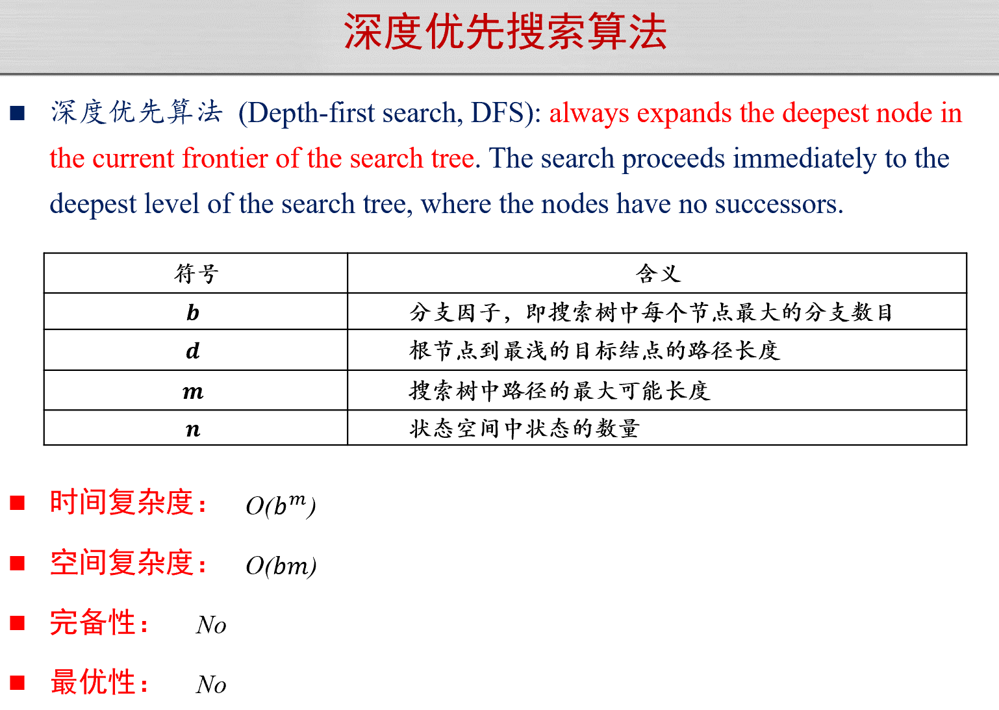

# 人工智能引论

> AI导？网安导！

## 搜索与求解
### 搜索算法基础

- 状态
- 动作
- 状态转移
- 搜索树
- BFS
  - 
- DFS
  - 

### 启发式搜索

- 定义启发函数$h(n)$，用于评估节点$n$到目标节点的 path 的最小代价。
- 定义评价函数$f(n)$，用于选择节点$n$的下一个节点。

!!! example "贪婪最佳优先搜索"
    - $f(n) = h(n)$

!!! example "A*搜索"
    - $f(n) = g(n) + h(n)$
    - $g(n)$ 为从初始节点到节点$n$的实际代价。（当前最小代价）

### 对抗搜索

- 一方最大化某个利益，另一方最小化某个利益。
- MiniMax
- Alpha-Beta 剪枝

### 蒙特卡洛树搜索

TBD

## 机器学习

## 有监督学习

## 无监督学习

## 深度学习