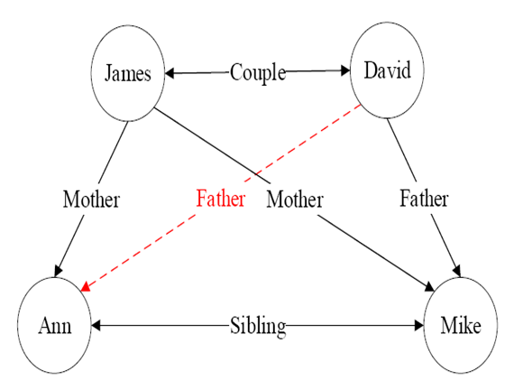
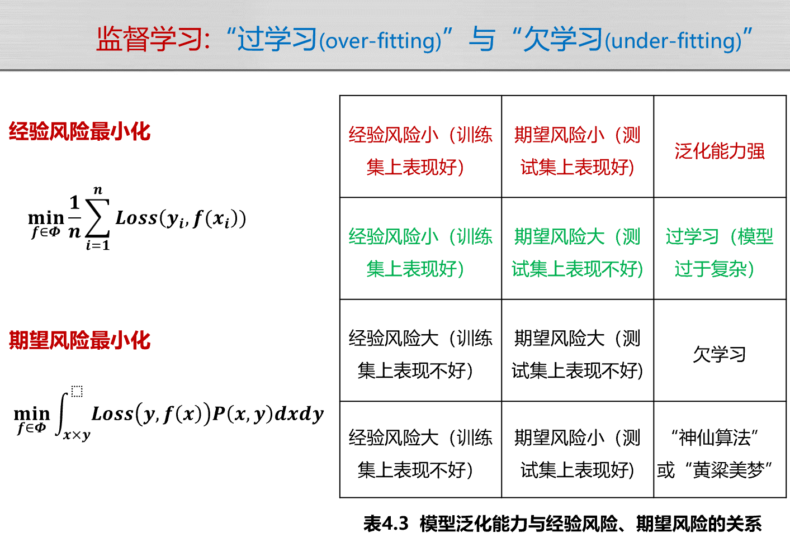
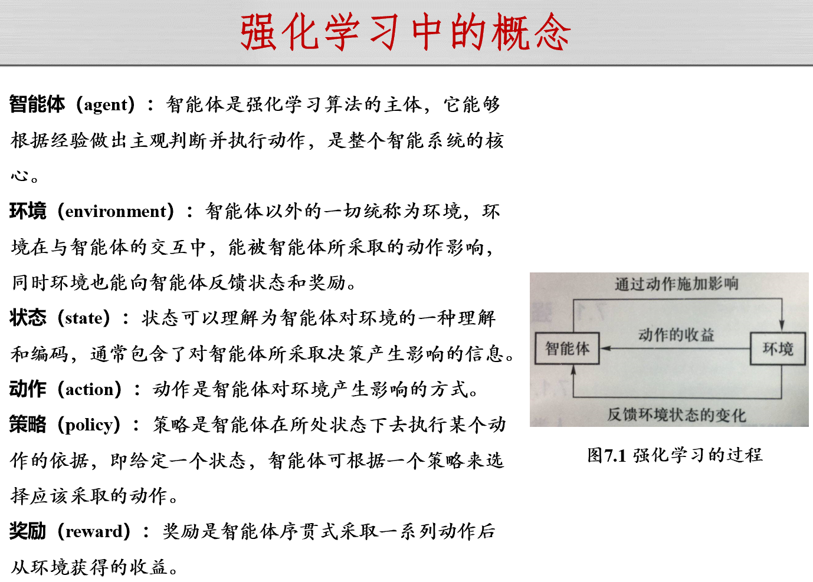

> 是人我吃

# 人工智能引论

> AI导？网安导！  
> 课表里有一门冬8周才开始自学的课  
> 任课教师：黄正行

## 知识表示与推理
### 命题逻辑

离散数学打进来了？

命题：要么真，要么假（得有个 TRuTh ValUe）。

归结法：

- $a \lor b$, $\neg b \lor c$可推出$a \lor c$。

### 谓词逻辑

!!! note "e.g."
    - $king(x)$: $x$是国王，这是一个一元谓词。
    - $Head_on(crown, x)$: $x$戴着皇冠，这是一个二元谓词。

### 知识图谱推理

一般而言，可将知识图谱中任意两个相连节点及其连接边表示成一个三元组（triplet）, 即 (left_node, relation, right_node)  ，例：(David, Father, Mike)。

- 正例：目标谓词符合图谱内事实的训练样例
- 反例：简单理解为图谱内其余关系的节点在关系为$\neg$目标谓词下的结果

!!! definition "FOIL信息增益值"
    $𝐹𝑂𝐼𝐿_{𝐺𝑎𝑖𝑛} = \hat{𝑚_{+}}⋅(\log_2 \frac{⁡\hat{𝑚_+}}{\hat{𝑚_+ } + \hat{𝑚_− }} − \log_2⁡ \frac{𝑚_+}{𝑚_{+} + 𝑚_{−}})$

    - 正号代表推理规则覆盖的正例，负号代表反例
    - 带`^`的表示添加了**新的前提约束谓词**后得到的结果

!!! example "FOIL"
    

    - 注意此例初始图中红线并不存在（需要推理得知），于是$Father(x,y)$作为**目标谓词**的训练样例只有一个正例（$Father(David, Mike)$）和四个反例（取其他四条线的两个节点，谓词改为$\neg Father$）

    将Monther(z, y)作为前提约束谓词加入, 可得到推理规则$Mother(z, y) → Father(x, y)$

    在背景知识中, Monther(z, y)有两个实例:
    
    - $Mother(James, Mike)$
    - $Mother(James, Ann)$
    
    对于$Mother(James, Mike)$这一实例, $z=James, y=Mike$, 将$z$和$y$带入$Father(x, y)$得到$Father(x, Mike)$
    
    - 覆盖了：
        - 正例 Father(David, Mike)
        - 反例 Father(James, Mike) Father(Ann, Mike)
    
    对于Monther(James, Ann)这一实例, z=James, y=Ann, 将z和y带入Father(x, y)得到Father(x, Ann).
    
    - 覆盖了:
        - 反例 Father(James, Ann)

### 概率图推理

不考

### 因果推理

不考

## 搜索与求解
### 搜索算法基础

- 状态：对搜索算法和搜索环境当前所处情形的描述信息。
- 动作：从一个状态转移到另外一个状态所采取的行为被称为动作。
- 状态转移：算法选择了一个动作之后，其所处状态也会发生相应变化，这个过程被称为状态转移。
- 目标测试函数`goal_test(s)`用于判断状态`s`是否为目标状态。
- 搜索树
- BFS
    - 
- DFS
    - 
- 评测标准：
    - 完备性：问题存在解时，算法是否能保证找到解。
    - 最优性：是否能找到最优解。
    - 时间复杂度
    - 空间复杂度

### 启发式搜索

- 定义启发函数$h(n)$，用于评估节点$n$到**目标节点**的 path 的最小代价。
- 定义评价函数$f(n)$，用于选择节点$n$的下一个节点。

!!! example "贪婪最佳优先搜索"
    - $f(n) = h(n)$，评价函数就是启发函数，于是每个动作选择选项中距目标节点 path 代价最小的节点
    - 时间复杂度和空间复杂度均为$𝐎(𝒃^𝒎)$，$b$是搜索树分支因子，$m$是最大深度

!!! example "A*搜索"
    - $f(n) = g(n) + h(n)$
    - 相对贪婪最佳优先搜索，$g(n)$ 为从初始节点到节点$n$的实际代价。（当前最小代价）
    - 性质：
        - 一致性（consistency）：启发函数的一致性指满足条件$ℎ(𝑛)≤𝑐(𝑛, 𝑎, 𝑛')+ℎ(𝑛')$，这里𝑐(𝑛, 𝑎, 𝑛′)表示结点𝑛通过动作a到达其相应的后继结点𝑛′的代价(三角不等式原则)。
        - 可容性（admissible）：对于任意结点𝑛，有$ℎ(𝑛)≤ℎ^∗ (𝑛)$，如果𝑛是目标结点，则有ℎ(𝑛)=0。如表3.3所示， $ℎ^∗ (𝑛)$是从结点𝑛出发到达终止结点所付出的（实际）最小代价。可以这样理解满足可容性的启发函数，启发函数不会过高估计（over-estimate）从结点𝑛到终止结点所应该付出的代价（即估计代价小于等于实际代价）
        - 满足一致性条件的启发函数一定满足可容性条件
        - 如果启发函数是可容的，那么A*搜索算法是最优的。

    !!! note "如果问题和启发函数满足以下条件，则A*搜索算法是完备的"
        - 搜索树中分支数量是有限的，即每个结点的后继结点数量是有限的
        - 单步代价的下界是一个正数
        - 启发函数有下界

### 对抗搜索

- 一方最大化某个利益，另一方最小化某个利益。
- MiniMax
- Alpha-Beta 剪枝

### 蒙特卡洛树搜索

- 使用**上限置信区间算法**：为每个动作的奖励期望计算一个估计范围，优先采用估计范围上限较高的动作。

## 机器学习

- 经验风险：训练集中数据产生的损失。
    - 经验风险越小说明学习模型对训练数据拟合程度越好。
- 期望风险：当测试集中存在无穷多数据时产生的损失。
    - 期望风险越小，学习所得模型越好。
- 结构风险最小化(structural risk minimization)：为了防止过拟合，在经验风险上加上表示模型复杂度的正则化项(regulatizer)或惩罚项(penalty term) 

## 有监督学习

监督学习方法又可以分为生成方法(generative approach)和判别方法(discriminative approach)。所学到的模型分别称为生成模型(generative model)和判别模型(discriminative model).

- 判别方法直接学习判别函数𝒇(𝑿) 或者条件概率分布𝑷(𝒀|𝑿) 作为预测的模型，即判别模型。
    - 判别模型关心在给定输入数据下，预测该数据的输出是什么。
    - 不考虑样本的产生模型，直接研究预测模型。
    - 典型判别模型包括回归模型、神经网络、支持向量机和Ada boosting等。
- 生成模型从数据中学习联合概率分布𝑃(𝑋,𝑌)（通过似然概率𝑃(𝑋|𝑌) 和类概率𝑃(𝑌) 的乘积来求取）
    - $𝑃(𝑌 | 𝑋) = \frac{𝑃(𝑋,𝑌)}{𝑃(𝑋)}$  或者 $𝑃(𝑌 | 𝑋) = \frac{𝑃(𝑋|𝑌)×𝑃(𝑌)}{𝑃(𝑋)}$
    - 典型方法为贝叶斯方法、隐马尔可夫链
    - 联合分布概率𝑃(𝑋,𝑌)或似然概率𝑃(𝑋|𝑌)求取很困难

### 线性回归

呃呃呃

### 逻辑回归

呃呃呃

### 决策树

- 正实例：产生正值决策的实例
- 负实例：产生负值决策的实例
- 决策树代表实例属性值约束的合取的析取式。从树根到树叶的每一条路径对应一组属性测试的合取，树本身对应这些合取的析取

!!! note "ID3算法"
    - 决策树的根结点是所有样本中信息量最大的属性。树的中间结点是该结点为根的子树所包含的样本子集中信息量最大的属性。决策树的叶结点是样本的类别值。
    - 用信息增益（即信息论中的互信息）来选择属性作为决策树的结点

- $p_i$表示$S$中属于类$i$的比例
- 熵(entropy)：给定有关某概念的正例和负例的集合S。对此BOOLEAN分类的熵为：$Entropy(S)= - pos \log_2{(pos)} – neg \log_2{(neg)}$
    - “pos”和”neg”分别表示S中正例和负例的比例。
    - 如果分类器有$c$个不同的输出，则：
        - $Entropy(S)= -\Sigma_{i=1}^c p_i \log_2{p_i}$ 
- 信息量：$\Sigma_{i=1}^c \frac{|S_v|}{|S|} Entropy(S_v)$，其中$S_v$表示$S$的子集，其属性$A$的值为$v$。
- 信息增益：$Gain(S,A) = Entropy(S) - \Sigma_{v=1}^c \frac{|S_v|}{|S|} Entropy(S_v)$

## 无监督学习

学习目标：探究同一数据集的数据分布

### K均值聚类

- 两个$m$维数据的欧氏距离$dist(a,b) = \sqrt{\Sigma_{i=1}^m (a_i - b_i)^2}$值越小，两个数据越相似
- 问题：如何将𝒏个数据依据其相似度大小将它们分别聚类到𝒌个集合，使得每个数据仅属于一个聚类集合。

!!! note "解决方案"
    - 第一步：初始化聚类质心
        - 初始化𝒌个聚类质心$c_1, c_2,..., c_k$，每个聚类质心$c_j$所在集合记为$G_j$
    - 第二步：将每个待聚类数据放入唯一一个聚类集合中
        - 对于 $1\leq i \leq n, 1 \leq j \leq k$，计算待聚类数据$𝑥_𝑖$和质心$𝑐_𝑗$之间的欧氏距离$𝑑(𝑥_𝑖,𝑐_𝑗)$
        - 将每个$𝑥_𝑖$放入与之距离最近聚类质心所在聚类集合中
    - 第三步：根据聚类结果、更新聚类质心
        - 根据每个聚类集合中所包含的数据，更新该聚类集合**质心**值
            - $c_j = \frac{1}{|G_j|} \Sigma_{x_i \in G_j} x_i$
    - 第四步：算法循环迭代，直到满足条件
        - 在新聚类质心基础上，根据欧氏距离大小，将每个待聚类数据放入唯一一个聚类集合中
        - 根据新的聚类结果，更新聚类质心
    - 满足以下两个条件时停止迭代
        - 已经达到了迭代次数上限
        - 前后两次迭代中，聚类质心基本保持不变
        
### 主成分分析

主成分分析是一种特征降维方法

!!! example "期望最大化（expectation maximization, EM）"
    EM算法是一种重要的用于解决含有隐变量（latent variable）问题的参数估计方法。
    
    EM算法分为求取期望（E步骤，expectation）和期望最大化（M步骤，maximization）两个步骤。 
    
    在EM算法的E步骤时，先假设模型参数的初始值，估计隐变量取值；在EM算法的M步骤时，基于观测数据、模型参数和隐变量取值一起来最大化“拟合”数据，更新模型参数。基于所更新的模型参数，得到新的隐变量取值（EM算法的 E 步），然后继续极大化“拟合”数据，更新模型参数（EM算法的M步）。以此类推迭代，直到算法收敛，得到合适的模型参数。

## 深度学习

Softmax函数一般用于多分类问题中，其将输入数据 $𝒙_𝒊$ 映射到第 $𝒊$ 个类别的概率 $𝒚_𝒊=softmax(x_i)=\frac{𝒆^(𝒙_𝒊)}{\Sigma_{j=1}^{k} e^(x_j )}$

### 神经网络
#### 前馈神经网络

各个神经元接受前一级的输入，输出给下一级，没有反馈。

!!! note "损失函数"
    假设有 $n$ 个训练数据 $x_i$，每个训练数据 $x_i$ 的真实输出为 $y_i$，模型对 $x_i$ 的预测值为 $\hat{y}_i$
    - 交叉熵损失函数：$L(y, \hat{y}) = -\Sigma_{i=1}^{n} y_i \log(\hat{y}_i)$
    - 均方误差损失函数：$L(y, \hat{y}) = \frac{1}{2} \Sigma_{i=1}^{n} (y_i - \hat{y}_i)^2$
    !!! note "梯度下降算法"
        梯度下降算法是一种迭代优化算法，用于最小化损失函数。

#### 卷积神经网络

全连接层：特征图转化为向量  
分类层：输出识别分类的置信度值

## 强化学习

## 人工智能博弈

## 可能考 or 考过了的题

> 来源于HZX老师最后两节课

- AlphaGo 用到了：强化学习，蒙特卡洛树搜索。
- 逻辑推理的三个层次：关联，干预，反事实（由易到难）。
- 广度优先搜索、深度优先搜索、蒙特卡洛树搜索属于启发式搜索吗？
- 归纳推理、因果推理、演绎推理的实际案例。
- 归结法证明某个命题是否成立。
- 用命题量词逻辑表示“所有实数的平方大于等于0”。
- **混淆偏差、因果关联、选择偏差的实例选择。**
    - 程序员和格子衬衫：选择偏差
    - 力形所以奋也：力和形是因果关联
    - 地面湿与行人撑伞：混淆偏差
- 哪个方案为导致MiniMax的算法结果改变？
- 博弈树
- 遗憾值计算