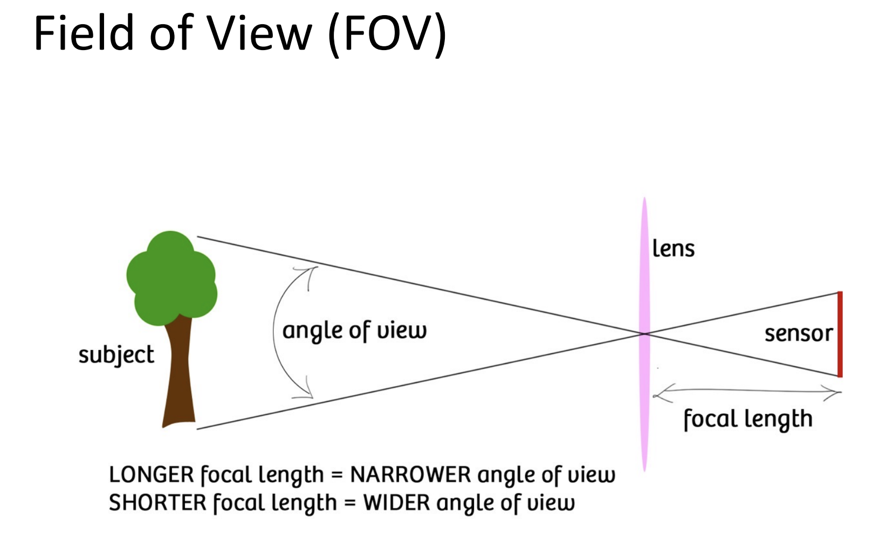
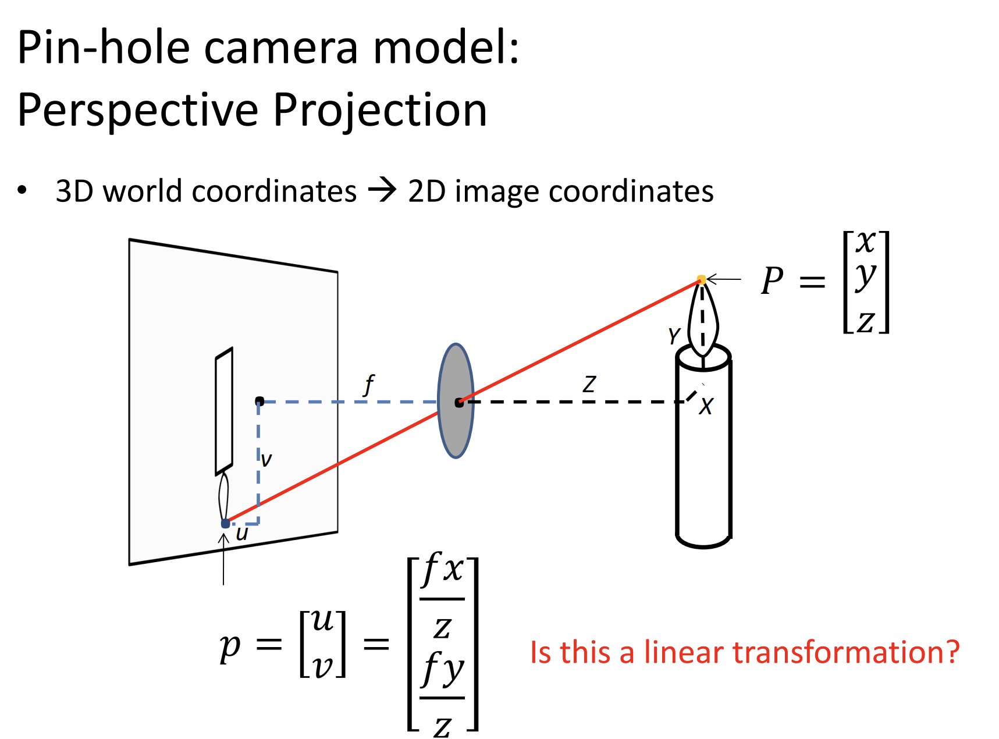
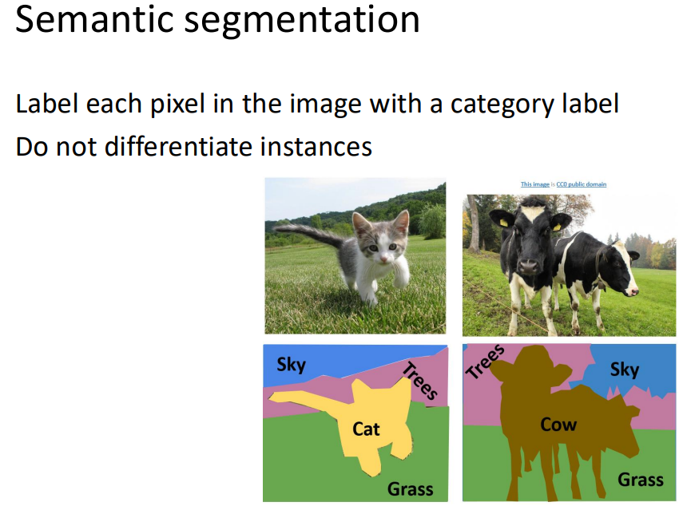
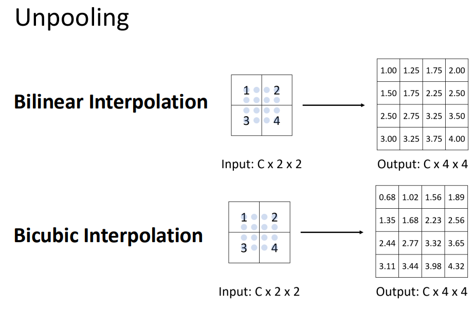

# 计算机视觉导论

> 任课教师：周晓巍  
> Reference: Umich EECS 498/598 Deep Learning for Computer Vision

## 01. intro

- CV Tasks
    - 3D 重建（元素定位、SLAM）
    - 图像理解
    - 图像合成

## 02. Review of Linear Algebra & Image Formation

向量&矩阵复习：我去，这不是我们最喜欢的线性代数吗

Each Matrix can be regarded as a geometric transformation

仿射变换 = 线性变换 + 平移，Using homogeneous coordinates：$(x', y', 1)^T = \begin{bmatrix} a & b & tx \\ c & d & ty \\ 0 & 0 & 1 \end{bmatrix} (x, y, 1)^T$

特征值的几何含义：对特征向量进行矩阵形式的线性变换后，方向不变，长度变为原来的 $\lambda$ 倍

### Camera & Lens

试着设计一个相机

idea1：直接将一片可以接收物体反射光的薄膜放在物体前面：物体上任意一点的光都会照到薄膜的每一处，导致并不是 one-to-one 接受光线

于是 idea2：在薄膜前面加一个小孔（aperture），只允许通过小孔的光线照到薄膜上

但是小孔并不是越小越好：会导致通过的光线太少了，且还有衍射现象

!!! note "FOV"
    

Aperture 的尺寸由镜片的直径刻画，记为 $D$

一种更好的描述方式是 f-number：$N = f/D$，其中 $f$ 是焦距，即镜片焦距与直径的比值

### Geometric image formation

## 03. Image Processing

Convolution: $(f * g)(x) = \int_{-\infty}^{\infty} f(t) g(x - t) dt$

- f(t): conv kernel
- g(x - t): signal
- (f * g)(x): output signal

### Blurring

- 通过卷积实现图像模糊
    - Box filter: 卷积核全为1
    - Gaussian filter: 卷积核为高斯分布

### Sharpening

实质是 adding high frequencies

- Low Frequency：Blur(I)
- High Frequency：I - Blur(I)
- Sharpened Image：I + α(I - Blur(I))，α 控制锐化程度

### Gradient detection filter

$\begin{bmatrix} -1 & 0 & 1 \\ -2 & 0 & 2 \\ -1 & 0 & 1 \end{bmatrix}$：提取水平方向的 Gradient

$\begin{bmatrix} -1 & -2 & -1 \\ 0 & 0 & 0 \\ 1 & 2 & 1 \end{bmatrix}$：提取垂直方向的 Gradient

Bilateral filter：在保持边缘的同时进行模糊

### Image Sampling

TBD

## 04. Model fitting & Optimization

### Optimization

$\textbf{minimize} \quad f_0(x)$（objective function）

$\textbf{subject to} \quad f_i(x) \leq 0, i = 1, ..., m; \quad g_i(x) = 0, i = 1, ..., p$（前者称为不等式约束，后者称为等式约束）

!!! example "Image Deblurring"
    模糊图像的还原可看作追求 $\min_X \|Y - FX\|^2$，其中 $Y$ 是模糊图像，$X$ 是清晰图像，$F$ 是模糊 kernel

### Model Fitting

A mathematical model $𝑏 = 𝑓_𝑥(𝑎)$ describes the relationship between input 𝑎 and output 𝑏, where x is model parameter。如线性模型 $b = a^T x$。

需要找到最优参数 $x^*$（即从 data 中学习参数），经典的方法是使 **均方误差（MSE, Mean Squared Error）** 最小化：$\hat{x} = \arg\min_x \sum_{i=1}^n (b_i - f_x(a_i))^2$

## 0?. Structure from Motion (SfM)

sfm 是通过一系列不同角度拍摄的照片，计算3d模型上每个点的坐标（构成点云），从而重建其3d建模和相机的参数

需要处理三个问题：

- 三维坐标怎么映射到照片的二维坐标（camera model）

- 怎么在世界坐标系中计算相机的位置与朝向（camera calibration & pose estimation）

- 怎么重建3d点云（sfm）

相机本身的坐标系（相机坐标系），xy轴位于相机屏幕平面，z轴正方向为相机的orientation

照片的生成：世界坐标系中的坐标转换到相机坐标系下（coordinate transformation），再投影到二维平面下（perspective projection），二维平面的坐标转化为像素（image plane to image sensor）

外参（位置和朝向）矩阵处理coordinate trans，内参（分辨率，焦距等）矩阵处理后面两个过程

外参：placement，orientation

coor trans：xc=Rxw+t use homogeneous coordinates

外参矩阵

perspective projection：xc-＞xi

im2im：内参矩阵

decompose projection matrix

视觉标定问题

假定内参一直求相机外参，perspectiveNpoint

minimize reprojection error

epipolar geometry

## 08. Depth Estimation & 3D Reconstruction

稠密的三维重建

Depth：目标点到相机平面的距离；有很多应用：避障、人脸识别

- A主动发射信号到环境中，通过接收反射信号计算距离，如雷达

## 09. Deep Learning

### Linear Classifier

$x$ 和权重 $w$ 相似时，得到的 score $w^T x$ 越大

loss function for regression: MSE: $\Sum_i (f(x_i) - y_i)^2$

不能用于 score based 分类问题，因为 score 是连续值(-inf, +inf)，需要把 score 转化为概率分布(0-1)

softmax function: $S_j = \frac{e^{f_j}}{\Sum_k e^{f_k}}$

cross-entropy loss: $D(groundtruth, prediction) = -\Sum_i y_i \log S_i$

### Neural Networks

线性 -> 非线性（激活函数）：Sigmoid，Relu... 即每个 perceptron：$f(x) = \sigma(w^T x + b)$

multi-layer NN: $f(x) = \sigma(W_n \sigma(W_{n-1} ... \sigma(W_1 x + b_1) ... + b_{n-1}) + b_n)$

- Fully connected layers

### Convolutional Neural Networks

## 10. Recognition

### 语义分割（Semantic Segmentation）

仅区分**不同类别**的像素并标注，例如说图片中有许多个同种物体（许多只猫），这时语义分割只标注哪些像素是猫，而不区分该像素属于哪只猫（Do not differentiate instances）

如何实现语义分割？

- 早期的方法是利用 sliding window，在图像上滑动一个窗口，对窗口内的像素利用 CNN 进行分类，得到该窗口内像素的类别标签，这样太慢了，并且 receptive field 太小
- Fully Convolutional Network (FCN)：make all predictions at once，输出一张预测图（语义图），损失函数是每个像素的交叉熵。
    - High-resolution ->(via down-sampling) Low-resolution ->(via up-sampling) High-resolution
    - Upsampling(Unpooling)
        - 
        - 
        - 称为 Transposed Convolution
    - U-Net
        - skip connection: combine low-level features with high-level features to get better prediction（从下采样阶段中的某一层直接skip到上采样阶段的某个层，使得某些可能在下采样过程中丢失的细节信息得以保留）
    - DeepLab
        - FCN + Atrous Convolution + CRF(Conditional Random Field)

Evaluation Metrics: IOU(Intersection over Union) = area(预测面积 $\cap$ 真实面积)/area(预测面积 $\cup$ 真实面积)

### Object Detection

Input: single RGB image

Output: A set of bounding boxes that denote objects

- Region Proposal: generate a set of candidate object bounding boxes - R-CNN
    - Bounding box 的质量也通过 IOU 来衡量

TBD

### Instance Segmentation

### Human Pose Estimation

在人体上定义一系列关键点（keypoints），如头顶、肩膀、肘部、手腕、臀部、膝盖、脚踝等

- 单人
- 多人
    - Top-down：在每个 bounding box 内进行单人 pose estimation（Mask R-CNN）
    - Bottom-up：先检测所有关键点，再将关键点组装成不同的人（OpenPose）

### Others

光流（Optical Flow）：描述图像中像素点的运动

- FlowNet
- Raft

Video Classification：识别 actions

## Deep Learning for 3D Vision

### DL4 Feature Mapping

### DL4 Object Pose Estimation