# 计算机视觉导论

> 任课教师：周晓巍  
> Reference: Umich EECS 498/598 Deep Learning for Computer Vision, https://note.noughtq.top/ai/cv/, https://you-ao.github.io/AI/CV/

少数大三下一丁点没学的课之一，呃呃呃

## 01. intro

- CV Tasks
    - 3D 重建（元素定位、SLAM）
    - 图像理解
    - 图像合成

## 02. Review of Linear Algebra & Image Formation

向量&矩阵复习：我去，这不是我们最喜欢的线性代数吗

Each Matrix can be regarded as a geometric transformation

仿射变换 = 线性变换 + 平移，Using homogeneous coordinates：$(x', y', 1)^T = \begin{bmatrix} a & b & tx \\ c & d & ty \\ 0 & 0 & 1 \end{bmatrix} (x, y, 1)^T$

特征值的几何含义：对特征向量进行矩阵形式的线性变换后，方向不变，长度变为原来的 $\lambda$ 倍

### 相机与透镜 Camera & Lens

试着设计一个相机

idea1：直接将一片可以接收物体反射光的薄膜放在物体前面：物体上任意一点的光都会照到薄膜的每一处，导致并不是 one-to-one 接受光线

于是 idea2：在薄膜前面加一个小孔（光圈，aperture），只允许通过小孔的光线照到薄膜上

但是小孔并不是越小越好：会导致**进光量减少**，且还有**光的衍射**现象，于是引入 lens（透镜），透镜可以聚集光，且焦距 $f$，物距 $o$，像距 $i$ 具有关系（高斯公式）：$\frac{1}{f} = \frac{1}{o} + \frac{1}{i}$

!!! note "Magnification"
    透镜可用于放大图像：$Magnification = \frac{image\ height}{object\ height} = \frac{i}{o} = \frac{f}{o-f}$，于是焦距越大，放大率越大。

!!! note "FOV"
    焦距的另一个用途是改变视域（Field of View, FOV）

    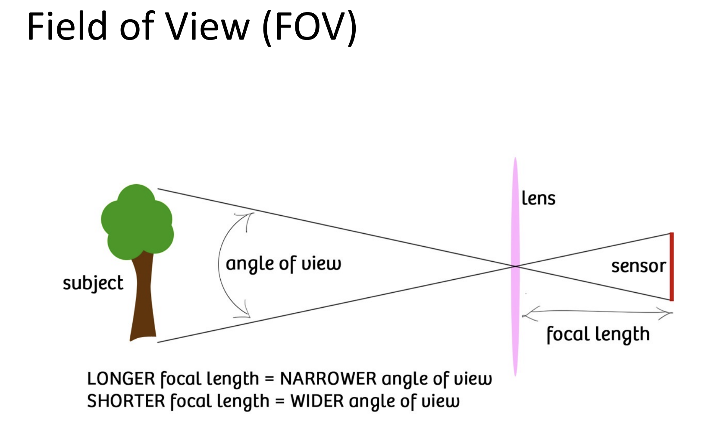

    Depends on 焦距 $f$ and 传感器大小 $s$，焦距越长/传感器越小，视角越小。

Aperture 的尺寸由镜片的直径刻画，记为 $D$

一种更好的描述方式是通过 f-number：$N = f/D$，其中 $f$ 是焦距，那么光圈 $D = \frac{f}{N}$

### 镜头失焦 Lens Defocus

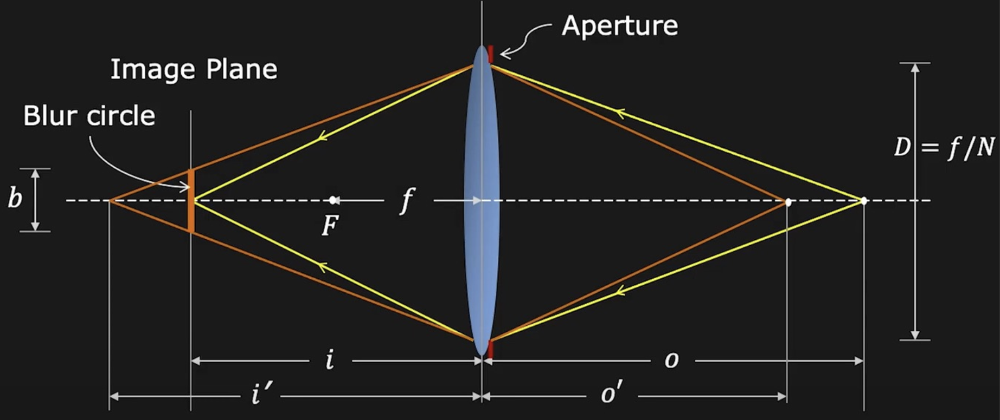

如图，假设物体原先在 $o$ 处，接收像的位置（底片位置）在 $i$ 处，现在物体移动到 $o'$ 处，光线会聚焦在 $i'$ 处，于是在 $i$ 处会形成一个模糊光斑，称为 Blur Circle，其直径为 $b$，可由相似三角形得到：

$$\frac{b}{D} = \frac{|i - i'|}{i'}$$

那么光斑直径 $b = D \frac{|i - i'|}{i'}$，可见光圈直径减小时，可以减小光斑直径，从而减小失焦模糊

### 调焦 Focusing

在像距 $i$ 和焦距 $f$ 固定的情况下，只有在同一平面内得到的图像是最清晰的，因此需要调节使得物体成像清晰

- 通过移动镜头位置来调节
- 通过改变底片位置来调节

### 景深 Depth of Field

在实际拍摄中只需要光斑的直径小于某个值 $b_{max}$（一般以一个像素的大小作为最大光斑直径）即可接受，于是只在某一个范围内的物体位置都能成像清晰，这个范围称为景深 DoF

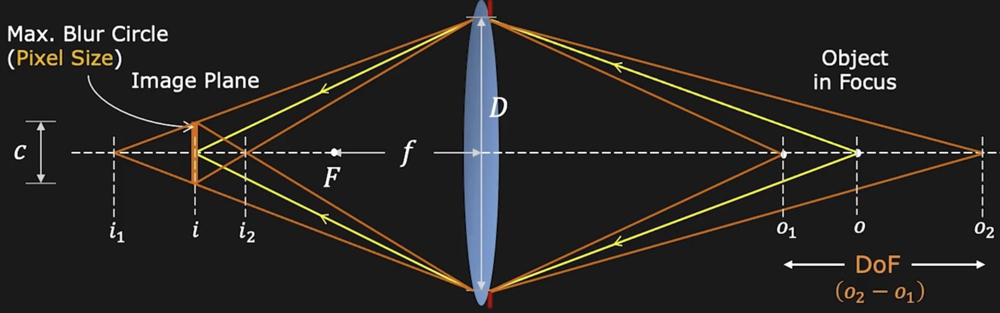

景深范围与焦距 $f$、光圈 $D$ 成反比

How to blur background?（使景深范围缩小，方便背景虚化即可） Large aperture, Long focal length, Near Foreground, Far Background

### Geometric image formation

相机模型将三维空间中的点映射到二维图像平面上

- 正射投影（Orthographic Projection）：忽略深度信息，直接将三维点 $(X, Y, Z)$ 映射到二维点 $(X, Y)$ 上
- 透视投影（Perspective Projection）：考虑深度信息，下面主要介绍透视投影

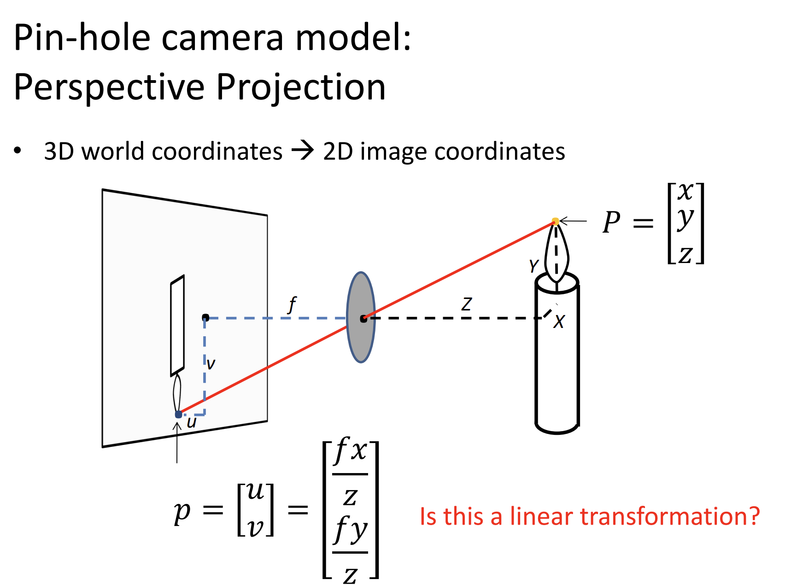

在笛卡尔坐标系中，这种投影变换不是线性的，于是需要使用齐次坐标

!!! note "齐次坐标"
    笛卡尔坐标转换为齐次坐标：$(x,y)^T \rightarrow (x, y, 1)^T$, $(x,y,z)^T \rightarrow (x, y, z, 1)^T$

    齐次坐标转换为笛卡尔坐标：$(x, y, w)^T \rightarrow (\frac{x}{w}, \frac{y}{w})^T$, $(x, y, z, w)^T \rightarrow (\frac{x}{w}, \frac{y}{w}, \frac{z}{w})^T$

    一个齐次坐标可能对应多个笛卡尔坐标，但它们只有长度上的缩放关系

利用齐次坐标，可以将透视投影表示为线性变换：

$$
\begin{bmatrix} f & 0 & 0 & 0 \\ 0 & f & 0 & 0 \\ 0 & 0 & 1 & 0 \end{bmatrix} \begin{bmatrix} x \\ y \\ z \\ 1 \end{bmatrix} = \begin{bmatrix} fx \\ fy \\ z \end{bmatrix} \rightarrow \begin{bmatrix} \frac{fx}{z} \\ \frac{fy}{z}  \end{bmatrix}
$$

经过透视投影后，成像中**长度、角度**等信息会损失/改变，但**线的曲直**得到保留

由于角度信息损失，会出现 Vanishing Point：三维空间内平行线在二维图像上投影后相交的点

- 两条平行线有相同的灭点 v
- 相机中心与灭点连成的直线平行于原直线
- 灭点可能在画面外或无限远处

平面上的所有线的灭点构成的点集形成灭线（Vanishing Line）：相互平行的空间平面在成像空间收敛于同一条灭线，即一组平行平面在二维图像上投影后相交的直线，例如地平线

!!! definition "透视畸变 Perspective Distortion"
	由于透视投影的性质形成的成像畸变，与镜片无关

	越远离相机中心，物体成像的畸变越明显

### Radial Distortion 径向畸变

另一种畸变，靠近图像边缘的部分会被拉伸或压缩；由有瑕疵的镜片导致

- 枕形畸变 Pin cushion（长焦镜头常见）
- 桶形畸变 Barrel（广角/短焦镜头常见）

这种畸变的数学计算：

$$
r^2 = x^2 + y^2 \\
x_{distorted} = x(1 + k_1 r^2 + k_2 r^4) \\
y_{distorted} = y(1 + k_1 r^2 + k_2 r^4)
$$

其中 $x, y$ 是理想情况下的坐标，$x_{distorted}, y_{distorted}$ 是畸变后的坐标，$k_1, k_2$ 是畸变参数，和镜头有关

### Photometric Image Formation

- Shutter Speed：快门速度，控制光线进入相机的时间长度
- Color Space
    - RGB
        - 红、绿、蓝三种颜色，每个颜色通过 0～255 8bit 的数据进行表示
    - HSV
        - Hue 色调 Saturation 饱和度 Value 亮度

## 03. Image Processing

- 增加图片对比度：S curve，使得暗部更暗，亮部更亮 $output(x,y) = f(input(x,y))$
- 颜色反转 $output(x,y) = 1 - input(x,y)$
- 图像模糊：利用边缘检测（Edge Detection）提取并滤除高频信息

下面主要介绍图像模糊

### 卷积 Convolution

$(f * g)(x) = \int_{-\infty}^{\infty} f(t) g(x - t) dt$

- f(t): conv kernel
- g(x - t): signal
- (f * g)(x): output signal

对于滤波 kernel 扫描图像边界时，图像边界外的像素值无法获取，使用 padding 技术进行填充

- Zero values 填充 0
- Edge values 填充边界值
- Symmetric 以与边界的对称方式填充

$$
输出图片大小 = \frac{InputSize - KernelSize + 2 \times Padding}{Stride} + 1
$$

### 图像模糊 Blurring

- 通过卷积实现图像模糊
    - Box filter: 卷积核全为 1
    - Gaussian filter: 
        - 卷积核/滤波器的每一个值由二维高斯函数计算得到：$f(i,j) = \frac{1}{2\pi \sigma^2} e^{-\frac{i^2 + j^2}{2\sigma^2}}$

### 图像锐化 Sharpening

实质是向图像中加入高频信息

对于图像 $I$

- 先获取 Low Frequency：$Blur(I)$
- High Frequency：$I - Blur(I)$
- Sharpened Image：$I + \alpha (I - Blur(I))$，$\alpha$ 控制锐化程度

### 边缘检测 Edge Detection

$\begin{bmatrix} -1 & 0 & 1 \\ -2 & 0 & 2 \\ -1 & 0 & 1 \end{bmatrix}$：提取水平方向的 Gradient，检测垂直边

$\begin{bmatrix} -1 & -2 & -1 \\ 0 & 0 & 0 \\ 1 & 2 & 1 \end{bmatrix}$：提取垂直方向的 Gradient，检测水平边

Bilateral filter：在保持边缘的同时进行模糊（不考）

### 图像采样 Image Sampling

在图片缩放时，需要对像素进行采样；每隔一点采样一次即可得到尺寸为原先一半的图片，但是会导致信息丢失，出现混叠（Aliasing）现象

!!! example "Aliasing"
	由于信号变化的频率过快或采样的频率过低导致

	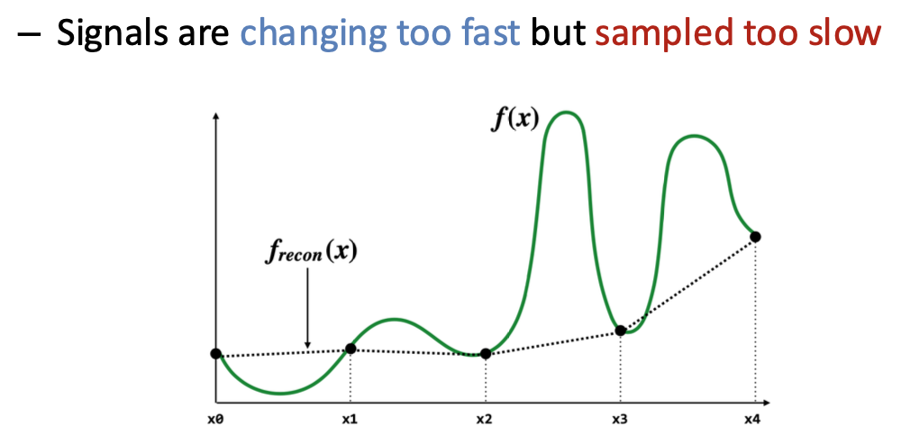

	Examples：摩尔纹

减少混叠的方法：

- 增加采样频率
- Antialiasing Filter
    - 改变原来信号的频谱，在采样前使用低通滤波器减少一部分图像的高频部分

### 图像放大 Image Magnification

图像放大就是上采样（Upsampling），这时反而需要对缺失的信息进行**插值**（Interpolation）

- 一维插值方法
    - 最近邻插值
	- 线性插值
	- 多项式插值
- 二维插值方法
	- 双线性插值
	- 双多项式插值

### 改变宽高比 Image Aspect Ratio Change

方案：删去图片中不重要的部分：与周围像素接近的部分。通过边缘能量（Edge Energy）来衡量像素的重要性：

$$
E(i,j) = |\frac{\partial I}{\partial x}| + |\frac{\partial I}{\partial y}|
$$

利用卷积进行求导

- 接缝裁剪（seam carving）：自顶向下寻找一条使像素边缘能量最小化的连接路径。$M_{i,j} = E(i,j) + \min(M_{i-1,j-1}, M_{i-1,j}, M_{i-1,j+1})$
- 接缝插入（seam insertion）：以同样的方法找到若干条接缝，然后对每条自顶向下的接缝进行插值，以放大图像

## 04. Model fitting & Optimization

> 我就知道学机器学习赌对了

### Optimization

$\textbf{minimize} \quad f_0(x)$（objective function）

$\textbf{subject to} \quad f_i(x) \leq 0, i = 1, ..., m; \quad g_i(x) = 0, i = 1, ..., p$（前者称为不等式约束，后者称为等式约束）

!!! example "Image Deblurring"
    模糊图像的还原可看作追求 $\min_X \|Y - FX\|^2$，其中 $Y$ 是模糊图像，$X$ 是清晰图像，$F$ 是模糊 kernel

### Model Fitting

A mathematical model $𝑏 = 𝑓_𝑥(𝑎)$ describes the relationship between input 𝑎 and output 𝑏, where x is model parameter。如线性模型 $b = a^T x$。

需要找到最优参数 $x^*$（即从 data 中学习参数），经典的方法是使 **均方误差（MSE, Mean Squared Error）** 最小化：$\hat{x} = \arg\min_x \sum_{i=1}^n (b_i - f_x(a_i))^2$

### Numerical Methods

```
𝒙 ← 𝒙𝟎% Initialization 
while not converge  
𝒉 ← descending_direction(𝒙) % determine the direction  
α ← descending_step(𝒙, 𝒉) % determine the step
𝒙 ← 𝒙 + α𝒉 % update the parameters
```

接下来需要用一些方法确认下降方向和步长

- 梯度下降（Gradient Descent）
	- 下降方向：$h = -\nabla f(x)$（此时目标函数下降最快）
	- 下降步长：在 $\phi(\alpha) = f(x_0 + \alpha h)$ 和 $\alpha$ 接近时，是比较好的步长
	- 易于实现，在离最小值较远时表现不错
	- 接近最小值时收敛很慢，浪费大量计算
- 牛顿法（Newton Method）
    - 下降方向：$h = -H^{-1} \nabla f(x)$，其中 $H$ 是 Hessian 矩阵
    - 在最小值附近收敛很快
    - 需要计算 Hessian 矩阵，计算量大
- 高斯-牛顿法（Gauss-Newton Method）
	- 下降方向：$h = -(J^T J)^{-1} J^T R(x)$，其中 $J$ 是雅可比矩阵，$R(x)$ 是残差向量
	- 计算量小，收敛快

### 鲁棒性估计 (Robustness Estimation)

在实际问题中，数据中可能包含异常值（Outliers，距离 assumption 很远），这些异常值如果数量很多，会对 MSE 产生较大影响

需要使用鲁棒函数代替 MSE，例如 L1 范数（绝对值损失函数）：$\rho(r) = |r|$，Huber 损失函数

!!! example "RANSAC - Random Sample Consensus"
	关键思想：Inliers 之间的分布很类似，而 Outliers 则是随机分布的

	使用两两数据点对进行投票

	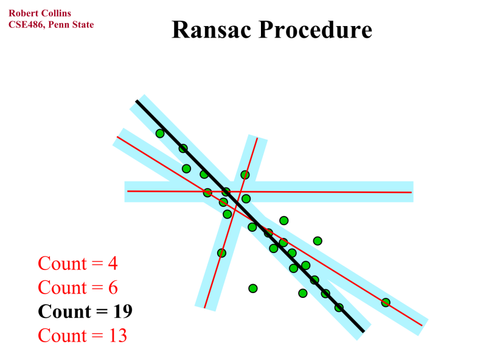

## 05. Image Matching & Motion Estimation

### Image Feature Matching 图像特征匹配

找到两张图像中点与点之间的对应关系，分为下面三个步骤：

- 检测：找到关键点
- 描述：对每个关键点提取向量特征描述符
- 匹配：比较两张图中任选一对点的描述符，找到最相似的一对

#### 检测 Detection

对于比较“Unique”的关键点，很容易在另一张图中找到对应点——如何寻找 Unique 的关键点？

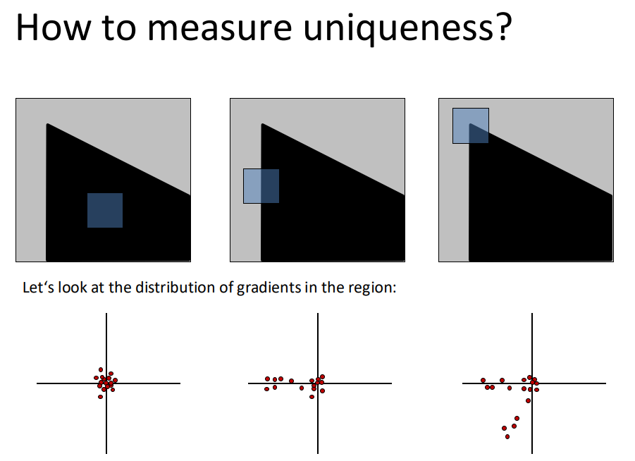

移动窗口，找到沿**任意方向**移动时像素变化较大的部分（称为**角**，corner），表现为图中梯度的分布。

利用 PCA 主成分分析定量判断梯度的分布：

- 第一主成分：方差最大即数据最分散的方向
- 第二主成分：与第一主成分正交且方差最大（剩余部分数据最分散）的方向
- 角的两个主成分都很大

Harris Corner Detector：计算角响应值 Corner Response $f = \frac{\lambda_1 \lambda_2}{\lambda_1 + \lambda_2}$，$\lambda_1, \lambda_2$ 是两个主成分特征值

计算得到每个像素的角响应值后，寻找局部区域中的极大值作为角点

响应值 invariant：

- 光强移动：I -> I + c
- 图片平移 Image translation
- 旋转 Rotation

not invariant：

- 光强缩放 Intensity scaling I -> kI
- 图片缩放 Image scaling

Blob Detector：寻找图像中**斑点**（Blob）状的区域作为特征点，其二阶导很大

拉普拉斯 Filter：$\nabla^2 I = \frac{\partial^2 I}{\partial x^2} + \frac{\partial^2 I}{\partial y^2} = \begin{bmatrix}0 & 1 & 0 \\ 1 & -4 & 1 \\ 0 & 1 & 0 \end{bmatrix}$

- LoG (Laplacian of Gaussian)：先对图像进行高斯模糊，再使用拉普拉斯滤波器
    - $\nabla^2 (f * g) = f * (\nabla^2 g)$
    - 使用两个不同尺度的高斯滤波器，计算差分（DoG, Difference of Gaussian）近似 LoG

#### 描述 Description

Idea：相似的图像块应该有相似的描述符

- 尺度不变特征变换 SIFT (Scale Invariant Feature Transform)
	- 计算关键点处的梯度方向直方图，作为描述符
	- Robust to image scaling, rotation, illumination changes
	- 旋转：虽然旋转后角响应值不变，但是梯度方向直方图发生了 shifting，需要找到主方向，以其作为基准旋转图像，直到两张图对齐。

#### 匹配 Matching

Given a feature in I1, how to find the best match in I2?

1. 定义两个描述符之间的**距离**
    - L2 distance: $d = ||f_1 - f_2||_2 = \sqrt{\sum_i (f_{1i} - f_{2i})^2}$
        - Radio Test: $d = \frac{||f_1 - f_2||_2}{||f_1 - f_3||_2}$，其中 $f_2$ 是 $I_2$ 中距离 $f_1$ 最近的描述符，$f_3$ 是 $I_2$ 中距离 $f_1$ 第二近的描述符。值越大，说明 $f_2$ 和 $f_3$ 越接近，越容易出现误匹配
        - 相互最近邻（Mutual Nearest Neighbor）：可靠的匹配需要保证 $f_1$ 在 $I_2$ 中的最近邻是 $f_2$，且 $f_2$ 在 $I_1$ 中的最近邻是 $f_1$
2. For all features in I2, compute the distance to the feature in I1, find min distance

### Motion Estimation 运动估计

- 特征追踪：提取特征点，并在多帧间追踪它们；输出稀疏点位移
- 光流法 Optical Flow：Recover image motion at each pixel；输出稠密位移场，称为光流场

两个问题通过 Lucas-Kanade method 解决，该方法假设如下三点：

- Small Motion：相邻两帧间像素位移较小
- Brightness Consistency：同一物体的像素亮度在不同帧中保持相似
- Spatial Coherence：相邻像素的运动是相似的

需要求解位移 $(u, v)$，由 Brightness Consistency 有 $I(x, y, t) = I(x + u, y + v, t + 1) \approx I(x, y, t) + I_x u + I_y v + I_t$

那么 $I_x u + I_y v + I_t = \nabla I \cdot [u, v]^T + I_t = 0$

还需要一个等式（因为有两个未知数），由 Spatial Coherence 可知在一个小窗口内，所有像素的位移 $(u, v)$ 是一样的，于是 $N*N$ 的窗口就给出了 $N*N$ 个方程，可以通过最小二乘法优化得到 $A^T A [u, v]^T = -A^T b$，在 $A^T A$ 可逆且 well-conditioned 的情况下，可以求解出 $(u, v)$

如果 Motion 很大，为了满足 Small Motion，需要降低分辨率

## 06. Image Stitching

### Image Warping 图像扭曲

仿射变换：

$\begin{bmatrix} x' \\ y' \end{bmatrix} = \begin{bmatrix} a & b \\ c & d \end{bmatrix} \begin{bmatrix} x \\ y \end{bmatrix} + \begin{bmatrix} t_x \\ t_y \end{bmatrix}$


使用齐次坐标（在最底下添加一行 001）：

$\begin{bmatrix} x' \\ y' \\ 1 \end{bmatrix} = \begin{bmatrix} a & b & t_x \\ c & d & t_y \\ 0 & 0 & 1 \end{bmatrix} \begin{bmatrix} x \\ y \\ 1 \end{bmatrix}$

投影变换：

$\begin{bmatrix} x' \\ y' \\ 1 \end{bmatrix} = \begin{bmatrix} h_{11} & h_{12} & h_{13} \\ h_{21} & h_{22} & h_{23} \\ h_{31} & h_{32} & h_{33} \end{bmatrix} \begin{bmatrix} x \\ y \\ 1 \end{bmatrix}$

具有尺度不变性，因此给每个元素除以 $h_{11}$ 可得到八个自由度

#### 图像扭曲实现

- Forward Mapping：对于源图像中的每个像素 $(x, y)$，计算其在目标图像中的位置 $(x', y') = T(x, y)$，然后将源图像的像素值赋值给目标图像的对应位置
	- 问题：可能会出现目标图像中得到对应的坐标在 pixels “中间”
- Inverse Mapping：对于目标图像中的每个像素 $(x', y')$，计算其在源图像中的位置 $(x, y) = T^{-1}(x', y')$，然后将源图像的像素值赋值给目标图像的每个像素
    - 问题，计算源图像中对应的坐标也会出现 landing between pixels 的问题，需要插值

插值：

- Nearest Neighbor
- Weighted Sum
- ...

### 图像拼接 Image Stitching

- RANSAC
    1. Randomly choose s samples (Typically s = minimum sample size that lets you fit a model)
    2. Fit a model (e.g., transformation matrix) to those samples
    3. Count the number of inliers that approximately fit the model
    4. Repeat N times
    5. Choose the model that has the largest set of inliers

### 全景图 Panorama

使用圆柱投影：

$$
x' = r \tan^{-1}(\frac{x}{f}) \\
y' = r \frac{y}{\sqrt{x^2 + f^2}}
$$

其中 (x', y') 是圆柱投影后的坐标，(x, y) 是图像坐标，f 是焦距，r 是圆柱的半径

## 07. Structure from Motion (SfM)

通过一系列不同角度拍摄的照片，计算3d模型上每个点的坐标（构成点云），从而重建其3d建模和相机的 poses

需要处理三个问题：

- 三维坐标怎么映射到照片的二维坐标（camera model）
- 怎么在世界坐标系中计算相机的位置与朝向（camera calibration & pose estimation）
- 怎么重建3d点云（sfm）

### Camera Model 相机模型

相机本身的坐标系（相机坐标系），xy轴位于相机屏幕平面，z轴正方向为相机的 orientation

照片的生成：世界坐标系中的坐标转换到相机坐标系下（coordinate transformation），再投影到二维平面下（perspective projection），二维平面的坐标（毫米）转化为坐标（像素）（image plane to image sensor）

外参（位置和朝向）矩阵处理世界坐标系 -> 相机坐标系，内参（分辨率，焦距等）矩阵处理后面两个过程

#### 坐标转换

记世界坐标系中，相机位置为 $\bold{c_x}$，朝向为 $R$，其中

$$
R = \begin{bmatrix} r_{11} & r_{12} & r_{13} \\ r_{21} & r_{22} & r_{23} \\ r_{31} & r_{32} & r_{33} \end{bmatrix}
$$

且 R 是标准正交矩阵

第一行是相机 x 轴在世界坐标系下的表示，第二行是相机 y 轴在世界坐标系下的表示，第三行是相机 z 轴在世界坐标系下的表示。

那么给定世界坐标系下的点 $\bold{x_w}$，其在相机坐标系下的位置为：

$$
\bold{x_c} = R(\bold{x_w} - \bold{c_x}) = R\bold{x_w} - R\bold{c_x} = R\bold{x_w} + \bold{t} \\ (let \quad \bold{t} = -R\bold{c_x})
$$

那么用齐次坐标表示为（这个 4*4 称为外参矩阵）：

$$
\begin{bmatrix} x_c \\ y_c \\ z_c \\ 1 \end{bmatrix} = \begin{bmatrix} r_{11} & r_{12} & r_{13} & t_x \\ r_{21} & r_{22} & r_{23} & t_y \\ r_{31} & r_{32} & r_{33} & t_z \\ 0 & 0 & 0 & 1 \end{bmatrix} \begin{bmatrix} x_w \\ y_w \\ z_w \\ 1 \end{bmatrix}
$$

### 透视投影

见 Lec02 Geometric image formation 一节

$x = \begin{bmatrix} f & 0 & 0 & 0 \\ 0 & f & 0 & 0 \\ 0 & 0 & 1 & 0 \end{bmatrix} \begin{bmatrix} x_c \\ y_c \\ z_c \\ 1 \end{bmatrix} = \begin{bmatrix} f x_c \\ f y_c \\ z_c \end{bmatrix} \rightarrow \bold{x} = \begin{bmatrix} \frac{f x_c}{z_c} \\ \frac{f y_c}{z_c} \end{bmatrix}$

### Image Plane to Image Sensor

$$
\begin{bmatrix} u \\ v \\ 1 \end{bmatrix} = \begin{bmatrix} f_x & 0 & c_x & 0 \\ 0 & f_y & c_y & 0 \\ 0 & 0 & 1 & 0 \end{bmatrix} \begin{bmatrix} x_c \\ y_c \\ z_c \\ 1 \end{bmatrix}
$$

其中 $f_x = f \cdot m_x$，$f_y = f \cdot m_y$，$m_x, m_y$ 分别是每毫米对应的像素数 (pixels/meter)

内参矩阵 $M_{int} = \begin{bmatrix} f_x & 0 & c_x & 0 \\ 0 & f_y & c_y & 0 \\ 0 & 0 & 1 & 0 \end{bmatrix}$

### 相机标定 Camera Calibration

$\bold{u} = M_{int} M_{ext} \bold{x_w}$，需要求内参矩阵 $M_{int}$ 和外参矩阵 $M_{ext}$

https://note.noughtq.top/ai/cv/7#camera-calibration

### 视觉定位问题

给定一组2维图像，确定相机在三维空间的位置和朝向

优化目标：最小化 reprojection error

### SfM

epipolar geometry

## 08. Depth Estimation & 3D Reconstruction

稠密的三维重建

Depth：目标点到相机平面的距离；有很多应用：避障、人脸识别

- Active Depth Sensing：主动发射信号到环境中，通过接收反射信号计算距离，如雷达
- Passive Depth Sensing：通过 RGB 图像计算深度，如立体视觉

### 立体视觉匹配 Stereo Vision Matching

在三维空间中定位点需要两只眼睛（两条视线的交点）

Best：极线是水平线（如果不是的话，需要进行立体图像矫正，将图像平面投影到一个与相机中心连线平行的公共平面上。）要求如下：

- 相机的像平面相互平行，并且也和基线（两条相机连线）平行
- 两台相机中心的高度相等
- 两台相机焦距相等

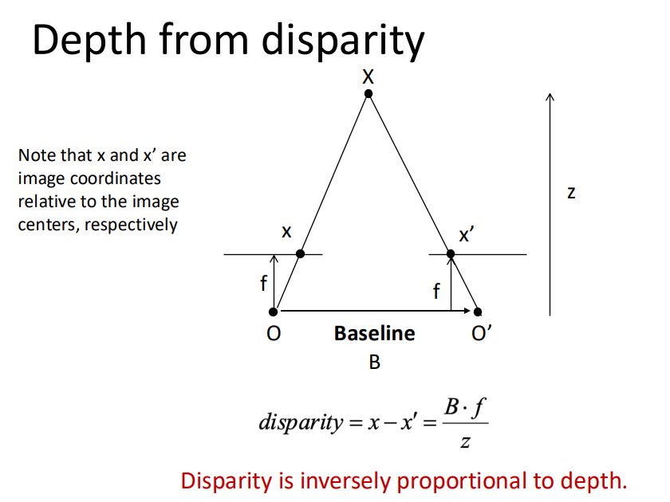

其中 $z$ 是深度，$f$ 是焦距，$B$ 是两台相机的间距，$x - x'$ 是视差（disparity）

## 09. Deep Learning

### Linear Classifier

$x$ 和权重 $w$ 相似时，得到的 score $w^T x$ 越大

loss function for regression: MSE: $\sum_i (f(x_i) - y_i)^2$

不能用于 score based 分类问题，因为 score 是连续值(-inf, +inf)，需要把 score 转化为概率分布(0-1)

softmax function: $S_j = \frac{e^{f_j}}{\sum_k e^{f_k}}$

cross-entropy loss: $D(groundtruth, prediction) = -\sum_i y_i \log S_i$

### Neural Networks

线性 -> 非线性（激活函数）：Sigmoid，Relu... 即每个 perceptron：$f(x) = \sigma(w^T x + b)$

multi-layer NN: $f(x) = \sigma(W_n \sigma(W_{n-1} ... \sigma(W_1 x + b_1) ... + b_{n-1}) + b_n)$

- Fully connected layers

### Convolutional Neural Networks

## 10. Recognition

### 语义分割（Semantic Segmentation）

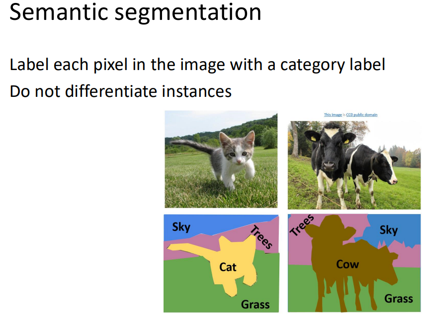

仅区分**不同类别**的像素并标注，例如说图片中有许多个同种物体（许多只猫），这时语义分割只标注哪些像素是猫，而不区分该像素属于哪只猫（Do not differentiate instances）

如何实现语义分割？

- 早期的方法是利用 sliding window，在图像上滑动一个窗口，对窗口内的像素利用 CNN 进行分类，得到该窗口内像素的类别标签，这样太慢了，并且 receptive field 太小
- Fully Convolutional Network (FCN)：make all predictions at once，输出一张预测图（语义图），损失函数是每个像素的交叉熵。
    - High-resolution ->(via down-sampling) Low-resolution ->(via up-sampling) High-resolution
    - Upsampling(Unpooling)
        - 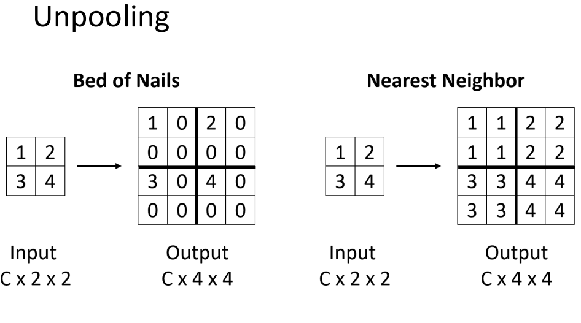
        - 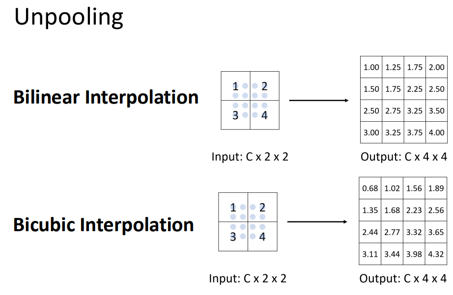
        - 称为 Transposed Convolution
    - U-Net
        - skip connection: combine low-level features with high-level features to get better prediction（从下采样阶段中的某一层直接skip到上采样阶段的某个层，使得某些可能在下采样过程中丢失的细节信息得以保留）
    - DeepLab
        - FCN + Atrous Convolution + CRF(Conditional Random Field)

Evaluation Metrics: IOU(Intersection over Union) = area(预测面积 $\cap$ 真实面积)/area(预测面积 $\cup$ 真实面积)

### Object Detection

Input: single RGB image

Output: A set of bounding boxes that denote objects

- Region Proposal: generate a set of candidate object bounding boxes - R-CNN
    - Bounding box 的质量也通过 IOU 来衡量

TBD

### Instance Segmentation

### Human Pose Estimation

在人体上定义一系列关键点（keypoints），如头顶、肩膀、肘部、手腕、臀部、膝盖、脚踝等

- 单人
- 多人
    - Top-down：在每个 bounding box 内进行单人 pose estimation（Mask R-CNN）
    - Bottom-up：先检测所有关键点，再将关键点组装成不同的人（OpenPose）

### Others

光流（Optical Flow）：描述图像中像素点的运动

- FlowNet
- Raft

Video Classification：识别 actions

## Deep Learning for 3D Vision

### DL4 Feature Mapping

### DL4 Object Pose Estimation

## Computational Photography

在成像过程中利用计算技术（算法）提升图像质量或实现特殊效果

### HDR(High Dynamic Range)

Dynamic Range：图像中最亮和最暗部分的比值

DR 过低就导致很亮或很暗的地方拍出来没有层次，细节丢失（黑糊糊一片）

- 曝光包围(exposure bracketing)：在不同曝光下捕捉多个 LDR 图像
- 合成 HDR 图像：将多个 LDR 图像合成为一个 HDR 图像

### Deblurring

由于失焦或运动模糊导致图像模糊

- 非盲图像反卷积（NBID）：空间反卷积 = 频域中的除法
- 优化：添加正则化项

### Colorization

- Sample-based methods：对目标图像使用源图像的颜色进行着色