# Data Analysis and Machine Learning

!!! note "Overview"
    国际化拔尖人才培养课程：机器学习在数据分析和自然语言处理中的应用。讲得很浅，类似通识课的难度，连写代码的任务都没有。

    > "Eighty percent will be course lessons, and twenty percent will be life lessons."  -- Raja Sooriamurthi

## Lec 1: Introduction

Real World Problem Solving (From abstract world to real world):

1. Puzzled-Based Learning: Domain Independent, Logical Reasoning
2. System-based Learning: Reasoning with domain-specific methods (Learn physics knowledge to solve physics problems, etc.)
3. Project-based Learning: Working with teams, Dealing with uncertainty

例如，问题要求计算$100!$，重要的不是答案，而是计算过程。例如说，可以立刻确定结果末尾有两个零，由100带来的。（好难绷的例子）

> Learing occurs when someone wants to learn, not when someone wants to teach.  -- Roger Schank

### Information System

Class Core, Ultimate Goal: Info System is all about **adding value** to organizations and ~~use technology~~.

Machine Learning永远不会孤立存在，一般发生于某种business context下，用于添加value，例如说医院预测预约者失约的概率。（个人理解：强调实际用途？）因此面对ML问题，从value的角度思考。

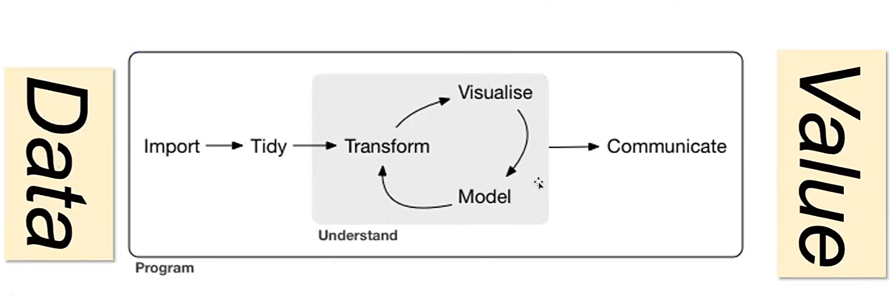

如图，从数据中提取Value的过程，其中Visualize（可视化）代表Data Analysis，Modeling（建模）代表Machine Learning。

### Use of Data

Visualization and Prediction.

Process when solving a problem:

- Consider whether the problem is worth solving
- Invention: WHAT CAN I DO?

### Tools

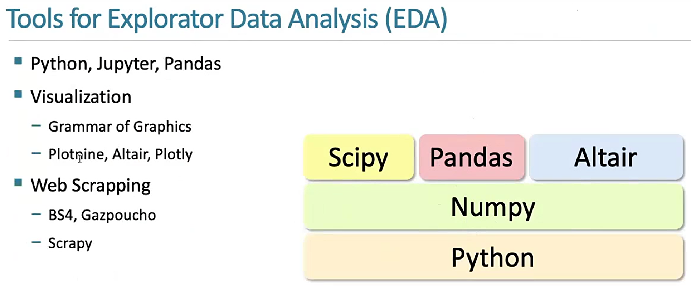

~~"Matplotlib is too low-level"~~

### Machine Learning

Learning: Improvement.

!!! example "eg"
  
    - Recommendation System: Netflix
      
    - Association: People who read this book also read...
      
    - Email spam classification

## Lec2: Computational Thinking & Tidy Data

> If there is no action, there is no value.

### 计算思维

四个方面：

- Decomposition: Divide and Conquer
- Abstraction: Separate the "What" from the "How"
- Recognition: Look for similarities between problems
- Generalization: Adapt previous solutions to new problems
- Computation: How to express solution unambiguously

### Abstraction

~~CS61A讲过了（~~

> This is the approach of stratified design, the notion that a complex system should be structured as a sequence of levels that are described using a sequence of languages.   -- Abelson and Sussman

即复杂的系统在设计/阐述时应该被分层，每一层用不同的语言描述。

e.g. Internet的七层结构，Git分为Porcelain（面向用户）和Plumbing（Core Git）两层。

### EFFECTIVE VISUALIZATION

Tidy Data: 数据的组织格式，使得数据更容易被处理。（例如用表格）

!!! note "e.g."
  
    即便是表格也有messy的，如下图，蓝色表格对人类来说是更可读的，而绿色（Tidy Ver.）对计算机更友好。  

    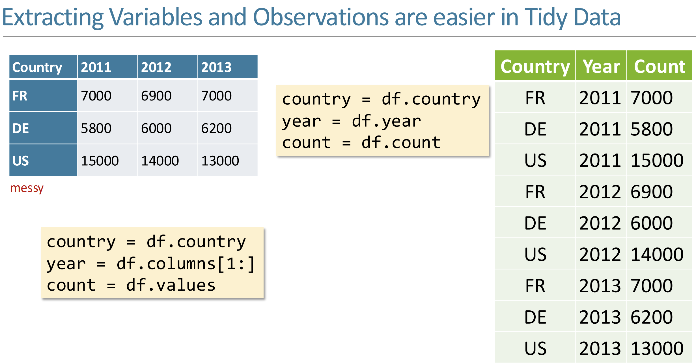

Data Analysis中注意的三个属性：

- Variable: 和编程语言中的变量不同，这里指的是**可以被测量的性质或量**
- Value: 某个时刻测量Variable的结果
- Observation:  The values of several variables measured under similar conditions.

### RESHAPING DATAFRAMES

- Column headers are values, not variable names
- Row headers are Observations.

## Lec 3: Reshape Data - Introduction to Visualization

> Creativity, Curiosity, and Compassion

!!! example "e.g."
  
    Subway Map: put you in other's shoes.

    Data gathered: About Movies.  

    

    面对这些数据，我们可以提出很多问题，例如：性别不同的人分别喜欢看什么电影？年龄对电影评价的影响如何？等等。然后可以造一个Tidy的表格：

    | MovieID | Title | Male_Rating | Female_Rating | Diff |

### Effective Mapping

Types of Data:

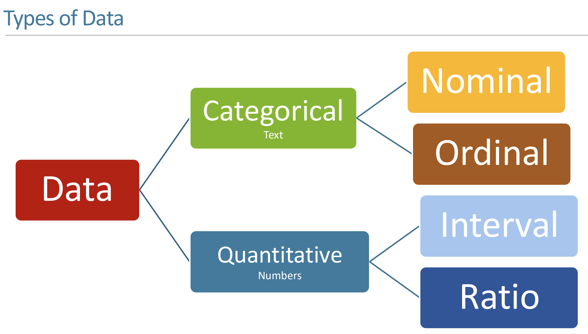

- N(Normals)

    - Operation: =, !=
    - e.g.: 邮政编码，血型，瞳孔颜色，种族，政党
    - 根本无法量化的特性

- O(Ordered)

    - Operation: =, !=, >(<)(=)
    - e.g.: "Low/High/Medium Income Level". 满意程度（高，中，低）
    - 具有分级（Order）的大致范围

- Q(Interval - Location of zero arbitrary - 0 只是一个标记点，实则也是一个该量的值)

    - Operation: =, !=, >(<)(=), -
    - e.g.: temperature（摄氏度与华氏度）, pH, SAT score

- Q(Ratio - Location of 0 fixed - 0 代表该量的完全缺失)

    - Operation: =, !=, >(<)(=), -, /
    - e.g.: Physical measurements(mass, length, 开尔文温度)
    - 换句话说，不存在负数（？）

## Lec 4: Overview of Machine Learning

Value Proposition (end-to-end)

- Pain Point
- Problem Formulation (measure the pain)
- Solution Development
- Deployment
- Evaluation (reduction in pain)
- Maintenance / Sustainability

### Measurement of learning

用P表示对某程序的表现衡量，定义经历E和某类任务T，则$P(T,E+\Delta) > P(T,E)$。

ML TASKS:

- **Classification / Regression**

    - assign a label (classification) or numerical value (regression) to an unknown entity based on a set of features and known labels (or numerical values)

- **Clustering**

    - group a bunch of entities that share common features

- **Optimization**

    - from amongst a set of alternatives pick the “best” while balancing competing value metrics

- **Forecasting**

    - based on the past, forecast the future

- **Recommendation**

    - based on prior behavior rank order candidate preferences

- **Association**

    - identify which items co-occur e.g., bread and peanut butter

如何评判ML TASKS完成的好坏？（mea

1. 需要确定评判的指标（e.g.

### Types of Learning

- Supervised Learning

    - We know both the input and the output
    - 'Teacher'

- Unsupervised Learning

    - We only know the input

- Reinforcement

    - We know what is desired (correct) and what is not desired
    - the ‘credit/blame assignment’ problem

Pull out features from data, and then feed them into a **model**.

Two phases of ML:

1. Training (with training data)
2. Testing (with testing data)

## Lec 5: Evaluating a Classifier

### Cross-Validation AND DATA LEAKAGE

#### Cross-Validation

没太听懂这块，这个Cross-Validation是用来减少“运气”对结果的影响，to measure authentic learning.

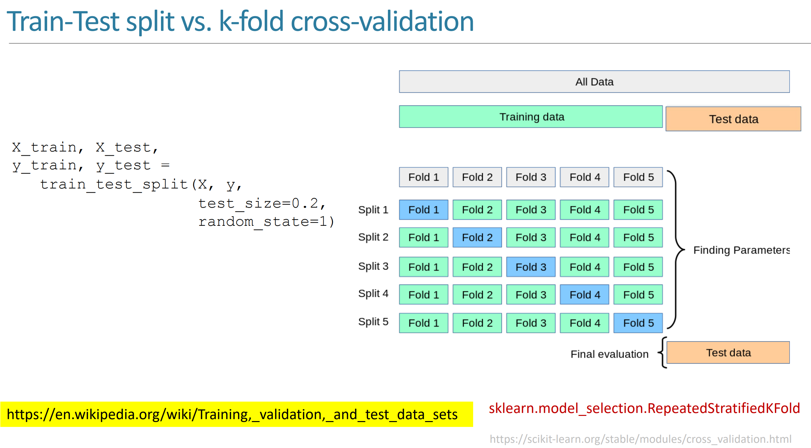

#### Data Leakage

Leakage: Testing data has overlapped with training data.

The twain shall never meet.

### cLASSIFIER EVALUATION

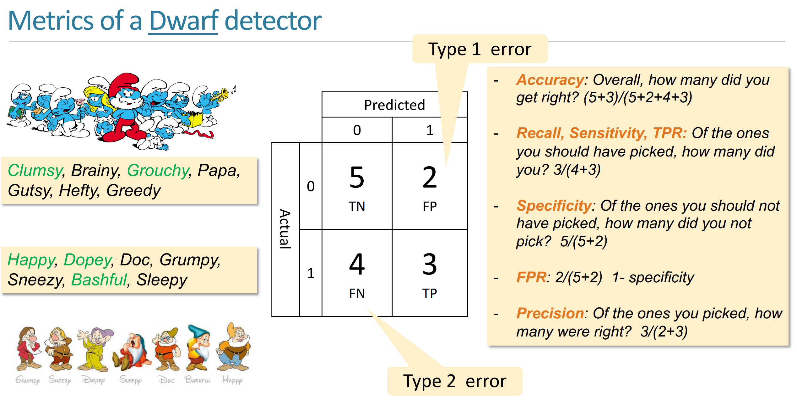

形似倒排索引那一课的表格。

## Lec 6: Decision Trees

决策树每个节点是一个问题，节点的每个子节点是一个答案，最终叶子节点是一个决策。

Good Decision Tree: Wide and Shallow.

建树方法：Brutal Force & Greedy Algorithm.

### Recursive Partitioning

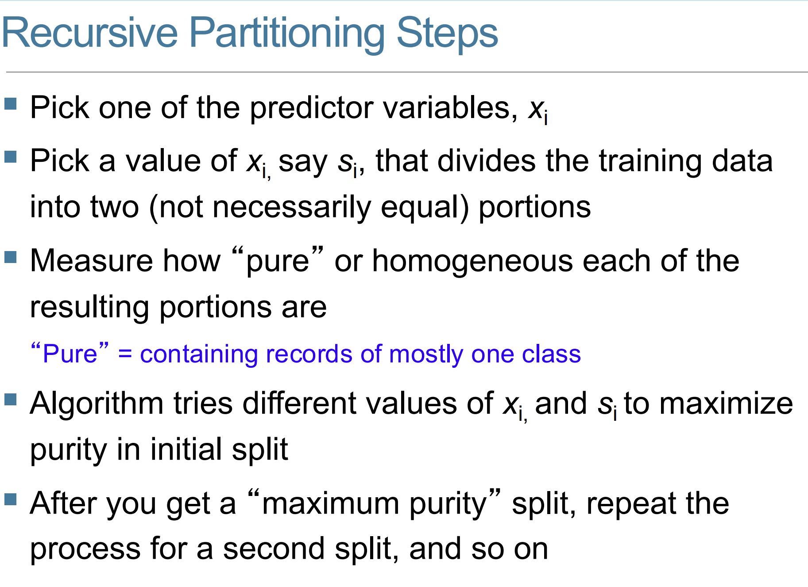

对于每个predictor variable，选择一个value，然后根据这个value的值将数据分为两部分，然后在purity达到最大时递归。

这个 Split 的过程就可以用 Decision Tree 来表示，分成的几部分就用几个叶子节点表示，最终得到一个可用于 Classification 的 Decision Tree。

### Purity

- Misclassification Error Rate: $1 - max(p1, p2, ..., pk)$
- GINI（基尼系数）: $1 - (p1^2 + p2^2 + ... + pk^2)$（If the partition is fully homogeneous, GINI = 0）
- Entropy: $-p1log(p1) - p2log(p2) - ... - pklog(pk)$
- $p_k$ 是在每个决策后的数据集（即每个叶子节点）中，随机挑选一个数据，其属于第k类的概率。
- 一组父子关系（也就是一次Split）的GINI Index就是所有子节点GINI Index的加权平均。（权重为子节点数据集的大小占比）
- 叶子节点的GINI Index越小，说明这个叶子节点的数据越纯，如果降为0，说明这个叶子节点的数据完全纯净（全部属于同一类）。

!!! example "eg"
  

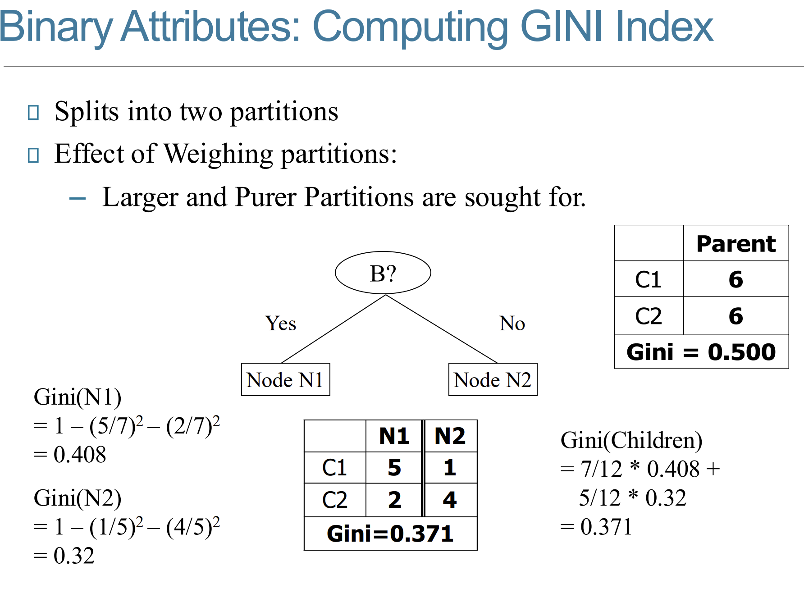

### Random Forest

在建森林时的随机性：

- Bagging: 从原始数据集中随机抽取一部分数据，然后用这部分数据建立一个决策树。

    - 经验上取2/3的数据

- Feature: 从所有的特征中随机选取一部分特征，然后用这部分特征建立一个决策树。

    - 经验上取$\sqrt{p}$个特征

### Ensemble Learning

以 error rate 而言，Learner 可以被分为 Strong, Bad, Weak.

Ensemble Learning: 通过组合多个 Weak Learner 来构建一个 Strong Learner。

!!! example "eg"
  
    以这个判断垃圾邮件的 Classifier 为例，我们仅有的特征是 `Lottery`（彩票）和 `Sale` 这两个词在邮件中出现的次数。我们要对这个 Classifier 建一个决策树。  

    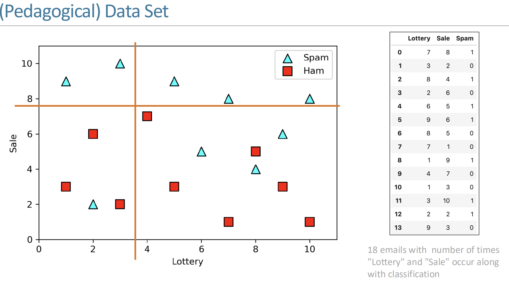

    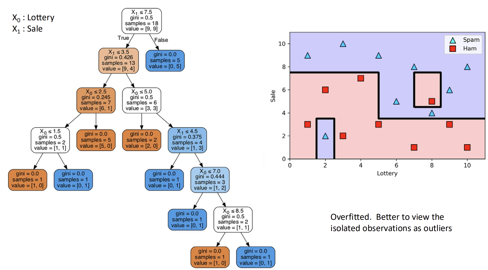
    
    这里`value`的两个分量就是当前节点对应情况下的 Spam/Ham 个数。

### Bagging(Bootstrap Aggregating)

从原始数据集（Observations）中随机抽取一部分数据，然后用这部分数据建立一个决策树（Weak Learner）。

Weak Learner 通过投票（VOTE）合成 Strong Learner。（从图像上讲，如果某一区域被超过一半的决策树判断为 Spam，那么这个区域就鉴定为 Spam）

这里的 Vote 可以理解为加权投票，即每个决策树的权重不同。

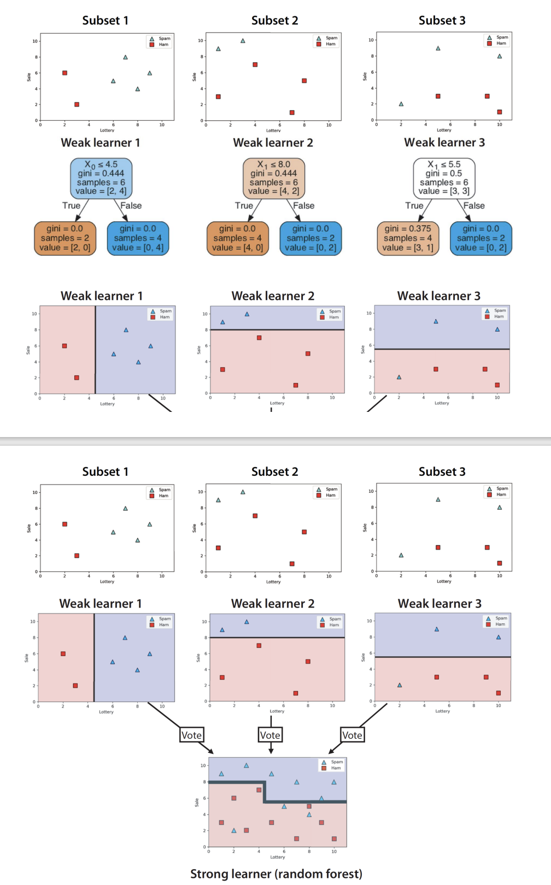

### Boosting (AdaBoost(Adaptive Boosting))

为每个数据点赋予一个权重，每次建树（即 Weak Learner）时，对于错误鉴定的数据点，增加其权重，在此基础上接着新建 Weak Learner 与决策树。

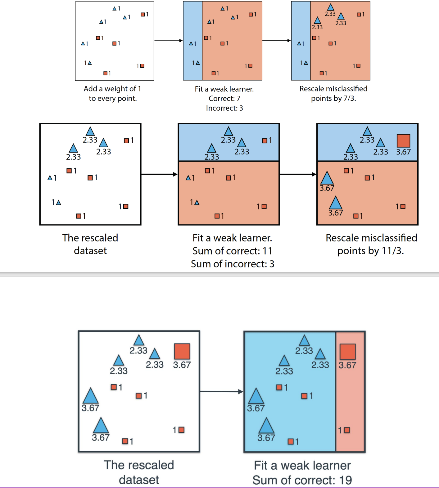

类似 Bagging 的投票，这里需要评判每个 Weak Learner 的权重。

使用 `log-odds(accuarcy)` 函数，根据 Learner 的准确率评判每个 Weak Learner 的权重：

- $log-odds(accuarcy) = log(\frac{accuarcy}{1-accuarcy})$
- 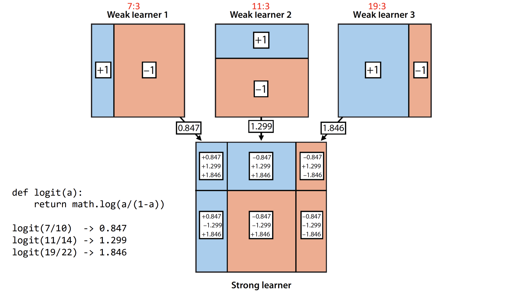

### Sciktlearn-demo

概率论基础知识：

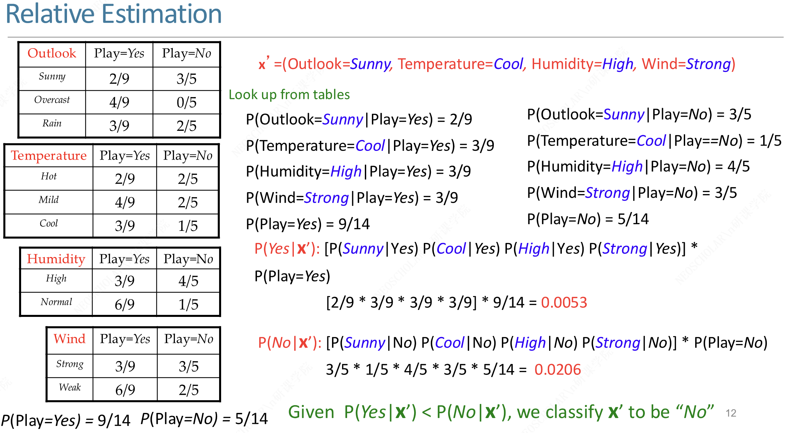

使用 MNIST 数据集，对数字进行鉴别。

每个数字是一个 28x28 符号组成的图片，共有 784 个 feature，每个特征是一个格子里的符号。

## Lec 7: Recommender System: User-based and Item-based

- Apply Machine Learning: How?

    - 第一步是分辨利益相关者（Stakeholder）：Producer, Consumer, Manager
    - 考虑这些利益相关者的价值主张（Value Proposition）
    - Use specific method/task

        - Classification ... and so on

这一节课就探讨一下 Recommendation 的实际原理。

!!! example "intro"

    The Long Tail Effect:

    - Small number of best-selling products
    - Large number of products selling in small quantities

### Recommendation method

- Hand Curated (人工推荐)

    - 人工推荐，例如“大家都在看”
    - 实则是没有考虑到当前用户的 Preference

- Simple Aggregation （简易聚合）

    - 例如 Amazon 的“Customers who bought this item also bought...”
    - 仅仅是根据购买记录进行推荐

- Personalized

### Collaborative Filtering

#### Distance/Similarity Metrics

$sim(u, v) = \frac{1}{1 + d(u, v)}$

- Euclidean Distance
- Manhattan Distance
- Pearson Coefficient
- Tanimoto Coefficient
- Jaccard Distance (Similarity of sets): $\frac{A \cap B}{A \cup B}$

#### User-based

可使用：User Rating Matrix

- 横坐标是 Item，纵坐标是 User
- 每个格子是 User 对 Item 的评分

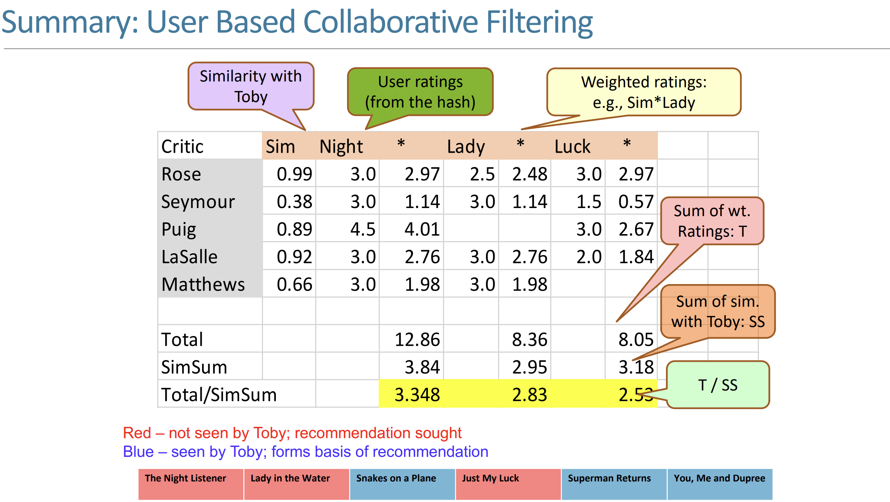

Drawback：Item 必须是 Users 共有的，例如说都看过一部电影，这是很难收集的。

#### Item-based

- 横坐标是需要被推荐的 Item，纵坐标是已经被评分的 Item
- 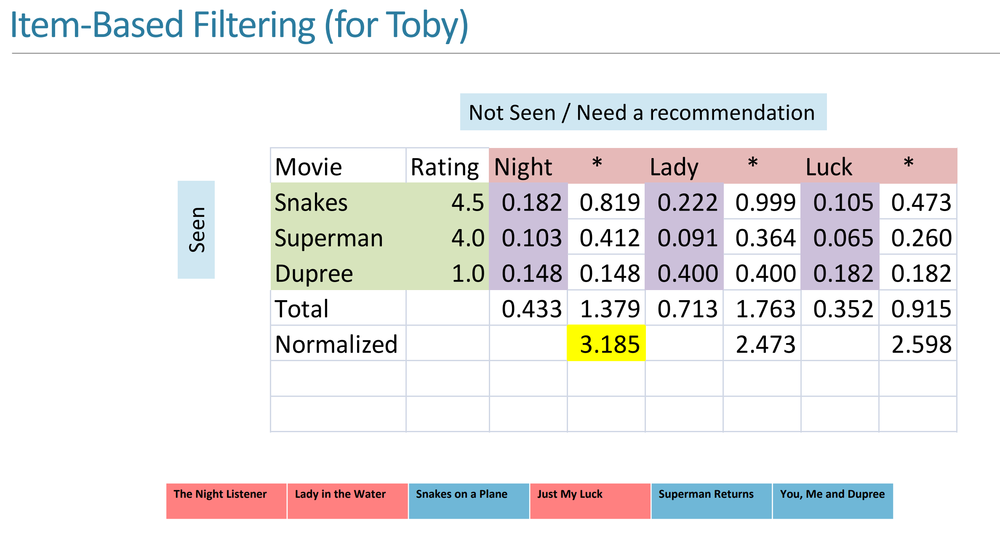
- 这里紫色背景的数据是这一列列头的电影（属性）和这一行行头的电影（属性）的相似度

#### Content-based

每个人对电影的不同标签有不同的 Rate，电影本身也在这些标签上有不同的 Rate，相同的标签 Rate 相乘，得到 User 在该标签上的评价（Score），将所有标签的评价加和，得到 User 对电影的评价（实则是一个矩阵乘，见下图）

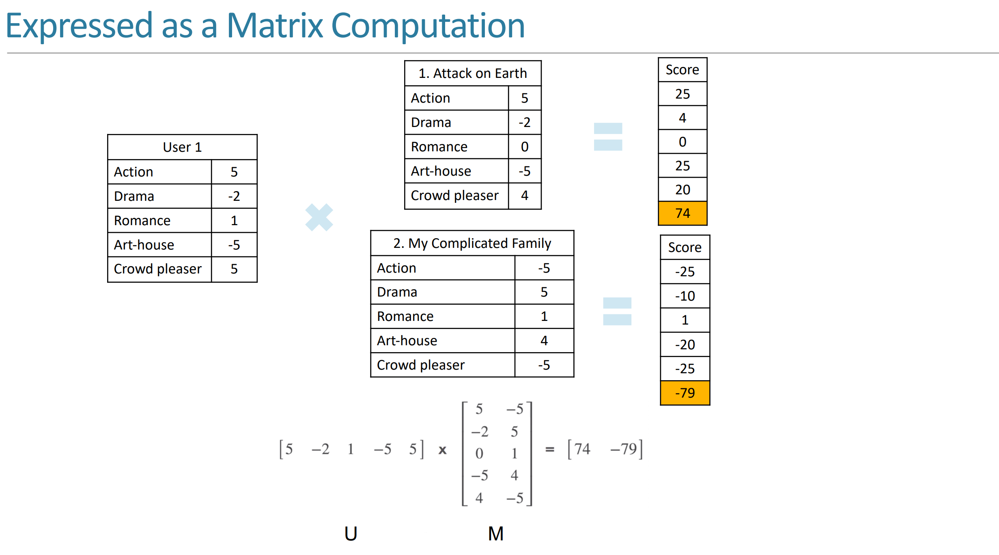

#### Latent Factor Based

## Lec 8

### Alternating Least Squares

TBD

何时停止迭代？有下面三种情况：

- 迭代一段时间后停止
- 迭代一定次数后停止
- 计算每次迭代后与实际值的差距，当差距小于某个阈值时（或者误差不再减小了）停止

## Lec 9: Optimization (Genetic Algorithm)

!!! note "Intro: CSP"
    **约束满足问题**：我们被提供：

    - 一系列变量
    - 每个变量的取值范围
    - 一系列**约束**限制了这些变量的取值

    我们需要求得：

    - 每个变量合适的取值，使得所有的约束条件都被满足

    一些变种问题

    - 这样的取值（解）是否存在
    - 找到一些解
    - 找到所有解
    - 在某个条件下，找到最优解

与 Constraint Satisfaction Problem 不同，Optimization Problem 还需要进行解的 质量评估（Quality Measure），有时会要求一个评估函数（Evaluation Function）。

### 真实案例：拍卖车的最佳分配

