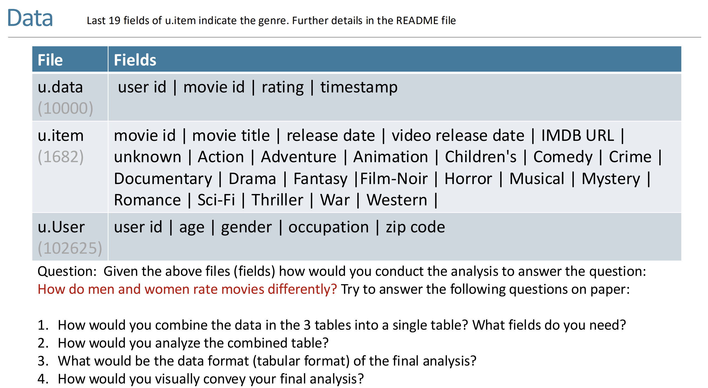

# Data Analysis and Machine Learning

!!! note "Overview"
    国际化拔尖人才培养课程：数据分析与机器学习。讲得很浅，连写代码的任务都没有。

    "Eighty percent will be course lessons, and twenty percent will be life lessons."  -- Raja Sooriamurthi

## Lec 1: Introduction

Real World Problem Solving (From abstract world to real world):

1. Puzzled-Based Learning: Domain Independent, Logical Reasoning
2. System-based Learning: Reasoning with domain-specific methods (Learn physics knowledge to solve physics problems, etc.)
3. Project-based Learning: Working with teams, Dealing with uncertainty

例如，问题要求计算$100!$，重要的不是答案，而是计算过程。例如说，可以立刻确定结果末尾有两个零，由100带来的。（好难绷的例子）

> Learing occurs when someone wants to learn, not when someone wants to teach.  -- Roger Schank

### Information System

Class Core, Ultimate Goal: Info System is all about **adding value** to organizations and ~~use technology~~.

Machine Learning永远不会孤立存在，一般发生于某种business context下，用于添加value，例如说医院预测预约者失约的概率。（个人理解：强调实际用途？）因此面对ML问题，从value的角度思考。

如图，从数据中提取Value的过程，其中Visualize（可视化）代表Data Analysis，Modeling（建模）代表Machine Learning。

### Use of Data

Visualization and Prediction.

Process when solving a problem:

- Consider whether the problem is worth solving
- Invention: WHAT CAN I DO?

### Tools

~~"Matplotlib is too low-level"~~

### Machine Learning
Learning: Improvement.

!!! example "eg"
    - Recommendation System: Netflix
    - Association: People who read this book also read...
    - Email spam classification

## Lec2: Computational Thinking & Tidy Data

> If there is no action, there is no value.

### 计算思维

四个方面：

- Decomposition: Divide and Conquer
- Abstraction: Separate the "What" from the "How"
- Recognition: Look for similarities between problems
- Generalization: Adapt previous solutions to new problems
- Computation: How to express solution unambiguously

### Abstraction

~~CS61A讲过了（~~

> This is the approach of stratified design, the notion that a complex system should be structured as a sequence of levels that are described using a sequence of languages.   -- Abelson and Sussman

即复杂的系统在设计/阐述时应该被分层，每一层用不同的语言描述。

e.g. Internet的七层结构，Git分为Porcelain（面向用户）和Plumbing（Core Git）两层。

### EFFECTIVE VISUALIZATION

Tidy Data: 数据的组织格式，使得数据更容易被处理。（例如用表格）

!!! note "e.g."
    即便是表格也有messy的，如下图，蓝色表格对人类来说是更可读的，而绿色（Tidy Ver.）对计算机更友好。  
    

Data Analysis中注意的三个属性：

- Variable: 和编程语言中的变量不同，这里指的是**可以被测量的性质或量**
- Value: 某个时刻测量Variable的结果
- Observation:  The values of several variables measured under similar conditions.

### RESHAPING DATAFRAMES

+ Column headers are values, not variable names 
+ Row headers are Observations.

## Lec 3: Reshape Data - Introduction to Visualization

> Creativity, Curiosity, and Compassion

!!! example "e.g."
    Subway Map: put you in other's shoes.  

Data gathered: About Movies.  

面对这些数据，我们可以提出很多问题，例如：性别不同的人分别喜欢看什么电影？年龄对电影评价的影响如何？等等。然后可以造一个Tidy的表格：

| MovieID | Title | Male_Rating | Female_Rating | Diff |

### Effective Mapping

Types of Data:

- N(Normals)
    - Operation: =, !=
    - e.g.: 邮政编码，血型，瞳孔颜色，种族，政党
    - 根本无法量化的特性
- O(Ordered)
    - Operation: =, !=, >(<)(=)
    - e.g.: "Low/High/Medium Income Level". 满意程度（高，中，低）
    - 具有分级（Order）的大致范围
- Q(Interval - Location of zero arbitrary - 0 只是一个标记点，实则也是一个该量的值)
    - Operation: =, !=, >(<)(=), -
    - e.g.: temperature（摄氏度与华氏度）, pH, SAT score
- Q(Ratio - Location of 0 fixed - 0 代表该量的完全缺失)
    - Operation: =, !=, >(<)(=), -, /
    - e.g.: Physical measurements(mass, length, 开尔文温度)
    - 换句话说，不存在负数（？）

## Lec 4: Overview of Machine Learning

Value Proposition (end-to-end)

- Pain Point
- Problem Formulation (measure the pain)
- Solution Development
- Deployment
- Evaluation (reduction in pain)
- Maintenance / Sustainability

### Measurement of learning

用P表示对某程序的表现衡量，定义经历E和某类任务T，则$P(T,E+\Delta) > P(T,E)$。

ML TASKS:

- **Classification / Regression**
  - assign a label (classification) or numerical value (regression) to an unknown entity based on a set of features and known labels (or numerical values)
- **Clustering**
  - group a bunch of entities that share common features
- **Optimization**
  - from amongst a set of alternatives pick the “best” while balancing competing value metrics
- **Forecasting**
  - based on the past, forecast the future
- **Recommendation**
  - based on prior behavior rank order candidate preferences
- **Association**
  - identify which items co-occur e.g., bread and peanut butter

如何评判ML TASKS完成的好坏？（mea
1. 需要确定评判的指标（e.g.

### Types of Learning
- Supervised Learning
  - We know both the input and the output
  - 'Teacher'
- Unsupervised Learning
  - We only know the input
- Reinforcement
  - We know what is desired (correct) and what is not desired
  - the ‘credit/blame assignment’ problem

Pull out features from data, and then feed them into a **model**.

Two phases of ML:
1. Training (with training data)
2. Testing (with testing data)

## Lec 5: Evaluating a Classifier

### Cross-Validation AND DATA LEAKAGE
#### Cross-Validation
没太听懂这块，这个Cross-Validation是用来减少“运气”对结果的影响，to measure authentic learning.

#### Data Leakage
Leakage: Testing data has overlapped with training data.

The twain shall never meet.

### cLASSIFIER EVALUATION
