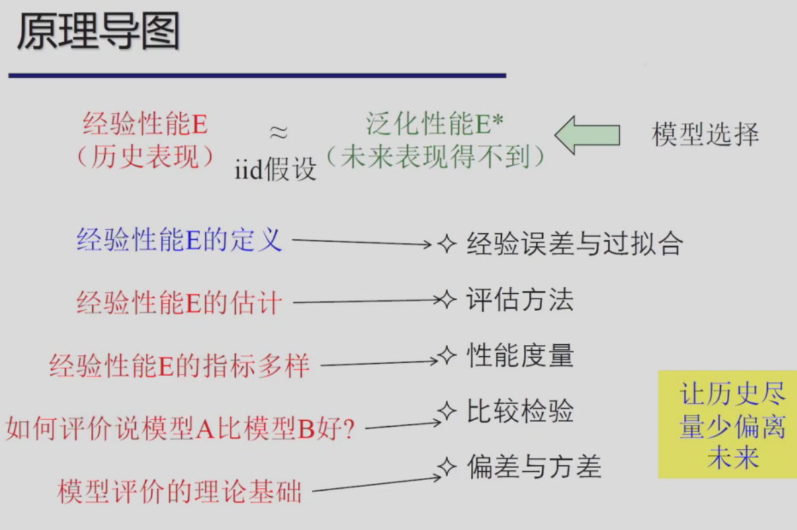
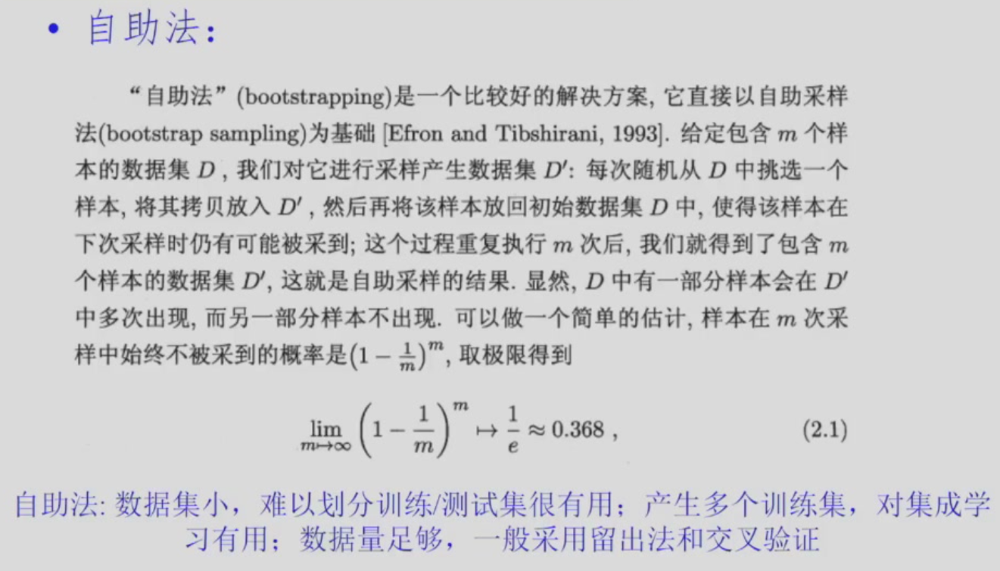
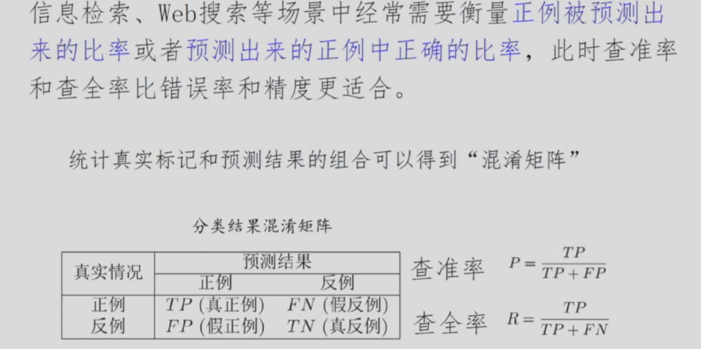
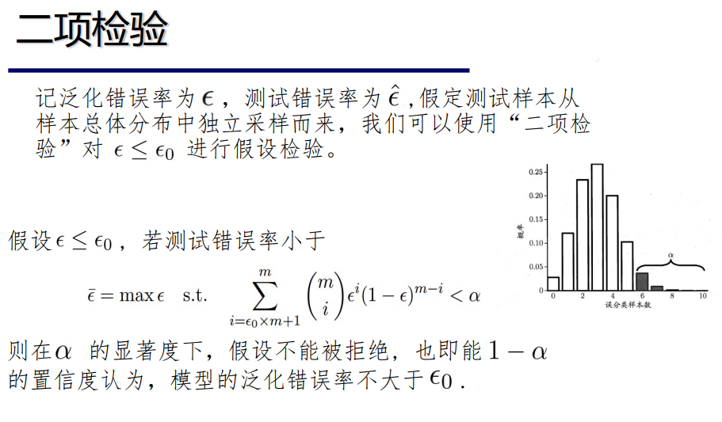
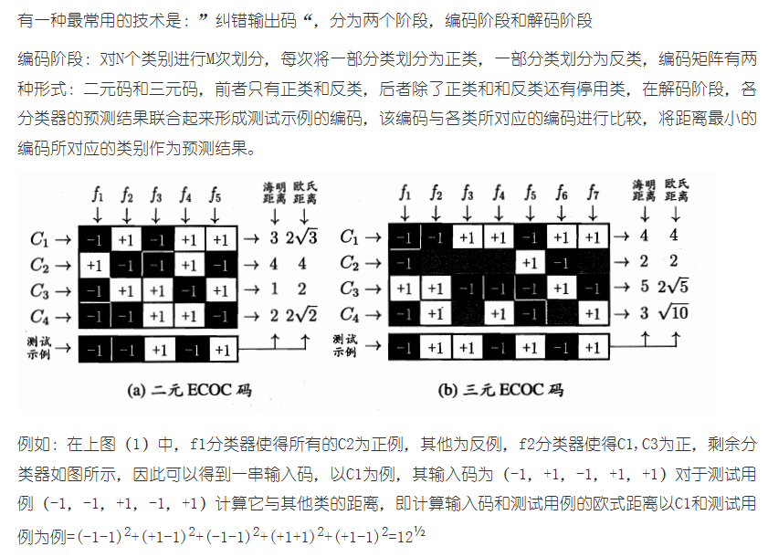
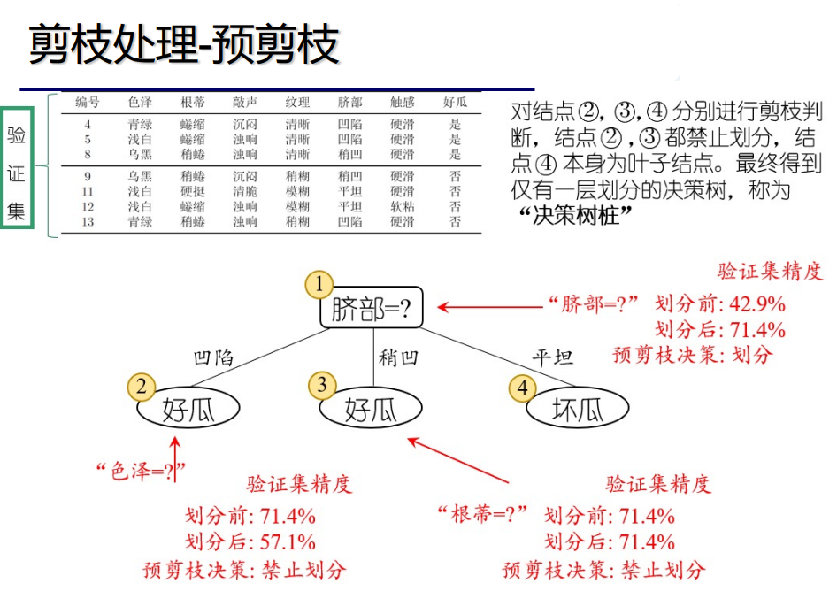
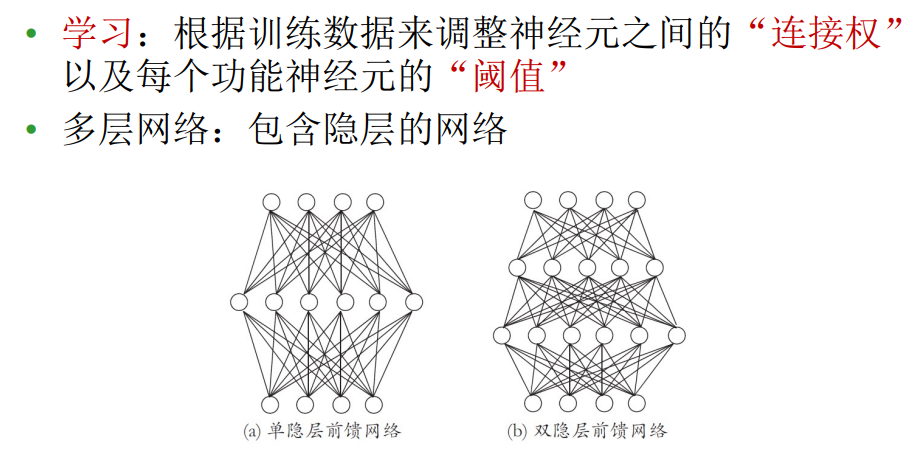
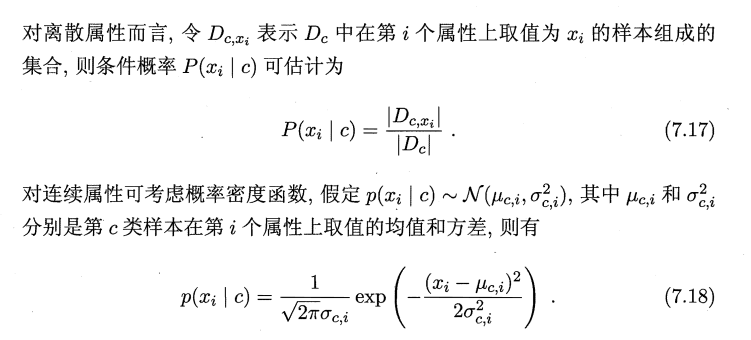
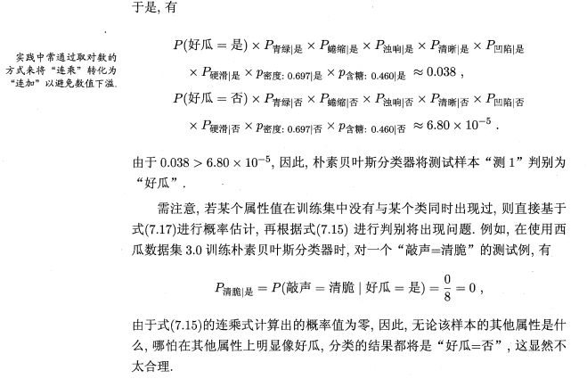
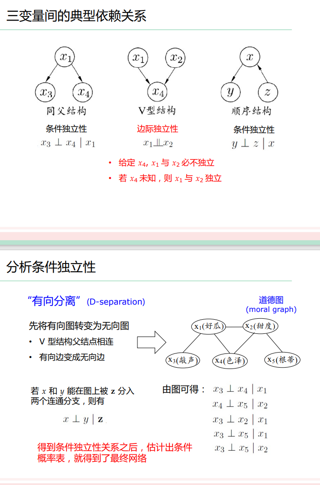

> Let's fxxking go

# 机器学习

> 任课教师：赵洲
> 参考：《机器学习》（周志华），https://note.gopoux.cc/cs/ml/review/

!!! note "Homework"
    [HW1](./assets/MLhw1.pdf)

## Terminology

- 特征（Feature）：又称属性（Attribute）
- 属性值：属性的取值
- 样本（Sample）/示例（Instance）：数据集中的每一行记录（一个对象的输入）**不含标记**
- 样本维度：样本的属性个数
- 特征张成的空间：属性空间/输入空间
- 标记张成的空间：输出空间
- 样例（Example）：示例+标记
- 任务：
    - 预测任务：根据标记的取值情况
        - 分类任务：标记是离散值（二分类、多分类）
        - 回归任务：标记是连续值
        - 聚类任务：标记为空值，对示例进行分组
    - 监督学习：所有 Instance 都有标记（分类、回归）
    - 无监督学习：所有 Instance 都没有标记（聚类）
    - 半监督学习：少量 Instance 有标记，大量没有标记

机器学习的根本目标是提高模型的**泛化能力**（Generalization），即在未见过的数据上也能有良好的表现——依靠历史数据来逼近泛化能力（假设历史和未来**独立同分布**）。

归纳偏好：学习过程中对某种类型假设的偏好

No free lunch theorem：如果算法 A 在某些问题上表现优于算法 B，那么必然存在另一些问题，算法 B 优于算法 A。

### 模型评估与选择

!!! note "错误率与误差"
    - 错误率（Error Rate）：分类错误的样本数占总样本数的比例
    - 误差（Error）：样本真实输出与预测输出之间的差距

- 过拟合：模型学习能力过强，将训练样本本身的某些特质都当作所有样本的一般性质，导致泛化能力下降
    - Sol：优化目标加正则项，early stopping
- 欠拟合：对训练样本的一般性质都没有学到
    - Sol：增加模型复杂度，决策树（拓展分支），神经网络（增加训练轮数）

??? note "将数据集分成训练集和测试集（评估方法）"
    - 留出法（Hold-out）：将数据集随机分成训练集和测试集
        - 划分尽可能保持数据分布的一致性
        - 分层采样（Stratified Sampling）：保持类别比例一致
    - 交叉验证（Cross Validation）：将数据集分成 k 份，轮流用 k-1 份做训练集，1 份做测试集，最终得到 k 个测试结果，取平均值作为返回结果
    - 留一法（Leave-one-out）：取交叉验证中 k 为数据集样本总数
    - 自助法
        - 

在进行模型评估与选择时，除了对适用学习算法进行选择，还需对算法参数进行设定（调参）。

### 性能度量

对模型泛化能力的评价标准

- 回归任务常用**均方误差**
    - $E(f;D) = \frac{1}{m} \sum_{i=1}^{m} (f(x_i)-y_i)^2$
- 对分类任务，错误率和精度最常用（即分对/错样本占样本总数的比例）
    - 错误率：$E(f;D) = \frac{1}{m} \sum_{i=1}^{m} I(f(x_i) \neq y_i)$
    - 精度：$Acc(f;D) = \frac{1}{m} \sum_{i=1}^{m} I(f(x_i) = y_i) = 1 - E(f;D)$
    - 混淆矩阵：
        - 
        - 查重率-查准率曲线（P-R Curve）
        - F1值：$F_1 = \frac{2 \cdot P \cdot R}{P + R} = \frac{2 \cdot TP}{样例总数 + TP - TN}$
        - FPR-TPR曲线（ROC Curve）（$FPR = \frac{FP}{FP + TN}, TPR = \frac{TP}{TP + FN}$）

### 比较检验

- 二项检验：
    - 
- T 检验：
    - 

## 线性模型

对于由 $d$ 个属性描述的 Instance $x$，线性模型试图学得一个通过属性的线性组合来进行预测的函数，即 $f(x) = w_1 x_1 + w_2 x_2 + ... + w_d x_d + b = w \cdot x + b$。其中 $x_i$ 是 $x$ 在第 $i$ 个属性上的取值

### Perceptron 感知机

线性模型中若误分类则有 $- y_i (w \cdot x_i + b) \gt 0$，则可定义感知机损失函数为 $L(w,b) = - \sum_{i=1}^{m} y_i (w \cdot x_i + b)$

梯度：$\frac{\partial L}{\partial w} = - \sum_{i=1}^{m} y_i x_i$，$\frac{\partial L}{\partial b} = - \sum_{i=1}^{m} y_i$

### 常见线性模型任务

- 线性回归
    - 目标：回归任务。最小化均方误差，对于输入属性个数为1的最简单情况，即 $(w^*, b^*) = \arg\min_{w,b} \sum_{i=1}^{m} (y_i - w x_i - b)^2$，亦即**最小二乘法**。对该式求导即可得到最小值点
    - 对于多元线性回归，数据集 $D$ 表示为一个矩阵 $X$，在 $X^T X$ 满秩或正定的情况下可学得模型 $f(x) = \hat{x}_i^T (X^T X)^{-1} X^T y$，其中 $\hat{x}_i = (x_i, 1)$
        - 现实中常见 $X^T X$ 不满秩的情况，此时可解出多个 $\hat{w}$，它们都能使均方误差最小化。选择哪个解作为输出将由学习算法的归纳偏好决定，常见的做法是引入正则化 (regularization) 项
    - 命 $f(x) = \ln y$，则为对数线性回归
- 对数几率回归
    - 分类任务。对于二分类任务，输出标记 $y \in \{0, 1\}$，而线性回归模型产生的预测值 $z = w^T x + b$ 是实值，于是我们需将预测值转换为 0/1，例如 Heaviside 步函数（$f(z) = 1$ if $z \geq 0$ else $0$），但该函数不可导，不利于优化
    - Sigmoid 函数：$f(z) = \frac{1}{1 + e^{-z}} = \frac{1}{1+e^{w^T x + b}}$
    - 此时可得到对数几率 $\ln \frac{y}{1-y} = w^T x + b$，$\frac{y}{1-y}$ 称为几率（odds）（反映了正例相对于反例的可能性），加上对数称为**对数几率**，即对数几率（logit）是输入属性的线性函数
    - 那么 $P(y=1|x) = \frac{e^{w^T x + b}}{1 + e^{-(w^T x + b)}}$，$P(y=0|x) = \frac{1}{1 + e^{-(w^T x + b)}}$，可见 Sigmoid 函数的输出可解释为样本属于正例的概率
    - 极大似然法（估计 $w, b$）：给定数据集 ${(x_i, y_i)}_{i=1}^{m}$，对数回归模型最大化对数似然函数
        - $L(w,b) = \sum_{i=1}^{m} [y_i \ln P(y_i=1|x_i) + (1-y_i) \ln P(y_i=0|x_i)]$
        - 命 $\beta = (w, b), \hat{x}_i = (x_i, 1)$，于是转化为最小化负对数似然函数 $l(\beta) = \sum_{i=1}^{m} [-y_i \beta^T \hat{x}_i + \ln(1 + e^{\beta^T \hat{x}_i})]$
        - 使用牛顿法求解 $\frac{\partial l}{\partial \beta} = 0$,可得到最优解 $\beta^* = \arg\min_{\beta} l(\beta)$
- 线性判别分析（Linear Discriminant Analysis, LDA）
    - 给定训练样本，将样例投影到一条直线上，使得同类样例的投影点尽可能接近、异类样例的投影点尽可能远离；在对新样本进行分类时，将其投影到同样的这条直线上，再根据投影点的位置来确定样本的类别
    - 可被视为一种监督降维技术
    - 两类数据同先验，满足高斯分布且协方差相等时，LDA 达到最优分类

### 多分类学习

将多分类任务拆成若干个二分类任务来解决，对每个分类器的预测结果进行集成得到多分类结果

- 一对多（one-vs.-rest, OvR）：对于 $k$ 类分类任务，命某一类别为正例，其余类别为反例，训练 $k$ 个分类器，对于每个样本，每个分类器输出正例的概率，比较各分类器预测置信度，置信度最大的类别为预测类别。
- 一对一（one-vs.-one, OvO）：对于 $k$ 类分类任务，两两匹配，训练 $k(k-1)/2$ 个二分类器，新样本提交给所有分类器预测，投票被预测最多的结果即为预测结果

- 多对多（many-vs.-many, MvM）：若干类作为正类，另一部分作为反类
    - 

### 类别不平衡问题

不同类别的样本数量差异较大 -> 转化为类别平衡问题

- 再缩放（Rescaling）
    - 欠采样：去除一些反例使得正例和反例数量接近。
    - 过采样：增加一些正例使得正例和反例数量接近。
    - 阈值移动：调整分类器的输出阈值。

## 决策树

从根结点到每个叶结点的路径对应了⼀个判定测试序列

### 基本学习算法

递归结束条件：

- 当前结点包含的样本全属于同一类别。
- 当前结点包含的样本为空。结点类别设定为其父结点包含样本最多的类别。
- 当前结点包含样本的剩余特征的取值相同。结点类别设定为包含样本最多的类别

### 划分属性

希望决策树的分⽀结点所包含的样本尽可能属于同⼀类别，即结点的 “纯度”(purity) 越来越⾼

- ID3 决策树（使用信息增益作为划分属性的选择标准）    
    - 信息熵（Entropy）：假设当前样本集合 $D$ 中第 $k$ 类样本所占比例为 $p_k$，则 $D$ 的信息熵定义为 $Ent(D) = - \sum_{k=1}^{|\mathcal{Y}|} p_k \log_2 p_k$。熵越大，纯度越低。
    - 最小值为 0，最大值为 $\log_2 |\mathcal{Y}|$，其中 $|\mathcal{Y}|$ 为类别数
    - 信息增益：使用属性 $a$ 对 $D$ 进行划分，得到若干个子集 $D_v$，其中 $D_v$ 包含了 $D$ 中所有 $a$ 值为 $a^v$ 的样本，则可定义划分获得的信息增益： $Gain(D,a) = Ent(D) - \sum_{v=1}^{V} \frac{|D_v|}{|D|} Ent(D_v)$；信息增益越大则通过 $a$ 划分后纯度提升越多
    - 缺点是信息增益偏好于取值较多的属性
- C4.5 决策树（使用信息增益率作为划分属性的选择标准）
    - 信息增益率：$Gain\text{-}ratio(D,a) = \frac{Gain(D,a)}{IV(a)}$，其中 $IV(a) = - \sum_{v=1}^{V} \frac{|D_v|}{|D|} \log_2 \frac{|D_v|}{|D|}$，称为属性 $a$ 的固有值（Intrinsic Value），属性 $a$ 可取的值越多（V 越大），固有值越大
    - 给信息增益做了一个规范化
    - 信息增益率偏好于取值较少的属性，故 C4.5 先选出信息增益高于平均水平的属性，再从中选取信息增益率最高的属性作为划分属性
- CART 决策树（使用基尼指数作为划分属性的选择标准）
    - 基尼值（Gini Index）：假设当前样本集合 $D$ 中第 $k$ 类样本所占比例为 $p_k$，则 $D$ 的基尼值定义为 $Gini(D) = 1 - \sum_{k=1}^{|\mathcal{Y}|} p_k^2$。基尼指数越小，纯度越高
    - 划分后基尼指数（Gini Index）：使用属性 $a$ 对 $D$ 进行划分，得到若干个子集 $D_v$，则可定义属性 $a$ 的基尼指数：$Gini\text{-}index(D,a) = \sum_{v=1}^{V} \frac{|D_v|}{|D|} Gini(D_v)$
    - 选择使划分后基尼指数**最小**的属性作为划分属性

### 剪枝

决策树很容易过拟合，需要通过剪枝来提升泛化能力

- 预剪枝（Pre-pruning）：在决策树生成过程中，对每个结点在划分前进行评估，若划分后泛化能力没有提升，则不进行划分，直接将该结点设为叶结点，其类别设为训练样例中最多的类别
    - 
    - pros：降低过拟合风险，显著减少训练时间和测试时间开销
    - cons：可能导致欠拟合
- 后剪枝（Post-pruning）：先生成完整决策树，然后从深至浅考察每个非叶结点，若将该结点变为叶结点后泛化能力提升（验证集精度提升），则进行剪枝
    - pros：保留了更多的分支，欠拟合风险小
    - cons：增加训练时间开销

### 连续值处理

决策树只能处理离散值属性，需对连续值属性进行离散化处理

当前节点划分属性为连续值时，该属性可以继续作为其后代节点的划分属性（例如在父节点上使用了“密度 $\leq 0.5$”作为划分属性，则在子节点上仍然可以使用“密度 $\leq 0.3$”作为划分属性）

### 缺失值处理

有些样本在某些属性上缺失值，需要解决以下两个问题：

- 在属性缺失的情况下如何选择划分属性
- 给定划分属性，如果某样本在该属性上缺失值，如何对该样本进行划分

### 多变量决策树

每个非叶节点不再是某个属性，而是属性的线性组合：$\sum_{i=1}^{d} w_i a_i = t$，其中 $w_i$ 是属性 $a_i$ 对应的权重，$w_i$ 和 $t$ 可在本结点包含的样本集和属性集上学得。

## 神经网络

### 神经元模型

M-P 神经元模型：

- Inputs：$x_1, x_2, ..., x_n$
- Weights：$w_1, w_2, ..., w_n$
- Threshold：$\theta$
- Output：$f(\sum_{i=1}^{n} w_i x_i - \theta)$，其中 $f$ 是激活函数
    - $f$ 常用阶跃函数（Heaviside step function）：$f(x) = \begin{cases} 1 & \text{if } x > 0 \\ 0 & \text{otherwise} \end{cases}$
    - $f$ 常用 sigmoid 函数：$f(x) = \frac{1}{1 + e^{-x}}$

### 感知机

感知机由输入层和输出层组成，输入层神经元将输入信号传递给输出层神经元，输出层神经元是一个 M-P 神经元。

!!! note "感知机学习规则"
    对训练样例 $(\bold{x}, y_i)$，若当前感知机输出 $\hat{y}$，则调整输出层神经元权重：

    $$
    w_i \leftarrow w_i + \Delta w_i \\
    \Delta w_i = \alpha (y_i - \hat{y}) x_i
    $$

    其中 $\alpha \in (0, 1]$ 是学习率

单层感知机只能解决线性可分问题（类似用一条直线划分超平面），无法解决例如异或这种非线性可分问题（需要在超平面上确定一个区域），因此引入更多的隐藏层神经元。

#### 多层感知机

输入层与输出层间新加若干层神经元，称为隐藏层神经元——其和输出层一样都具有激活函数

- 一种特殊的多层感知机是前馈神经网络（Feedforward Neural Network, FNN）：每层神经元与下一层神经元全互联, 神经元之间不存在同层连接也不存在跨层连接

!!! note "误差逆传播算法"
    Error Backpropagation, BP 是最成功的训练多层 FNN 的算法

    最小化误差函数 $E(w) = \frac{1}{2} \sum_{i=1}^{m} (y_i - \hat{y}_i)^2$，其中 $y_i$ 是样本真实输出，$\hat{y}_i$ 是样本预测输出

    缓解过拟合：

    - 早停法：若训练误差降低，但验证误差升高，则停止训练。
    - 正则化：在误差函数中加入一项描述模型复杂度的项。

### 全局最小与局部极小

局部最小：在 $(\bold{w^*}; \theta^*)$ 的 $\epsilon$ 邻域内没有更小的误差值，则 $(\bold{w^*}; \theta^*)$ 是局部极小解

全局最小：在整个参数空间内没有更小的误差值，则 $(\bold{w^*}; \theta^*)$ 是全局极小解

跳出局部最小：

- 多组不同初始化参数优化神经网络，选择误差最小的解作为最终参数。
- 模拟退火：每一步都有一定概率接受误差更大的解，跳出局部最小。
- 随机梯度下降：计算梯度时加入随机因素
- 遗传算法

### 其他 NN

我猜不考

### 深度学习

即深层神经网络

- 预训练：每训练一层隐层节点，训练时将上一层隐层节点的输出作为输入，本层的输出作为下一层隐层节点的输入
- 微调：预训练完成后采用 BP

权共享：一组神经元共享同一组权重参数：Used in CNN

## 支持向量机

> 合味道？

目标是最大化分类间隔（margin），推导后得到
$$
\min \frac{1}{2} ||w||^2 \\
s.t. \quad y_i (w^T \cdot x_i + b) \geq 1, i=1,2,...,m （所有点到分割超平面的距离都至少为 1/||w||）
$$

> 推导可见 https://zhuanlan.zhihu.com/p/77750026

### 对偶问题

引入拉格朗日乘子 $\alpha_i \geq 0$，构造拉格朗日函数

最终模型为 $f(x) = w^T \cdot x + b = \sum_{i=1}^{m} \alpha_i y_i x_i^T \cdot x + b$

KKT 条件：

$$
\begin{cases}
\alpha_i \geq 0, \\
y_i f(x_i) \geq 1, \\
\alpha_i (y_i f(x_i) - 1) = 0
\end{cases}
$$

支持向量机解的稀疏性: 训练完成后, 大部分的训练样本都不需保留, 最终模型仅与支持向量有关.

### SMO

求解这个优化问题，使用序列最小最优化算法（SMO，Sequential Minimal Optimization），每次选择两个变量优化，固定其他变量，直至收敛。

### 核函数

对于线性不可分问题，即不存在一个超平面能正确划分两类样本，看起来 SVM 什么也做不了；但是可以将样本从原始空间映射到一个更高维的特征空间, 使得样本在这个特征空间内线性可分

TBD

### 软间隔

### 正则化

### 支持向量回归

### 核方法

## 贝叶斯分类器

### 贝叶斯决策论

贝叶斯决策论考虑这样一个情形：在所有**相关概率**都已知的情况下，如何基于其和**判断损失**来选择新样本的类别标记。

!!! definition "先验、后验概率"
    https://zhuanlan.zhihu.com/p/397960221

    - 先验（Prior Probability）——根据常识、历史、经验等，推断某事发生的概率；即在考虑“观测数据”前，能表达p不确定性的概率分布。它旨在描述这个不确定量的**不确定程度**，而不是这个不确定量的随机性。（直接表示为 $P(c)$
    - 似然（Likelihood）——描述了给定了特定观测值后，描述模型参数是否合理
    - 后验（Posterior Probability）——某事已经发生，求这件事情发生的原因是由某个因素引起的可能性的大小；即在考虑和给出相关证据或数据后所得到的条件概率，是一个未知量（视为随机变量）基于试验和调查后得到的概率分布。（后验概率指给定数据 $x$ 后，类别 $c \in C$ 的概率 $P(c|x)$。

给定 $N$ 个类别 $c_1, c_2, ..., c_N$，命 $\lambda_{ij}$ 是将真实 label 为 $c_j$ 的样本错误分类为 $c_i$ 所带来的损失，那么将样本 $x$ 分类为 $c_i$ 的条件风险（期望损失）为

$$
R(c_i|x) = \sum_{j=1}^{N} \lambda_{ij} P(c_j|x)
$$

贝叶斯判定准则 (Bayes decision rule): 为最小化总体风险，只需在每个样本上选择那个能使条件风险 $R(c|x)$ 最小的类别标记，即 $h^*(x) = \arg\min_{i \in \{1,2,...,N\}} R(c_i|x)$

$h^*(x)$ 称为贝叶斯最优分类器 (Bayes optimal classifier)，对应的整体风险 $R(h^*)$ 称为贝叶斯风险 (Bayes risk)

!!! example "贝叶斯决策论示例"
    - 假设目标是最小化分类错误率，则 $\lambda_{ij} = 1$ if $i \neq j$ else $0$，则条件风险为 $R(c_i|x) = 1 - P(c_i|x)$，于是 $h^*(x) = \arg\max_{i \in \{1,2,...,N\}} P(c_i|x)$

可看出要通过贝叶斯判定准则来最小化整体风险，关键在于计算后验概率 $P(c_i|x)$。两种基本策略：

- 判别式方法（Discriminative Approach）：直接对后验概率建模
    - 决策树
    - BP 神经网络
    - 支持向量机
- 生成式方法（Generative Approach）：对联合概率分布 $P(x, c)$ 建模，然后通过贝叶斯公式计算后验概率 $P(c|x) = \frac{P(x, c)}{P(x)}$
    - 贝叶斯分类器

### 极大似然估计（Maximum Likelihood Estimation）

先假设 $P(x|c)$ （似然概率）被参数向量 $\theta_c$ 唯一确定，再通过训练数据估计参数。

记 $P(x|c) = P(x|\theta_c)$，给定类别 $c$ 的训练样本集 $D_c = \{x_i | (x_i, c_i) \in D, c_i = c\}$，则似然函数为

$$
P(D_c|\theta_c) = \prod_{x_i \in D_c} P(x_i|\theta_c)
$$

连乘易造成下溢，因此通常使用对数似然 (log-likelihood)

$$
LL(\theta_c) = \log P(D_c|\theta_c) = \sum_{x_i \in D_c} \log P(x_i|\theta_c)
$$

$\theta_c$ 的极大似然估计为 $\theta_c^* = \arg\max_{\theta_c} LL(\theta_c)$

### 朴素贝叶斯分类器

假设**每个属性独立地对分类结果发生影响**，寻找一下先验后验概率：

- 先验概率 $P(c) = \frac{|D_c|}{|D|}$
- 后验概率 $P(c|x) = \frac{P(x|c) P(c)}{P(x)} = \frac{P(c) \prod_{i=1}^{d} P(x_i|c)}{P(x)}$

朴素贝叶斯分类器的表达式即为

$$
h_{nb}(x) = \arg\max_{c \in \mathcal{Y}} P(c) \prod_{i=1}^{d} P(x_i|c)
$$

!!! example "朴素贝叶斯分类器示例"
    - 
    - 

为避免上述例子中出现的其他属性携带的信息被训练集中未出现的属性值“抹去”，在估计概率值时通常要进行"平滑" (smoothing) ，常用"拉普拉斯修正" (Laplacian correction)：令 $N$ 表示训练集 $D$ 中可能的类别数，$N_i$ 表示第 $i$ 个属性可能的取值数，则

$$
P(c) = \frac{|D_c| + 1}{|D| + N} \\
P(x_i | c) = \frac{|D_{c, x_i}| + 1}{|D_c| + N_i}
$$

!!! note "NB 的使用"
    - 若对预测速度要求高
        - 预计算所有概率估值，使用时“查表” 
    - 若数据更替频繁
        - 不进行任何训练，收到预测请求时再估值 (懒惰学习, lazy learning)
    - 若数据不断增加
        - 基于现有估值，对新样本涉及的概率估值进行修正 (增量学习, incremental learning)

#### 半朴素贝叶斯分类器

NB 假设的属性条件独立性在现实中往往不成立，导致分类性能下降。因此提出半朴素贝叶斯分类器 (semi-naïve Bayes classifier)

基本思路：适当考虑一部分属性间的相互依赖信息，如独依赖估计（One-Dependence Estimator, ODE）：假设每个属性在类别之外最多仅依赖一个其他属性

!!! note "Methods for semiNB"
    

ODE -> kDE 即将父属性 $p a_{i}$ 替换为包含 k 个属性的集合 $\bold{p a_i}$ 考虑了属性间的高阶依赖，但是估计似然概率时需要指数级增加的训练样本

### 贝叶斯网

有向无环图，结点表示随机变量，边表示变量之间的依赖关系。使用条件概率表（conditional probability table）描述结点之间的依赖关系（贝叶斯网假设每个属性与其非后裔属性独立）

!!! example "贝叶斯网中结点的独立性"
    

- 推断：基于已知属性变量的观测值，推测其他属性变量的取值
    - 精确推断：NP-Hard
    - 近似推断：
        - Gibbs sampling
        - 变分推断 (variational inference)

### EM 算法

无法观测到的变量称为隐变量 (hidden variable) 

## 聚类

无监督学习，将数据样本划分为若干个通常不相交的“簇”(cluster)

### 性能度量

性能度量主要考虑**簇间相似度低，簇内相似度高**

- 外部指标
    - 将聚类结果与与某个“参考模型”(reference model) 进行比较，如 Jaccard 系数，FM 指数，Rand 指数
- 内部指标
    - 直接考察聚类结果，无参考模型，如 DB 指数，Dunn 指数等

### 距离度量

- 非负性：$d(x_i, x_j) \geq 0$
- 对称性：$d(x_i, x_j) = d(x_j, x_i)$
- 同一性：$d(x_i, x_j) = 0 \iff x_i = x_j$
- 三角不等式：$d(x_i, x_j) + d(x_j, x_k) \geq d(x_i, x_k)$

常用闵可夫斯基距离（Minkowski Distance）：

$$
d(x_i, x_j) = (\sum_{k=1}^{d} |x_{ik} - x_{jk}|^p)^{1/p}
$$

p = 1 时为曼哈顿距离 (Manhattan Distance)；p = 2 时为欧氏距离 (Euclidean Distance)

### 常见聚类方法

- 原型聚类 (原型=簇中心，有簇中心的聚类方法)
    - 先对原型初始化，然后对原型进行迭代更新求解
    - K-Means，学习向量量化 (Learning Vector Quantization, LVQ)，高斯混合聚类
- 密度聚类 (划成多个等价类，未必有簇中心)
    - 从样本密度的角度来考察样本之间的可连接性，并基于可连接样本不断扩展聚类簇
    - DBSCAN (Density-Based Spatial Clustering of Applications with Noise, DBSCAN)，OPTICS (Ordering Points To Identify the Clustering Structure, OPTICS)，DENCLUE (DENsity CLUstEring, DENCLUE)
- 层次聚类  (聚类效果跟抽象的粒度有关，形成多层次聚类)
    - 在不同层次对数据集进行划分，从而形成树形的聚类结构
    - AGNES (自底向上)，DIANA (自顶向下)

#### K-Means 聚类

每个簇中心以该簇中所有样本点的“均值”表示

- Step1: 随机选取k个样本点作为簇中心
- Step2: 将其他样本点根据其与簇中心的距离，划分给最近的簇
- Step3: 更新各簇的均值向量，将其作为新的簇中心
- Step4: 若所有簇中心未发生改变，则停止；否则执行 Step 2

#### LVQ

试图找到一组原型向量来刻画聚类结构，但数据样本带有类别标记

#### 高斯混合聚类

采用高斯概率分布来表达聚类原型，簇中心=均值，簇半径=方差

## 降维与度量学习

### K 近邻学习器

Lazy Learning：事先没有分类器，见到测试样本再开始准备分类器

