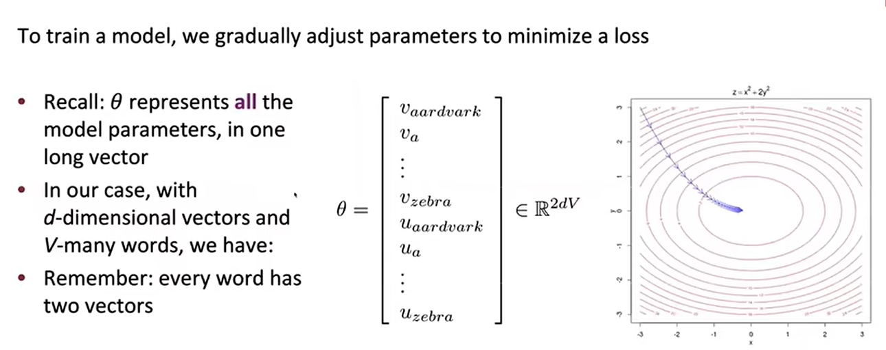

# Stanford CS224N: Natural Language Processing with Deep Learning

## Lec 1: Introduction and Word Vectors

**指称语义**（Denotational Semantics）：用于定义一个词的意义（meaning），即一个 Signifier(符号) 和 Signified(所指) 代表着“符号”指的是其对应的一组个体。（例如，"cat" 指的是我们熟悉的那一类动物）

而这个定义对于电脑来说太难理解了，因此在传统 NLP 中，使用 one-hot vector 来表示一个词（只有一位是 1，其他都是 0），但是这就要求我们向量的维度等于词汇表的大小（太大了！），与此同时词汇间的关系也无法表示。

**分布语义**（Distributional Semantics）：一个词的意义由其**上下文**决定（上下文指的是出现在这个词附近固定区域内的词集），因此创造一个多维的词向量（也称为 word embedding）来表示一个词，可用于预测其上下文中的词。

### Word2Vec 算法

1. 选择一个大型语料集（corpus）
2. 把语料集中的每个词都用词向量表示
3. 对于文本中的每个位置 `t`，都有一个中心词 `c` 和一个上下文词集 `o`，用 `c` 与 `o` 词向量的**相似度**计算在 `c` 的条件下 `o` 出现的概率（或者反过来）
4. 不断调整词向量使得这个概率最大化

!!! note "Likelihood and Loss Function（损失函数）"
    对于语料集中的每个位置 $t = 1, \dots, T$，在固定范围 $m$ 内预测上下文，中心词 $c$ 为 $w_t$，上下文词集 $o$ 为 $w_{t-m}, \dots, w_{t-1}, w_{t+1}, \dots, w_{t+m}$，$Likelihood = L(\theta) = \Pi_{t=1}^T \Pi_{-m \leq j \leq m, j \neq 0} P(w_{t+j} | w_t; \theta)$，其中 $\theta$ 为模型参数（all variables to be optimized），即可能性的计算方法就是对每个位置，（在该位置中心词已出现的前提下）将其上下文中每个词出现的概率相乘，各个位置的乘积再相乘。

    为了方便计算（乘积比加和更难处理），通常使用 **Negative Log Likelihood** 作为损失函数，即 $J(\theta) = -\frac{1}{T} \log L(\theta) = -\frac{1}{T} \sum_{t=1}^T \sum_{-m \leq j \leq m, j \neq 0} \log P(w_{t+j} | w_t; \theta)$，于是相比于最大化 $L(\theta)$，我们最小化 $J(\theta)$。

现在的问题是，我们怎么计算 $P(w_{t+j} | w_t; \theta)$？我们可以使用 softmax 函数，即 $P(w_{t+j} | w_t; \theta) = \frac{\exp(v_{w_{t+j}}^T v_{w_t})}{\sum_{w \in V} \exp(v_w^T v_{w_t})}$，其中 $v_w$ 为词 $w$ 的词向量，$V$ 为词汇表。

$\theta$ 是所有词的中心向量和所有词的上下文向量合成的向量，即 $\theta = [v_{w_1}, \dots, v_{w_{|V|}}, v'_{w_1}, \dots, v'_{w_{|V|}}]$，其中 $v_{w_i}$ 为词 $w_i$ 的中心向量，$v'_{w_i}$ 为词 $w_i$ 的上下文向量。



!!! note "梯度下降"
    使用梯度下降算法优化损失函数，即 $\theta_{new} = \theta_{old} - \eta \nabla J(\theta)$，其中 $\eta$ 为学习率，$\nabla J(\theta)$ 为损失函数的梯度。

    对于单变量，$\theta_{new(j)} = \theta_{old(j)} - \eta \frac{\partial J(\theta)}{\partial \theta_{old(j)}}$

    ```python
    while True:
        theta_grad = compute_gradient(J, corpus, theta)
        theta = theta - eta * theta_grad
    ```

    ??? warning "随机梯度下降"
        由于计算整个语料集的梯度（$\nabla J(\theta)$）会太耗时，于是每次只采样一个位置 $t$，计算该位置的梯度，然后更新参数。

        ```python
        while True:
            window = sample_window(corpus)
            theta_grad = compute_gradient(J, window, theta)
            theta = theta - eta * theta_grad
        ```

## Lec 2: Word Vectors, Word Sense, and Neural Network Classifiers