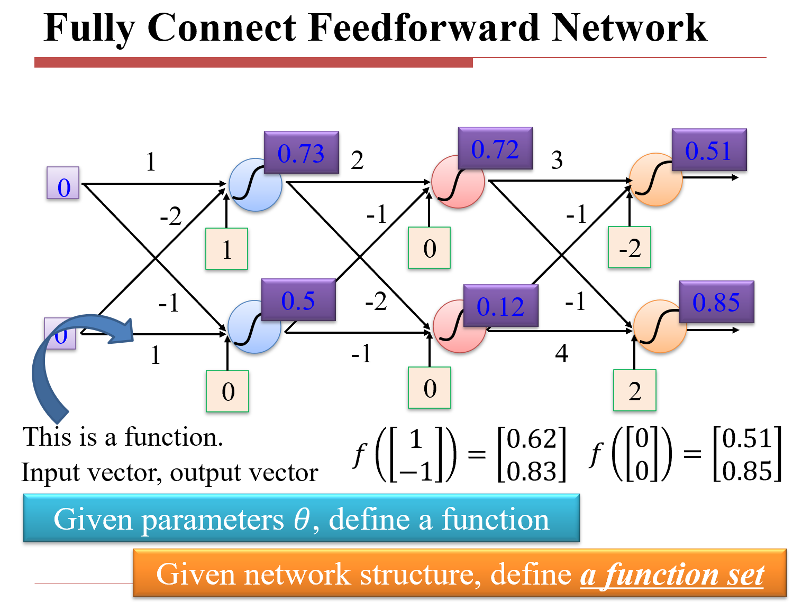
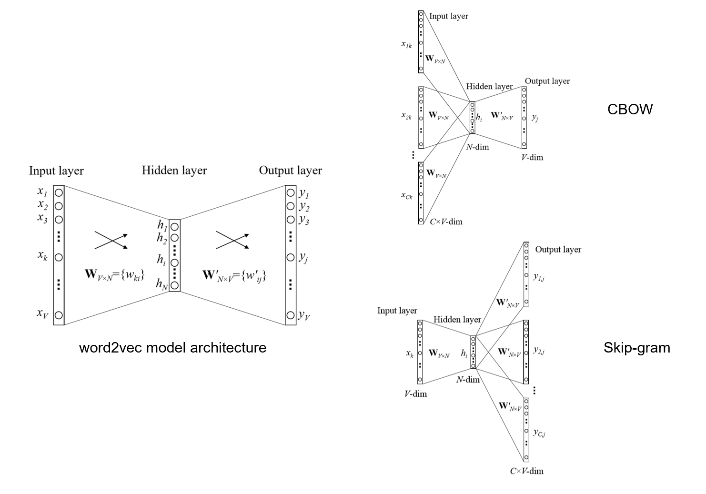

# 自然语言处理导论

> 任课教师：汤斯亮

## Deep Learning Basics

ML = Looking for a Function

全连接层可看作权重矩阵转置与输入向量的乘积，即 $y = W^T x$

### Word Embedding

!!! note "1st stage"
    一般，我们使用 WordNet 这样的层级图（Taxonomy）来表示词汇之间的关系（包括同义词、上下位关系等）。

    - Weakness：很难 keep up to date，难以计算词汇之间的相似度，需要人为规定并管理

    !!! note "2nd stage"
        - one-hot vector：第 i 个词的词向量为 $[0, 0, \cdots, 1, \cdots, 0]$，其中 1 在第 i 个位置/或者根据词汇的出现频率来赋值
        - 问题：维度过高，无法表示词汇之间的相似度（词向量甚至是正交的，因此甚至可以说 motel 和 hotel 这样的词完全无关），如果根据频率的话，the 和 a 这种词出现得太多了，导致文章无法区分

        !!! note "3rd stage"
            - 分布表示（Distributional Representation）：使用一个词向量表示词，利用神经网络降维
            - Word2Vec：对 one-hot 进行两层神经网络（Input Layer -> Hidden Layer -> Output Layer），最终得到一个词向量。
            - 

## 卷积神经网络