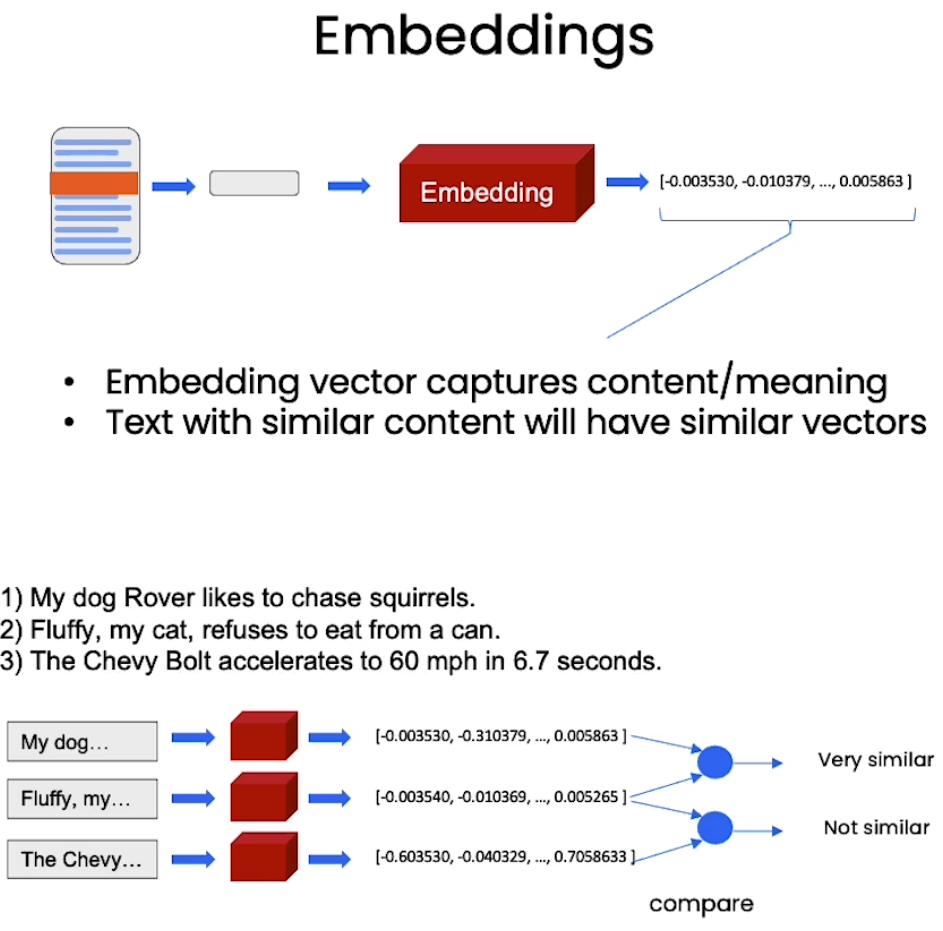
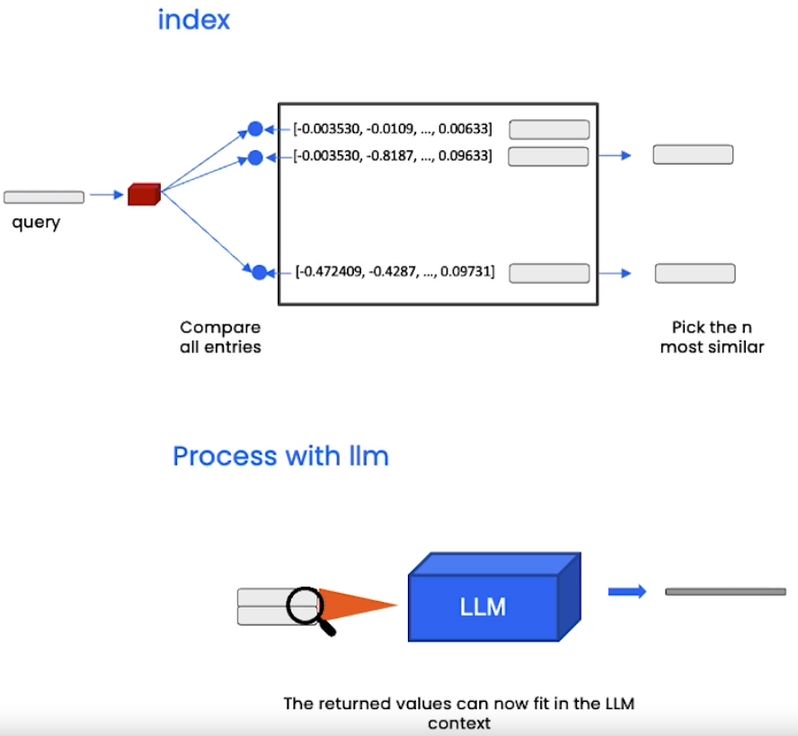
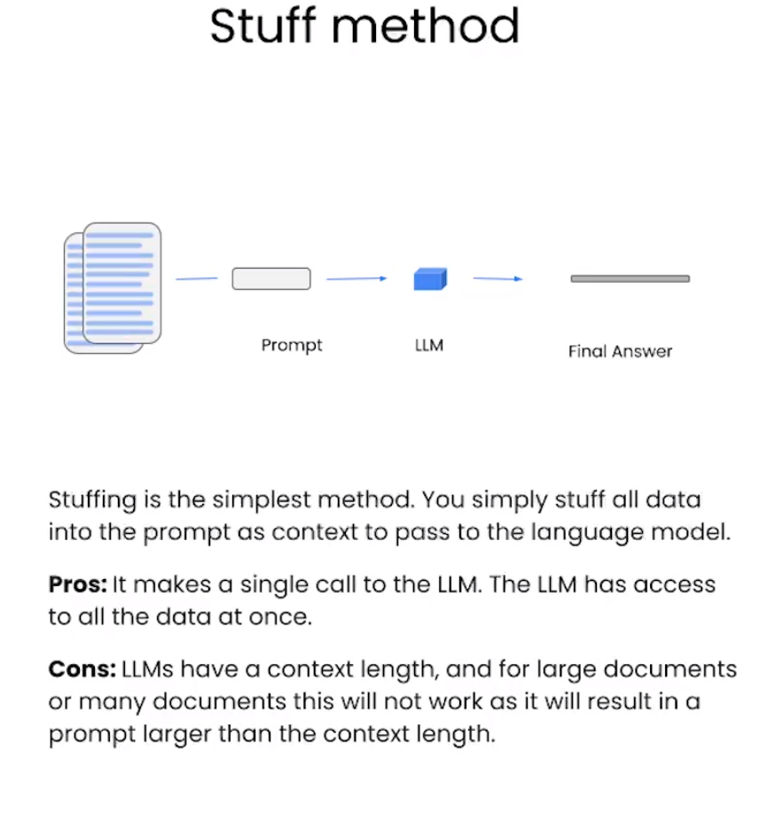
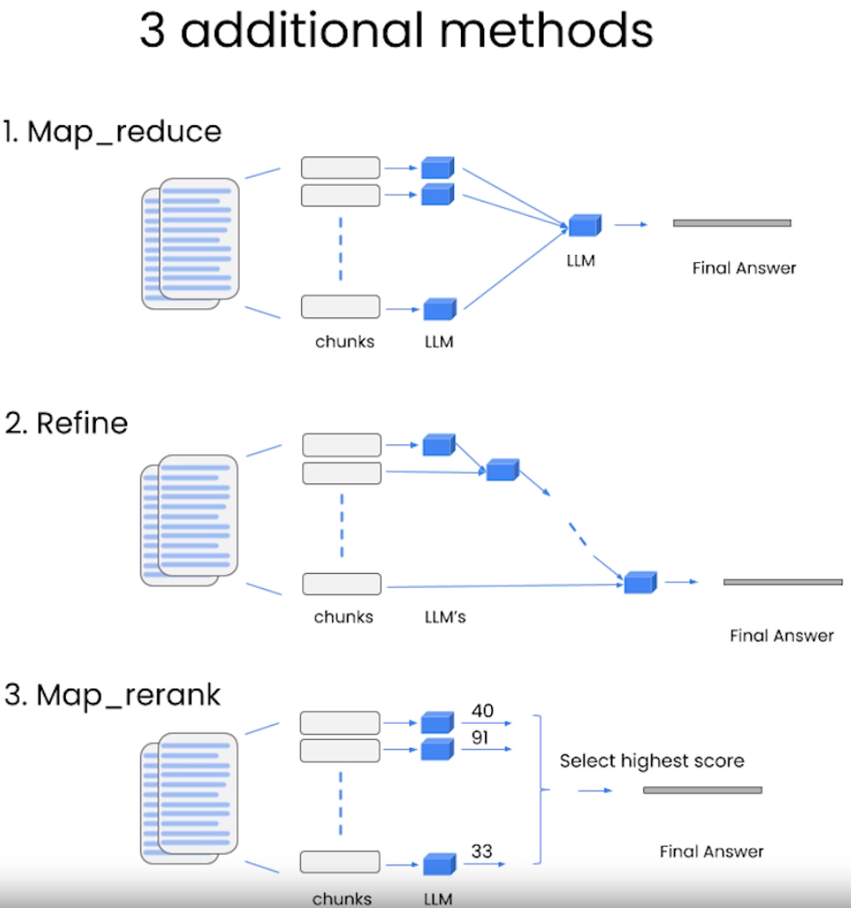
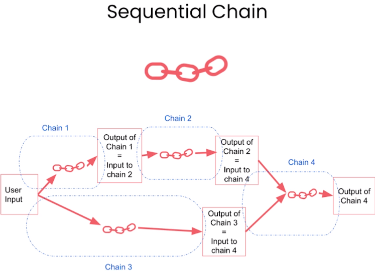
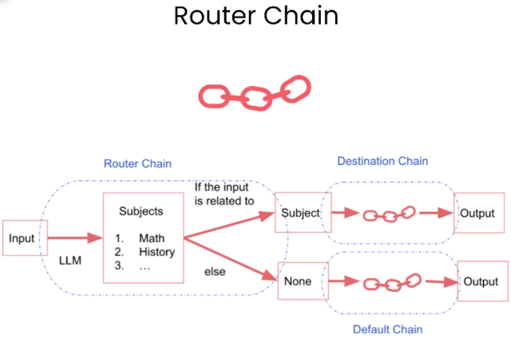

# RAG (Retrieval-Augmented Generation)

> Resources: https://github.com/ksm26/LangChain-for-LLM-Application-Development/

检索增强生成，用于解决大语言模型的幻觉问题

!!! note "Querying a LLM w/ RAG"
    - User Input 转化为向量，在外部**向量数据库（External Vector Database）**中进行相似性检索（Retrieval），得到的信息成为 Query 的 Context
    - 将 Query 和 Context 嵌入 Prompt 模板，输入 LLM 进行生成

??? note "相似性检索"
    - 计算 Query 向量与向量数据库中每个 Text Chunk 向量的相似度
        - 欧氏距离：$\sqrt{\sum_{i=1}^n (x_i-y_i)^2}$
        - **余弦相似度**：$\frac{\sum_{i=1}^n x_i y_i}{\sqrt{\sum_{i=1}^n x_i^2} \sqrt{\sum_{i=1}^n y_i^2}}$，余弦值越大，表示两个向量越相似
        - 点积：$\sum_{i=1}^n x_i y_i$

## 向量数据库

文本不直接存入向量数据库中（传统数据库就是这么做的），而是经过下列步骤

+ 将知识库文档切分成小块（Text Chunks）
+ 对每个 Text Chunk 输入嵌入模型进行高维向量化操作，这一步需要利用另一个模型，称为 Embedding Model
    + 
    + 向量数据库可以存储**非结构化**数据，类似图片、音频、视频
+ 得到的高维向量存入向量数据库中
    + 

进行 Retrieval 后，提取出相似度最高的 k 个 Text Chunks（称为 Top-k Chunks），对它们进行一些操作，使这些 Chunk 参与到最终答案的生成（可以看作是参与到 Context 中），有以下几种方式：

- Stuffing
    - 直接把 Top-k Chunks 全部添加到 Context 中
    - 可能导致超过模型的 Context Size
- Map reduce
    - 每个 Chunk 都输入一个 LLM 进行处理，得到若干个结果
    - 利用另一个 LLM 进行总结得到最终回答
- Refine
    - 不同于 Map reduce 的并行，refine 更像迭代，每个 LLM 基于前一个 LLM 的输出和下一个 Chunk 进行处理，得到新的输出，直到所有 Chunk 都被处理完，得到最终回答
- Re-ranking（利用的模型称为 Reranking Model）
    - 类似 Map reduce，但每个 LLM 输出时还会顺带给出一个 Score，选择 Score 最高的输出作为最终回答（或者是 Context？IDK）
    - 需要每个模型都了解评分标准

!!! note "几种方法图示"
    

    

得到最终的 Context

## LangChain

> TBD

### Models, Prompts and Parsers

### Memory

### Chains





### RAG w/ LangChain

```python
QA_chain = (
    { "Context" : retriever | docsq, "Question": RunnablePassthrough()}
        | prompt
        | llm
        | StrOutputParser() 
) # Stuff Method
```