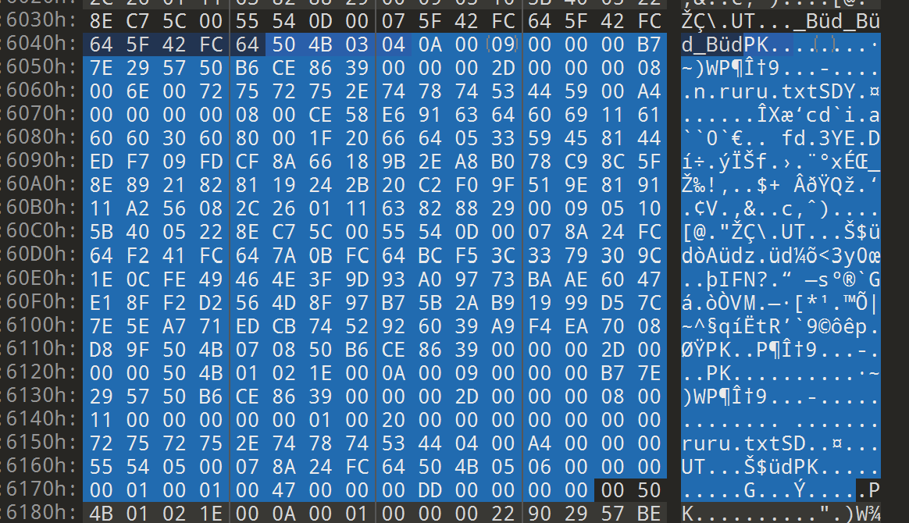

# CTF101
> 拼搏百天，我要成为安全领域大神！

!!! note "课程网站 & Useful links"
    https://hello-ctf.com/  
    https://courses.zjusec.com/

## Web
!!! extra "Web基础"
    课程slides: https://cubicy.notion.site/2024-Web-4d50db2d026c4fffb76bfebdc1f9d553  
    箱神辅学slide: https://slides.tonycrane.cc/PracticalSkillsTutorial/2023-fall-ckc/lec6/#/  
    MDN Web Docs: https://developer.mozilla.org/zh-CN/docs/Learn/Common_questions/Web_mechanics/How_does_the_Internet_work

### 基础
Web = Client + Server  

- Client: 浏览器
    - 可视化(HTML/CSS/JS)
    - 交互(JS)
    - 缓存(Cookie)
    - 安全性
- Server: 1 or 多台服务器
    - 处理请求
    - 前后端、数据库
    - 安全性（403 Forbbiden）

数据交换：数据包->路由器->不同IP  
**D**omain **N**ame **S**ystem: 记录域名映射到的IP地址/其他域名/其他东西

Proxy: 

- 正向：假装进入内网
- 反向：代理商穿透内网，佯装内网把数据返回出来

Cookie: 客户端储存用户在服务器上的数据，用于识别用户身份，下次带着cookie就不用再输密码啦  
Session: 和cookie差不多，不过是在服务器端临时储存  

### php
我擦，没听懂
### SQL
我擦，也没听懂

!!! note "地址栏输入一个url回车后发生了什么（纯抄的）"
    - DNS解析（域名解析）：
        浏览器会首先检查本地缓存中是否有该网址对应的IP地址。
        如果没有，它会向DNS服务器发送请求，查询该网址的IP地址。
        DNS服务器返回该网址对应的IP地址给浏览器。
    - 建立TCP连接：
        浏览器使用前面得到的IP地址，通过TCP/IP协议与目标服务器建立连接。
        这包括三次握手过程：客户端发送SYN包，服务器返回SYN-ACK包，客户端再发送ACK包确认连接。
    - 发送HTTP请求：
        建立连接后，浏览器会发送一个HTTP请求到服务器。这个请求包含了请求方法（如GET或POST）、请求的资源路径以及一些头信息（如浏览器类型、可接受的文件类型等）。
    - 服务器处理请求并返回响应：
        服务器接收到请求后，会处理该请求，查找请求的资源（如HTML文件、图片、视频等）。
        服务器会将找到的资源以及一些头信息（如内容类型、内容长度等）打包成HTTP响应，返回给浏览器。
    - 浏览器接收响应并渲染页面：
        浏览器接收到服务器返回的HTTP响应后，会解析响应的头信息和内容。
        如果内容是HTML文件，浏览器会解析HTML并根据其中的指令（如加载CSS文件、执行JavaScript脚本等）进行渲染。
        浏览器会逐步构建DOM树和CSSOM树，并根据它们生成渲染树，最后将内容绘制到屏幕上。
    - 加载资源：
        如果HTML文件中包含了其他资源（如图片、CSS、JavaScript等），浏览器会根据需要发送额外的HTTP请求来加载这些资源。
        这些资源加载完成后，浏览器会继续渲染页面，更新显示内容。 整个过程通常在短时间内完成，以确保用户能够快速看到网页内容。

## Misc
### 解码工具
```bash
ciphey -t TEXT  
ciphey -f FILE
```
隐写判断（样板戏轮流上）:

- 文件头尾判断：https://www.cnblogs.com/bravexiaoxi/articles/File_Header_Footer.html
- winhex/010editor #查看文件编码
- exiftool FILE #看exif信息
- strings FILE
- binwalk -e FILE
- stegsolve.jar
- foremost FILE
- zsteg -a FILE (png or bmp)
- steghide extract -sf FILE (jpg) -p PASSWORD 
- python \lsb.py extract file.png
- [stegdetect](https://blog.csdn.net/weixin_43921596/article/details/86654754)

### md5
```python
import hashlib
def md5_encrypt(data):
    md5 = hashlib.md5()
    md5.update(data.encode('utf-8'))
    return md5.hexdigest()
```

### Base家族
### Zip
Zip文件由：压缩源文件数据区，压缩源文件目录区、压缩源文件目录结束标志三部分组成。

- 源文件数据区：504B0304开头，两个字节后的两个字节是压缩方式（全局方式位标记），即`50 4B 03 04 14 00 0? 00`，不加密/伪加密时，问号为0，加密时不为0。
- 源文件目录区：504B0102开头，四个字节后的两个字节是标记是否加密，即`50 4B 01 02 3F 00 14 00 0? 00`，不加密/伪加密时，问号为0，加密时不为0。
- 源文件目录结束标志：504B0506连带后面18个字节结束本文件

伪加密：如果源文件数据区不加密（全局方式位标记为0），但源文件目录区加密（标记不为0），则解压软件会要密码，还爆破不了。把源目录区的加密标记改为0即可。  
有的题会出现压缩包嵌套（一般全是伪加密），这时编码类似于一层一层包着，解压一层就会出现下一层的压缩包，直到最后一层才和flag有关，此时在010editor中找到最内层的压缩文件直接复制粘贴出来就是一个最内层的压缩包。



梗来源：ruru

### Blockchain

听不懂思密达

- 区块链：一种去中心化的数据库，数据以区块的形式存储在多个节点上，每个区块包含了前一个区块的哈希值，形成了一个链式结构。
- 比特币：一种基于区块链技术的加密货币，是第一个去中心化的数字货币。
- 挖矿：通过计算机算力解决数学难题，获得比特币的过程。
- 共识机制：区块链网络中的节点如何达成一致，保证数据的一致性和安全性。
- 智能合约：一种自动执行合约的计算机程序，运行在区块链上，无需第三方信任。
- 以太坊：一种基于区块链技术的智能合约平台，支持自定义代币和去中心化应用。
- 以太坊虚拟机：以太坊网络中的虚拟机，用于执行智能合约。

笑点解析：上面这一串全是Copi帮我补的

交易：EOA（外部账户）和EOA的交易  
合约：EOA和合约的交易（类似调用函数）  
创建合约：EOA和NULL的交易

## Reverse

- 编译（汇编）：从源代码到目标文件
- 链接：从目标文件到可执行文件


### GDB/GEF
- `i r` 列出所有寄存器的值
- `i functions` 列出所有函数
- `c`继续直到断点，`b 行号` `b 函数名`设置断点
- `p 变量名` 打印变量值
- `display 变量名` 每次停下来都显示变量值
- `x /s 地址` 看看地址处存了什么
- `set $寄存器 = xxx` 修改寄存器的值，可以修改`rip`以跳到指定位置


## Pwn
shellcode: 机器码，执行系统命令
命令注入：
```c
#include <stdio.h>

int main(int argc, char* argv[])
{
	char data[64] = {0};
	char cmd[64] = {0};

	puts("I'm a simple echo server");
	scanf("%64s", data);
	sprintf(cmd, "echo %s\n", data);
	system(cmd);
	return 0;
}
```
如上C代码模拟了一个用于echo东西的cmd，我们可以输入"wolegeshaogang&&ls"，这样在输出外会执行ls命令（利用sh的语法）。

## python的一些包
### socket  
```python
import socket

HOST = "IP Address"  # IP address
PORT = PORTNUMBER   # Port number

s = socket.socket(socket.AF_INET, socket.SOCK_STREAM)   # create socket

s.connect((HOST, PORT)) # connect to server
```
然后使用 `s.send(MESSAGE)` 和 `s.recv(MESSAGE)` 进行数据传输，返回为bytes类型。

## 杂项
!!! extra "Overviews"
    记录一些做题时碰到的小技巧/知识

用vim写文件的时候，会自动在当前文件下生成一个`.<filename>.swp`（存有编辑信息，相当于实时备份），如果有意外退出的情况就不怕没保存了。正常`:wq`就会把这个临时文件删除。~~你们vim真是太安全了~~    
再次打开vim时使用`vim -r <filename>`就可以把临时文件恢复为原文件。

Linux安装：

- .deb: `sudo dpkg -i <package>.deb`
- .tar.gz: `tar -zxvf <package>.tar.gz` -> `./configure` -> `sudo make` -> `make install`

`objdump -d <exeutable filename> > a.asm` 保存汇编代码