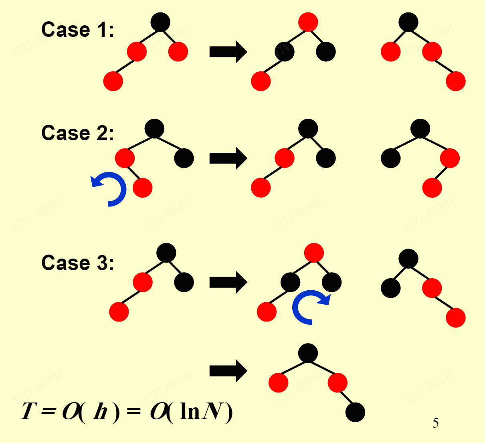

# 高级数据结构与算法分析

> 任课教师：杨洋

!!! note "Reference"
    OI wiki: https://oi-wiki.org/ds/  
    https://note.shad0wash.cc/cs/ads/

## AVL树
是二叉搜索树的一种：

- 平衡因子（BF: Balance Factor）：某节点左子树的高度减去右子树的高度
- AVL树：任意节点的平衡因子只能是-1、0、1
- 不满足条件时，通过旋转操作进行调整，形成AVL树
    - 旋转：将某个节点“提起来”，另一侧节点与其的父子关系便颠倒，同时节点本身的某个子节点也易父
        - RR, LL, RL, LR
        - LL,RR一般是对失衡节点的子节点转上去
        - RL,LR一般是对失衡节点的孙子节点转上去（转两次）
        - 具体可见[这里的](https://www.hello-algo.com/chapter_tree/avl_tree/#752-avl)图像展示


???+ note "例题" 
    Insert 2, 1, 4, 5, 9, 3, 6, 7 into an initially empty AVL tree.  Which one of the following statements is FALSE?


    A. 4 is the root


    B. 3 and 7 are siblings


    C. 2 and 6 are siblings


    D. 9 is the parent of 7
    
    ??? key-point "Answer"
        插入建树就行，记得每次插入后如果有失衡就立刻旋转，选B。


```c
Node RightRotate(Node UnbalancedNode){
    Node Child = UnbalancedNode->LeftChild;
    Node GrandChild = Child->RightChild;
    Child->RightChild = UnbalancedNode;
    UnbalancedNode->LeftChild = GrandChild;
    Update(UnbalancedNode);
    Update(Child);
    return Child;
}

Node LeftRotate(Node UnbalancedNode){
    Node Child = UnbalancedNode->RightChild;
    Node GrandChild = Child->LeftChild;
    Child->LeftChild = UnbalancedNode;
    UnbalancedNode->RightChild = GrandChild;
    Update(UnbalancedNode);
    Update(Child);
    return Child;
}
```

## Splay树
是二叉搜索树的一种：

- 每访问一个节点，将其旋转到根节点，会使树的高度降低。
- 一般从根节点开始旋转，直到目标节点成为根节点。
- zig: 访问节点的父节点是根节点时，只需一次旋转（把访问节点转上去）
- zig-zig: 访问节点的父节点不是根，且访问节点、父节点、祖父节点在同一侧时，需要两次旋转（沿祖父节点-父节点旋转，再沿父节点-访问节点旋转）
- zig-zag: 访问节点的父节点不是根，且访问节点、父节点、祖父节点不在同一条链上时，需要两次旋转（沿父节点-访问节点旋转，再沿祖父节点-访问节点旋转）（这是因为第一次旋转后访问节点便与原祖父节点有了一条关系边）

???+ note "有关旋转的一道作业题"
    https://ms.ntub.edu.tw/~spade/teaching/x-DS2005/DS-04-23.pdf

## 摊还分析

对一个空的数据结构连续进行$m$次操作，Worst_cost为$\max_{1\leq i\leq m} c_i$，Average_cost为$\frac{\sum_{i=1}^m c_i}{m}$，前者太大，后者难以计算。

引入Amortized_cost $\hat{c_i} = c_i + \Delta_i$，$\Delta_i$可正可负。且有$\sum_{i=1}^m \hat{c_i} \geq \sum_{i=1}^m c_i$，即$\hat{c_i}$是对$c_i$的一种“平摊”。

worst-case time $\geq$ **amortized time** $\geq$ average time

以对某Stack的操作为例：有`pop`、`push`、`multi_pop`的操作，其中`multi_pop`连续`pop`栈上`min(k, size)`个元素。

`pop`和`push`一次cost为1，`multi_pop`一次cost为k。


### 聚合法

进行连续`n`次操作（如上述三种操作），最坏的操作序列的总cost为`Tn`，则摊还时间为`Tn/n`。

此处有陷阱：可能会以为，（对`multi_pop`而言）最坏的操作就是连着进行`n`次`multi_pop`，每次pop出`n`个元素，于是得到$O(n^2)$的错误答案，但实际上这种情况根本不会发生，栈里不可能一直有`n`个元素。

因此最坏情况实则是`n-1`次`push`和一次`multi_pop`，cost为`2n-2`，摊还时间为$\frac{2n-2}{n}=\frac{O(n)}{n}=O(1)$。

### 核算法

### 势能法
令$\hat{c_i} - c_i = Credit_i = \Phi(D_i) - \Phi(D_{i-1})$

其中$\Phi(D_i)$为第`i`次操作后该结构的“势能”（是该结构的某个特性的函数，如一棵树的节点个数或高度，一个栈的元素个数等），规定$\Phi(D_0)=0$。

## 红黑树

> 超标小工具：https://www.cs.usfca.edu/~galles/visualization/RedBlack.html

哨兵化：所有无子节点的子节点都变为无键值的NIL节点，将NIL节点视为叶子，这在性质5里很有用。

拥有一个颜色Attribute的Balanced Binary Search Tree，满足以下五个条件：

1. 每个节点是红色或黑色
2. 根节点是黑色
3. 每个叶子和NIL节点是黑色
4. 每个红色节点的两个子节点都是黑色
5. 从任一节点到其子树中每个叶节点（或NIL）的所有路径都包含相同数目的黑色节点

定义黑高度：从某节点到叶子/NIL节点的黑色节点数目是该节点的黑高(Black Height)。BH(Tree) = BH(root)。  
定义内/外部节点：NIL节点是外部节点，非NIL节点是内部节点。

- Lemma：一棵有n个内部节点的红黑树的高度至多为$2\ln(n+1)$

### 插入
只能插入红色节点



=== "Case -1"
    插入节点为根节点，直接涂黑

=== "Case 0"
    父节点为黑，不破坏性质，直接插入

=== "Case 1"
    父节点和叔叔节点都是红色，将父节点和叔叔节点涂黑，祖父节点涂红，这时可能祖父节点和其父节点都是红色，向上继续递归调整。

=== "Case 2"
    父节点为红色，叔叔节点为黑色（或NIL），并且新节点处于离叔叔节点更近的侄子位，此时先将父节点（父节点为左孩子）左旋/（父节点为右孩子）右旋下去，原父节点变为叔叔节点的远侄子，转为Case 3。

=== "Case 3"
    父节点为红色，叔叔节点为黑色（或NIL），新节点处于离叔叔节点更远的侄子位，此时将祖父节点涂红，父节点涂黑，然后将祖父节点左旋/右旋下去，完成插入。

### 删除

- 删除叶子节点：`if(child->color==black) child->parent->onechild = NIL else = NULL`
- 删除度为1的节点：用其唯一子节点替代
- 删除度为2的节点：类似BST的删除，用左子树的最大节点或右子树的最小节点替代，具体如下：
  
    === "Case 1"
        找到其后继节点，将其值复制到当前节点，删除后继节点

TBD


## B+树

B阶B+树满足以下性质：

1. 叶子节点在同一层
2. 叶子节点存储的元素称为Data Element
3. $\lceil \frac{B}{2} \rceil \leq \text{Degree of In-Node} \leq B$
   1. $2 \leq \text{Degree of Root} \leq B$
4. $\lceil \frac{B}{2} \rceil \leq \text{每片叶中元素个数} \leq B$
   1. 若根为叶，则$1 \leq \text{根元素数目} \leq B$
5. In-Node 存储的第$i$个值$e_i$是该Node的第$i+1$个子树的叶子中的最小值

TBD

## 倒排索引

Recall 邻接表，倒排索引当中包含了所有文档中的关键字，并且以链表的形式进行存储，每个关键字对应一个链表，链表中存储了包含这个关键字的文档的编号，出现的位置以及次数。  
查询关键字可用 hash table 或 Search Tree，search tree 查询速度较慢，但进行范围查询较为容易；hash table 查询速度较快，但是进行范围查询相对困难。  
搜索的性能衡量指标有两个：召回率和准确率。召回率是指检索到的相关文档数与系统中所有相关文档数的比值，准确率是指检索到的相关文档数与检索到的文档总数的比值。
|  | Relevant | Irrelevant |
| --- | --- | --- |
| Retrieved | $R_R$ | $I_R$ |
| Not Retrieved | $R_N$ | $I_N$ |

- 召回率：$Recall = \frac{R_R}{R_R+R_N}$
- 准确率：$Precision = \frac{R_R}{R_R+I_R}$

???+ note "作业题"
    Precision is more important than recall when evaluating the explosive detection in airport security.()  
    准确度在航班安检时爆炸物的探测中比召回率更重要。（）
    ??? "Answer"
        False. 召回率更重要，因为不能漏掉任何一个爆炸物。  
        “召回率就是，宁可错杀一千绝不放过一个。” -- yy老师

## 左式堆与斜堆
TBD

## 二项堆

二项堆是一个由$K$个二项树$B_k, B_{k-1}, ... , B_0$组成的森林。

二项树$B_k$的定义如下：

1. $B_0$是一个单节点树。
2. $B_k$是通过将一棵$B_{k-1}$树附接到另一棵$B_{k-1}$树的根上得到的。
3. $B_k$高度为$k$，有$2^k$个节点。
4. 深度为$d$的节点数为$C_k^d$。

每个二项堆可以用一个唯一的二进制数表示，如$1101$表示一个由$B_3, B_2, B_0$组成的二项堆。

### 二项堆的操作

TBD