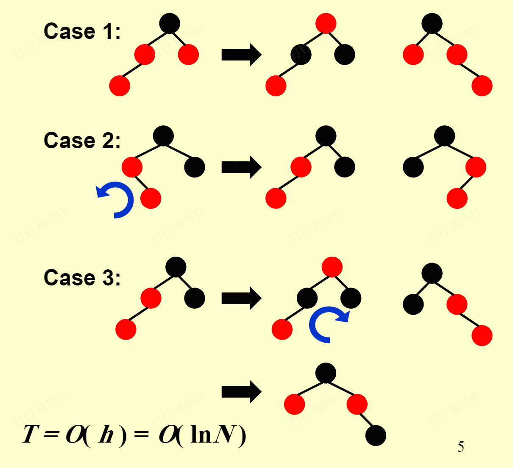
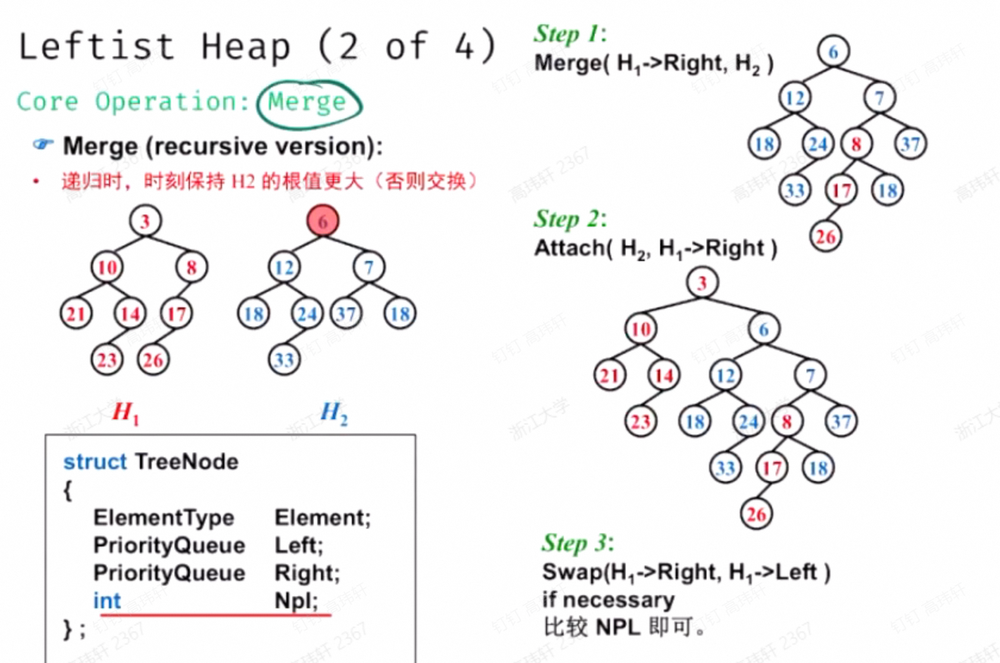
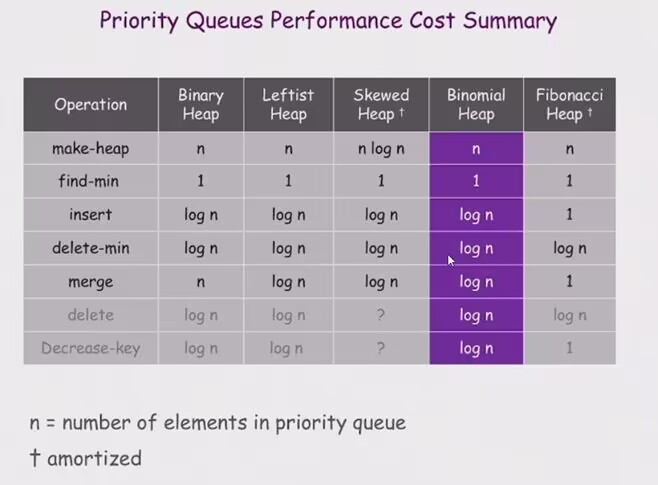
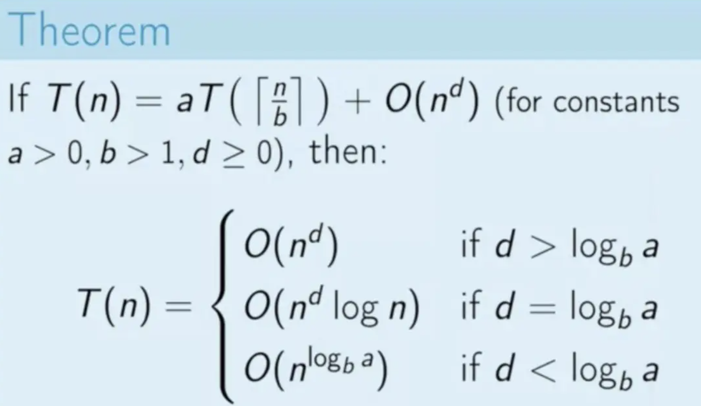
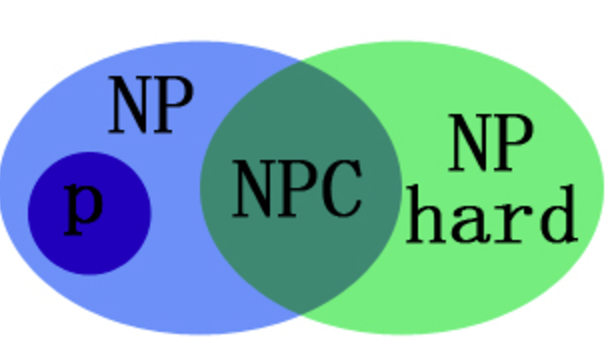

# 高级数据结构与算法分析

> 任课教师：杨洋

!!! note "Reference"
    OI wiki: <https://oi-wiki.org/ds/>  
    <https://note.shad0wash.cc/cs/ads/>  
    抄了好多[ADS面向40分斩杀线复习 by Klee1453](https://github.com/Klee1453/ads-geq-40)  
    后半学期摆了……

## AVL树

是二叉搜索树的一种：

- 平衡因子（BF: Balance Factor）：某节点左子树的高度减去右子树的高度
- AVL树：任意节点的平衡因子只能是-1、0、1
- 不满足条件时，通过旋转操作进行调整，形成AVL树
  - 旋转：将某个节点“提起来”，另一侧节点与其的父子关系便颠倒，同时节点本身的某个子节点也易父
    - RR, LL, RL, LR
    - LL,RR一般是对失衡节点的子节点转上去
    - RL,LR一般是对失衡节点的孙子节点转上去（转两次）
    - 具体可见[这里的](https://www.hello-algo.com/chapter_tree/avl_tree/#752-avl)图像展示

???+ note "例题"
    Insert 2, 1, 4, 5, 9, 3, 6, 7 into an initially empty AVL tree.  Which one of the following statements is FALSE?

    A. 4 is the root


    B. 3 and 7 are siblings


    C. 2 and 6 are siblings


    D. 9 is the parent of 7
    
    ??? key-point "Answer"
        插入建树就行，记得每次插入后如果有失衡就立刻旋转，选B。

```c
Node RightRotate(Node UnbalancedNode){
    Node Child = UnbalancedNode->LeftChild;
    Node GrandChild = Child->RightChild;
    Child->RightChild = UnbalancedNode;
    UnbalancedNode->LeftChild = GrandChild;
    Update(UnbalancedNode);
    Update(Child);
    return Child;
}

Node LeftRotate(Node UnbalancedNode){
    Node Child = UnbalancedNode->RightChild;
    Node GrandChild = Child->LeftChild;
    Child->LeftChild = UnbalancedNode;
    UnbalancedNode->RightChild = GrandChild;
    Update(UnbalancedNode);
    Update(Child);
    return Child;
}
```

AVL 树的搜索、插入和删除操作的时间复杂度为 $O(logn)$。

## Splay树

是二叉搜索树的一种：

- 每访问一个节点，将其旋转到根节点，会使树的高度降低。
- 一般从根节点开始旋转，直到目标节点成为根节点。
- zig: 访问节点的父节点是根节点时，只需一次旋转（把访问节点转上去）
- zig-zig: 访问节点的父节点不是根，且访问节点、父节点、祖父节点在同一侧时，需要两次旋转（沿祖父节点-父节点旋转，再沿父节点-访问节点旋转）
- zig-zag: 访问节点的父节点不是根，且访问节点、父节点、祖父节点不在同一条链上时，需要两次旋转（沿父节点-访问节点旋转，再沿祖父节点-访问节点旋转）（这是因为第一次旋转后访问节点便与原祖父节点有了一条关系边）

???+ note "有关旋转的一道作业题"
    <https://ms.ntub.edu.tw/~spade/teaching/x-DS2005/DS-04-23.pdf>

## 摊还分析

对一个空的数据结构连续进行$m$次操作，Worst_cost为$\max_{1\leq i\leq m} c_i$，Average_cost为$\frac{\sum_{i=1}^m c_i}{m}$，前者太大，后者难以计算。

引入Amortized_cost $\hat{c_i} = c_i + \Delta_i$，$\Delta_i$可正可负。且有$\sum_{i=1}^m \hat{c_i} \geq \sum_{i=1}^m c_i$，即$\hat{c_i}$是对$c_i$的一种“平摊”。

worst-case time $\geq$ **amortized time** $\geq$ average time

以对某Stack的操作为例：有`pop`、`push`、`multi_pop`的操作，其中`multi_pop`连续`pop`栈上`min(k, size)`个元素。

`pop`和`push`一次cost为1，`multi_pop`一次cost为k。

### 聚合法

进行连续`n`次操作（如上述三种操作），最坏的操作序列的总cost为`Tn`，则摊还时间为`Tn/n`。

此处有陷阱：可能会以为，（对`multi_pop`而言）最坏的操作就是连着进行`n`次`multi_pop`，每次pop出`n`个元素，于是得到$O(n^2)$的错误答案，但实际上这种情况根本不会发生，栈里不可能一直有`n`个元素。

因此最坏情况实则是`n-1`次`push`和一次`multi_pop`，cost为`2n-2`，摊还时间为$\frac{2n-2}{n}=\frac{O(n)}{n}=O(1)$。

### 核算法

### 势能法

令$\hat{c_i} - c_i = Credit_i = \Phi(D_i) - \Phi(D_{i-1})$

其中$\Phi(D_i)$为第`i`次操作后该结构的“势能”（是该结构的某个特性的函数，如一棵树的节点个数或高度，一个栈的元素个数等），规定$\Phi(D_0)=0$。

## 红黑树

> 超标小工具：<https://www.cs.usfca.edu/~galles/visualization/RedBlack.html>

哨兵化：所有无子节点的子节点都变为无键值的NIL节点，将NIL节点视为叶子，这在性质5里很有用。

拥有一个颜色Attribute的Balanced Binary Search Tree，满足以下五个条件：

1. 每个节点是红色或黑色
2. 根节点是黑色
3. 每个叶子和NIL节点是黑色
4. 每个红色节点的两个子节点都是黑色
5. 从任一节点到其子树中每个叶节点（或NIL）的所有路径都包含相同数目的黑色节点

定义黑高度：从某节点到叶子/NIL节点的黑色节点数目是该节点的黑高(Black Height)。BH(Tree) = BH(root)。  
定义内/外部节点：NIL节点是外部节点，非NIL节点是内部节点。

- Lemma：一棵有n个内部节点的红黑树的高度至多为$2\ln(n+1)$

### 插入

只能插入红色节点



=== "Case -1"
    插入节点为根节点，直接涂黑

=== "Case 0"
    父节点为黑，不破坏性质，直接插入

=== "Case 1"
    父节点和叔叔节点都是红色，将父节点和叔叔节点涂黑，祖父节点涂红，这时可能祖父节点和其父节点都是红色，向上继续递归调整。

=== "Case 2"
    父节点为红色，叔叔节点为黑色（或NIL），并且新节点处于离叔叔节点更近的侄子位，此时先将父节点（父节点为左孩子）左旋/（父节点为右孩子）右旋下去，原父节点变为叔叔节点的远侄子，转为Case 3。

=== "Case 3"
    父节点为红色，叔叔节点为黑色（或NIL），新节点处于离叔叔节点更远的侄子位，此时将祖父节点涂红，父节点涂黑，然后将祖父节点左旋/右旋下去，完成插入。

### 删除

- 删除叶子节点：`if(child->color==black) child->parent->onechild = NIL else = NULL`
- 删除度为1的节点：用其唯一子节点替代
- 删除度为2的节点：类似BST的删除，用左子树的最大节点或右子树的最小节点替代，具体如下：
  
    === "Case 1"
        找到其后继节点，将其值复制到当前节点，删除后继节点

TBD

## B+树

B阶B+树满足以下性质：

1. 叶子节点在同一层
2. 叶子节点存储的元素称为Data Element
3. $\lceil \frac{B}{2} \rceil \leq \text{Degree of In-Node} \leq B$
   1. $2 \leq \text{Degree of Root} \leq B$
4. $\lceil \frac{B}{2} \rceil \leq \text{每片叶中元素个数} \leq B$
   1. 若根为叶，则$1 \leq \text{根元素数目} \leq B$
5. In-Node 存储的第$i$个值$e_i$是该Node的第$i+1$个子树的叶子中的最小值

B+树的深度为$O(\lceil \log_{\lceil \frac{B}{2} \rceil} n \rceil)$，其中$n$为元素个数。

### 操作

$n$个元素的B+树高度为$h$，则：

1. 分裂（核心操作）：B+ 树的核心在于其分裂操作。可以把M 的限制看做对连出去的边数的限制，叶子节点相当于是连出去至多 M 条节点—数据的边，这样可以把非叶节点和叶子节点的情况统一看待。当某个节点已经连出去 M 条边，需要塞第M+1 条边的时候，需要分裂。分裂会产生一个和原节点同级的节点，就在原节点的右侧。原节点的前⌈(M+1)/2⌉ 个孩子还属于自己，剩下的 ⌊(M+1)/2⌋ 个孩子需要交给新创建的节点。如果分裂的过程中，导致父节点也超出了M 的限制，就需要对父节点也进行分裂，以此类推。如果父节点已经是根节点，就创建一个新根再进行分裂，此时树高会增加 1，其他情况下树高不会改变。（Credit: <https://mem.ac>）
2. 搜索：$O(\log n)$
3. 插入/删除：$O(\frac{B}{\log B} \log n)$

具体操作见：<https://note.isshikih.top/cour_note/D2CX_AdvancedDataStructure/Lec02>

## 倒排索引

Recall 邻接表，倒排索引当中包含了所有文档中的关键字，并且以链表的形式进行存储，每个关键字对应一个链表，链表中存储了包含这个关键字的文档的编号，出现的位置以及次数。  
查询关键字可用 hash table 或 Search Tree，search tree 查询速度较慢，但进行范围查询较为容易；hash table 查询速度较快，但是进行范围查询相对困难。  
搜索的性能衡量指标有两个：召回率和准确率。召回率是指检索到的相关文档数与系统中所有相关文档数的比值，准确率是指检索到的相关文档数与检索到的文档总数的比值。

| TableOf | Relevant | Irrelevant |
| --- | --- | --- |
| Retrieved | $R_R$ | $I_R$ |
| Not Retrieved | $R_N$ | $I_N$ |

- 召回率：$Recall = \frac{R_R}{R_R+R_N}$
- 准确率：$Precision = \frac{R_R}{R_R+I_R}$

???+ note "作业题"
    Precision is more important than recall when evaluating the explosive detection in airport security.()  
    准确度在航班安检时爆炸物的探测中比召回率更重要。（）
    ??? "Answer"
        False. 召回率更重要，因为不能漏掉任何一个爆炸物。  
        “召回率就是，宁可错杀一千绝不放过一个。” -- yy老师

## 左式堆与斜堆

### 左式堆

回忆普通二叉堆的性质：

> wyy有话说

1. Insert：我们直接插在完全二叉树的下一个空位上，然后 percolate up 找到它应当在的位置，显然最坏情况也与完全二叉树的高度成正比，即 O(log n)。
2. FindMin：直接返回根结点即可，时间 O(1)。
3. DeleteMin：直接用完全二叉树的最后一个元素顶替根结点，然后 percolate down 找到新根结点的归宿，时间 O(log n)。
4. BuildHeap：即对 n 个元素建堆存储。这是一个比较特别的操作，最原始的方法就是连续插入 n次，但这样时间复杂度为 O(n log n)，所以我们要有更好的手段。我们的方法是：无需管序性质，直接任意插入这 n 个值，然后从完全二叉树倒数第二排有孩子的结点开始，往前依次检查是否有违反序性质的，有就 percolate down 到正确的位置，循环直到根结点也调整完毕为止，可以验证这样的算法复杂度为 O(n)，具体可见数据结构基础的教材与 PPT。

- 除此之外，我们还有一些操作，这些操作在 Dijkstra 算法加速等场景中可能有应用，因此也展开介绍：
    1. DecreaseKey/IncreaseKey：非常简单，直接用 percolate up/down 实现即可。
    2. Delete：用 DecreaseKey 把 key 降低到最低，percolate up 到根结点后调用 DeleteMin 即可。

为了进行 merge 操作，使得 merge 更快，引入了左式堆。

- 定义$NPL(x)$：x到一个孩子不足两个的节点的最短路径长，于是只有一个孩子或者叶子的节点的$NPL$为0，且定义$NPL(NULL)=-1$。
  - 从而$NPL(X) = 1 + \min(NPL(LeftChild), NPL(RightChild))$
- 左式堆：每个节点的左孩子的$NPL$大于等于右孩子的$NPL$。
- 定理：在右路径上有 r 个结点的左式堆必然至少有 $2^r − 1$ 个结点（右路径指从根结点出发一路找右孩子直到找到叶子的路径）。

#### 操作

1. Merge：核心操作
2. Insert：看作一个节点和一个左式堆的 merge
3. DeleteMin：删去根节点，然后 merge 左右子树
4. Delete: 删去该节点，然后 merge 左右子树，然后 Bottom-up 递归调整 NPL

How to Merge(递归版本):  


非递归版本：  


### 斜堆

斜堆(skew heap)也叫自适应堆(self-adjusting heap)，它是左式堆的一个变种。通常用来实现优先队列，支持插入，删除，合并操作，并且均摊复杂度都为$O(\log n)$。

斜堆在结构上没什么特殊要求，只需要是一颗二叉树，并且结点满足堆序即可。

#### 操作

- Merge
    - 如果一个空斜堆与一个非空斜堆合并，返回左右子树互换的非空斜堆。
        - 如果两个斜堆都非空，那么比较两个根结点，将较小的根结点的右孩子对应的子堆和另一个堆去合并，合并得到的新子堆的根结点作为新的右孩子。
        - 将当前根结点的左右孩子互换位置。
    - 迭代版本的合并类似上面左式堆的那张图，不过在Step 2要变成Swap Right paths中每个节点的左右子树（从下往上）。

插入和删除和左式堆一样。

## 二项堆

二项堆是一个由$K$个二项树$B_k, B_{k-1}, ... , B_0$组成的森林。

二项树$B_k$的定义如下：

1. $B_0$是一个单节点树。
2. $B_k$是通过将一棵$B_{k-1}$树附接到另一棵$B_{k-1}$树的根上得到的。
3. $B_k$高度为$k$，有$2^k$个节点。
4. 深度为$d$的节点数为$C_k^d$。

每个二项堆可以用一个唯一的二进制数表示，如$1101$表示一个由$B_3, B_2, B_0$组成的二项堆。

### 二项堆的操作

1. FindMin: 直接遍历所有树,注意到对于一个有$n$个结点的二项堆，最多有$\log n$棵树，因此时间复杂度为$O(\log n)$
2. Merge: 类比二进制数的竖式加法，确定合并二项树的顺序，时间复杂度为$O(\log n)$
3. DeleteMin: 先 FindMin 找到最小根节点，去除此根节点所在的二项树，剩余二项树记为新的二项堆$R$。对这个二项树，删除根节点后，其留下的孩子们视作一个新的二项堆$S$，然后将$S$和$R$合并。时间复杂度为$O(\log n)$

!!! note "各种堆的操作时间复杂度"
    

## 回溯

TBD

### α-β剪枝

Alpha 剪枝是指对于 min 结点，如果其兄弟结点的值比当前结点的值大，那么就不再搜索当前结点的子结点；Beta 剪枝是指对于 max 结点，如果其兄弟结点的值比当前结点的值小，那么就不再搜索当前结点的子结点。

!!! note "一道作业题"
    

## 分治

TBD

### Master Theorem 主定理

主定理适用于求解如下递归式算法的时间复杂度：$T(n) = aT(\frac{n}{b}) + f(n)$

那么

- 若对于某个大于0的常数 $\epsilon$ 有 $f(n) = O(n^{log_b{a}-\epsilon})$，那么 $T(n) = \Theta(n^{log_b{a}})$
- 若 $f(n) = \Theta(n^{log_b{a}})$，那么 $T(n) = \Theta(n^{log_b{a}} \log n)$
- 若对于某个大于0的常数 $\epsilon$ 有 $f(n) = \Omega(n^{log_b{a}+\epsilon})$，且对于某个常数 $c < 1$ 和所有足够大的 $n$ 有 $a f(\frac{n}{b}) \leq c f(n)$，那么 $T(n) = \Theta(f(n))$



!!! note "Lemma"
    $$
    T(N) = aT(N/b) + \Theta (N^k \log^{p} N), a \geq 1, b \geq 1, p \geq 0 \\
    \textrm{We will have:} \\
    T(N) = \Omicron(N^{\log_{b}a}), \textrm{ if } a \gt b^k \\
    T(N) = \Omicron(N^k \log^{p} N), \textrm{ if } a \lt b^k \\
    T(N) = \Omicron(N^k \log^{p + 1} N), \textrm{ if } a = b^k
    $$

    - 关于主定理的记忆：$a$是divide把问题分成子问题的个数，$b$是子问题的规模，$\Theta (N^k \log^{p} N)$是合并的复杂度
    - 需要比较的是$aT(N/b)$项和$\Theta (N^k \log^{p} N)$谁占据主导地位，类似于极限的抓大头原则
    - 如果说$aT(N/b)$占据主导地位，那么总的时间复杂度只需要考虑分割的过程，$T = \Omicron(\sum_{h = 0}^{\log_{b}N}a^{\log_{b}N - h}) = \Omicron(N^{\log_{b}a})$，是在背不出就记得分母上的值在对数中放在底上，无论哪种情况，都有N的几次方
    - 如果说合并$\Theta (N^k \log^{p} N)$占据主导地位，那么总的时间复杂度一定是单次合并的复杂度这个数量级的（合并次数是常数）
    - 如果说两者同样重要，仍然是合并的过程更占主导，但是需要补偿给切分的过程一个指数

    Credit: [ADS面向40分斩杀线复习 by Klee1453](https://github.com/Klee1453/ads-geq-40)

## 动态规划

也就是记忆化搜索。

## 贪心

TBD

## NP问题



### 常见的NP-C问题

- 可满足性问题SAT
    - 给定一个逻辑表达式，是否存在某种赋值让其为真
- 顶点覆盖问题
    - 在图中，找到一个最小的**顶点集合**，使得该集合中的顶点能够覆盖图中的所有边
- Clique（团）问题
    - 无向图中找到一个完全子图，其中的每两个顶点都直接相连
- 哈密尔顿回路、哈密尔顿路径问题
- Dominating Set问题
    - 在图中，找到一个最小的**顶点集合**，使得该集合中的每个顶点或者与之相邻的顶点都在集合中
- Independent Set问题
    - 在图中，找到一个最大的**顶点集合**，使得该集合中的任意两个顶点都没有边连接
- 0-1背包问题或者划分问题
    - 在一个集合中寻找一个子集，让子集元素之和等于二分之一全集元素之和

### 常见的NP-Hard问题

- 旅行商问题
    - 给定一系列城市和城市间的距离，求解遍历每个城市的最短距离的回路
-  装箱问题（NP-HARD）
    - 给定n个物品，能否用k个箱子装下

~~yy老师你说的是中文吗？~~

## 近似算法

- 近似比$\rho = \max \{OPT/C, C/OPT \}$，$C$为解，$OPT$为最优解。近似比恒大于1，我们的目标是让近似比经历接近1。
- PTAS：poly-Time Approx Scheme，多项式时间近似算法。
    - PTAS产生一个近似比为$1 + \epsilon$的解（$\epsilon \gt 0$），同时要求**对于问题规模N的**时间复杂度随总是多项式时间的，无论$\epsilon$取何值。

### 装箱问题

- NextFit：第二个能够和第一个装进箱子就装，否则开个新的
    - 假设$M$是最优解，NextFit最多用$2M-1$个箱子
- FirstFit：查找之前所有装过东西的箱子，装到第一个能装进去的，没有就开个新的
    - 假设$M$是最优解，FirstFit最多用$17M/10$个箱子，可以构造序列让FirstFit使用$17(M - 1)/10$个箱子
- BestFit：查找之前所有装过东西的箱子，装到装进去后最满的那个箱子里，没有就开个新的
    - 时间复杂度$T(N) = \Omicron (N \log N)$
    - 假设$M$是最优解，BestFit最多用$17(M)/10$个箱子
- 不存在近似比优于$1.6666..$的在线算法
- 离线算法：对所有物品排个序，然后套上面的三个方案
    - FirstFitDecreasing：假设$M$是最优解，最多用$11M/9 + 6/9$个箱子，能够构造序列恰好使用这么多箱子

### 背包问题——分数形式

- 你可以选择装一个物品的一定比例，而非全部装入，还是求背包内的总价值最大的装法
- 贪心算法：近似比为2

### K-center问题

- 在一个点集中，找k个点，使得所有点到这些点的最小距离组成的集合中的最大值最小。
- 贪心算法：近似比为2，没有近似比更小的算法

## 局部搜索

- Neighborhood：定义了一个解的邻域，即在当前解的基础上，通过一定的操作得到的解的集合（$N(S)$）
  - 局部最优解（Local Optimum）：在邻域内是最好的解
- 从一个可行的解开始，通过在邻域内搜索，找到一个更好的解
  - 无法找到更好的解时，停止搜索

```python
Start from a feasible solution S
MinCost = cost(S)
while True:
    S' = search(N(S))
    CurrentCost = cost(S')
    if CurrentCost < MinCost:
        MinCost = CurrentCost
    else:
        break
```
`Search`一般找邻域中最好的解

### Vertex Cover问题

在一个图中，找到一个最小的顶点集合，使得该集合中的顶点能够覆盖图中的所有边。（每条边至少有一个端点在集合中）

- Feasible Solution(Original): 取所有顶点
- search(N(S)): 从当前Solution中每次删除一个顶点，看看能不能找到更好的（顶点数更少的）解
- 删错一个就炸缸了

!!! note "改良"
    - Metropolis Algorithm: `Search`变为在邻域内随机选择一个顶点，同时加入找到的解更差，不一定退出搜索，而是有一定概率$e^{\frac{-\Delta cost}{kT}}$接受这个解（类似于回溯）

### Hopfield 神经网络

- 边是好的：两个顶点的值乘以权重是负数
- 点是好的：和他相连的所有边，好边权重和大于坏边权重和
- 问题：求一种对点的赋值，使得所有点是好的
- 邻域:=选择一条不好的边，选一个**顶点**取反（Stabe-filpping Algorithm）

```py
State_flipping{
    Start from an arbitrary configuration S
    while S is not stable:
        u = Get a unsatisfied Vertex in S
        u.state = -u.state
    return S
}
```

问题来了：这个循环会终止吗？

- 可以证明，**最大迭代次数等于边的权值的绝对值之和**

### 最大割问题

- 问题：在一个图中，每一个边都有一个正的权值，将图划分为两个集合，使得跨越两个集合的边的权值最大
- 这个问题可以转化为霍普菲尔德神经网络问题，点分别赋值为-1或者1（集合A和集合B），因为都是最大化好边权重和。
- 近似比：2，即局部最优解大于等于全局最优解的一半

## 并行算法

### PRAM模型

Parallel Random Access Machine，随机存取并行机器。

按处理器划分

```c
for P_i, 1 <= i <= n do
    B(0,i) = A(i)
    for h = 1 to log n do
        if i <= n/2^h then
            B(h,i) = B(h-1,2i-1) + B(h-1,2i)
        else stay idle
    for i = 1: output B(log n,1);for i>1: stay idle
```

Work-Depth模型

```c
for P_i, 1 <= i <= n pardo
    B(0,i) = A(i)
for h = 1 to log n do
    for P_i, i <= n/2^h pardo
        B(h,i) = B(h-1,2i-1) + B(h-1,2i)
    else stay idle
for i = 1 pardo
    output B(log n,1)
```

- EREW：不允许同时读和同时写；
- CREW：允许同时读但不允许同时写的PRAM模型；
- CRCW：允许同时读和同时写的PRAM模型
- C: Concurrent，R: Read，E: Exclusive，W: Write

## 外部排序

在内存里访问`a[i]`只需要$O(1)$时间，而在磁盘上更慢。

- 迭代次数：$1+\log{N/M}$，其中 $N$ 是数据个数，$M$ 是内存大小