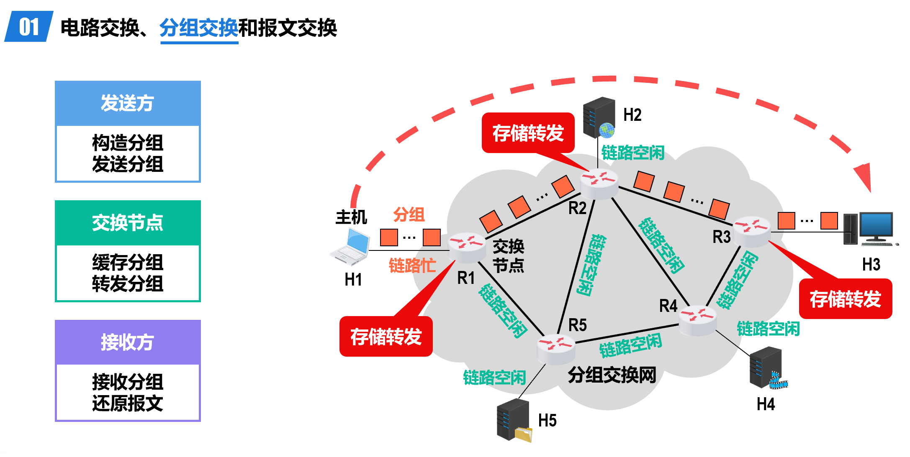
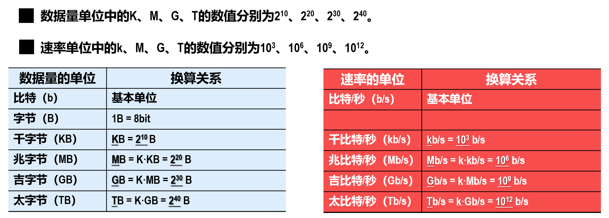
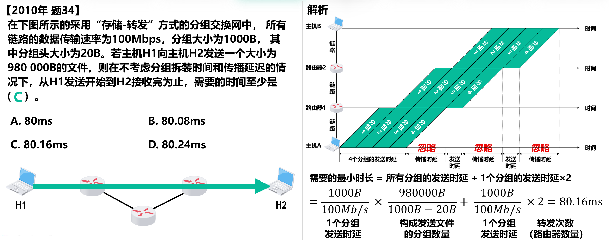

# 计算机网络

> 任课教师：许海涛

## 绪论

### 因特网

!!! note "网络vs.互联网vs.因特网"
    - 网络：节点（Node）和节点间通过有线/无线链路（Link）连接而成的系统
    - 互联网：由多个网络通过路由器互联而成的网络（网络的网络）
    - 因特网（Internet）：全球最大的互联网

因特网的三个发展阶段：

- ARPANET 向互连网发展
- 三级结构因特网
- 多层次 ISP 结构的因特网
    - ISP（Internet Service Provider）：因特网服务提供商，例如中国电信/联通/移动

因特网的标准化工作是面向公众的，其任何一个建议标准在成为因特网标准之前都以 RFC（Request for Comments）的技术文档的形式在因特网上发表。

### 交换模型（Switching Model）

- 电路交换：用户设备通过用户线连到各自的电话交换机，交换机间通过中继线互联
    - 分配资源——占用资源——归还资源
    - **突发式**数据传送，传送效率很低——传送时间占很小一部分
- 分组交换：通过**分组交换网**中的**交换节点**传送分组后的数据（报文）
    - 
    - pros：没有建立连接和释放连接的过程；分组传输过程中逐段占用通信链路，有较高的通信线路利用率；交换节点可以为每一个分组独立选择转发路由，使得网络有很好的生存性
    - cons：分组首部带来了额外的传输开销；交换节点存储转发分组会造成一定的时延；无法确保通信时端到端通信资源全部可用，在通信量较大时可能造成网络拥塞；分组可能会出现失序和丢失等问题。
    - 注意，分组的首部是额外添加的，并不包含原数据的内容，即分组 = 首部 + 数据
- 报文交换：
    - 报文被**整个**地发送，而不是拆分成若干个分组进行发送。
    - 交换节点将报文整体接收完成后才能查找转发表，将整个报文转发到下一个节点。
    - 因此，报文交换比分组交换带来的转发时延要长很多，需要交换节点具有的缓存空间也大很多。

### 计算机网络简介

- 分类
    - 按照交换方式分类：
        - 电路交换
        - 分组交换
        - 报文交换
    - 使用者分类
        - 公用网（因特网）
        - 专用网（军队、铁路等）
    - 传输介质分类
        - 有线网
        - 无线网
    - 覆盖范围分类
        - 广域网（WAN）：几十-几千公里
        - 城域网（MAN）：五公里-五十公里
        - 局域网（LAN）：1km左右
        - 个域网（PAN）：10m左右
    - 拓扑结构分类
        - 总线型
        - 星型
        - 环型
        - 网状型

!!! definition "CN 的性能指标"
    ??? note "速率"
        即**每秒交换多少个 bit**，亦称为数据率（data rate）或比特率（bit rate），单位是 bps（bits per second, bit/s），也常用 kbps、Mbps、Gbps 等，每两个单位间隔 1000 倍。

        - 注意，**数据量**的单位常用字节（Byte, B），1B = 8bits，且此处 KB, MB, GB 等中的 K, M, G 是 2^10 的倍数，与速率的进制不同。
        - 

        ??? example "例"
            - 有一个待发送的数据块，大小为100MB，网卡的发送速率为100Mbps，则网卡发送完该数据块需要多长时间？
            - $t = \frac{100MB}{100Mbps} = \frac{MB}{Mbps} =$（不能直接约掉M！）$\frac{2^{20} \times 8 bits}{10^6 bits/s} \approx 8.389s$

    ??? note "带宽"
        用来表示网络的通信线路所能传送数据的能力，即在单位时间内从网络中的某一点到另一点所能通过的最高数据率。

        - 数据传送速率 = min [主机接口速率，线路带宽，交换机或路由器的接口速率]
        
    ??? note "吞吐量"
        在单位时间内通过某个网络或接口的实际数据量；受网络带宽限制。

    ??? note "时延"
        数据从网络的一端传送到另一端所耗费的时间，也称为延迟或迟延。 

        - 发送时延 = 分组长度（bits）/ 发送速率（bps）（发送速率就是『带宽』中计算的那个最小值）
        - 传播时延 = 信道长度（m）/ 信号传播速度（m/s）
            - 自由空间：3.0 × 108 m/s
            - 铜线：2.3 × 108 m/s
            - 光纤：2.0 × 108 m/s
        - 排队时延和处理时延不方便计算
        - 有点流水线的感觉：

        ??? example "例"
            - 
                - 注意计算分组数量时，分组长度要减去首部长度
            - 
                - 由此可以看出，分组长度大时，发送时延占主导；否则传播时延占主导

    ??? note "时延带宽积"
        传播时延和带宽的乘积，可以形象地理解为某一时刻信道/链路中“充满”的比特数。

        链路的时延带宽积也称为以比特为单位的链路长度

        ??? example "例"
            - 主机A和B之间采用光纤链路，链路长1km，链路带宽为1Gb/s，请计算该链路的时延带宽积。
            - 时延带宽积 = 传播时延 × 带宽 = $\frac{1000m}{2.0 \times 10^8 m/s} \times 1Gb/s = 5000 bits$

    ??? note "往返时间"
    ??? note "利用率"
    ??? note "丢包率"