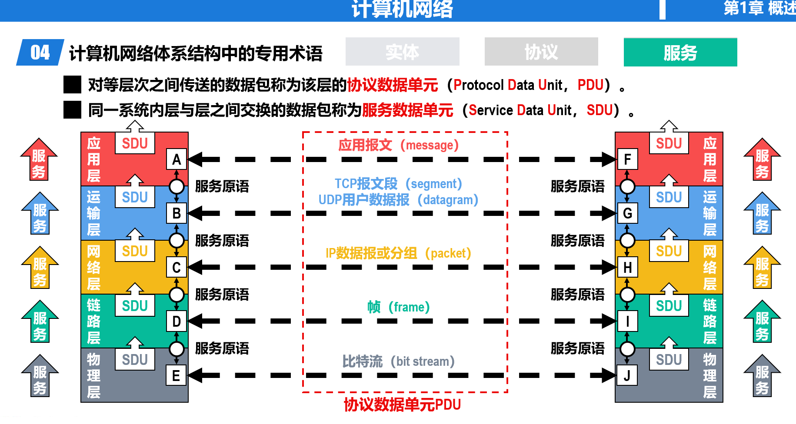

# 计算机网络

> 任课教师：许海涛  
> 参考：《深入浅出计算机网络》，<https://zjucomp.net/>，<https://www.yuque.com/xianyuxuan/coding/gez9yl>

??? note "课程作业"
    - [hw1](./assets/CNhw1.pdf)
    - [hw2](./assets/CNhw2.pdf)

## 绪论

### 因特网

!!! note "网络vs.互联网vs.因特网"
    - 网络：节点（Node）和节点间通过有线/无线链路（Link）连接而成的系统
    - 互联网：由多个网络通过路由器互联而成的网络（网络的网络）
    - 因特网（Internet）：全球最大的互联网

因特网的三个发展阶段：

- ARPANET 向互连网发展
- 三级结构因特网
- 多层次 ISP 结构的因特网
    - ISP（Internet Service Provider）：因特网服务提供商，例如中国电信/联通/移动

因特网的标准化工作是面向公众的，其任何一个建议标准在成为因特网标准之前都以 RFC（Request for Comments）的技术文档的形式在因特网上发表，即因特网草案->建议标准->因特网标准

### 交换模型（Switching Model）

- 电路交换：用户设备通过用户线连到各自的电话交换机，交换机间通过中继线互联
    - 分配资源——占用资源——归还资源
    - **突发式**数据传送，传送效率很低——传送时间占很小一部分
- 分组交换：通过**分组交换网**中的**交换节点**传送分组后的数据（报文，Message）
    - 
    - 将较长的报文拆分成若干个较短的等长数据段，在每个数据段前加上一些必要的控制信息（称为 Header），例如源地址和目标地址等，这样就形成了一个个分组（Packet）
    - pros：没有建立连接和释放连接的过程；分组传输过程中逐段占用通信链路，有较高的通信线路利用率；交换节点可以为每一个分组独立选择转发路由，使得网络有很好的生存性
    - cons：分组首部带来了额外的传输开销；交换节点存储转发分组会造成一定的时延；无法确保通信时端到端通信资源全部可用，在通信量较大时可能造成网络拥塞；分组可能会出现失序和丢失等问题。
    - 注意，分组的首部是额外添加的，并不包含原数据的内容，即分组 = 首部 + 数据
- 报文交换：
    - 报文被**整个**地发送，而不是拆分成若干个分组进行发送。
    - 交换节点将报文整体接收完成后才能查找转发表，将整个报文转发到下一个节点。
    - 因此，报文交换比分组交换带来的转发时延要长很多，需要交换节点具有的缓存空间也大很多。

### 计算机网络简介

- 分类
    - 按照交换方式分类：
        - 电路交换
        - 分组交换
        - 报文交换
    - 使用者分类
        - 公用网（因特网）
        - 专用网（军队、铁路等）
    - 传输介质分类
        - 有线网
        - 无线网
    - 覆盖范围分类
        - 广域网（WAN）：几十-几千公里
        - 城域网（MAN）：五公里-五十公里
        - 局域网（LAN）：1km左右
        - 个域网（PAN）：10m左右
    - 拓扑结构分类
        - 总线型
        - 星型
        - 环型
        - 网状型

!!! definition "CN 的性能指标"
    ??? note "速率"
        即**每秒交换多少个 bit**，亦称为数据率（data rate）或比特率（bit rate），单位是 bps（bits per second, bit/s），也常用 kbps、Mbps、Gbps 等，每两个单位间隔 1000 倍。

        - 注意，**数据量**的单位常用字节（Byte, B），1B = 8bits，且此处 KB, MB, GB 等中的 K, M, G 是 2^10 的倍数，与速率的进制不同。
        - 

        ??? example "例"
            - 有一个待发送的数据块，大小为100MB，网卡的发送速率为100Mbps，则网卡发送完该数据块需要多长时间？
            - $t = \frac{100MB}{100Mbps} = \frac{MB}{Mbps} =$（不能直接约掉M！）$\frac{2^{20} \times 8 bits}{10^6 bits/s} \approx 8.389s$

    ??? note "带宽"
        用来表示网络的通信线路所能传送数据的能力，即在单位时间内从网络中的某一点到另一点所能通过的最高数据率。

        - 数据传送速率 = min [主机接口速率，线路带宽，交换机或路由器的接口速率]
        
    ??? note "吞吐量"
        在单位时间内通过某个网络或接口的实际数据量；受网络带宽限制。

    ??? note "时延"
        数据从网络的一端传送到另一端所耗费的时间，也称为延迟或迟延。 

        - 发送时延 = 分组长度（bits）/ 发送速率（bps）（发送速率就是『带宽』中计算的数据传送速率）
        - 传播时延 = 链路长度（m）/ 电磁波信号传播速度（m/s）
            - 自由空间：$3.0 × 10^8$ m/s
            - 铜线：$2.3 × 10^8$ m/s
            - 光纤：$2.0 × 10^8$ m/s
        - 排队时延和处理时延不方便计算
        - 有点流水线的感觉：

        ??? example "例"
            - 
                - 注意计算分组数量时，分组长度要减去首部长度
            - 
                - 由此可以看出，分组长度大时，发送时延占主导；否则传播时延占主导

        

    ??? note "时延带宽积"
        传播时延和带宽的乘积，可以形象地理解为某一时刻信道/链路中“充满”的比特数。

        链路的时延带宽积也称为以比特为单位的链路长度

        ??? example "例"
            - 主机A和B之间采用光纤链路，链路长1km，链路带宽为1Gb/s，请计算该链路的时延带宽积。
            - 时延带宽积 = 传播时延 × 带宽 = $\frac{1000m}{2.0 \times 10^8 m/s} \times 1Gb/s = 5000 bits$

    ??? note "往返时间"
        RTT（Round Trip Time），即一个分组从发送端发送，到发送端收到从接收端发来的相应确认分组所经历的时间

    ??? note "利用率"
        - 链路利用率：某条链路有百分之多少时间有数据通过
            - 某链路利用率增大时，其引起的时延也会增大（根本是分组在交换节点的排队时延增大了）
        - 网络利用率：所有链路利用率的加权平均
        - $D_0$: 网络空闲时的时延；$D$: 网络当前时延；$U$: 网络利用率。那么有 $D = \frac{D_0}{1-U}$

    ??? note "丢包率"
        一定的时间范围内，传输过程中丢失的分组数量与总分组数量的比值。
        
        - Packet 丢失主要有以下两种原因：
            - 分组在传输过程中出现误码，被传输路径中的节点交换机（例如路由器）或目的主机检测出误码而丢弃。
            - 节点交换机根据丢弃策略主动丢弃分组。

### 计算机网络体系结构

- 常见的三种 CN Arch
    - OSI 七层参考模型：物理层、数据链路层、网络层、传输层、会话层、表示层、应用层
    - TCP/IP 四层参考模型：网络接口层、网际层、传输层、应用层；即物理层和数据链路层合并为网络接口层，会话层到应用层合并为新应用层
    - 原理参考模型：由于网络接口层在教学意义上比较难以理解，把网络接口层重新拆分为数据链路层和物理层

#### 分层的必要性

分层可将庞大复杂的问题转化为若干较小的局部问题，各层主要考虑的功能如下：

- 物理层：传输媒体（介质）的选择；物理接口选择；0/1 的表示
- 数据链路层：标识网络中各主机（主机编址，例如MAC地址）；从比特流中区分出地址和数据（数据封装格式）；协调各主机争用总线（媒体接入控制）；以太网交换机的实现（自学习和转发帧）；检测数据是否误码（差错检测）；出现传输差错如何处理（可靠传输和不可靠传输）
- 网络层：标识网络和网络中的各主机（网络和主机共同编址，例如IP地址）；路由器转发分组（路由选择协议、路由表和转发表）；
- 运输层：进程之间基于网络的通信（进程的标识，例如端口号）；出现传输差错如何处理（可靠传输和不可靠传输；
- 应用层：通过应用进程间的交互来完成特定的网络应用；进行会话管理和数据表示；

!!! note "Terminology"
    - 实体（Entity）：任何可发送或接收信息的硬件或软件进程
    - 协议（Protocol）：对等实体之间通信的规则，包含如下三要素
        - 语法（Syntax）：规定数据包的结构，确保信息能够被正确解析
        - 语义（Semantics）：规定数据包中的每个字段代表什么意义，以及接收设备收到后该如何处理
        - 同步（Synchronization）：规定发送方和接收方在通信时的时序匹配关系
    - 服务（Service）：对等实体通过协议进行通信，为**上一层**提供服务；实体看得见下层提供的服务，但并不知道实现该服务的具体协议
        - 相邻两层实体交换信息的接口称为服务访问点（ASP，Access Service Point），用于区分不同的服务类型
        - 上层要使用下层所提供的服务，必须通过与下层交换一些命令，这些命令称为**服务原语**。
    - PDU & SDU
        - 
        
## 物理层

!!! note "物理层接口特性"
    - 机械特性：规定连接器的形状、尺寸和引脚排列等
    - 电气特性：规定信号的电压、电流、频率、距离限制等
    - 功能特性：规定接口电缆的各条信号线的作用
    - 规程特性：规定在信号线上传输比特流的一组操作过程，包括各信号间的时序关系

### 传输媒体

也称传输媒介，是网络设备间的物理通路，处于物理层之下，不包含在 CN Arch 中

- 导向型传输媒体（固体媒体）
    - 同轴电缆
        - 基带、宽带
    - 双绞线
        - 绞合：减少相邻导线间的电磁干扰 & 抵御部分来自外界的电磁干扰
    - 光纤
        - 使用发光二极管或半导体激光器将电脉冲转为光脉冲，通过光纤到达接收端后，通过光电二极管或激光检波器输出电脉冲
        - 多模光纤（全反射 all along）（发光二极管 to 光电二极管）、单模光纤（直线传播）（半导体激光器 to 激光检波器）
        - pros：通信容量非常大，抗电磁干扰能力强，传输损耗小，中继距离长，体积小重量轻
        - cons：切割光纤需要较贵的专用设备；光纤接口较昂贵
- 非导向型传输媒体（无线媒体）
    - 
    - 无线电波（长、中、短、米波）
        - 低频中频近地传输，高频甚高频通过大气离子层反射远距离传输
    - 微波（分米、厘米、毫米波）
        - 地面微波接力通信
        - 同步卫星、人造卫星
    - 红外线
        - 各种遥控器
        - 频率更高，必须要直线传播，传输距离短，速度较低
    - 激光
    - 可见光

### 传输方式

- 串行/并行传输
    - 前者：只有一条链路传输一道比特流
    - 后者：有多条链路同时传输多道比特流
    - 
- 同步/异步传输
    - 前者：
        - 外同步：在收发双方之间增加一条时钟信号线。
        - 内同步：发送端将时钟信号编码到发送数据中一起发送（例如曼彻斯特编码）。
    - 后者：
        - 按字节进行传输，字节间异步（时间间隔不固定）
        - 字节中的每个比特仍然要同步，即各比特的持续时间是相同的。
- 单向通信（单工通信，Simplex Communication）、双向交替通信（半双工通信，Half-Duplex Communication）和双向同时通信（全双工通信，Full-Duplex Communication）
    - 字面意思，即发送端和接收端不能/可以但不能同时/可以且可以同时通信
    - 分别应用于无线电广播、对讲机、电话

### 编码与调制

网络中所见的各种文字图片视频等称为消息（Message），消息需要转化为二进制数据（Data），接着为了在链路中传播，又要将其转化为电信号（Signal），即数字的电磁表现。计算机发出的信号称作数字基带信号，需要通过**调制**（基带调制（也称编码）（数字信道）、带通调制（模拟信道））迁移到适合传输的频段。

代表不同离散数值（0/1）的基本波形称为码元。

- 编码方式
    - 双极性不归零编码（编码效率高，但存在同步问题）
        - 正电平表示1，负电平表示0
        - 接收方怎么判断相邻的许多同电平码元究竟有多少个？给接收方发送数据的同时，还通过时钟信号线给接收方发送时钟信号。按照接收到的时钟信号的节拍，对数据信号线上的信号进行采样。
    - 双极性归零编码（自同步，但编码效率低）
        - 在每个码元的中间时刻信号都会回归到零电平。接收方只要在信号归零后采样即可。
    - 曼彻斯特编码（自同步，传统以太网）
        - 码元内部上升沿（正跳变）表示0，下降沿（负跳变）表示1
    - 差分曼彻斯特编码
        - 码元中间时刻的电平跳变仅表示时钟信号，而不表示数据。
        - **每一个码元开始处**无跳变表示1，有跳变表示0。
        
- 带通调制方法
    - 
- 混合调制方法
    - 相位和振幅结合起来一起调制，每个码元可看作一个二维平面的点
    - 正交振幅调制QAM-16
        - 类似极坐标，r=振幅，θ=相位
        - 12种相位
        - 共16种码元，每种码元表示 $\log_2{16} = 4$ 个比特
        - 每个码元与4个比特的对应关系采用格雷码，即任意两个相邻码元只有1个比特不同：这样就算发生了误码，最多也只有1个比特错误
        
### 信道的极限容量

信道会由于码元的传输速率、信号的传输距离、传输媒体质量、噪声干扰导致信号失真；信道上传输的数字信号，可以看做是多个频率的模拟信号进行多次叠加后形成的方波。

如果数字信号中的高频分量在传输时受到衰减甚至不能通过信道，则接收端接收到的波形前沿和后沿就变得不那么陡峭，每一个码元所占的时间界限也不再明确。这样，在接收端接收到的信号波形就失去了码元之间的清晰界限，这种现象称为**码间串扰**。如果信道的频带越宽，则能够通过的信号的高频分量就越多，那么码元的传输速率就可以更高，而不会导致码间串扰。然而，信道的频率带宽是有上限的，不可能无限大。因此，码元的传输速率也有上限。

!!! definition "奈氏准则"
    理想低通信道的最高码元传输速率 = 2W Baud = 2W 码元/秒（W 为信道的频率带宽）

    Baud 即码元/秒，1码元携带 n 比特信息时，数据传输速率（比特率） = n × 码元传输速率 = n × Baud (bps)

    ??? example "例"
        - 在无噪声情况下，若某通信链路的带宽为3kHz，采用4个相位，每个相位具有4种振幅的QAM调制技术，则该通信链路的最大数据传输速率是多少？
        - 采用4个相位，每个相位4种振幅的QAM调制技术，可以调制出 4 × 4 = 16个不同的基本波形（码元） 。采用二进制对这16个不同的码元进行编码，需要使用4个比特（$\log_2(16)=4$）。（即每个码元携带4比特信息）
        - 该通信链路的最大数据传输速率 = 6k（码元/秒）× 4（比特/码元）= 24k（比特/秒）= 24kbps

!!! definition "香农公式"
    带宽受限且有高斯白噪声干扰的信道的极限信息传输速率 $C = W \log_2(1 + \frac{S}{N}) (bps)$

    - S：信道内所传信号的平均功率
    - N：信道内的高斯噪声功率
    - S/N：由信噪比（SNR）计算出的一个比值
    - SNR = $10 \log_{10}(\frac{S}{N})$ dB

### 信道复用

Multiplexing:在一条传输媒体上同时传输多路用户的信号

- 频分复用（FDM）
    - 将信道的频带划分为若干个互不重叠的子信道，每个子信道传输一路用户信号
    - 每个子信道之间要有隔离频带，防止相邻子信道间的串扰
- 时分复用（TDM）
    - 将信道的时间划分为若干个时隙，每个时隙传输一路用户信号
    - 各用户时隙周期性出现周期为TDM帧的长度
    - 时分复用的所有用户在不同的时间占用同样的频带
- 波分复用（WDM）
    - 根据频分复用的设计思想，可在一根光纤上同时传输多个频率（波长）相近的光载波信号
    - 
- 码分复用（CDM）
    - 每个用户可以在相同的时间用相同的频带进行通信
    - 将每个比特时间划分为m个更短的时间片，称为码片（Chip）。
    - CDMA中的每个站点都被指派一个唯一的m比特码片序列（Chip Sequence）。
    - 某个站要发送比特1，则发送它自己的m比特码片序列
    - 某个站要发送比特0，则发送它自己的m比特码片序列的反码
    - 码片向量：0记为-1，1记为+1，原始message进行记录
    - 每个站分配的码片序列必须各不相同且码片向量正交
    - 例：
    - 又一例：

## 数据链路层

链路（Link）定义为从一个节点到相邻节点（中间没有其他节点）的物理线路（有线或无限）。

数据链路（Data Link）是在链路的基础上添加了一些实现**控制数据传输的协议**的软硬件（例如说网络适配器）

### 3 Problems

- 封装成帧和透明传输
    - 为网络层交付来的分组添加一个首部和一个尾部构成帧（Frame）
    - 首部的开头有帧开始符，尾部的结尾有帧结束符
    - 分组长度（数据载荷）最好大于首尾的长度（为保证效率），每种数据链路层协议都规定了其长度上限，称为最大传送单元（MTU，Maximum Transfer Unit）
    - 透明传输：在数据载荷中如果出现帧结束符，接收方会误以为到达了帧的结尾，从而导致后续的数据被抛弃
        - 需要采取措施使数据链路层对 PDU 内容没有任何限制，酷似该层不存在，即透明传输
        - Solution：
            - 面向字节的透明传输：**字节填充**，在**数据载荷中的**帧定界符和转义字符前插入一个转义字符（ESC）；接收方的数据链路层在把数据载荷上交给传输层时，去掉插入的转义字符
            - 面向比特的透明传输：**比特填充** 
- 差错检测
    - 根据帧尾中的检错码检测帧中是否有误码（1变成0，0变成1）
    - 奇偶校验：在待发送的数据后面添加1个校验位，使得添加该校验位后的整个数据中比特1的个数为奇/偶数
        - 如果偶数个位发生误码，则比特1的数量奇偶性不会改变，无法检测出错误
    - 循环冗余校验（CRC，Cyclic Redundancy Check）
        - 发送方和接收方事先约定一个生成多项式 $G(x)$，$G(x)$的最高次幂为$r$
        - 发送方将待发送的比特串通过 $G(x)$ 进行计算得到冗余码，添加到数据后一起发送
        - 接收方收到数据和冗余码后，通过 $G(x)$ 来计算收到的数据和冗余码是否产生了误码。
        - 
            - 注意这里的竖式除法，每一步做的不是减法，是异或
        - 

        ??? example "例"
            
            

    - 校验是否有误码是很好实现的，但是判断误码位置很难，有一种海明码：https://www.bilibili.com/video/BV1P64y1478p

- 可靠传输
    - 判断到误码后如何处理取决于数据链路层提供的传输服务
    - 可靠传输：通过某种机制实现发送方发送什么，接收方最终都能正确收到。无线链路误码率较高，必须可靠传输。
    - 不可靠传输：收到有误码的帧直接丢弃。有线链路误码率较低，可以不可靠传输。
    - 传输差错分类：误码、分组丢失、分组失序、分组重复

!!! note "停止-等待协议"
    发送方在发送数据分组后等待接收方发来的确认分组（ACK，Acknowledgement）或否定确认分组（NAK，Negative Acknowledgement），收到 ACK 后发送下一个数据分组，收到 NAK 后重发该数据分组。接收方进行差错检测，若无误码则发送 ACK，有误码则发送 NAK。

    - Problem 1：如果在发送方发送数据分组后，确认分组丢失了怎么办（接收方一直不回应，因此发送方无法继续发送数据分组）？
        - Solution：发送方设置一个超时定时器（Timeout Timer），在每发送一个数据分组后启动定时器，若在定时时间（RTO，Retransmission Time Out）内没有收到确认分组，则重发该数据分组。
        - RTO 一般设为比 RTT 略长一些的时间
    - Problem 2：如果 ACK 或 NAK 丢失了怎么办（经过 RTO 后，发送方重复发送相同的数据包）
        - Solution：给每个分组带上序号，对于停止-等待协议，只需要 1 位序号即可，0 和 1 交替使用
        - 接收方收到重复的数据分组后丢弃，发送一个“通知发送方发送新的数据分组”的 ACK
        - 考虑到确认迟到的情况，ACK 也要带上序号

    ??? note "Stop-and-Wait 的信道利用率"
        

!!! note "回退 n 帧协议（Go-Back-N）"
    采用流水线传输，利用发送窗口限制连续发送分组的数量

    - 使用 n 个比特给分组编序号（范围为 $0$ 到 $2^n-1$ ），维护一个发送窗口，大小为 $W_T \in (1, 2^n - 1]$。
    - 在未收到接收方确认分组的情况下，发送方可将序号落入$W_T$内的所有数据分组连续发送出去。
    - 接收方需要维护一个接收窗口 $W_R$ ，只有正确到达接收方（无误码）且序号落入 $W_R$ 内的数据分组才被接收方接收。$W_R$ 只能为 1。
    - 窗口滑动协议
        - 发送方：收到确认分组后，发送窗口向前滑动，允许发送更多的数据分组
        - 接收方：收到正确的数据分组后，接收窗口向前滑动，允许接收下一个数据分组；同时发回针对该分组的确认分组
    - 回退 N 帧的情况：看PPT
        - 累计确认：接收方不必对收到的每一个数据分组都发送一个确认分组，而是可以在收到几个序号连续的数据分组后，对按序到达的最后一个数据分组发送确认分组。
            - pros：减少向网络中注入确认分组的数量；即使确认分组丢失，也可能不必重传数据分组。
            - cons：不能向发送方及时准确地反映出接收方已正确接收的所有数据分组的数量

    ??? example "例"
        - 数据链路层使用后退N帧（GBN）协议，发送方已经发送了编号0~7的帧。当计时器超时时，若发送方只收到了0、2、3号帧的确认，则发送方需要重发的帧数是多少？
            - 从编号4开始超时，即重发 4 5 6 7 ，共 4 帧

!!! note "选择重传协议（Selective Repeat）"
    TBD

### PPP 协议

Point-to-Point Protocol，点对点协议

### 共享式 Ethernet

### 网卡

### MAC 地址
        
            

