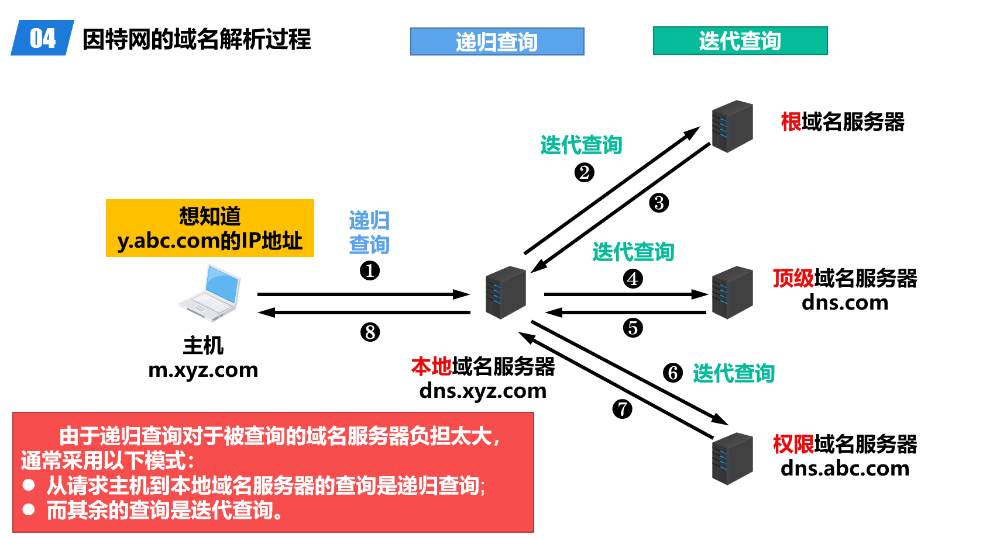

# 应用层

## 客户/服务器方式

客户和服务器是指通信中所涉及的两个应用进程。客户是服务请求方，服务器是服务提供方。服务器总是处于运行状态，并等待客户的服务请求。

## 对等（Peer-to-Peer）方式

没有固定的服务请求者和服务提供者，分布在网络边缘各端系统中的应用进程是对等的，被称为对等方。对等方相互之间直接通信，每个对等方既是服务的请求者，又是服务的提供者。

## DHCP 动态主机配置协议

对用户主机进行正确配置（IP，子网掩码，默认网关等），使其能够访问 Web 服务器。手动配置工作量大且容易出错，可以在局域网中部署一台 DHCP 服务器，自动获取配置参数，为用户主机分配 IP 地址等配置信息。

### 中继代理

## Domain Name System

### Domain Name Server

DNS使用分布在各地的域名服务器来实现域名到IP地址的转换。

- 根域名服务器（Root DNS Server）：每个根域名服务器都知道所有的顶级域名服务器的域名及其IP地址。
    - 通常并不直接对域名进行解析，而是返回该域名所属顶级域名的顶级域名服务器的IP地址
- 顶级域名服务器负责管理在该顶级域名服务器注册的所有二级域名。
- 权限域名服务器负责管理某个区的域名。
- 本地域名服务器不属于上述的域名服务器的等级结构。
    - 本地域名服务器起着代理的作用，会将主机发送的 DNS 请求报文转发到上述的域名服务器的等级结构中。

服务器中有高速缓存

### 域名解析过程

递归查询：

迭代查询：

## FTP 文件传输协议

FTP客户和服务器之间要建立以下两个并行的TCP连接：

- 一个是控制连接，在整个会话期间一直保持打开，用于传送FTP相关控制命令。
    - 主动模式与被动模式下都由客户机随机选择的临时端口发起该连接，且连接到服务器的熟知21端口。
- 另一个是数据连接，用于文件传输，在每次文件传输时才建立，传输结束就关闭。
    - 主动模式下由服务器熟知20端口发起该连接，连接到客户机另一个随机端口。
    - 被动模式下由客户机随机选择的临时端口发起该连接，连接到服务器由客户告知的端口。

## EMAIL

电子邮件系统采用 C/S 模式

- 发送协议：SMTP（Simple Mail Transfer Protocol，简单邮件传输协议）
- 读取协议：POP3（Post Office Protocol 3，邮局协议第3版）或 IMAP（Internet Message Access Protocol，互联网消息访问协议）

用户代理 ->（SMTP）-> 发送方邮件服务器 ->（SMTP）-> 接收方邮件服务器 <-（POP3）- 用户代理

### SMTP 简单邮件传输协议

只能传送ASCII码文本数据，不能传送可执行文件或其他的二进制对象。

为解决SMTP传送非ASCII码文本的问题，提出了多用途因特网邮件扩展 (Multipurpose Internet Mail Extensions，MIME)

### POP3 邮局协议第3版

用户只能以下载并删除方式或下载并保留方式从邮件服务器下载邮件到用户方计算机。

不允许用户在邮件服务器上管理自己的邮件。（例如创建文件夹，对邮件进行分类管理等）。

### IMAP4 互联网消息访问协议第4版

用户在自己的计算机上就可以操控邮件服务器中的邮箱，就像在本地操控一样，因此IMAP是一个联机协议。

## WWW 万维网

浏览器最重要的部分是渲染引擎，也就是浏览器内核。负责对网页内容进行解析和显示。

不同的浏览器内核对网页内容的解析也有不同，因此同一网页在不同内核的浏览器里的显示效果可能不同；

### HTTP 超文本传输协议

HyperText Transfer Protocol，超文本传输协议

浏览器向服务器发送 HTTP 请求报文，服务器收到请求后，向浏览器发送 HTTP 响应报文。

- HTTP/1.0采用非持续连接方式。在该方式下，每次浏览器要请求一个文件都要与服务器建立TCP连接，当收到响应后就立即关闭连接。
    - 请求一个万维网文档所需的时间 =2RTT+文档的传输时延
- HTTP/1.1采用持续连接方式，可以用流水线提高效率

HTTP 是面向文本的，其报文中的每一个字段都是一些 ASCII 码串，并且每个字段的长度都是不确定的。

- 请求报文格式
    - 请求行：方法 URL 版本
    - 首部行：首部字段名: 首部字段值
- 响应报文格式
    - 状态行：版本 状态码 状态短语
    - 首部行：首部字段名: 首部字段值

### Cookies

Cookie 是一种对无状态的HTTP进行状态化的技术

- 客户端首次向服务器发送请求，服务器生成一个唯一标识符，并将该标识符存储在服务器端的数据库中，同时将该标识符作为Cookie发送给客户端；客户端将该Cookie存储在本地。
- 以后每次客户端向该服务器发送请求时，都会将该Cookie发送给服务器，服务器通过该Cookie识别出该客户端，并从数据库中取出该客户端的相关信息，从而返回个性化的响应。

### WWW 缓存

位于中间系统上的Web缓存又称为代理服务器（Proxy Server）。

Web缓存把最近的一些请求和响应暂存在本地磁盘中。当新请求到达时，若发现这个请求与暂时存放的请求相同，就返回暂存的响应，而不需要按URL的地址再次去因特网访问该资源；否则，才向原服务器发送请求，获取响应，并将该响应暂存起来，以备将来使用。