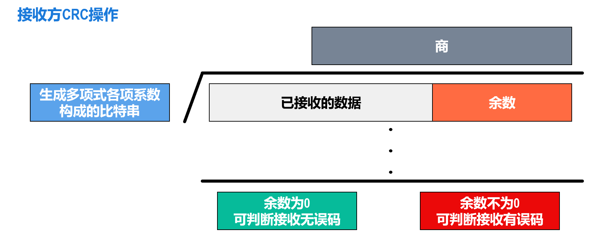
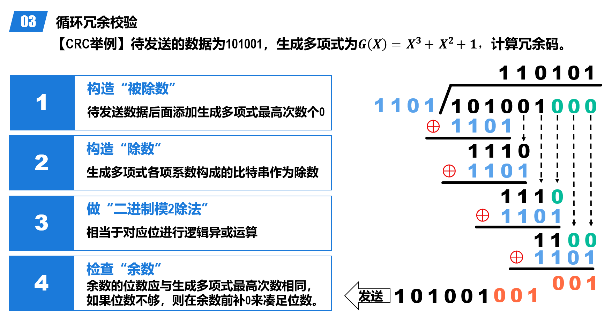
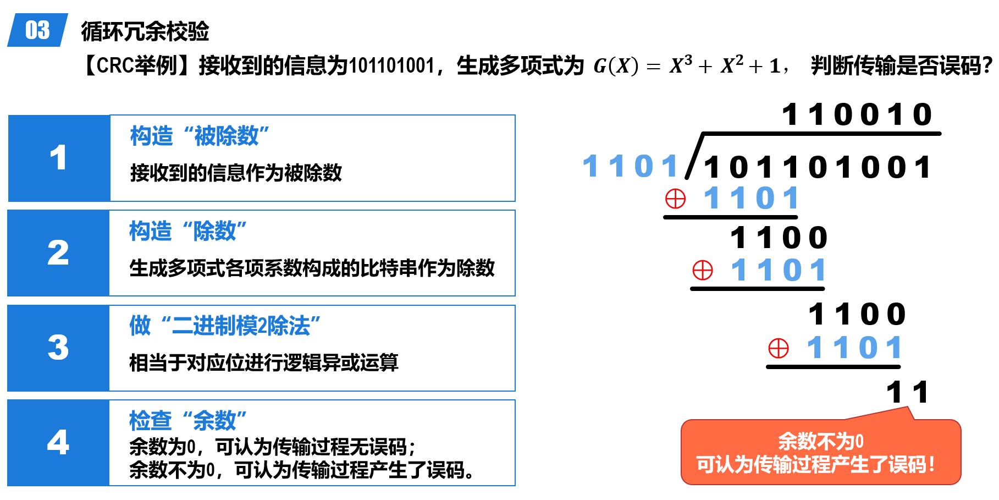

# 数据链路层

链路（Link）定义为从一个节点到相邻节点（中间没有其他节点）的物理线路（有线或无限）。

数据链路（Data Link）是在链路的基础上添加了一些实现**控制数据传输的协议**的软硬件（例如说网络适配器）

## 3 Problems

- 封装成帧和透明传输
    - 为网络层交付来的分组添加一个首部和一个尾部构成帧（Frame）
    - 首部的开头有帧开始符，尾部的结尾有帧结束符
    - 分组长度（数据载荷）最好大于首尾的长度（为保证效率），每种数据链路层协议都规定了其长度上限，称为最大传送单元（MTU，Maximum Transfer Unit）
    - 透明传输：在数据载荷中如果出现帧结束符，接收方会误以为到达了帧的结尾，从而导致后续的数据被抛弃
        - 需要采取措施使数据链路层对 PDU 内容没有任何限制，酷似该层不存在，即透明传输
        - Solution：
            - 面向字节的透明传输：**字节填充（Byte stuffing）**，在**数据载荷中的**帧定界符和转义字符前插入一个转义字符（ESC）；接收方的数据链路层在把数据载荷上交给传输层时，去掉插入的转义字符
            - 面向比特的透明传输：**比特填充（Bit stuffing）** 
- 差错检测
    - 根据帧尾中的检错码检测帧中是否有误码（1变成0，0变成1）
    - 奇偶校验：在待发送的数据后面添加1个校验位，使得添加该校验位后的整个数据中比特1的个数为奇/偶数
        - 如果偶数个位发生误码，则比特1的数量奇偶性不会改变，无法检测出错误
    - 循环冗余校验（CRC，Cyclic Redundancy Check）
        - 发送方和接收方事先约定一个生成多项式 $G(x)$，$G(x)$的最高次幂为$r$
        - 发送方将待发送的比特串通过 $G(x)$ 进行计算得到冗余码，添加到数据后一起发送
        - 接收方收到数据和冗余码后，通过 $G(x)$ 来计算收到的数据和冗余码是否产生了误码。
        - 
            - 注意这里的竖式除法，每一步做的不是减法，是异或
        - 

        ??? example "例"
            
            

    - 校验是否有误码是很好实现的，但是判断误码位置很难，有一种海明码：https://www.bilibili.com/video/BV1P64y1478p

- 可靠传输
    - 判断到误码后如何处理取决于数据链路层提供的传输服务
    - 可靠传输：通过某种机制实现发送方发送什么，接收方最终都能正确收到。无线链路误码率较高，必须可靠传输。
    - 不可靠传输：收到有误码的帧直接丢弃。有线链路误码率较低，可以不可靠传输。
    - 传输差错分类：误码、分组丢失、分组失序、分组重复

!!! note "停止-等待协议"
    发送方在发送数据分组后等待接收方发来的确认分组（ACK，Acknowledgement）或否定确认分组（NAK，Negative Acknowledgement），收到 ACK 后发送下一个数据分组，收到 NAK 后重发该数据分组。接收方进行差错检测，若无误码则发送 ACK，有误码则发送 NAK。

    - Problem 1：如果在发送方发送数据分组后，确认分组丢失了怎么办（接收方一直不回应，因此发送方无法继续发送数据分组）？
        - Solution：发送方设置一个超时定时器（Timeout Timer），在每发送一个数据分组后启动定时器，若在定时时间（RTO，Retransmission Time Out）内没有收到确认分组，则重发该数据分组。
        - RTO 一般设为比 RTT 略长一些的时间
    - Problem 2：如果 ACK 或 NAK 丢失了怎么办（经过 RTO 后，发送方重复发送相同的数据包）
        - Solution：给每个分组带上序号，对于停止-等待协议，只需要 1 位序号即可，0 和 1 交替使用
        - 接收方收到重复的数据分组后丢弃，发送一个“通知发送方发送新的数据分组”的 ACK
        - 考虑到确认迟到的情况，ACK 也要带上序号

    ??? note "Stop-and-Wait 的信道利用率"
        

!!! note "回退 n 帧协议（Go-Back-N）"
    采用流水线传输，利用发送窗口限制连续发送分组的数量

    - 使用 n 个比特给分组编序号（范围为 $0$ 到 $2^n-1$ ），维护一个发送窗口，大小为 $W_T \in (1, 2^n - 1]$。
    - 在未收到接收方确认分组的情况下，发送方可将序号落入$W_T$内的所有数据分组连续发送出去。
    - 接收方需要维护一个接收窗口 $W_R$ ，只有正确到达接收方（无误码）且序号落入 $W_R$ 内的数据分组才被接收方接收。$W_R$ 只能为 1。
    - 窗口滑动协议
        - 发送方：收到确认分组后，发送窗口向前滑动，允许发送更多的数据分组
        - 接收方：收到正确的数据分组后，接收窗口向前滑动，允许接收下一个数据分组；同时发回针对该分组的确认分组
    - 回退 N 帧的情况：看PPT
        - 累计确认：接收方不必对收到的每一个数据分组都发送一个确认分组，而是可以在收到几个序号连续的数据分组后，对按序到达的最后一个数据分组发送确认分组。
            - pros：减少向网络中注入确认分组的数量；即使确认分组丢失，也可能不必重传数据分组。
            - cons：不能向发送方及时准确地反映出接收方已正确接收的所有数据分组的数量

    ??? example "例"
        - 数据链路层使用后退N帧（GBN）协议，发送方已经发送了编号0~7的帧。当计时器超时时，若发送方只收到了0、2、3号帧的确认，则发送方需要重发的帧数是多少？
            - 从编号4开始超时，即重发 4 5 6 7 ，共 4 帧

!!! note "选择重传协议（Selective Repeat）"
    - $1 < W_R \leq W_T, W_T + W_R \leq 2^n \rightarrow 1< W_R \leq 2^{n-1}$
    - 发送方仅重传出现差错的分组：接收方对每个正确接收的分组**逐一确认**。

    ??? example "例"
        - 数据链路层使用选择重传（SR）协议，发送方已经发送了编号0~3的帧。现已收到1号帧的确认，0、2号帧依次超时，接收方需要重发的帧数是多少？
            - 2，即0、2号帧

## PPP 协议

> 考试时不一定考

Point-to-Point Protocol，点对点协议，常见用例为因特网用户连接到 ISP 提供的因特网接入服务，帧格式见下图：

透明传输、差错检测类似前述内容

## 共享式 Ethernet

以太网标准V1->V2->IEEE 802.3

## 网卡

要将计算机链接到以太网，需要使用网络适配器（Adapter），俗称网卡。

recall：在计算机内部，网卡与CPU之间的通信，一般是通过计算机主板上的I/O总线以并行传输方式进行。网卡与外部以太网（局域网）之间的通信，一般是通过传输媒体（同轴电缆、双绞线电缆、光纤）以串行方式进行的。

网卡要进行并行传输和串行传输的转换；计算机中要安装对应网卡的驱动，驱动程序负责驱动网卡发送和接收帧。

## MAC 地址
        
点对点的通信不需要 MAC 地址，广播式通信（例如在共享式以太网上）需要 MAC 地址来区分不同的节点（每个终端都会收到帧：怎么确认是不是发给自己的？）。

在每个主机发送的帧的首部中，都携带有发送主机（源主机）和接收主机（目的主机）的数据链路层地址。由于这类地址是用于媒体接入控制（Medium Access Control，MAC）的，因此被称为MAC地（硬件地址、物理地址）。

严格来说，MAC地址是对网络上各接口的唯一标识（一个主机可能有多个接口，例如接入有线局域网的以太网卡和接入无线局域网的Wi-Fi网卡），每个网卡都有一个唯一的MAC地址。

## CSMA/CD Protocol（重点）

CSMA/CD 是基于共享式以太网的碰撞问题提出的（将多个站点连接在一条总线上）：当某个站点在总线上发送帧时，总线资源会被该站点独占。此时，如果总线上的其他站点也要在总线上发送帧，就会产生 Collision。

载波监听多址接入/碰撞检测（Carrier Sense Multiple Access Collision Detection）

- 载波监听（Carrier Sense）：在发送数据前，站点先监听总线，若总线空闲96比特时间（帧间最小间隔）则发送数据（实则监听到总线空闲，不一定**真正空闲**），若总线忙则等待并继续检测
- 多址接入（Multiple Access）：多个站点共享同一条总线
- 碰撞检测（Collision Detection）：每个正在发送帧的站点边发送边检测 Collision，一旦在总线上检测到碰撞则立即停止发送，退避一段随机时间后再次进入载波监听阶段

!!! note "强化碰撞"
    发送帧的站点一旦检测到碰撞，除了立即停止发送帧外，还要再继续发送32比特或48比特的人为干扰信号（Jamming Signal），以便有足够多的碰撞信号使所有站点都能检测出碰撞。

note：不能避免碰撞，只是规定了遇到碰撞后的措施

采用该协议的站点不能同时发送和接收帧，因此该协议只能用于半双工通信。

!!! definition "争用期"
    

    站点从发送帧开始，经过争用期𝟐𝝉这段时间还没有检测到碰撞，就可以肯定这次发送不会产生碰撞。

    而从某个站点发送帧开始后到发生可能的碰撞之间的时间长短是不确定的，它取决于另一个发送帧的站点与本站点的距离，但不会超过总线的端到端往返传播时延，即一个争用期𝟐𝝉。

    𝟏𝟎𝑴𝒃/𝒔共享总线以太网（传统以太网）规定：争用期𝟐𝝉 的值为𝟓𝟏𝟐比特的发送时间，即𝟓𝟏.𝟐𝝁s 。

    !!! example "例"
        - 某局域网采用CSMA/CD协议实现介质访问控制，数据传输速率为10Mbps，主机甲和主机乙之间的距离为2km，信号传播速度是200000km/s。
            - 若主机甲和主机乙发送数据时发送冲突，则从开始发送数据时刻起，到两台主机**均**检测到冲突时刻止，最短需经过多长时间？最长需经过多长时间（假设主机甲和主机乙发送数据过程中，其他主机不发送数据）？
                - 最短经过时间：甲乙同时发射信号，碰撞发生于两主机连线中点，经过时间即为信号单程传播时延 $\tau = \frac{2000km}{200000km/s} = 0.01s = 10ms$
                - 最长经过实验：甲发送的信号到达乙，与其刚刚发送出来的信号碰撞，然后 jamming signal 原路返回，经过时间为 $2\tau = 20ms$

!!! definition "最小帧长"
    为了确保共享总线以太网上的每一个站点在发送完一个完整的帧之前，能够检测出是否产生了碰撞，帧的发送时延就不能少于共享总线以太网端到端的往返时间，即一个争用期𝟐𝝉 。

    对于𝟏𝟎𝑴𝒃/𝒔的共享总线以太网，其争用期𝟐𝝉 的值规定为𝟓𝟏.𝟐𝝁s，因此其最小帧长为𝟓𝟏𝟐𝒃，即𝟔𝟒𝑩：如果遭遇碰撞，就一定是在帧的前𝟔𝟒𝑩之内。由于发送端一直在边发送边 CD，那么如果接受方接收到一个小于最小帧长的帧——那一定是遭遇碰撞而被截止的无效帧，可以直接丢弃。

    Forshort：最小帧长=数据传输速率 * 争用期

    ??? example "例"
        在一个采用CSMA/CD协议的网络中，传输介质是一根完整的电缆，传输速率为1Gbps，电缆中的信号传播速度是200 000km/s。若最小数据帧长度减少800比特，则最远的两个站点之间的距离至少需要增加/减短多少？

        最小帧缩短，争用期应该减短，因此距离应当是减短。

        有 $frameLength = 2 \frac{distance}{200000 \times 10^3} \times 10^9$ ，那么 $distance = l/10$，即减短80m。

!!! definition "最大帧长"
    数据载荷的大小不是越长越好，需要有一个限制

    例如说以太网V2 的MAC帧

    

!!! definition "退避算法"
    检测到碰撞后站点要退避一段时间，采用截断二进制指数退避（Truncated Binary Exponential Backoff）算法计算这个时间。

    

!!! definition "共享式以太网的信道利用率"
    $s_{max} = \frac{T_0}{T_0 + \tau}$，$\tau$ 为传播时延，$T_0$ 为发送时延

### 集线器 Hub

只工作在物理层，不检测碰撞——碰撞由每个设备的网卡处理

构成一个更大的广播域和碰撞域

### 在物理层扩展以太网

- 扩展站点与集线器之间的距离
- 扩展共享式以太网的覆盖范围和站点数量

### 在数据链路层扩展以太网

使用网桥（Bridge）连接不同的以太网，而不是 Hub。网桥可以识别帧的结构，可以根据帧首部中的目的MAC地址和网桥自身的**帧转发表**来转发或丢弃所收到的帧。

源 MAC 地址填表（但是记为目的 MAC 地址），目的 MAC 地址查表

#### 透明网桥

通过自学习算法建立转发表。

网桥根据帧的目的MAC地址和网桥的转发表对帧进行转发，包含以下三种情况：

- 明确转发：网桥知道应当从哪个接口转发帧。
- 盲目转发：网桥不知道应当从哪个接口转发帧，只能将其通过除进入网桥的接口外的其他所有接口转发。
- 丢弃：网桥知道不应该转发该帧，将其丢弃。

!!! note "STP Protocol"
    为了提高以太网的可靠性，有时需要在两个以太网之间使用多个透明网桥来提供冗余链路，这样就可能形成环路。

    因此使用生成树协议（Spanning Tree Protocol，STP）来避免环路的产生：网桥之间通过交互网桥协议单元（Bridge Protocol Data Unit，BPDU），找出原网络拓扑的一个连通子集（即生成树），在这个子集里整个连通的网络中不存在环路。

#### Notice

- 如果网桥收到有误码的帧则直接丢弃。
- 如果网桥收到一个无误码的广播帧，则不用进行查表，而是直接从除接收该广播帧的接口的其他接口转发该广播帧
- 转发表中的每条记录都有其有效时间，到期自动删除！这是因为各站点的MAC地址与网桥接口的对应关系并不是永久性的，例如某个站点更换了网卡，其MAC地址就会改变。

## 交换式以太网

以太网交换机实质上是有多个接口的网桥，也有 STP 协议。仅使用交换机（而不使用集线器）的以太网就是交换式以太网

- 交换机连接计算机或其他交换机时，就类似独占传输媒体，可以进行全双工通信，不需要 CSMA/CD 协议
- 连接 Hub 时，仍然只能使用半双工通信

!!! definition "直通交换 Cut-Through Switching"
    （有些交换机用存储转发）交换机在接收到一个帧后，不必等到接收完整个帧，而是在接收到帧的首部并进行差错检测后，立即开始转发该帧。时延短，但是不检测差错就转发，可能会传播误码帧。

    ??? example "例"
        

交换机所连域构成一个更大的广播域，但每个接口都是一个独立的碰撞域。