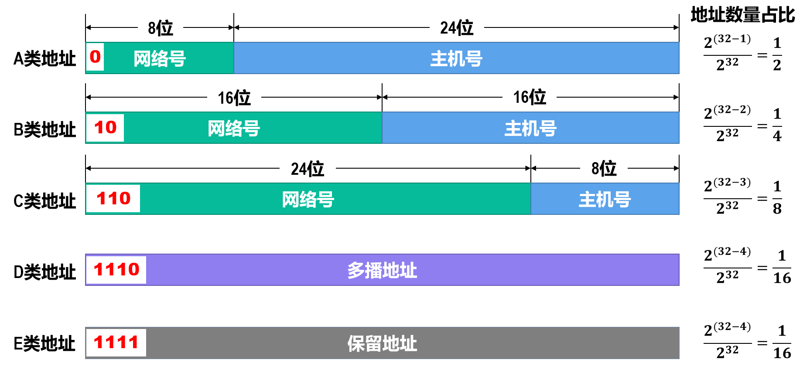
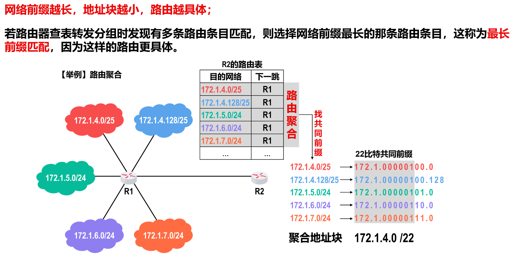

# 网络层/网际层

## 概述

网络层的主要任务是将分组通过多个网络和多段链路传输到目的主机，即**分组转发**+**路由选择**

### 网络层上层提供的服务

- 面向连接的虚电路服务
    - 先建立网络层链接：虚电路（VC），通信双方沿着 VC 发送分组
- 无连接的数据报服务
    - 不需要建立网络层连接，每个分组可走不同的路径

## IP 协议

### 异构网络互连

单一网络无法满足所有用户的需求，于是网络层采用相同的 IP 协议，貌似一个统一的网络。

### IPv4

IPv4地址是给因特网（Internet）上的每一个主机（或路由器）的每一个接口分配的一个在全世界范围内唯一的32比特的标识符。

采用点分十进制表示法：

#### 分类编址

IPv4地址分为两部分：网络号（NetID）和主机号（HostID）

- 网络号
    - 标志主机（或路由器）的接口所连接到的网络
    - 同一个网络中，不同主机（或路由器）的接口的IPv4地址的网络号必须相同，表示它们属于同一个网络。
- 主机号
    - 标志主机（或路由器）的接口
    - 同一个网络中，不同主机（或路由器）的接口的IPv4地址的主机号必须不同，表示它们是同一网络中的不同主机（或路由器）。

例：C 类地址192.168.0.1，其中192.168.0是网络号，1是主机号；B 类地址 172.16.96.1，其中 172.16 是网络号，96.1是主机号。

怎么判断一个IPv4地址的网络号和主机号的边界在哪里呢？这就要用到分类编址。

!!! note "分类编址"
    IPv4地址分为A、B、C、D、E五类。

    

    只有 ABC 类（单播地址）用于分配给主机（或路由器）的接口，且主机号为全 0 （网络地址）或全 1 （广播地址）的地址不能分配.

    - A 类
        - 最小网络号 0 和最大网络号 127 的地址不能指派，**可指派网络数量**为 $2^{8-1}-2 = 126$
        - 最小可指派网络号为 1（IP 地址为 1.0.0.0），最大可指派网络号为 126（IP 地址为 126.0.0.0）
        - 主机全 0 全 1 不能分配，每个网络内**可分配地址数量**为 $2^{24}-2=16777214$
    - B 类
        - **可指派网络数量**为 $2^{16-2}=16384$
        - 最小可指派网络号为 128.0（IP 地址为 128.0.0.0），最大可指派网络号为 191.255（IP 地址为 191.255.0.0）
        - 每个网络内**可分配地址数量**为 $2^{16}-2=65534$
    - C 类
        - **可指派网络数量**为 $2^{24-3}=2097152$
        - 最小可指派网络号为 192.0.0（IP 地址为 192.0.0.0），最大可指派网络号为 223.255.255 (IP 地址为 223.255.255.0)
        - 每个网络内**可分配地址数量**为 $2^{8}-2=254$
    - DE 类
        - 

!!! note "一般不使用的地址"
    | 网络号 | 主机号 | IP 地址 | 作为源地址 | 作为目的地址 | 说明 |
    | ------ | ------ | ------- | ---------- | ------------- | ---- |
    | 0 | 0 | 0.0.0.0 | 可以 | 不可以 | 在本网络上的本主机 |
    | 0 | hostID | 0.hostID | 可以 | 不可以 | 在本网络上的主机 hostID |
    | 全 1 | 全 1 | 255.255.255.255 | 不可以 | 可以 | 只在本网络上进行广播 |
    | netID | 全 1 | netID.255.255.255（A 类），netID.255.255（B 类），netID.255（C 类） | 不可以 | 可以 | 在网络 netID 上所有主机进行广播 |
    | 127 | 非全 0 或全 1 | 127.0.0.1~127.255.255.254 | 可以 | 可以 | 回环测试 |

#### 子网划分编址

从IPv4地址的主机号部分借用一些比特作为子网号来区分不同的子网，就可以利用原有网络中剩余的大量IPv4地址，而不用申请新的网络地址了。

使用子网掩码表明**主机号部分**被借用了几个比特作为**子网号**。

界定子网号和主机号采用**子网掩码**（32比特）：左起多个连续的比特1对应IPv4地址中的网络号和子网号，之后的多个连续的比特0对应IPv4地址中的主机号。

将划分子网的IPv4地址与相应的子网掩码进行逐比特的逻辑与运算，就可得到该IPv4地址所在子网的网络地址（网络号+子网号与 1 与，被保留，主机号与 0 与，被清零）。

!!! example "子网划分示例"
    已知某个网络的地址为218.75.230.0，使用子网掩码255.255.255.128对其进行子网划分，请给出划分细节。

    255.255.255.128 ->(前三个字节全1，展开最后一个字节) 255.255.255.**10000000**，表示从主机号部分借用了1比特作为子网号。

    于是划分的子网数量为 $2^1=2$，每个子网内主机数量为 $2^{7}-2=126$。

    如图，显然有 256-4 = 126 * 2

    

在未划分子网的情况下采用默认子网掩码（即子网掩码对应主机号的位置全为0，网络号的位置全为1，显然做逻辑与之后得到的子网网络地址就是原先的网络地址）：

- A 类：`255.0.0.0`
- B 类：`255.255.0.0`
- C 类：`255.255.255.0`

#### 无分类编址

地址分为**网络前缀**和**主机号**两部分；网络前缀是不定长的，需要类似子网掩码，使用32位的**地址掩码**

- 左起多个连续的比特1对应IPv4地址中的网络前缀
- 之后的多个连续的比特0对应IPv4地址中的主机号

斜线记法：`ipv4 addr / #bits of network prefix`

实际上，无分类域间路由选择CIDR是将网络前缀都相同的、连续的多个无分类IPv4地址，组成一个CIDR地址块，只要知道CIDR地址块中的任何一个地址，就可以知道该地址块的以下全部细节：

- 地址块中的最小地址
- 地址块中的最大地址
- 地址块中的地址数量
- 地址块中聚合某类网络的数量
- 地址掩码

!!! example "无分类域间路由选择示例"
    给定的无分类编址的IPv4地址为128.14.35.7/20，请给出该地址所在CIDR地址块的全部细节。

    网络前缀位数为20，将后两个比特展开（前两个比特占16字节，全都属于网络前缀），得到 128.14.0010|0011.00000111（竖线分隔网络前缀和主机号）。

    - 最小地址：将主机号部分全清零，得到 128.14.00100000.00000000 -> 128.14.32.0
    - 最大地址：将主机号部分全置1，得到 128.14.00101111.11111111 -> 128.14.47.255
    - 地址数量：主机号部分有12比特，$2^{12}=4096$
    - 聚合 C 类网络数量：C 类网络地址中主机号占8比特，即 $2^8 = 256$ 个地址；因此聚合的数量为 $2^12 / 2^8 = 4096 / 256 = 16$
    - 地址掩码：前20比特为1，后12比特为0，即 11111111.11111111.11110000.00000000 -> 255.255.240.0

- 无分类编址可以只分配所需大小的 CIDR 块，因此更有效地利用了 IPv4 地址空间
- 还有路由聚合的好处
    - 

#### IPv4 的应用规划

这一段看PPT例题

- FLSM（固定长度子网掩码）：所划分出的每一个子网都使用同一个子网掩码。
    - 题目一般是：申请到子网为 `some addr`，使用定长的子网掩码给图示的互联网各设备分配地址
        - 每个网络（就是子网）需要的地址数是设备数+1（该子网网络地址）+1（该子网广播地址）+该子网连接的路由器接口地址
        - 总共需要的地址数就是各子网需要的地址数之和
        - 然后要求从主机号中借来当子网号的比特数 $n$ 满足 $2^n \geq$ 实际子网数；剩余的位数（即新的用来表示主机号的位数）$k$ 满足 $2^k \geq \max_{子网}{子网需要的地址数}$ 
- VLSM（可变长度子网掩码）：每个子块的起点位置不能随便选取，只能选取主机号部分是块大小整数倍的地址作为起点。（具体看PPT例题）
    - 对每个子网分别进行计算，依旧要求 $2^{主机号位数} \geq$ 需要的地址数

#### IPv4 <=> MAC 地址

via ARP（地址解析协议）

Packet 传输过程中，源/目标 IP 地址不变，但源/目标 MAC 地址会随着每一跳的变化而变化。

仅使用 MAC 地址的缺点：

- 因特网中的每台路由器的路由表中就必须记录因特网上所有主机和路由器各接口的MAC地址
- 手工给各路由器配置路由表几乎是不可能完成的任务，即使使用路由协议让路由器通过相互交换路由信息来自动构建路由表，也会因为路由信息需要包含海量的MAC地址信息而严重占用通信资源。
- 包含海量MAC地址的路由信息需要路由器具备极大的存储空间，并且会给分组的查表转发带来非常大的时延。

!!! note "ARP(Address Resolution Protocol)"
    主机维护一个 ARP 缓存表，记录 IP 地址和 MAC 地址的映射关系；通过发送 ARP 请求报文，接收 ARP 响应报文来更新 ARP 缓存表。

    ARP 中的映射要周期性更新

## IP Datagram 的发送和转发

- 主机发送 IP 数据报
- 路由器转发 IP 数据报

对于两个不同地址块里的主机，如果存在数据报发送，需要路由器进行中转（称为间接交付），源主机怎么知道目的主机是否和自己在同一个地址块（网络）里呢？

> 将目标 IP 地址的网络前缀部分和自己的网络前缀部分进行比较，如果相同，则说明目的主机和自己在同一个地址块里，可以直接交付；否则，说明目的主机和自己不在同一个地址块里，需要通过路由器进行间接交付。

主机如何知道应该把IP数据报交给哪个路由器进行转发呢？

> 通过设置默认网关。所谓默认网关，即当路由表中查不到数据时会将数据发往的路由器端口 IP 地址

路由器收到数据报怎么转发呢？

> 1. 检查收到的IP数据报是否正确：生存时间是否结束；首部是否误码；若不正确，则丢弃该IP数据报，并向发送该IP数据报的源主机发送差错报告。
> 2. 基于IP数据报首部中的目的IP地址在路由表中进行查找。若找到匹配的路由条目，则按该路由条目的指示进行转发；否则丢弃该IP数据报，并向发送该IP数据报的源主机发送差错报告。

注意：路由器不转发广播IP数据报

## IPv4 数据包首部格式

我赌不考

- 首部 Checksum：用于检验IP数据报首部在传输过程中是否出错；发送方将每个字段（除Checksum字段外）按四字节为一组进行二进制反码求和，得到的结果取反后填入Checksum字段；接收方同样进行反码求和（这次包含Checksum字段），如果结果为0，则说明首部没有出错，否则说明首部出错，丢弃该IP数据报。
    - 反码求和：每一步加法，如果最高位有进位，要加到结果的最低位

## 静态路由配置

静态路由配置指：用户或网络管理员使用路由器的相关命令给路由器人工配置路由表

默认路由为：0.0.0.0/0 。其作用是当路由表不知道往哪里转发时，就会往默认路由指定的下一跳位置转发，根据网络号最长匹配原理，默认路由网络号长度为0，因此一定是最后一个被匹配的条目

特定主机路由：具体主机IP/32。网络号前缀长度 32 保证了这是第一个被匹配的静态条目

## 路由信息协议 RIP

RIP 要求每台路由器维护其到同一个自治系统内每一个其他网络的距离，称为距离向量；

**距离**使用跳数（hop count）来表示：

- 路由器到直连网络的距离定义为1。
- 路由器到非直连网络的距离定义为所经过的路由器数加1。

RIP允许一条路径最多只能包含15个路由器，RIP 距离等于16时相当于不可达。因此RIP只适用于小型互联网。

RIP 认为好的路由就是跳数最少的路由；当到达同一目的网络有多条RIP距离相等的路由时，可以进行等价负载均衡，也就是将通信量均衡地分布到多条等价的路径上。

RIP 的三个要点：

- 仅和**相邻**路由器交换信息
- 交换的是各自路由表的信息
- 周期性交换信息

### 路由条目更新规则

路由器 C 向路由器 D 发送封装有 C 的路由信息的RIP更新报文，D 收到后：

- 先对 C 的路由表进行修改，将其所有条目的 RIP 距离加 1，下一跳均记为 C
- 然后利用修改后的 C 路由表（记为 C'）更新自己的路由表，遵从以下规则
    - 如果 C' 中有新的目的网络的条目，则直接添加到 D 中
    - 如果 C' 中某一条目的目的网络及下一跳和 D 中的某一条目一样，则更新该条目的 RIP 距离（因为这是最新消息）
    - 如果 C' 中某一条目的目的网络和 D 中的某一条目一样，但下一跳不同，比较两者的 RIP 距离
        - 选择较小的对应的条目更新到 D 中
        - 如果 RIP 一样的话，直接把 C' 中的条目添加到 D 中，实现等价负载均衡

### RIP 的缺点

RIP距离无穷计数问题，可以采取以下多种措施减少出现该问题的概率或减小该问题带来的危害：

- 限制最大RIP距离为15（16表示不可达）
- 当路由表发生变化时就立即发送路由更新报文（即“触发更新”），而不仅是周期性发送。
- 让路由器记录收到某个特定路由信息的接口，而不让同一路由信息再通过此接口向反方向传送（即“水平分割”）。

## 开放最短路径优先协议 OSPF

OSPF是基于**链路状态**的，而不像RIP 那样是基于距离向量的

!!! definition "链路状态"
    链路状态（Link State，LS）是指本路由器都和哪些路由器相邻，以及相应链路的“代价（cost）”

简单来说就是得到一个带权有向图，以当前路由器为起点，通过 Dijkstra 算法得到到达某个点的最短路径

RIP 和 OSPF 都属于内部网关协议 IGP，应用范围为同一个自治系统AS内的路由选择。

## 边界网关协议 BGP

对于不同 AS 之间的路由选择，使用 BGP 协议；这属于外部网关协议 EGP。

## 网际控制报文协议 ICMP

Internet Control Message Protocol

主机或路由器使用ICMP来发送差错报告报文和询问报文，封装在 IP 数据报中进行传输。

### 差错报告报文

- 终点不可达
- 时间超过
- 源点抑制
- 参数问题
- 改变路由（重定向）

tracert：探测IP数据报从源主机到达目的主机要经过哪些路由器。

### 询问报文

- 回送请求和回答
    - Ping 请求和回答
- 时间戳请求和回答

## 虚拟专用网 VPN

## 网络地址转换 NAT

NAT：Network Address Translation

在路由器上安装 NAT 软件，所有使用内部专用地址的主机在和外部因特网通信时，都要在NAT路由器上将其内部专用地址转换成外部全球 IP 地址。

## IP 多播

Multicast 是一种实现“一对多”通信的技术，可以极大地节省网络资源。

### 网际组管理协议 IGMP

IGMP 中有三种报文：成员报告报文，成员查询报文和离开组报文。

一般工作原理分为两部分：

- 加入多播组（Node 发送成员报告报文，被多播路由器接收后添加到其多播组列表中）
- 监视多播组的成员变化
- 退出多播组

### 多播路由选择协议

疑似不考

## 移动 IP 技术

移动主机在各网络之间漫游时，仍然能够保持其原来的IP地址不变。

## IPv6
