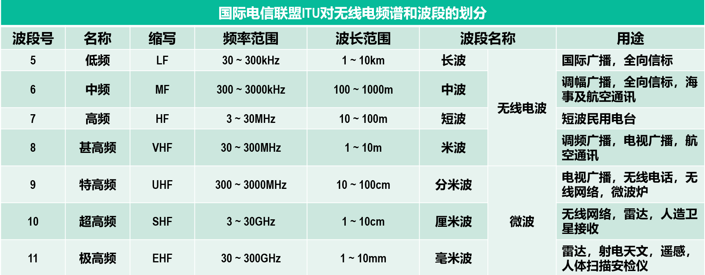
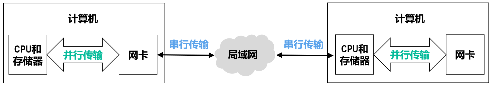

# 物理层

!!! note "物理层接口特性"
    - 机械特性：规定连接器的形状、尺寸和引脚排列等
    - 电气特性：规定信号的电压、电流、频率、距离限制等
    - 功能特性：规定接口电缆的各条信号线的作用
    - 规程特性：规定在信号线上传输比特流的一组操作过程，包括各信号间的时序关系

## 传输媒体

也称传输媒介，是网络设备间的物理通路，处于物理层之下，不包含在 CN Arch 中

- 导向型传输媒体（固体媒体）
    - 同轴电缆
        - 基带、宽带
    - 双绞线
        - 绞合：减少相邻导线间的电磁干扰 & 抵御部分来自外界的电磁干扰
    - 光纤
        - 使用发光二极管或半导体激光器将电脉冲转为光脉冲，通过光纤到达接收端后，通过光电二极管或激光检波器输出电脉冲
        - 多模光纤（全反射 all along）（发光二极管 to 光电二极管）、单模光纤（直线传播）（半导体激光器 to 激光检波器）
        - pros：通信容量非常大，抗电磁干扰能力强，传输损耗小，中继距离长，体积小重量轻
        - cons：切割光纤需要较贵的专用设备；光纤接口较昂贵
- 非导向型传输媒体（无线媒体）
    - 
    - 无线电波（长、中、短、米波）
        - 低频中频近地传输，高频甚高频通过大气离子层反射远距离传输
    - 微波（分米、厘米、毫米波）
        - 地面微波接力通信
        - 同步卫星、人造卫星
    - 红外线
        - 各种遥控器
        - 频率更高，必须要直线传播，传输距离短，速度较低
    - 激光
    - 可见光

## 传输方式

- 串行/并行传输
    - 前者：只有一条链路传输一道比特流
    - 后者：有多条链路同时传输多道比特流
    - 
- 同步/异步传输
    - 前者：
        - 外同步：在收发双方之间增加一条时钟信号线。
        - 内同步：发送端将时钟信号编码到发送数据中一起发送（例如曼彻斯特编码）。
    - 后者：
        - 按字节进行传输，字节间异步（时间间隔不固定）
        - 字节中的每个比特仍然要同步，即各比特的持续时间是相同的。
- 单向通信（单工通信，Simplex Communication）、双向交替通信（半双工通信，Half-Duplex Communication）和双向同时通信（全双工通信，Full-Duplex Communication）
    - 字面意思，即发送端和接收端不能/可以但不能同时/可以且可以同时通信
    - 分别应用于无线电广播、对讲机、电话

## 编码与调制

网络中所见的各种文字图片视频等称为消息（Message），消息需要转化为二进制数据（Data），接着为了在链路中传播，又要将其转化为电信号（Signal），即数字的电磁表现。计算机发出的信号称作数字基带信号，需要通过**调制**（基带调制（也称编码）（数字信道）、带通调制（模拟信道））迁移到适合传输的频段。

代表不同离散数值（0/1）的基本波形称为码元。

- 编码方式
    - 双极性不归零编码（编码效率高，但存在同步问题）
        - 正电平表示1，负电平表示0
        - 接收方怎么判断相邻的许多同电平码元究竟有多少个？给接收方发送数据的同时，还通过时钟信号线给接收方发送时钟信号。按照接收到的时钟信号的节拍，对数据信号线上的信号进行采样。
    - 双极性归零编码（自同步，但编码效率低）
        - 在每个码元的中间时刻信号都会回归到零电平。接收方只要在信号归零后采样即可。
    - 曼彻斯特编码（自同步，传统以太网）
        - 码元内部上升沿（正跳变）表示0，下降沿（负跳变）表示1
    - 差分曼彻斯特编码
        - 码元中间时刻的电平跳变仅表示时钟信号，而不表示数据。
        - **每一个码元开始处**无跳变表示1，有跳变表示0。
        
- 带通调制方法
    - 
- 混合调制方法
    - 相位和振幅结合起来一起调制，每个码元可看作一个二维平面的点
    - 正交振幅调制QAM-16
        - 类似极坐标，r=振幅，θ=相位
        - 12种相位
        - 共16种码元，每种码元表示 $\log_2{16} = 4$ 个比特
        - 每个码元与4个比特的对应关系采用格雷码，即任意两个相邻码元只有1个比特不同：这样就算发生了误码，最多也只有1个比特错误
        
## 信道的极限容量

信道会由于码元的传输速率、信号的传输距离、传输媒体质量、噪声干扰导致信号失真；信道上传输的数字信号，可以看做是多个频率的模拟信号进行多次叠加后形成的方波。

如果数字信号中的高频分量在传输时受到衰减甚至不能通过信道，则接收端接收到的波形前沿和后沿就变得不那么陡峭，每一个码元所占的时间界限也不再明确。这样，在接收端接收到的信号波形就失去了码元之间的清晰界限，这种现象称为**码间串扰**。如果信道的频带越宽，则能够通过的信号的高频分量就越多，那么码元的传输速率就可以更高，而不会导致码间串扰。然而，信道的频率带宽是有上限的，不可能无限大。因此，码元的传输速率也有上限。

!!! definition "奈氏准则"
    理想低通信道的最高码元传输速率 = 2W Baud = 2W 码元/秒（W 为信道的频率带宽）

    Baud 即码元/秒，1码元携带 n 比特信息时，数据传输速率（比特率） = n × 码元传输速率 = n × Baud (bps)

    ??? example "例"
        - 在无噪声情况下，若某通信链路的带宽为3kHz，采用4个相位，每个相位具有4种振幅的QAM调制技术，则该通信链路的最大数据传输速率是多少？
        - 采用4个相位，每个相位4种振幅的QAM调制技术，可以调制出 4 × 4 = 16个不同的基本波形（码元） 。采用二进制对这16个不同的码元进行编码，需要使用4个比特（$\log_2(16)=4$）。（即每个码元携带4比特信息）
        - 该通信链路的最大数据传输速率 = 6k（码元/秒）× 4（比特/码元）= 24k（比特/秒）= 24kbps

!!! definition "香农公式"
    带宽受限且有高斯白噪声干扰的信道的极限信息传输速率 $C = W \log_2(1 + \frac{S}{N}) (bps)$

    - S：信道内所传信号的平均功率
    - N：信道内的高斯噪声功率
    - S/N：由信噪比（SNR）计算出的一个比值
    - SNR = $10 \log_{10}(\frac{S}{N})$ dB

## 信道复用

Multiplexing:在一条传输媒体上同时传输多路用户的信号

- 频分复用（FDM）
    - 将信道的频带划分为若干个互不重叠的子信道，每个子信道传输一路用户信号
    - 每个子信道之间要有隔离频带，防止相邻子信道间的串扰
- 时分复用（TDM）
    - 将信道的时间划分为若干个时隙，每个时隙传输一路用户信号
    - 各用户时隙周期性出现周期为TDM帧的长度
    - 时分复用的所有用户在不同的时间占用同样的频带
- 波分复用（WDM）
    - 根据频分复用的设计思想，可在一根光纤上同时传输多个频率（波长）相近的光载波信号
    - 
- 码分复用（CDM）
    - 每个用户可以在相同的时间用相同的频带进行通信
    - 将每个比特时间划分为m个更短的时间片，称为码片（Chip）。
    - CDMA中的每个站点都被指派一个唯一的m比特码片序列（Chip Sequence）。
    - 某个站要发送比特1，则发送它自己的m比特码片序列
    - 某个站要发送比特0，则发送它自己的m比特码片序列的反码
    - 码片向量：0记为-1，1记为+1，原始message进行记录
    - 每个站分配的码片序列必须各不相同且码片向量正交
    - 例：
    - 又一例：