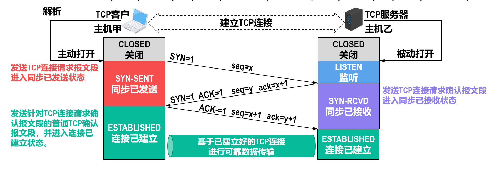

# 运输层

主要任务：为运行在不同主机上的**应用进程**提供直接的逻辑通信服务

TCP/IP体系结构的运输层使用端口号来标识和区分应用层的不同应用进程。端口号的长度为16比特，取值范围是0~65535。

## TCP vs. UDP

TCP: Transmission Control Protocol（传输控制协议），仅支持单播；UDP: User Datagram Protocol（用户数据报协议），支持单播、多播和广播。

|                | TCP                          | UDP                         |
| ------------------ | ---------------------------- | --------------------------- |
| 面向对象            | 字节流                  | 应用报文               |
| 传输可靠性 | 面向连接的可靠传输                    | 无连接不可靠传输                   |

## TCP 报文首部

- 源端口、目的端口
- 序号：32比特，是数据载荷中第一个字节的序号
- 确认号：32比特，是期望收到的下一个报文的数据载荷的第一个字节的序号
    - 只有 ACK 标志位置 1 时，确认号字段才有效
- 数据偏移：标明首部长度
- 窗口：发送报文者接收窗口大小
- SYN 标志位：用于建立连接，SYN=1 且 ACK=0 为连接请求报文；SYN=1 且 ACK=1 为连接确认报文
    - SYN 为 1，不能携带数据，但要消耗掉一个序号。
- FIN 标志位：用于释放连接，FIN=1 表示发送方已经没有数据发送了，请求释放连接
    - FIN 为 1，即使不携带数据，也要消耗掉一个序号
- RST 标志位：复位连接，RST=1 表示连接出现差错，请求释放连接后重连；也可以拒绝连接请求
- PSH 标志位：提示接收方应用进程立即将数据向上交付
- URG 标志位：1 表示报文紧急指针字段有效
    - 指明紧急数据的长度
    - 紧急数据：可以插队到数据载荷最前面，立即包装到报文中发送

## TCP 三报文握手

采用“三报文握手”而不是“两报文握手”来建立TCP连接，是为了防止已失效的TCP连接请求报文段突然又传送到了TCP服务器进程，因而导致错误。

## TCP 四报文挥手

- 处于时间等待（TIME-WAIT）状态后要经过2MSL时长，可以确保TCP服务器进程能够收到最后一个TCP确认报文段而进入关闭（CLOSED）状态。
- 在发送完最后一个TCP确认报文段后，再经过2MSL时长，就可以使本次连接持续时间内所产生的的所有报文段都从网络中消失。这样就可以使下一个新的TCP连接中不会出现旧连接中的报文段。

## TCP 流量控制

防止造成接收方的接收缓存溢出

为了打破由于非零窗口通知报文段丢失而引起的双方互相等待的死锁局面，TCP为每一个连接都设有一个持续计时器。当持续计时器超时时，就发送一个零窗口探测报文段，仅携带1字节的数据，请求返回接收方的零窗口大小。

## TCP 拥塞控制

拥塞：对网络中某一资源的需求超过了该资源所能提供的可用部分

流量控制是接收方对发送方发送速率的控制，而拥塞控制是发送方根据算法自行调整发送速率。

TCP 采用隐式反馈算法：源点自身通过对网络行为的观察（例如超时重传或往返时间RTT）来推断网络是否发生了拥塞

- slow start & congestion avoidance：
    - 发送窗口 swnd，拥塞窗口 cwnd，慢开始门限 ssthresh
    - cwnd < ssthresh 时，使用 slow start
    - cwnd > ssthresh 时，转为使用拥塞避免
    - cwnd = ssthresh 时，都可以
    - 在 slow start 阶段，每次收到一个确认报文段，cwnd 增加刚刚发送的报文段个数（1，2，4，8，...指数增长）
    - 达到 ssthresh 后，转为拥塞避免阶段（cwnd 每次加1）
    - 重传计时器超时时，将 cwnd 设为 1，ssthresh 设为原先的 cwnd/2，然后重新进入 slow start 阶段
    - 
- fast retransmit & fast recovery：
    - 快速重传：让发送方尽早知道发生了个别TCP报文段的丢失，一旦收到3个连续的重复确认，就将相应的报文段立即重传
    - 快恢复：发送方一旦收到3个重复确认，就知道现在只是丢失了个别的报文段，于是不启动慢开始算法，而是执行快恢复算法。
        - 发送方将慢开始门限ssthresh的值和拥塞窗口cwnd的值都调整为当前cwnd值的一半，并开始执行拥塞避免算法

swnd = min(rwnd, cwnd)

## TCP 可靠传输

下列推算只考虑 swnd 和 rwnd

发送方向接收方发送 TCP 数据报文段，接收方发回 TCP 确认报文段，包含 ack（期望收到的下一个字节序号）（同时表明序号到 ack-1 的数据都已经收到）和 rwnd（接收窗口大小）

!!! tip "ack 的含义"
    - 在选择重传协议中， ackn表明序号到n为止的数据已正确接收，现在期望收到序号为n+1的数据。
    - 在TCP协议中， ackn表明序号到n-1为止的数据已正确接收，现在期望收到序号为n的数据。

发送方在没有收到接收方确认的情况下，可以把序号落入发送窗口内的数据依次全部发送出去。发送窗口前沿移动有三种情况：

- 前移（通常情况）
- 保持不动
    - 情况1：没有收到新的确认，接收方通知的窗口大小也没有改变。
    - 情况2：收到了新的确认，但接收方通知的窗口缩小了，使发送窗口的前沿正好不动。
- 向后收缩
    - 接收方通知的窗口变小了

!!! definition "用指针来表示窗口"
    可以用P1、P2和P3三个指针来指向相应的字节序号，描述发送窗口的相关信息

    - P1指向发送窗口内已发送但还未收到确认的第一个数据的序号。
        - 小于P1的就是已发送并已收到确认的部分
    - P2指向发送窗口内还未发送的第一个数据的序号。
        - P2 - P1 = 已发送但还未收到确认的字节数量
    - P3指向发送窗口前沿外的第一个数据的序号
        - 大于等于P3的就是不允许发送的部分
        - P3 - P1 = swnd
        - P3 - P2 = 允许发送但当前还未发送的字节数量（又称为可用窗口或有效窗口）

    

## TCP 超时重传

我们知道超时重传时间 RTO 应该略大于往返时间 RTT，但是在 TCP 报文传输中，可能经过多个网络，也可能只经过一个网络，且这些网络的速度还各不相同，因此每个报文的 RTT 也会不同；因此要利用采集到的 RTT 计算加权平均往返时间 RTTs：

$$
RTT_{S1} = RTT_{1} \\
RTT_{Si} = (1 - \alpha) * RTT_{S(i-1)} + \alpha * RTT_{i}(新的 RTT 样本) \quad (i > 1)
$$

## TCP 选择确认