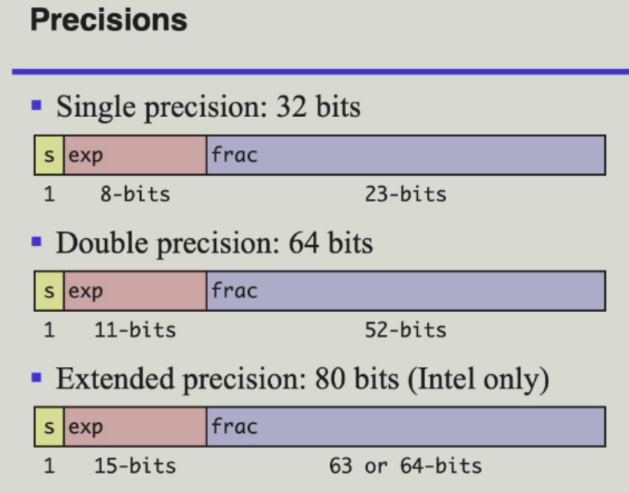
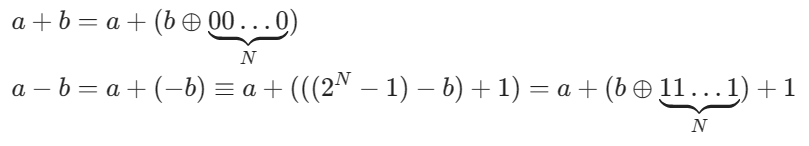

# 计算机系统Ⅰ

> 任课教师：常瑞、吴磊、冯博
!!! abstract "成绩组成"
	- 作业 10%
	- Projects 共60%  
		- Lab0 - 实验准备 6%  
		- Lab1 - 多路选择器+七段数码管 10%  
		- Lab2 - 加减法器 6%  
		- Lab3 - 时序电路 8%  
		- Lab4 - 卷积核 8%  
		- Lab5 - 汇编实现 10%  
		- 大程 - Single Cycle CPU 12%  
		- Bonus - TBD 10%  
	- Final 30%

!!! note "课程主页"
	https://zju-sys.pages.zjusct.io/sys1/sys1-sp24/

## 超级有用
[从0开始的Verilog体验](https://hdlbits.01xz.net/wiki/Main_Page)

## 理论课部分
Von Neumann架构：I/O System $\leftrightarrows$ CPU $\leftrightarrows$ Memory  
   

Instructions: 0/1 binaries  
编译型高级语言 $\underrightarrow{\text{Compiler}}$ 汇编语言 $\underrightarrow{\text{Assembler}}$ 机器语言  
解释型高级语言 $\underrightarrow{\text{Interpreter}}$ 机器语言  

### 进制转换
例：$1011.101_2 = 2^3 + 2^1 + 2^0 + 2^{-1} + 2^{-3} = 11.6875_{10}$

### 数据的表示
用n个bit的的二进制数编码一个真值（true value）为X的数字，编码后得到机器数（machine number）  
$X = X_{n-1}X_{n-2}\dots X_1X_0$  
无符号整数(unsigned integer)范围: $0 \le X \le 2^n - 1$    
有符号整数(signed integer)范围: 编码方式不同，有不同的范围  

- 原码(original code)：最高位为符号位，0为正，1为负  
    - 缺点：0有两种表示，+0和-0，导致可表示的范围减小1
    - Hardware Complexity
    - 二进制加法失效
- 反码(one's complement)：正数的反码与原码相同，负数的反码是对应正数的原码的每一位取反
    - 优点：二进制加法后，将进位加到最后一位上即可得到正确结果
    - 缺点：0还是有两种表示，+0和-0
- 补码(two's complement)：正数的补码与原码相同，负数的补码是对应正数的原码的每一位取反，然后加1
    - 优点：0只有一种表示
    - 缺点：最小的负数没有对应的正数
    - 二进制加法后，将溢出位丢弃即可得到正确结果
    - 已知A(用补码表示)，那么-A的补码就是A按位取反（**包括符号位**）然后加1
    - 补码的减法就是把减数取反加1，然后加到被减数上
    - 补码的范围：$-2^{n-1} \le X \le 2^{n-1} - 1$, n为位数

[补码计算详解](https://blog.csdn.net/ZHurric/article/details/115108811)

!!! note "Modulo Operation"
	If $A,B,M$ satisfy $A = B + K \times M$, then $A \equiv B \pmod M$

???+ "浮点数的表示（IEEE 754 Standard）"
	
	s为符号位，exp为指数位，frac为尾数位。见<https://zhuanlan.zhihu.com/p/107106675>  
	$V = (-1)^s \times M \times 2^{E - bias}$  
	其中 $E$ 为指数位对应的十进制数，$M$ 为$1.尾数$  
	对任意浮点数，$E-bias$是固定值，因此根据一种位数下的表示与所给的偏移量可计算出另一位数表示下其指数位的值。（很绕，见作业）

### 布尔代数
- 与：$A \cdot B$
- 或：$A + B$
- 非：$\overline{A}$
    - 优先级：非 > 与 > 或

#### K-map
$n$个变量对应的K-map是一个$2^n$个元素的表格，每个元素对应一个变量组合。  
尽可能画一个大的框，框中元素个数为$2^n(n\ge 1)$

??? 例
	

!!! note "作业"
	[纸质作业可供复习](cs1hw1.pdf)(疑似有错)

## 实验部分

> 多看课程网站吧，这课神必的不行。

### lab0
```verilog
module main( 
	I0,
	I1,
	I2,
	O );

   input I0;
   input I1;
   input I2;
   output O;
   ....
endmodule
```

这一段代码表示一个叫做`main`的电路`module`(模块)，先声明I1、I2、I3、O这几个**引脚序列**.之后用input/output说明各个引脚是输入还是输出。  
`wire wire0`定义一条名为wire0的线路。  
wire的电气特性：必须被有且仅有一个assign输入，可以有0个或者多个assign输出。  

运算符：`&`表示与，`|`表示或，`^`表示异或，`~`表示非。

`assign`语句用于给wire赋值。如`assign wire0 = I0 & I1;`表示wire0的值为I0和I1的与，`assign O = ~wire0;`表示O的值为wire0的非。

### lab1
#### 二选一多路选择器
$O = S \cdot I_0 + \overline{S} \cdot I_1$  
其中，$S$为选择信号，$I_0$和$I_1$为输入信号，$O$为输出信号。  
点乘号表示逻辑与，加号表示逻辑或，横线表示逻辑非。  

使用代码实现：  
```verilog
module mux2to1(
	input I0,
	input I1,
	input S,
	output O
	);
	assign O = S & I0 | ~S & I1;
endmodule
```

#### 四选一多路选择器
$O = \overline{S_1} \cdot \overline{S_0} \cdot I_0 + S_0 \cdot \overline{S_1} \cdot I_1 + \overline{S_0} \cdot S_1 \cdot I_2 + S_1 \cdot S_0 \cdot I_3$  

实现：使用三个二选一多路选择器实现。（封装两个二选一多路选择器模块）  
$Mux(I0, I1, S) = S \cdot I_1 + \overline{S} \cdot I_0$  
$O = Mux(Mux(I_0, I_1, S_0), Mux(I_2, I_3, S_0), S_1)$  

```verilog
module mux4to1(
	input I0,
	input I1,
	input I2,
	input I3,
	input S0,
	input S1,
	output O
	);
	wire w1, w2;
	mux2to1 Mux1(I0, I1, S0, w1);
	mux2to1 Mux2(I2, I3, S0, w2);
	mux2to1 Mux3(w1, w2, S1, O);
endmodule
```

### lab2 - 加减法器
#### 全加减器
N位二进制的加减法是$\mod 2^N$下的加减法。  
   

??? a的解释
	

### lab3 - 时序电路
史