> No...

# 计算机系统 Ⅱ

!!! note "Links"
    https://note.tonycrane.cc/cs/pl/riscv/privileged/

## RISC-V Assembly
（其实是系统一的东西）32位指令

- Opcode: 操作码，用于识别指令类型
- rs1: the first register source operand
- rs2: the second register source operand
- rd: the register destination operand
- funct3/7: （从Opcode的指令类型中）确定特定的指令
- imm: immediate value or address

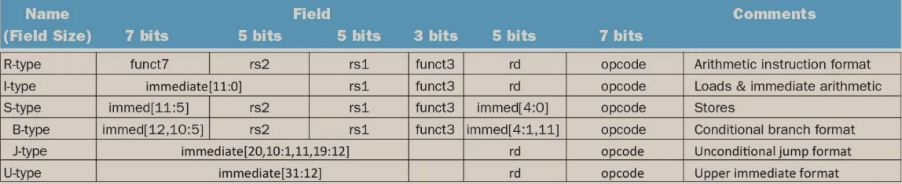

寄存器与内存：


一些例子：

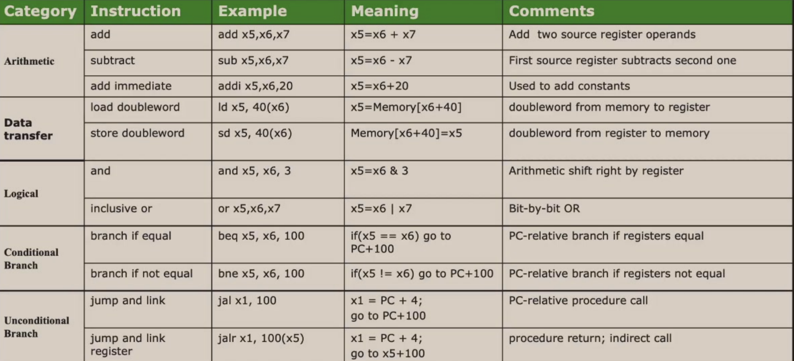

## Pipelining

通过Overlapping的方式，将多个指令的多个阶段同时进行，以提高CPU的效率。

定义吞吐量（Throughput/TP）：单位时间内完成的指令数。  
$TP = \frac{n}{T} \lt TP_{max}$且$T = (m+n-1) \times \Delta t_0$，其中$m$为流水线级数，$n$为指令数，$\Delta t_0$为流水线时钟周期。

$TP_{max} = \lim_{n\to\infty} \frac{n}{T} = \frac{1}{\Delta t_0}$

### Solve Bottleneck
1. Subdivide the task
2. Repetition

定义加速比（Speedup/SP）：$S = \frac{Exetime_{non-pipe}}{Exetime_{pipe}} = \frac{nm\Delta t_0}{(m+n-1)\Delta t_0} = \frac{n}{n+m-1}$

效率$E = \frac{SP}{m} = TP \cdot \Delta t_0$

### 非线性流水线

[看这篇文章](https://blog.csdn.net/rizero/article/details/106740895)

## Operating System
### ELF

C程序编译为可执行文件的四个过程：

- 预处理 —— 宏展开
- 编译 —— 源代码转为汇编
- 汇编 —— 汇编转为机器码
- 链接 —— 将多个目标文件链接为一个可执行文件，链接库

最终的可执行文件包含一个 crt(C runtime)，这个 crt 内会调用 main 函数。

ELF - Executable and Linkable Format 二进制文件内包含如下段（Section）：

- .text: 代码段
- .rodata: read only 数据段
- .data: 数据段
- .bss: 未初始化数据段

!!! note "Quiz"
    ```c
    // 如下均定义/声明在全局作用域
    int a = 1; // 存储在.data段
    int b; // 存储在.bss段
    const int c = 2; // 存储在.rodata段
    ```

- Static linking
    - All needed code is packed in single binary, leading to large binary
    - `_start` is executed after evecve system call
    - 
- Dynamic linking
    - Reuse libraries to reduce ELF file size
    - Howto resolve library calls?
        - It is the loader who resolves lib calls.
    - Entry point 是 loader

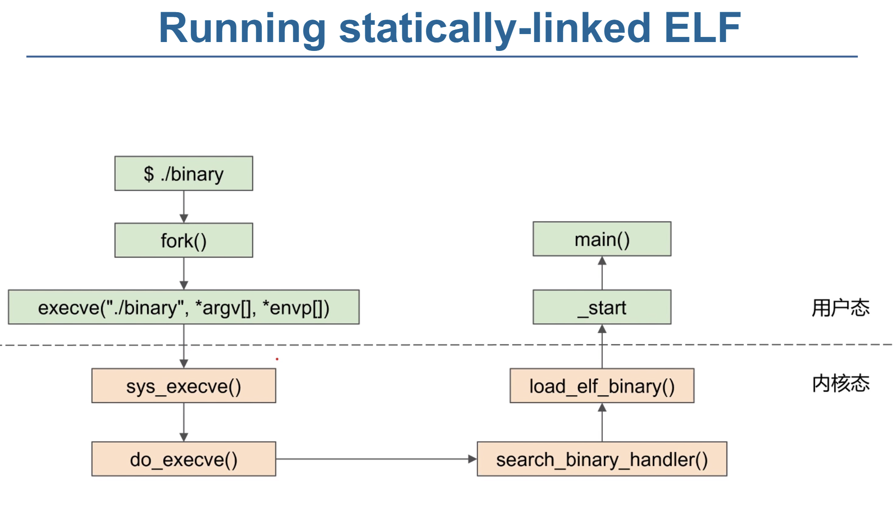

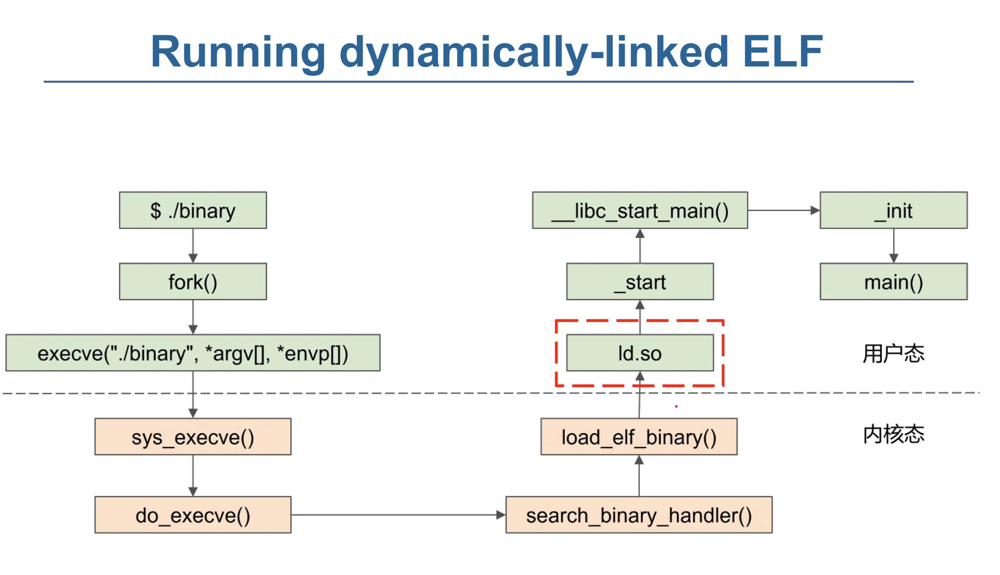

`_libc_start_main`: Setup environment and stack, then call main

#### Memory Layout 内存布局

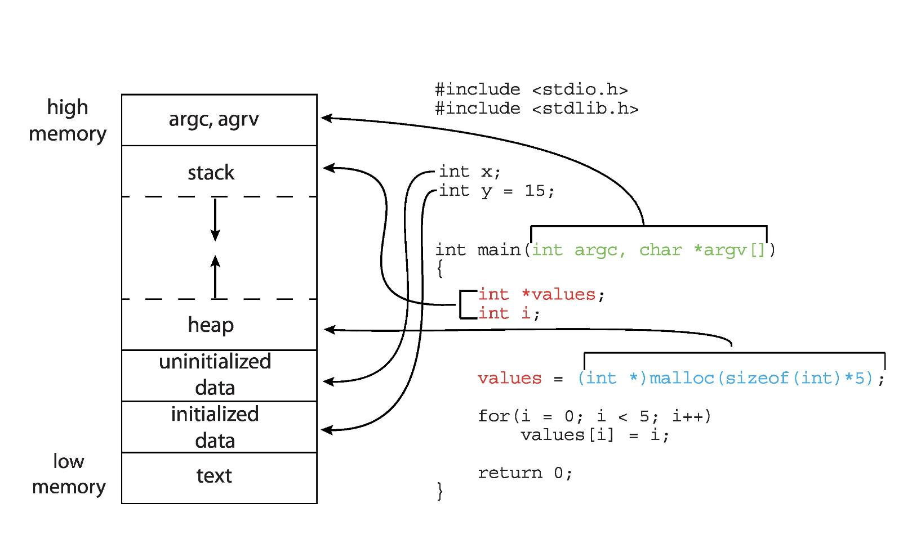

在二进制文件运行时的内存布局。

注意 stack 从高地址向低地址增长，heap 从低地址向高地址增长。


存储在Memory中的数据，基本单元是Byte，每个数据都被一个地址标记。

> DMA(Direct Memory Access)：设备直接访问内存，不经过CPU。

### OS Structure
操作系统是一种“Resource Allocator and Abstracter”，它管理硬件资源，提供抽象接口。

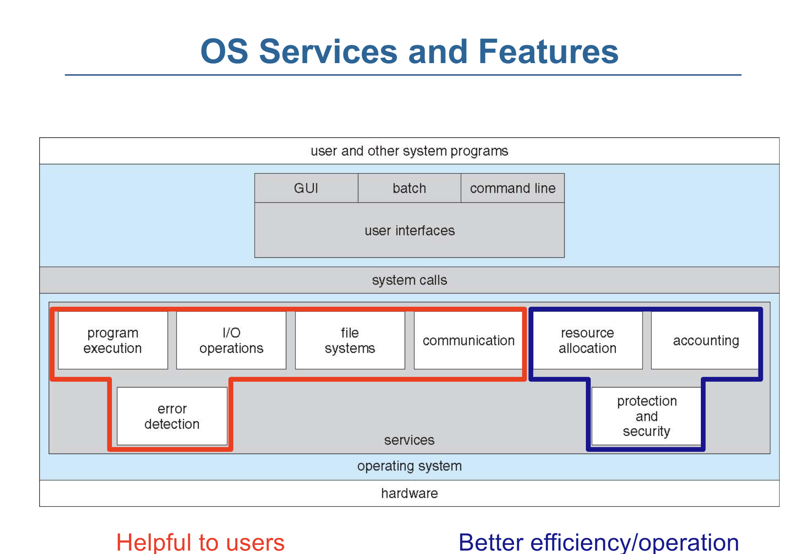

UI: CLI -> GUI -> Touchscreen...


- 简单结构 Simple Structure
    - MS-DOS
    - 不区分用户和内核态
    - 用户程序、操作系统程序、驱动程序都运行在同一个地址空间，可以互相操作
- 整体结构 Monolithic Structure
    - Unix
    - 有区分用户和内核态
    - 操作系统程序运行在内核态，用户程序运行在用户态
    - 用户程序通过系统调用访问内核态
    - 内核态程序给用户态程序接口来提供服务
- 微内核结构 Microkernel Structure
    - Mach, Minix...
    - 防止内核态程序过于复杂，漏洞概率更大
    - 尽可能多地将内核代码移动到用户态中
    - 内核只提供最基本的服务，其他服务通过进程间通信实现：更稳定
    - 将操作系统的功能分为多个独立的进程
    - 可移植性更好
- 模块化结构 Modular Structure
    - Linux (Modular + Monolithic)
    - 将内核分为多个模块（loadable kernel module），每个模块负责一个特定的功能
    - 模块可以动态加载和卸载
    - 保持了微内核结构的优点，同时减少了进程间通信的开销
- 外核结构 Exokernel Structure
    - 外内核则进行更少的抽象，来让用户程序可以有更多控制物理资源的可能
    - 内核只进行物理资源的分配和保护，而资源的使用、管理都由用户程序自己决定
    - 用户程序可以直接访问硬件资源，自己实现操作系统的功能
- 层级结构 Layered Structure
    - 为了提高模块化结构的性能，将模块分为多个层次
    - 最底层权限最高，为硬件
    - 每个层次只能调用比自己低的层次，不能调用比自己高的层次
    - 例如，文件系统、网络协议栈等
- 混合结构 Hybrid Structure
    - 结合了多种结构的优点
    - 例如，Windows NT, Apple Mac OS X

### Event
Event 分为 Interrupt - 由硬件引起，Exception - 由软件引起。

一些指令会被限制：只有OS能够执行它们（Privileged Instructions），CPU是如何判断当前状态能否执行这些指令的？

- All modern processors support (at least) two modes of execution:
    - User mode: In this mode protected instructions cannot be executed
    - Kernel mode: In this mode all instructions can be executed
    - User code executes in user mode
    - OS code executes in kernel mode
    - The mode is indicated by a status bit in a protected control register
        - The CPU checks this bit before executing a protected instruction

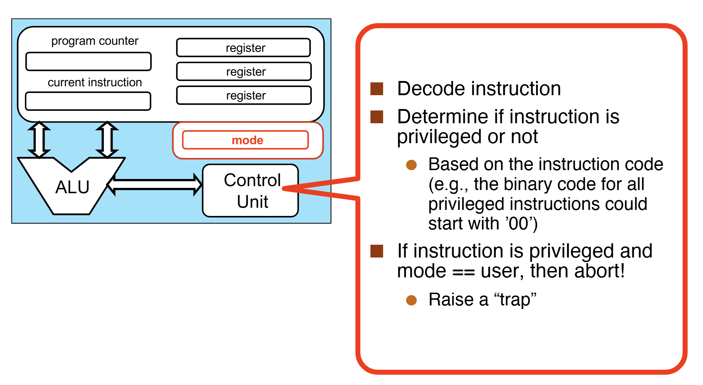

Event是操作流中“不被预期”的情况，CPU会根据Event的类型，调用相应的Handler。

- An event stops execution, changes mode, and changes context 
- The kernel defines a handlerfor each event type

OS Code running: Boot -> Wait for Event -> Event Handler -> Return to Wait

特殊的 Event：

- System Call - 会导致Trap -> System Call Handler
    - 发生于User Mode下需要执行Privileged Instructions的情况
        - e.g., to create a process, write to disk, read from the network card
        - 每种ISA都有自己的System Call
        - 
        - 为什么`printf`需要SysCall `libc_write`？
            - 打印到终端这种Device I/O需要 Kernel Mode (Privileged Instructions)
- Timer Interrupt - 会导致Regularly Interrupt -> Timer Interrupt Handler


### System Call

每个Syscall有自己的Syscall Number，通过这个Number来调用Syscall，这个Number就是 Syscall Table 的索引，OS对具体的Syscall不感兴趣，只根据Number跳到Kernel中对应的Handler。

`strace`可以查看程序的System Call。

https://www.cnblogs.com/machangwei-8/p/10388883.html

SysCall的类型：

- Process control
    - create process, terminate process
    - end, abort
    - load, execute
    - get process attributes, set process attributes
    - wait for time
    - wait event, signal event
    - allocate and free memory
    - Dump memory if error
    - Debuggerfor determining bugs, single step execution
    - Locks for managing access to shared data between processes
- File management
    - create file, delete fileopen, close fileread, write, reposition
    - get and set file attributes
- Device management
    - request device, release device
    - read, write, repositionget device attributes, set device attributes
    - logically attach or detach devices
- Information maintenance
    - get time or date, set time or date
    - get system data, set system data
    - get and set process, file, or device attributes
- Communications
    - create, delete communication connection
    - send, receive messages if message passing model to host nameor process name
        - From client to server
    - Shared-memory model create and gain access to memory regions
    - transfer status information
    - attach and detach remote devices
- Protection
    - Control access to resources
    - Get and set permissions
    - Allow and deny user access

### System Service

## Process

进程是一个正在执行的程序的实例，例如说一个ELF加载到内存中，开始执行。

> a unit of resource allocation and protection

对于同一个Program的不同Process，它们的

- .text段是相同的（Size & Content）
- .data段的Size是相同的，但Content可能不同
- Stack和Heap两者都不同

### Process Control Block
也称为Task Control Block，是操作系统用来管理进程的数据结构，存储每个进程的信息。

- 每个进程有且仅有一个PCB。
    - 在新进程创建时，OS会为其分配一个PCB
    - 在进程终止时，OS会回收PCB
- 存储这些 Process 的 META data：
    - Process State - Running, waiting, ready, etc.
    - Program Counter - Address of next instruction
    - CPU Registers - Contents of all process-centric registers
    - Blah blah blah...
    - 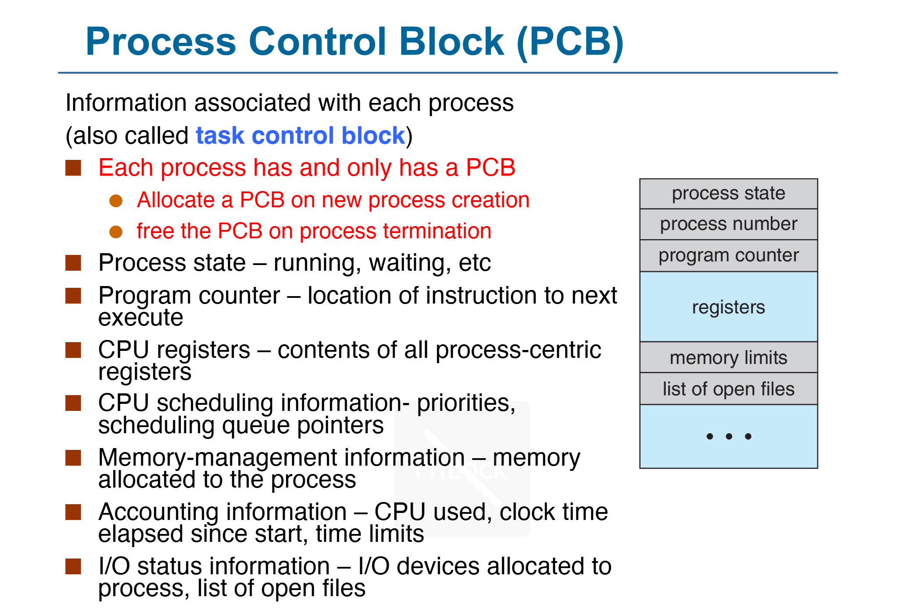

On Linux: PCB is `task_struct`

### Process State
As a process executes, it changes state. The state of a process is defined in part by the current activity of that process.

- New: The process is being created.
- Running: Instructions are being executed.
- Waiting: The process is waiting for some event to occur.
- Ready: The process is waiting to be assigned to a processor.
- Terminated: The process has finished execution.
- 

### Process Creation
一个进程可能会产生多个进程，于是形成一个进程树，ppid是某节点父进程的pid。

`fork()`是一个SysCall，用于创建一个新的进程，新进程是调用进程的副本（各状态初始完全一致地复制过去），但是有不同的pid，Resource Utilization初始化为0。

- 返回给父进程的是新进程的pid
- 返回给子进程的是0

???+ info "Quiz"
    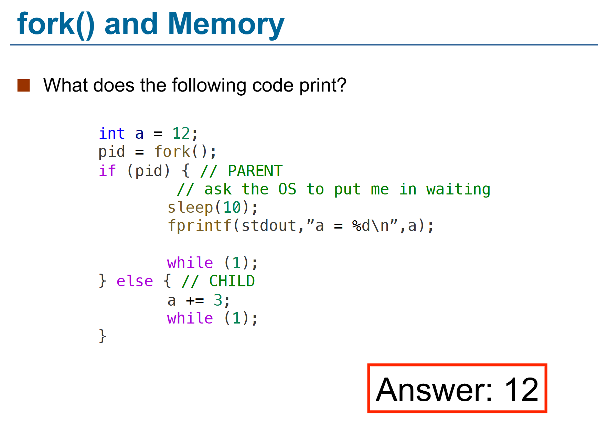  
    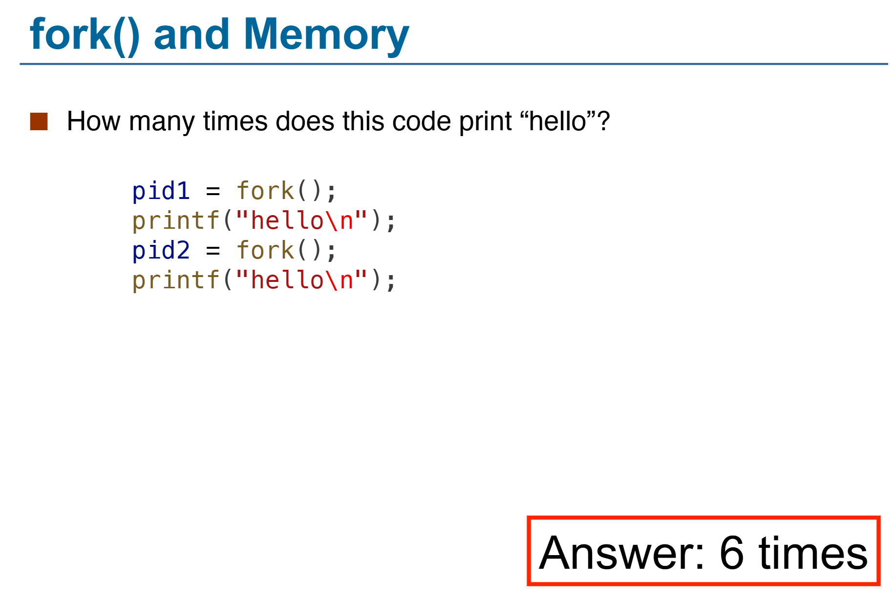  
    下面这张图里，每次`fork()`会给当前每个进程都创建一个子进程，所以第一次`fork()`后有两个进程，第二次`fork()`后有四个进程。  
    ```c
    int main(int argc, char* arg[]){
        fork();
        if(fork())
        {
            fork();
        }
        fork();
    }
    ```
    这段代码会产生多少个进程？ ——12个

    - (1) 第一行`fork()`后，有两个进程（Original进程和它fork出来的子进程）
    - (2) 第二行在if后括号中的`fork()`后，有四个进程
    - (3) 并且对 (1) 中两个进程，返回1，对 (2) 中新出现的两个进程，返回0
    - 因此 (1) 中两个进程进入if(){}, (2) 中两个进程**不进入**if(){}
    - 在条件语句中的`fork()`后，新出现两个进程，目前共6个进程
    - 最后的`fork()`所有进程都会执行，所以最后有12个进程

#### exec*()

`execve()`是一个SysCall，v stands for `argv`（命令行参数），e stands for `envp`（环境变量）。


- 其余的`exec*()`函数类似，但不是SysCall
- `exec*()` replaces the current process image with a new process image
- 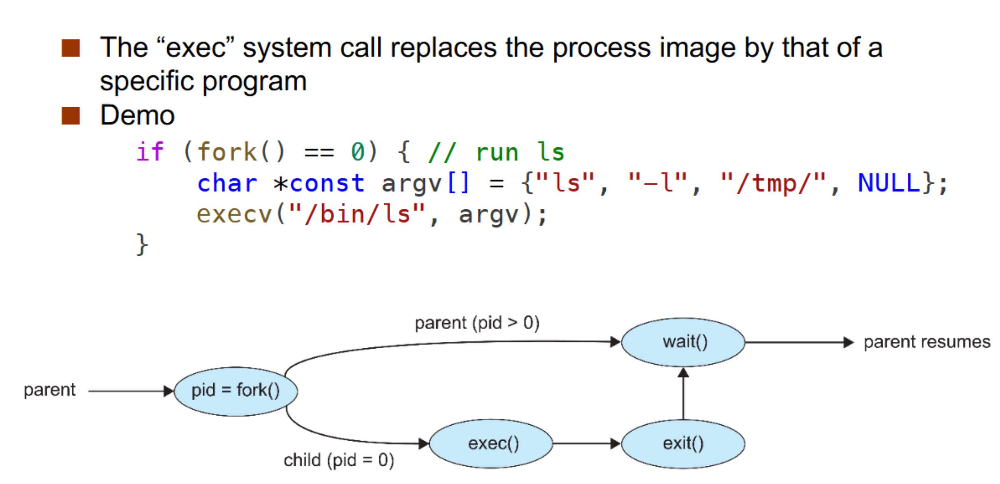
- `exec*`后，若执行成功，原进程的ELF会被替换，原进程**直接终止**，也没有返回值；若没有执行成功，则返回报错信息，原进程**继续执行**。

### Process Termination
#### wait()

#### exit()
一个进程通过`exit()`的SysCall来终止自己，接收一个参数（exit/return code）

- 进程终止后，进程占用的资源会被回收

### Signals

进程可以通过信号来通知其他进程，也可以接收信号，例如说Ctrl+C实则是发送了一个SIGINT信号。

- 异步事件，程序必须处理
- SIGKILL和SIGSTOP不能被捕获或忽略（for security reasons）
    - 总能Kill进程）

!!! note "demo: kill a infinite loop with SIGINT forbidden"
    ```c
    #include<signal.h>
    #include<stdio.h>
    void handler(int sig){
        fprintf(stdout,”I don’t want to die!\n”);
        return;
    }
    main(){
        signal(SIGINT, handler);
        while(1);// infinite loop
    }
    ```

### Zombie Process

子进程死亡后，它的父进程会接收到通知去执行一些清理操作，如释放内存之类。然而，若父进程并未察觉到子进程死亡，子进程就会进入到“ 僵尸(zombie)”状态。从父进程角度看，子进程仍然存在，即使子进程实际上已经死亡。

Zombie 会占用其 PCB，不会占用CPU，但会占用内存。

A zombie lingers on until: 

- its parent has called wait() for the child, or
- its parent dies


### Orphan Process

父进程运行结束，但子进程还在运行（未运行结束）的子进程就称为孤儿进程（Orphan Process）。孤儿进程最终会被 init 进程（pid 为 1）所收养，并由 init 进程对它们完成状态收集工作。

孤儿进程是没有父进程的进程，为避免孤儿进程退出时无法释放所占用的资源而变为僵尸进程，进程号为 1 的 init 进程将会接受这些孤儿进程，这一过程也被称为“收养”。init 进程就好像是一个孤儿院，专门负责处理孤儿进程的善后工作。每当出现一个孤儿进程的时候，内核就把孤儿进程的父进程设置为 init ，而 init 进程会循环地 wait() 它的已经退出的子进程。这样，当一个孤儿进程凄凉地结束了其生命周期的时候，init 进程就会出面处理它的一切善后工作。因此孤儿进程并不会有什么危害。

> When a child exits, a SIGCHLD signal is sent to the parent.
> init process handles child termination with a handler for SIGCHLD that calls wait().

### Process Scheduling
为了使CPU迅速地切换到下一个进程，**Process scheduler** 在 Ready 的进程中选择下一个在 Core 上运行的进程。

维护两个 Scheduling Queue：

- Ready queue 
    - set of all processes residing in main memory, ready and waiting to execute 
- Wait queues 
    - set of processes waiting for an event (i.e. I/O)
- 进程在不同的 Queue 中频繁 Transfer，因此需要用 List 实现。

```C
struct list_head{
    struct list_head *next,*prev;
};
```

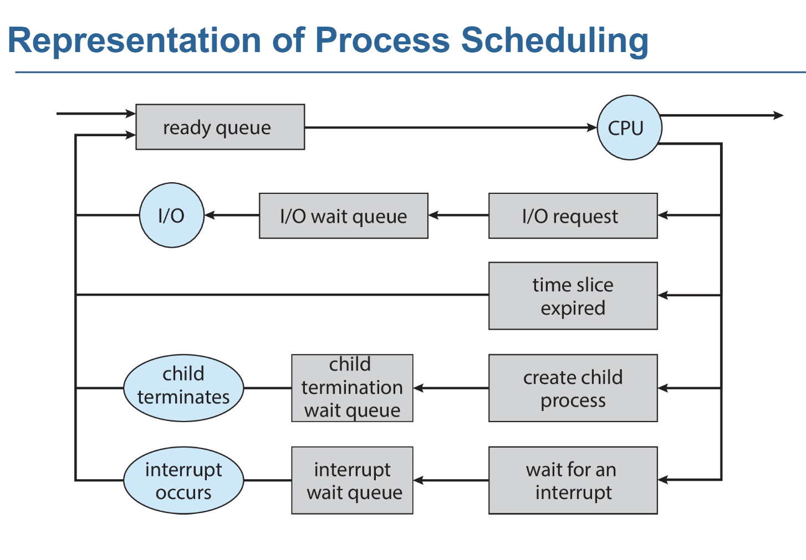

#### Context Switch
> 由于在处理 trap 时，有可能会改变系统的状态。所以在真正处理 trap 之前，我们有必要对系统的当前状态进行保存，在处理完成之后，我们再将系统恢复至原先的状态，就可以确保之前的程序继续正常运行。这里的系统状态通常是指寄存器，这些寄存器也叫做 CPU 的上下文（context）。

当CPU从一个进程切换到另一个进程时，需要保存当前进程的状态，并加载新进程的已保存的状态，这就是上下文切换。

- Context of a process is represented in the PCB
- Switch 时，System 并不进行什么操作

