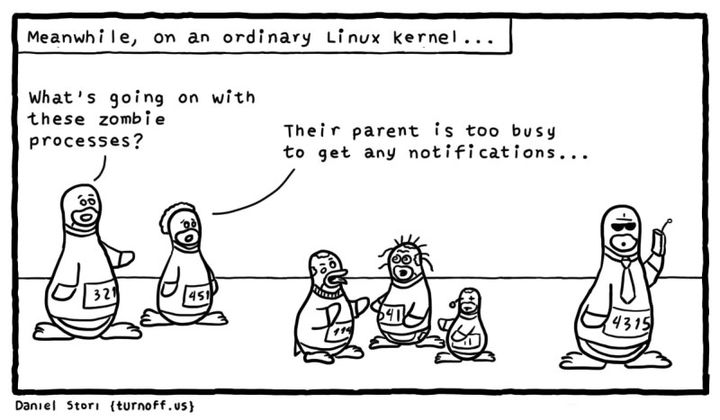

> No...

# 计算机系统 Ⅱ

!!! note "Links"
	<https://note.tonycrane.cc/cs/pl/riscv/privileged/>

## ISA 指令集体系结构

### 分类 - 根据内部存储结构

1. 栈 Architecture
    - 操作数在栈顶（TOS: Top of Stack）
    - 对于 C = A + B，指令为 `push A; push B; add; pop C`
2. 累加器 Architecture
    - 一个隐式操作数来自累加寄存器，另一个来自内存，计算结果在累加寄存器中
    - 对于 C = A + B，指令为 `load A, add B, store C`
3. 寄存器-内存 Architecture
    - 所有指令都可以访问内存
    - 第二个操作数（以下例子中为`B`）来自内存
    - 对于 C = A + B，指令为 `load R1, A; Add R3, R1, B; Store R3, C`
4. 寄存器-寄存器: Load/Store Architecture
    - 操作数都在寄存器中
    - 对于 C = A + B，指令为 `Load R1, A; Load R2, B; Add R3, R1, R2; Store R3, C`

!!! note "Practice"
    D = A * B - (A + C * B)
    ??? note "Stack"
        ```asm
        push A
        push B
        mul
        push A
        push C
        push B
        mul
        add
        sub
        pop D
        ```
    ??? note "Accumulater"
        ```asm
        load B
        mul C
        add A
        store D
        load A
        mul B
        sub D
        store D
        ```
    ??? note "Register-Memory"
        ```asm
        ; 提供指令：add/sub/mul/load/store Reg, data
        load R1, A
        mul R1, B
        load R2, C
        mul R2, B
        add R2, A
        store R2, D
        mul R1, D
        store R1, D
        ```
    ??? note "Load-Store"
        ; 提供指令 add/sub/mul RegDest, Reg1, Reg2; load/store Reg, &Mem
        ```asm
        load R1, &A
        load R2, &B
        load R3, &C
        mul R7, R3, R2
        add R8, R7, R1
        mul R9, R1, R2
        sub R10, R9, R8
        store R10, &D
        ```

### RISC-V ISA 汇编

（其实是系统一的东西）32 位指令

- Opcode: 操作码，用于识别指令类型
- rs1: the first register source operand
- rs2: the second register source operand
- rd: the register destination operand
- funct3/7: （从Opcode的指令类型中）确定特定的指令
- imm: immediate value or address


寄存器与内存：


一些例子：


### Addressing Mode 寻址模式


Also Ref: <https://note.tonycrane.cc/cs/system/cs1/topic5/>

## Pipelining 流水线概述

通过Overlapping的方式，将多个指令的多个阶段同时进行，提高吞吐量，以提高CPU的效率。

定义吞吐量（Throughput/TP）：单位时间内完成的指令数。  
$TP = \frac{n}{T} \lt TP_{max}$且$T = (m+n-1) \times \Delta t_0$，其中$m$为流水线级数，$n$为指令数，$\Delta t_0$为流水线时钟周期。

$TP_{max} = \lim_{n\to\infty} \frac{n}{T} = \frac{1}{\Delta t_0}$

### Solve Bottleneck

1. Subdivide the task
2. Repetition

定义加速比（Speedup/SP）：$Sp = \frac{Exetime_{non-pipe}}{Exetime_{pipe}} = \frac{nm\Delta t_0}{(m+n-1)\Delta t_0} = \frac{nm}{n+m-1}$

$n \to \infty$时，$Sp \to m$ （理想加速比为流水线级数）

效率$E = \frac{SP}{m} = TP \cdot \Delta t_0$


### Hazard 冲突

#### 结构冲突

多条指令在同一时钟周期抢着访问同一个物理资源。

Solution：

- Stall（Always works）
- 添加更多硬件

#### 数据冲突
#### 控制冲突

!!! note "分支预测"
    - 静态分支预测：总是预测分支不发生
    - 动态分支预测：根据历史记录预测
        - 维护分支历史记录表（Branch History Table）

## 非线性流水线

[看这篇文章](https://blog.csdn.net/rizero/article/details/106740895)

## Multiple Issue 多发射

为了改进指令级别的并行（ILP, Instruction Level Parallelism），除了加深流水线外，还可以同时发射多条指令。

## 冲突与中断

## Operating System 操作系统

### ELF 概述

C程序编译为可执行文件的四个过程：

- 预处理 —— 宏展开
- 编译 —— 源代码转为汇编
- 汇编 —— 汇编转为机器码
- 链接 —— 将多个目标文件链接为一个可执行文件，链接库

最终的可执行文件包含一个 crt(C runtime)，这个 crt 内会调用 main 函数。

ELF - Executable and Linkable Format 二进制文件内包含如下段（Section）：

- .text: 代码段
- .rodata: read only 数据段
- .data: 数据段
- .bss: 未初始化数据段

!!! note "Quiz"
    ```c
    
        // 如下均定义/声明在全局作用域
    
        int a = 1; // 存储在.data段
    
        int b; // 存储在.bss段
    
        const int c = 2; // 存储在.rodata段
    ```
    
    

- Static linking

    - All needed code is packed in single binary, leading to large binary
    - `_start` is executed after evecve system call
    - 

- Dynamic linking

    - Reuse libraries to reduce ELF file size
    - Howto resolve library calls?
        - It is the loader who resolves lib calls.
    - Entry point 是 loader


`_libc_start_main`: Setup environment and stack, then call main

#### Memory Layout 内存布局


在二进制文件运行时的内存布局。

注意 stack 从高地址向低地址增长，heap 从低地址向高地址增长。


存储在Memory中的数据，基本单元是Byte，每个数据都被一个地址标记。

> DMA(Direct Memory Access)：设备直接访问内存，不经过CPU。

### OS Structure 操作系统结构

**操作系统是一种“Resource Allocator and Abstracter”**，它管理硬件资源，提供抽象接口。


UI: CLI -> GUI -> Touchscreen...

- 简单结构 Simple Structure
    - MS-DOS
    - 不区分用户和内核态
    - 用户程序、操作系统程序、驱动程序都运行在同一个地址空间，可以互相操作

- 整体结构 Monolithic Structure
    - Unix
    - 有区分用户和内核态
    - 操作系统程序运行在内核态，用户程序运行在用户态
    - 用户程序通过系统调用访问内核态
    - 内核态程序给用户态程序接口来提供服务

- 微内核结构 Microkernel Structure
    - Mach, Minix...
    - 防止内核态程序过于复杂，漏洞概率更大
    - 尽可能多地将内核代码移动到用户态中
    - 内核只提供最基本的服务，其他服务通过进程间通信实现：更稳定
    - 将操作系统的功能分为多个独立的进程
    - 可移植性更好

- 模块化结构 Modular Structure
    - Linux (Modular + Monolithic)
    - 将内核分为多个模块（loadable kernel module），每个模块负责一个特定的功能
    - 模块可以动态加载和卸载
    - 保持了微内核结构的优点，同时减少了进程间通信的开销

- 外核结构 Exokernel Structure
    - 外内核则进行更少的抽象，来让用户程序可以有更多控制物理资源的可能
    - 内核只进行物理资源的分配和保护，而资源的使用、管理都由用户程序自己决定
    - 用户程序可以直接访问硬件资源，自己实现操作系统的功能

- 层级结构 Layered Structure
    - 为了提高模块化结构的性能，将模块分为多个层次
    - 最底层权限最高，为硬件
    - 每个层次只能调用比自己低的层次，不能调用比自己高的层次
    - 例如，文件系统、网络协议栈等

- 混合结构 Hybrid Structure
    - 结合了多种结构的优点
    - 例如，Windows NT, Apple Mac OS X


### Event 事件

Event 分为 Interrupt - 由硬件引起，Exception - 由软件引起。

一些指令会被限制：只有OS能够执行它们（Privileged Instructions），CPU是如何判断当前状态能否执行这些指令的？

- All modern processors support (at least) two modes of execution:
    - User mode: In this mode protected instructions cannot be executed
    - Kernel mode: In this mode all instructions can be executed
    - User code executes in user mode
    - OS code executes in kernel mode
    - The mode is indicated by a status bit in a protected control register
        - The CPU checks this bit before executing a protected instruction


Event是操作流中“不被预期”的情况，CPU会根据Event的类型，调用相应的Handler。

- An event stops execution, changes mode, and changes context
- The kernel defines a handlerfor each event type

OS Code running: Boot -> Wait for Event -> Event Handler -> Return to Wait

特殊的 Event：

- System Call - 会导致Trap -> System Call Handler
    - 发生于User Mode下需要执行Privileged Instructions的情况
        - e.g., to create a process, write to disk, read from the network card
        - 每种ISA都有自己的System Call
        - 
        - 为什么`printf`需要SysCall `libc_write`？
            - 打印到终端这种Device I/O需要 Kernel Mode (Privileged Instructions)
- Timer Interrupt - 会导致Regularly Interrupt -> Timer Interrupt Handler


### System Call 系统调用

每个Syscall有自己的Syscall Number，通过这个Number来调用Syscall，这个Number就是 Syscall Table 的索引，OS对具体的Syscall不感兴趣，只根据Number跳到Kernel中对应的Handler。

`strace`可以查看程序的System Call。

[https://www.cnblogs.com/machangwei-8/p/10388883.html](https://www.cnblogs.com/machangwei-8/p/10388883.html)

SysCall的类型：

- Process control
    - create process, terminate process
    - end, abort
    - load, execute
    - get process attributes, set process attributes
    - wait for time
    - wait event, signal event
    - allocate and free memory
    - Dump memory if error
    - Debuggerfor determining bugs, single step execution
    - Locks for managing access to shared data between processes

- File management
    - create file, delete fileopen, close fileread, write, reposition
    - get and set file attributes

- Device management
    - request device, release device
    - read, write, repositionget device attributes, set device attributes
    - logically attach or detach devices
- Information maintenance
    - get time or date, set time or date
    - get system data, set system data
    - get and set process, file, or device attributes

- Communications
    - create, delete communication connection
    - send, receive messages if message passing model to host nameor process name
        - From client to server
    - Shared-memory model create and gain access to memory regions
    - transfer status information
    - attach and detach remote devices

- Protection
    - Control access to resources
    - Get and set permissions
    - Allow and deny user access


### System Service 系统服务

## Process 进程

进程是一个正在执行的程序的实例，例如说一个ELF加载到内存中，开始执行。

> a unit of resource allocation and protection

对于同一个Program的不同Process，它们的

- .text段是相同的（Size & Content）
- .data段的Size是相同的，但Content可能不同
- Stack和Heap两者都不同

### Process Control Block 进程控制块 PCB

也称为Task Control Block，是操作系统用来管理进程的数据结构，存储每个进程的信息。

- 每个进程有且仅有一个PCB。
  - 在新进程创建时，OS会为其分配一个PCB
  - 在进程终止时，OS会回收PCB

- 存储这些 Process 的 META data：
  - Process State - Running, waiting, ready, etc.
  - Program Counter - Address of next instruction
  - CPU Registers - Contents of all process-centric registers
  - Blah blah blah...
  - 


On Linux: PCB is `task_struct`

### Process State 进程状态

As a process executes, it changes state. The state of a process is defined in part by the current activity of that process.

- New: The process is being created.
- Running: Instructions are being executed.
- Waiting: The process is waiting for some event to occur.
- Ready: The process is waiting to be assigned to a processor.
- Terminated: The process has finished execution.
- 

### Process Creation 进程创建

一个进程可能会产生多个进程，于是形成一个进程树，ppid是某节点父进程的pid。

`fork()`是一个SysCall，用于创建一个新的进程，新进程是调用进程的副本（各状态初始完全一致地复制过去），但是有不同的pid，Resource Utilization初始化为0。

- 返回给父进程的是新进程的pid
- 返回给子进程的是0

???+ info "Quiz"
    下面这张图里，每次`fork()`会给当前每个进程都创建一个子进程，所以第一次`fork()`后有两个进程，第二次`fork()`后有四个进程。  
    
    

    ```c
        int main(int argc, char* arg[]){
            fork();
            if(fork())
            {
                fork();
            }
            fork();
    
        }
    ```
    上面这段代码会产生多少个进程？ ——12个

    - (1) 第一行`fork()`后，有两个进程（Original进程和它fork出来的子进程）
    - (2) 第二行在if后括号中的`fork()`后，有四个进程
    - (3) 并且对 (1) 中两个进程，返回1，对 (2) 中新出现的两个进程，返回0
    - 因此 (1) 中两个进程进入if(){}, (2) 中两个进程**不进入**if(){}
    - 在条件语句中的`fork()`后，新出现两个进程，目前共6个进程
    - 最后的`fork()`所有进程都会执行，所以最后有12个进程

#### exec*()

`execve()`是一个SysCall，v stands for `argv`（命令行参数），e stands for `envp`（环境变量）。

- 其余的`exec*()`函数类似，但不是SysCall
- `exec*()` replaces the current process image with a new process image
- 
- `exec*`后，若执行成功，原进程的ELF会被替换，原进程**直接终止**，也没有返回值；若没有执行成功，则返回报错信息，原进程**继续执行**。

### Process Termination

#### wait()


#### exit()

一个进程通过`exit()`的SysCall来终止自己，接收一个参数（exit/return code）

- 进程终止后，进程占用的资源会被回收

### Signals 信号

进程可以通过信号来通知其他进程，也可以接收信号，例如说Ctrl+C实则是发送了一个SIGINT信号。

- 异步事件，程序必须处理
- SIGKILL和SIGSTOP不能被捕获或忽略（for security reasons）
    - 总能Kill进程


!!! note "demo: kill a infinite loop with SIGINT forbidden"
  	```c
		#include<signal.h>
		#include<stdio.h>
		void handler(int sig){
			fprintf(stdout,”I don’t want to die!\n”);
			return;
		}
		main(){
			signal(SIGINT, handler);
			while(1);// infinite loop
		}
	```
	
### Zombie Process 僵尸进程

子进程死亡后，它的父进程会接收到通知去执行一些清理操作，如释放内存之类。然而，若父进程并未察觉到子进程死亡，子进程就会进入到“ 僵尸(zombie)”状态。从父进程角度看，子进程仍然存在，即使子进程实际上已经死亡。

Zombie 会占用其 PCB，不会占用CPU，但会占用内存。

A zombie lingers on until:

- its parent has called wait() for the child, or
- its parent dies



### Orphan Process 孤儿进程

父进程运行结束，但子进程还在运行（未运行结束）的子进程就称为孤儿进程（Orphan Process）。孤儿进程最终会被 init 进程（pid 为 1）所收养，并由 init 进程对它们完成状态收集工作。

孤儿进程是没有父进程的进程，为避免孤儿进程退出时无法释放所占用的资源而变为僵尸进程，进程号为 1 的 init 进程将会接受这些孤儿进程，这一过程也被称为“收养”。init 进程就好像是一个孤儿院，专门负责处理孤儿进程的善后工作。每当出现一个孤儿进程的时候，内核就把孤儿进程的父进程设置为 init ，而 init 进程会循环地 wait() 它的已经退出的子进程。这样，当一个孤儿进程凄凉地结束了其生命周期的时候，init 进程就会出面处理它的一切善后工作。因此孤儿进程并不会有什么危害。

> When a child exits, a SIGCHLD signal is sent to the parent.
  
init process handles child termination with a handler for SIGCHLD that calls wait().

### Process Scheduling 进程调度

为了使CPU迅速地切换到下一个进程，**Process scheduler** 在 Ready 的进程中选择下一个在 Core 上运行的进程。

维护两个 Scheduling Queue：

- Ready queue
    - set of all processes residing in main memory, ready and waiting to execute

- Wait queues
    - set of processes waiting for an event (i.e. I/O)

- 进程在不同的 Queue 中频繁 Transfer，因此需要用 List 实现。

```C
struct list_head{
    struct list_head *next,*prev;
};
```


#### Context Switch 上下文切换

> 由于在处理 trap 时，有可能会改变系统的状态。所以在真正处理 trap 之前，我们有必要对系统的当前状态进行保存，在处理完成之后，我们再将系统恢复至原先的状态，就可以确保之前的程序继续正常运行。这里的系统状态通常是指寄存器，这些寄存器也叫做 CPU 的上下文（context）。  
ZJU-SYS2-FA24

当CPU从一个进程（实则是线程Thread）切换到另一个进程时，需要保存当前进程的状态，并加载新进程的已保存的状态，这就是上下文切换。

- Context of a process is represented in the PCB
- Switch 时，System 本身并不进行什么操作

1. 在两个Kernel线程中的上下文切换
    - 寄存器在什么时候/哪里保存？
    - where: 保存在PCB中，即`cpu_context`
    - when: 在`context_switch()`中，即在`cpu_switch_to()`中

2. 在两个用户线程中的上下文切换
    - 令人感叹的是，上下文切换**必须**在内核态中进行
    - User context 在什么时候/哪里保存？
    - when: kernel_entry; where: 每个线程的 kernel stack 中，确切说是`pt_regs`结构体内
    - Kernel context 在什么时候/哪里保存？
    - when: `cpu_switch_to()`; where: `cpu_context`
	- 
    - 


### CPU Scheduling CPU调度

- 定义：操作系统决定哪个进程在CPU上运行，要运行多久
- 使用 dispatcher 进行切换
    - A component of the OS that’s used to switch between processes


#### IO burst and CPU burst

大多数进程的执行时间是由CPU burst和IO burst交替组成的。

因此进程可以分为两类：

- IO bound 进程
    - 大多数时间等待IO
    - 包含许多短小的CPU burst
    - e.g. /bin/cp

- CPU bound 进程
    - 大多数时间在CPU上运行
    - IO burst很短很短（如果有的话）
    - e.g. /bin/gcc


#### CPU Scheduler CPU调度器

操作系统跟踪进程的状态，在 CPU 空闲时选择下一个进程运行。

调度可分为两类

- Preemptive Scheduling（可抢占式调度）
	- 进程即使在正常执行时，也可以被抢占
	- Easy for CPU to handle, most of modern choices.

- Non-preemptive Scheduling（非抢占式调度）
    - 进程只能在执行完毕或者等待IO时才能被抢占（hold CPU until it's willing to give it up）


那么调度发生在什么时候？


#### Scheduling Objectives 调度的目标

- 最大化 CPU 利用率
- 最大化吞吐量
- 最小化等待时间
- 最小化周转时间（Turnaround time）

    - Time from process creation to completion

- 最小化响应时间

    - Time from process creation to first response


### Process Scheduling 进程调度

为了使CPU迅速地切换到下一个进程，**Process scheduler** 在 Ready 的进程中选择下一个在 Core 上运行的进程。

维护两个 Scheduling Queue：

- Ready queue

    - set of all processes residing in main memory, ready and waiting to execute

- Wait queues

    - set of processes waiting for an event (i.e. I/O)

- 进程在不同的 Queue 中频繁 Transfer，因此需要用 List 实现。

```C
struct list_head{
    struct list_head *next,*prev;
};
```


#### Dispatcher

Dispatcher 把CPU的选择交给被 Scheduler 选中的进程，包括切换至Kernel态，保存当前进程的PCB，加载新进程的PCB。

- Dispatch Latency: Time it takes for the dispatcher to stop one process and start another running

#### Scheduling Criteria 调度标准

- CPU Utilization
- Throughput
- Turnaround Time: **Finsh Time - Arrival Time**
- Waiting Time: **Start Time - Arrival Time**
- Response Time

#### Scheduling Algorithms 调度算法（重点！）

- FCFS (First-Come, First-Served)
- SJF (Shortest Job First)
- Round Robin
- Priority Scheduling
- Multilevel Queue Scheduling
- Multilevel Feedback Queue Scheduling

这里要画图了！注意 Burst Time 可看作执行时间。

??? info "FCFS"
    - First-Come, First-Served
      
    - Non-preemptive
      
    - Easy to understand and implement
      
    - Poor in performance: 长进程会导致短进程等待时间过长
      
    - Burst Time: P1: 24, P2: 3, P3: 3，这里展示一下以`123`的顺序执行的情况，会发现比`321`的情况要差很多
      
    - 

??? info "SJF"
    - 理论上的最佳方案
    - 可分为两类：Non-preemptive SJF, Preemptive SJF
        - Non-preemptive SJF
            - 选择最短的 **总的** Burst 时间
            - 
        - Preemptime SJF
            - 选择最短的 **剩余 Burst 时间**
            - 
            - 这里 turnaround time 是一样的，还是完成时间减去 Arrival Time；对于 Waitng Time，会出现图里 P1 P2 这种分段执行的，这时 Waiting Time 就要分成两部分：从 Arrive 到第一次执行的时间间隔，再加上每次执行的结束时间到下次执行的开始时间的间隔 
            - 但是很难知道每个进程的 Burst Time
            - 可以通过已发生过的 CPU Burst 预测

??? info "Round Robin"
  
    - Preemptive
      
    - 定义一个时间片（Time Quantum）：作为每个进程每次持续的最长时间
      
    - 除非只剩下一个 READY 进程，否则，一个进程最多执行一个时间片长度后就得把 CPU 使用权交给另一个 READY 进程。
      
    - Ready Queue 是 First-IN-First-OUT
      
    - Scheduling:
      
        - 从 Ready Queue 中选出第一个进程
          
        - 设置计时器，在一个时间片长度后中断进程
          
        - Dispatch 该进程
      
    -       
    - 因此对时间片的选取很重要：长 or 短？
      
        - 短时间片
          
            - 响应时间/互动率很好！但是额外开销太大了：因为 Dispatch 时 Context Switch 太多太耗时。
      
        - 长时间片
          
            - 响应时间很差，额外开支变少了：时间片很长很长时就变成 FCFS 型了

??? info "Priority Scheduling"
    - Non-Preemptive or Preemptive
    - 为每个进程定义一个优先级（一个数字）
        - 也即把 Ready Queue 利用为一个优先队列
    - 优先级高的（一般是数字小的）先执行
    - 其实优先级取“预测的下一次 Burst TIme”时就是SJF
    -       
    - 来看一个优先级调度和 Round Robin 的综合
        - 
    - Problem：低优先级的进程总会被抢占，几乎永不执行（Starvation）
        - Solution：Increase the priority of a process as it **ages**.

??? info "Multilevel Queue"
	
	- ready queue 被分成多个队列
	
	- 比如分成交互性队列和批处理队列
	
	- 一个进程会被永久地分到一个队列中
	
	- 每个队列可以使用不同的 Scheduling Algorithm
	
	- 例如，高交互性的进程队列可以使用 RR 算法，低交互的批处理队列可以使用 FCFS 算法
	
	- 队列之间也可以进行调度

??? info "Multilevel Feedback Queues"
	类似 Multilevel Queue，但是进程可以在不同队列之间移动。

	给交互性、I/O intensive 的进程更高的调度优先级

	最最常见的调度算法

## IPC(Inter-Process Communication) 进程间通信

进程间通信是指两个或多个进程之间交换信息的机制。

进程可以通过通信进行”合作“，例如说文件这类信息在不同进程中的共享，或者说对同一个任务的 Multi-processing。

!!! example "Chrome Browser"
  
	Chrome浏览器使用进程隔离，每个标签页都是一个进程，这样一个标签页崩溃不会影响其他标签页。

	- Browser Process: 管理所有的标签页，UI，硬盘和网络的IO
	- Renderer Process: 每个标签页一个进程，负责渲染页面，读取HTML & CSS，加载JS。
	- 在一个沙盒里运行，限制了对系统的访问
	- Plugin Process: 每个插件一个进程，如Flash Player

### Models of IPC 进程间通信模型

- 共享内存（Shared Memory）

    - 
    - low-overhead: almost no SysCall
    - One process creates a shared memory segment
    - Processes can then “attach” it to their address spaces
    - 两个进程单独地访问共享内存

- Message Passing

    - 
    - high-overhead: 需要通过System Call进入Kernel态获取Message
    - 每次的Message很小
    - 创造一个邮筒（Mailbox），通过邮筒发送与接收消息，摧毁邮筒
    - Blocking or Non-blocking
        - Blocking(同步)：发送者在信息被接收前一直Block，接收者在信息到达前一直Block
        - Non-blocking(异步)：发送者持续发消息，接收者接收一条有效信息或者空消息

    - 这里有一个 Buffering 的概念：

        - Queue of messages attached to the link.
        - Implemented in one of three ways

            1. Zero capacity – no messages are queued on a link.  
               Sender must wait for receiver
            2. Bounded capacity – finite length of n messages  
               Sender must wait if link full
            3. Unbounded capacity – infinite length  
               Sender never waits


- Pipe
    - Ordinary Pipe
        - 一个进程写，一个进程读
        - 一般是父子进程间通信
        - 进程外无法访问
        - 进程产生者写到`fd[1]`的 write-end，进程产生者读取`fd[0]`的 read-end
        - 因此是单向的
        - On Windows: Anonymous Pipe
    - Named Pipe
        - 两个进程之间通信
        - 通过文件系统
        - 双向
        - 有名管道是一种特殊类型的文件，它允许无关的进程之间进行通信
        - 与无名管道不同，有名管道有一个路径名与之关联，以`mkfifo()`创建

## Thread 线程

### Process vs Thread 进程 vs 线程

线程是进程的一个 Execution Unit，一个进程可以包含多个线程。每个线程有自己的 Stack 和 PC, Regs，但是共享 Data Section、Heap 和 Code Section。

**简单来说，线程是执行单元，进程是资源管理单元**


- Single-threaded Process

    - 一个进程只有一个线程

- Multi-threaded Process

    - 一个进程有多个线程


使用线程的优势：

- Economical

    - 创建线程比创建进程开销更少（Code Section、Data Section、Heap 已经被加载）

- Resource Sharing

    - 线程本身就是共享资源的
    - No more need for IPC

- Responsiveness
- Scalability

    - 一个进程中的多个线程可以并行执行，提高效率


劣势：

- 独立性差

    - 一个线程崩溃会导致**整个进程**崩溃
    - 很难知道是哪个线程出了问题


### Thread Model 线程模型

- Many-to-one

    - 多个User Thread映射到一个Kernel Thread
    - 无法很好利用多核架构
    - 一个User Thread阻塞会导致整个进程阻塞

- One-to-one

	- 一个User Thread映射到一个Kernel Thread
	- Create a new user thread requires work from kernel

- Many-to-many

    - 多个User Thread映射到多个Kernel Thread
    - 如果一个User Thread阻塞，Kernel 创造出一个新的 Kernel Thread，避免整个进程阻塞

- Two-level

	- 可多对多，可一对一


### Thread Library 线程库

Some demos

### Linux Thread

使用 `clone()` 的 SysCall 来创建线程。有如下 flag 可选

- `CLONE_VM`: 共享内存空间
- `CLONE_FS`: 共享文件系统信息
- `CLONE_FILES`: 共享文件描述符
- `CLONE_SIGHAND`: 共享信号处理程序

与此同时，Linux 下 `task_struct` 存储的是**线程**的 TCB，进程的 PCB 是 **Leader Thread** 的 TCB。(不存在 PCB 了）

同时一个 Process 可由单个线程+一个地址组成，也可以是多个线程+一个地址。

### Thread Mapping 线程映射

一个 Task 可以在 User Mode 下执行线程，此时使用 User Code & User Stack，也可以在 Kernel Mode 下执行（例如调用个 Syscall），使用 Kernel Code & Kernel Stack

???+ example "eg"
	执行 `printf()` 时，会调用 `write()`，`write()` 是一个 SysCall，因此会进入 Kernel Mode，此时会切换到 Kernel Stack，Kernel Code。

    User code: printf(...)

	Kernel code: write(...)

## Synchronization 同步

!!! example "Race Condition"
	由于 Thread A B 运行的 `counter = counter+1` 实则是多行指令（寄存器内加1，写回寄存器），因此在 Thread A 读完运算完还没有写回的时候，被 Interrupt，转为 Thread B，Thread B 读取时，读到的是初始的 `counter` 值，运算后再写回，再由 Thread A 写回，得到的 `counter` 就只加了1.
    !!! success "解决方案"
    	Critical Section: 一段“**原子性**”的代码，同一时间段只能有一个线程在运行。
    	```c
    	while(1){
    		entry_section()  
    			Critical Section  
    		end_section()  
    			remainder section  
    	}
    	```
    ??? info "如何构建 Critical Section aka Synchronization 的解决方案需要满足的条件"
    	- Mutual Exclusion: 在同⼀时刻，最多只有⼀个线程可以执⾏临界区
    	- Progress: 当没有线程在执⾏临界区代码时，必须在申请进⼊临界区的线程中选择⼀个线程，允许其执⾏临界区代码，保证程序执⾏的进展
    	- Bounded Waiting: 当⼀个进程申请进⼊临界区后，必须在有限的时间内获得许可并进⼊临界区，不能⽆限等待

Peterson's Algorithm: 两个线程的 Mutual Exclusion（只适用于两个线程）

- 假设 Load 和 Store 是原子操作（不可被中断）
- 两个进程共享下面这两个变量作为属性：
    - `flag[2]`: 进程是否准备好进入临界区
    - `int turn`: 轮到哪个进程进入临界区
    - 伪代码如下


但是 Peterson 没有看起来那么万能，一是因为只适用两个线程，二是因为可能会导致处理器或编译器对\*看起来无害\*的操作指令进行**重排序**，这导致其要求线程的Load和Store是原子性的。

- 这在单线程进程里无所谓
- 多线程里可能会导致非预期的结果！

!!! example "e.g."
    两个线程共享下面两个变量：
    ```c
    bool flag = false;
    int x = 0;
    ```
    现在线程1执行
    ```c
    while(!flag);
    printf("%d\n", x);
    ```
    线程2执行
    ```c
    x = 100;
    flag = true;
    ```
    最后的结果是什么？
    ??? success "解答"
        - 我们预期的结果是输出100，但结果可能不是这样！
        - 重排序可能导致 `flag = true` 先执行，`x = 100` 后执行
    !!! question "那咋办"
        引入内存屏障（Memory Barrier）来防止重排序

        - 一句指令，使内存中所有的变化全部传播到所有其他处理器
        - 现在只需要在线程1，2的两条语句之间加上`memory_barrier`即可

### 硬件支持

我们有硬件的指令来支持同步：

#### Test-and-Set

设置并返回初始值，原子操作

```c
bool test_set (bool *target)
{
    bool rv = *target;
    *target = TRUE;
    return rv:
}
```
TBD

#### Compare-and-Swap

```c
int compare_and_swap(int *value, int expected, int new_value)
{
    int temp = *value;
    if (*value == expected)
        *value = new_value;
    return temp;
}
```

TBD

### 原子性变量

TBD

### Mutex Lock 互斥锁

TBD

### Semaphore 信号量

```c
struct semaphore {
    int value;
    struct list_head* waiting_queue;
};
```

## Deadlock 死锁
 
两个或多个进程互相等待对方释放资源，导致**所有**进程都无法继续执行。

### Priority Inversion 优先级反转

如果高优先级的进程等待低优先级的进程的 Lock，亦即，**被低优先级进程抢占了**

!!! info "Solution"
    - 优先级继承
        - 短暂地提高低优先级进程的优先级

### Condition Variable 条件变量

诶，我们直接定义一个条件变量，让所有线程都等待这个条件变量的信号，这样就不会出现死锁了！

```C
While (condition == false)
    wait(condition_variable);

// Remainder Section
```

### Real Problems 

#### Bounded Buffer Problem 有界缓冲问题

两个进程，一个生产者，一个消费者，共享 n 个 buffer。

- 生产者向 buffer 中写入数据
- 消费者从 buffer 中移除数据

本问题要保证：

- 生产者不会向满的 buffer 写入数据
- 消费者不会从空的 buffer 移除数据

解决方案：定义 mutex 初始为 1，full-slots 初始为 0，empty-slots 初始为 n


```C
wait(S){
    while(S <= 0);
    S--;
}

signal(S){
    S++;
}
```

```C

// Producer Process
do {
    // Produce an item
    wait(empty-slots);
    wait(mutex);
    // add the item to the buffer
    ...
    signal(mutex);
    signal(full-slots);
} while (true);


// Consumer Process
do {
    wait(full-slots);
    wait(mutex);
    // remove an item from the buffer
    ...
    signal(mutex);
    signal(empty-slots);
    // consume the item
    ...
} while (true);
```

这里还有几个思考题（我没记

#### Readers-Writers Problem 读者写者问题

一系列进程共享一个 data set，有两种进程：

- Readers: 只读取数据，不修改
- Writers: 能读取数据，也能修改数据
- 多个 Readers 可以共存，但是 Readers 和 Writers 之间互斥，Writers 之间也互斥

解决方案：定义 mutex 初始为 1，write 初始为 1，read_count 初始为 0

`mutex`保护`read_count`，`read_count` 记录当前 Reader 的数量

```C
// Writer Process
do {
    wait(write);
    // write shared data
    ...
    signal(write);
} while (true);

// Reader Process
do {
    wait(mutex);
    read_count++;
    if (read_count == 1)
        wait(write);
    signal(mutex);
    // read shared data
    ...
    wait(mutex);
    read_count--;
    if (read_count == 0)
        signal(write);
    signal(mutex);
} while (true);
```

!!! extra "变种"
    - Reader First
    - Writer First

#### Dining-Philosophers Problem 哲学家就餐问题

TBD

### Deadlock 发生的条件

- Mutual Exclusion: 资源不共享，一种资源在某个时段只能被一个进程持有
- Hold and Wait: 持有至少一个资源的进程等待获取正被其他进程持有的其他资源
- No Preemption: 资源只能被持有者自愿释放
- Circular Wait: 一系列进程互相等待对方释放资源

!!! note "Resource Allocation Graph"
    - 一个图，节点是所有进程（${P_1, P_2, ..., P_n}$）和资源（${R_1, R_2, ..., R_m}$）
    - 两种边：
        - Request Edge：$P_i$ 指向 $R_j$ 的有向边，表示 $P_i$ 请求 $R_j$ （进程尚未持有资源）
        - Assignment Edge：$R_j$ 指向 $P_i$ 的有向边，表示 $R_j$ 被 $P_i$ 持有 （进程已经持有资源）
    - 例
        - 
        - 这里 R 节点中不同的点代表一个资源的不同 Instance 
    - 这里有一类判断这种图是否含有死锁的题，思路一般是
        - 先找哪个进程能执行，执行掉，然后释放资源
        - 然后看能不能继续执行别的进程
    !!! note "Basic Facts"
        - 如果图中没有环，那么没有死锁
        - 如果有环
            - 且每个资源只有一个实例，那么有死锁
            - 且每个资源有多个实例，那么可能有死锁

### Deadlock 的预防 Prevention

只需要考虑预防上面四个条件（其一）就够了

- Prevent Mutual Exclusion: 这个可以不考虑：对于不共享的资源，额那只能互斥，对于共享的资源我们又不需要担心
- Prevent Hold and Wait: 一个进程要么在执行前一次性 Request 所有资源，要么只有在不持有任何资源时才能 Request 资源
    - 导致资源利用率降低，可能会导致 Starvation
- Prevent No Preemption: 如果一个进程持有资源，但是又请求其他资源，那么就释放已持有的资源，将资源加入到 Request 队列中（没看懂）
- Prevent Circular Wait: 给资源编号，进程只能按编号递增的顺序请求资源

### Deadlock 的避免 Avoidance

与预防不同，使用 Deadlock Avoidance 算法确保不会出现循环等待。

SAFE STATE: 如果系统能够分配资源序列，使得每个进程按某种顺序获得资源都能完成，那么系统处于 SAFE STATE

- Safe State 里的进程不会发生 Deadlock，Unsafe State **可能**会发生 Deadlock

这里对于多实例的资源，使用 Banker's Algorithm，懒得记了，在 deadlock 的 ppt 靠后的部分。

感觉研究这一个例子就够了：


### Deadlock 的检测 Detection

即使预防和避免，还是没能让死锁大人尽兴吗···

Allow system to enter deadlock state, but detect and recover from it

- 资源只有单实例
    - 通过 Resource Allocation Graph 检测
    - 也就是检测是否有环
        - 诶，我这儿还有一离散
    - 把图里所有的资源节点都视为边（我总感觉像极了离散里讲过的一个操作），之后图只有进程节点，称为 Wait-for Graph
- 资源有多实例
    - 这里就需要用到类似 Banker's Algorithm 的方法了
    - 就是利用 Banker，鉴定一下能不能进入 Safe State，不能就说明有死锁

### Deadlock 的解决 Recovery

- Process Termination
    - 终止死锁的进程
    - 每次终止一个进程，直到死锁解除

或者

- Resource Preemption
    - 抢占资源
    - 选择一个进程，释放资源，回滚到某个 Checkpoint
    - 可能会导致 Starvation