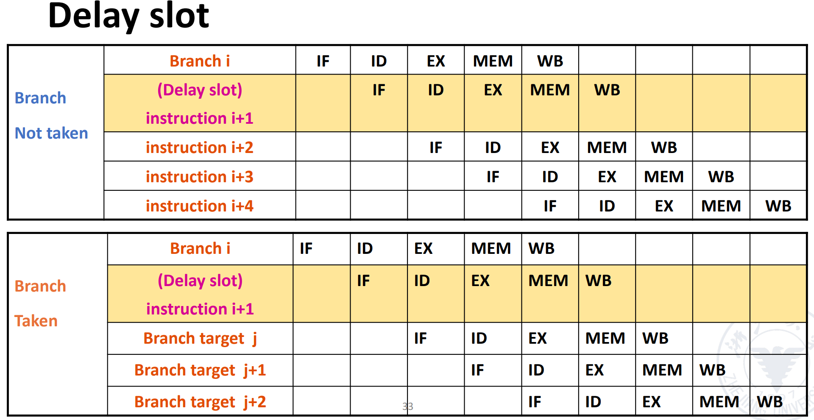
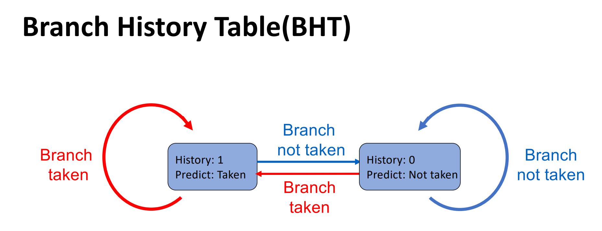
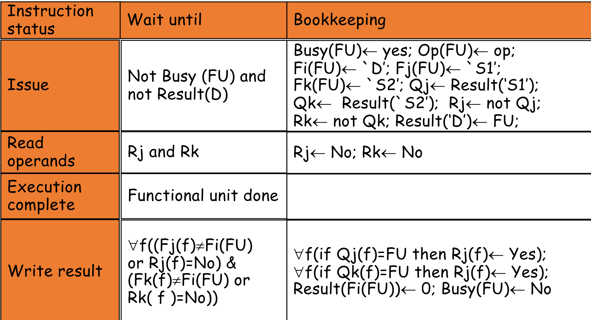

# 计算机系统 Ⅲ

> 任课教师：吴磊、周亚金

## 量化研究

!!! note "Amdahl's Law"
    $$\text{Speedup} = \frac{改进前时间}{改进后时间} = \frac{1}{1 - B + \frac{B}{S}} \rightarrow \frac{1}{1-B}$$
    $B$ 为并行化（被优化）比例，$S$ 为被优化部分的加速比。也就是说，无论怎么优化，理想加速比都取决于没被优化的部分所占的比例

    !!! example "例"
        - 把系统中某个函数的速度提高到了原先的20倍，但这个函数占整个系统的40%，则整个系统的速度提高了多少倍？
            - Speedup = $\frac{1}{1 - 0.4 + \frac{0.4}{20}} = 1.613$

Performance = 1/Execution Time

CPU 执行时间 = CPU 时钟周期数 * CPU 时钟周期时间 = CPU 时钟周期数 / CPU 时钟频率

CPI（Cycles Per Instruction）= CPU 时钟周期数 / 指令数

CPU 执行时间 = 指令数 * CPI * 时钟周期时间 = 指令数 * CPI / 时钟频率

!!! note "Performance Depends on"
    - Algorithm: affects IC, possibly CPI
    - Programming Language: affects IC, CPI
    - Compiler: affects IC, CPI
    - ISA: affects IC, CPI, $T_c$

## 分支预测

很长 or 超标量的流水线必须等到分支指令计算结果出来之后才能进行下一条指令，导致大量 Stall，于是引入分支预测，只在**预测失误**时才 Stall

- 静态分支预测
    - Based on typical branch behavior
    - 全部预测为 untaken or taken
    - Delay Slots: 在分支指令后的几条指令，不管分支是否发生，都会执行（由于导致电路复杂化，逐渐被淘汰）
    - 
- 动态分支预测
    - Hardware measures actual branch behavior
        - e.g. 记录最近 branch 的行为，根据历史数据预测
    - 预测不准时，会进行历史的更新
    - BHT（Branch History Table）: 用于记录历史数据
        - 
        - 1 bit 的 BHT 会导致多层嵌套的循环多次预测错误，炸膛了
    - BTB（Branch Target Buffer）: 用于记录分支目标地址，Buffer 中的指令都预测为 Taken
        - 优势是更快（在 IF 阶段）就可以得到分支指令
        - 可存储多条指令，对 MultiProcessors 有利
        - branch folding
    - Integrated Instruction Fetch Unit
        - 把多个功能并入 IF 阶段，包括
            - Integrated Branch Prediction
            - Prefetch 指令
            - Instruction memory access and buffering

## 重叠执行

What is this

## ILP

### Dynamic Scheduling

RAW/WAR/WAW 导致数据冲突，需要使用动态调度重排指令顺序

- Out-of-order Execution
    - 乱序执行
    - 只要①对之前的指令没有 Dependence ②没有冲突，一条指令就可以执行

!!! note "Scoreboard"
    - 将 ID 阶段分割为 IS(Issue) 和 RO(Read Operands) 两个阶段
        - Issue: 译码指令，检查有没有**结构冲突**
            - 以 Program Order 发射指令，若有结构冲突/输出取决于先前发射却未完成的指令，则不发射
        - RO：等到没有**数据冲突**后再读入 Operands
        - **此模型中不存在前递**
    - Solutions for WAR:
        - 在 Read 寄存器前 Stall WB 阶段
        - 只在 RO 阶段读取寄存器
    - Solution for WAW:
        - 在另一条指令完成前探测冲突并 Stall 新指令的发射

    Scoreboard 包含三个部分

    - Instruction Status
        - 指令处于 IS/RO/EX/WB 的哪个阶段
    - Functional Unit Status
        - 每个功能单元（Functional Unit）是否被占用，有九种状态
            - Busy: Indicates whether the unit is busy or not
            - Op: Operation to perform in the unit (e.g., + or –)
            - Fi: Destination register
            - Fj, Fk: Source-register numbers
            - Qj, Qk: Functional units producing source registers Fj, Fk
            - Rj, Rk: Flags indicating when Fj, Fk are **ready and not yet read**.
    - Register Result Status
        - 显示哪个 FU 会写这个寄存器
    - 
    - TBD

!!! note "Tomasulo Algo"
    TBD

Exception vs. Interrupt

| | Exception | Interrupt |
| --- | --- | --- |
| Cause | 由程序引起 | 由外部设备引起 |
| When to Handle | When Detected | When Convinient |

TBD

### Hardware Support: Reorder Buffer(ROB)

以先来先出的顺序（就是被发射的顺序）存储 uncommitted 指令

- 4 Fields
    - Inst Type
    - Destination Field
    - Value Field
    - Ready Field
- 指令完成时，结果存入 ROB，同时标记 Ready Field
- 便于 undo 错误预测的 branch

!!! note "Hardware-based Speculation"
    - Issue - Get inst from FP Op Queue
    - Execute - operate on operands
    - Write Result - finish execution
        - 写入 CDB（Common Data Bus），通知所有正在等待的 FU 和 ROB，将 Reservation Station 标记为 Available
    - Commit - update reg with reorder result

### 多发射 MultiIssue

见 [系统2笔记](./ComputerSystem2.md#multiple-issue-多发射)