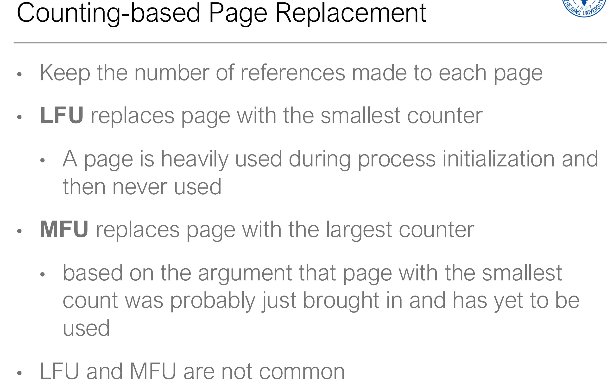
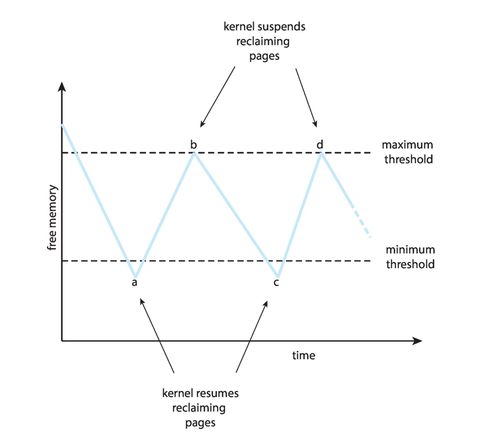
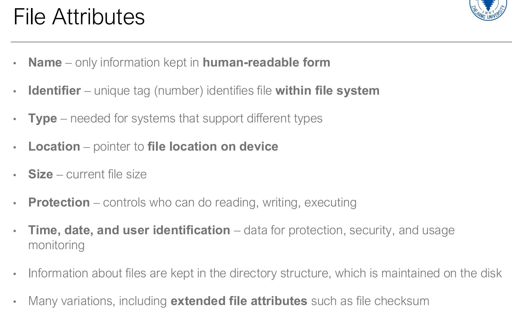
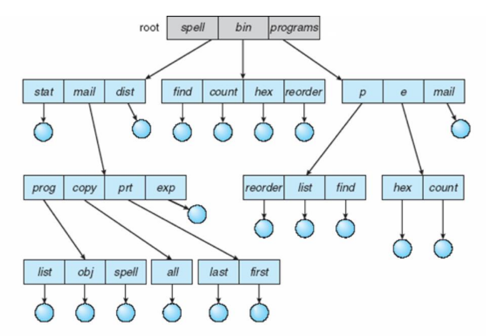
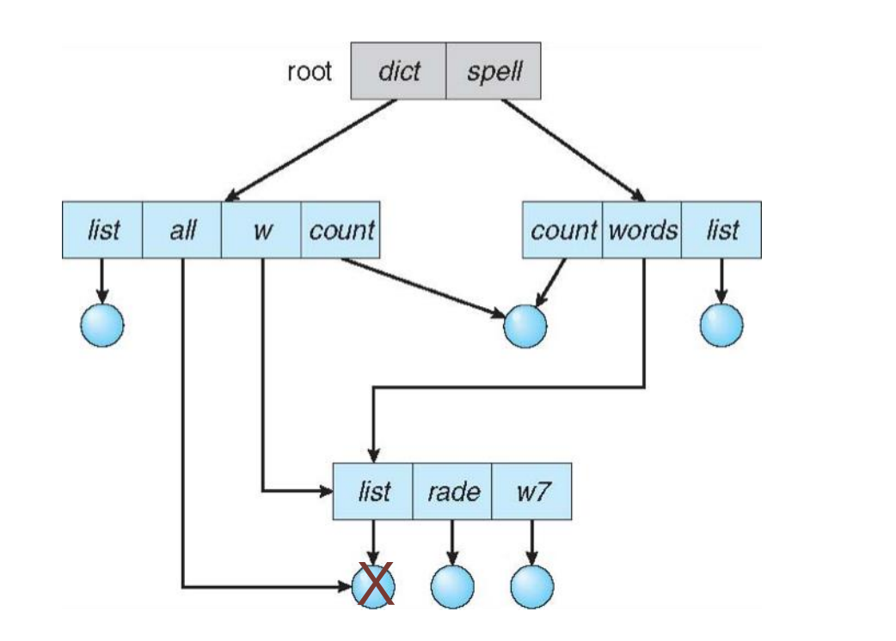

# 计算机系统 Ⅲ

> 任课教师：吴磊、周亚金

!!! note "Homework"
    - [HW1](./assets/3230105892_sys3_hw1.pdf)

> 比系统二更生硬地把体系和OS的内容捏合了起来，呃

## 量化研究

!!! note "Amdahl's Law"
    $\text{Speedup} = \frac{改进前时间}{改进后时间} = \frac{1}{1 - B + \frac{B}{S}} \rightarrow \frac{1}{1-B}$
    $B$ 为并行化（被优化）比例，$S$ 为被优化部分的加速比。也就是说，无论怎么优化，理想加速比都取决于没被优化的部分所占的比例

    !!! example "例"
        - 把系统中某个函数的速度提高到了原先的20倍，但这个函数占整个系统的40%，则整个系统的速度提高了多少倍？
            - Speedup = $\frac{1}{1 - 0.4 + \frac{0.4}{20}} = 1.613$

Performance = 1/Execution Time

CPU 执行时间 = CPU 时钟周期数 * CPU 时钟周期时间 = CPU 时钟周期数 / CPU 时钟频率

CPI（Cycles Per Instruction）= CPU 时钟周期数 / 指令数

CPU 执行时间 = 指令数 * CPI * 时钟周期时间 = 指令数 * CPI / 时钟频率

!!! note "Performance Depends on"
    - Algorithm: affects IC, possibly CPI
    - Programming Language: affects IC, CPI
    - Compiler: affects IC, CPI
    - ISA: affects IC, CPI, $T_c$

## 分支预测

很长 or 超标量的流水线必须等到分支指令计算结果出来之后才能进行下一条指令，导致大量 Stall，于是引入分支预测，只在**预测失误**时才 Stall

- 静态分支预测
    - Based on typical branch behavior
    - 全部预测为 untaken or taken
    - Delay Slots: 在分支指令后的几条指令，不管分支是否发生，都会执行（由于导致电路复杂化，逐渐被淘汰）
    - 
- 动态分支预测
    - Hardware measures actual branch behavior
        - e.g. 记录最近 branch 的行为，根据历史数据预测
    - 预测不准时，会进行历史的更新
    - BHT（Branch History Table）: 用于记录历史数据
        - 
        - 1 bit 的 BHT 会导致多层嵌套的循环多次预测错误，炸膛了
    - BTB（Branch Target Buffer）: 用于记录分支目标地址，Buffer 中的指令都预测为 Taken
        - 优势是更快（在 IF 阶段）就可以得到分支指令
        - 可存储多条指令，对 MultiProcessors 有利
        - branch folding
    - Integrated Instruction Fetch Unit
        - 把多个功能并入 IF 阶段，包括
            - Integrated Branch Prediction
            - Prefetch 指令
            - Instruction memory access and buffering

## 重叠执行

What is this

## ILP

### Dynamic Scheduling

RAW/WAR/WAW 导致数据冲突，需要使用动态调度重排指令顺序

- Out-of-order Execution
    - 乱序执行
    - 只要①对之前的指令没有 Dependence ②没有冲突，一条指令就可以执行

!!! note "Scoreboard"
    - 将 ID 阶段分割为 IS(Issue) 和 RO(Read Operands) 两个阶段
        - Issue: 译码指令，检查有没有**结构冲突**
            - 以 Program Order 发射指令，若有结构冲突/输出取决于先前发射却未完成的指令，则不发射
        - RO：等到没有**数据冲突**后再读入 Operands
        - **此模型中不存在前递**
    - Solutions for WAR:
        - 在 Read 寄存器前 Stall WB 阶段
        - 只在 RO 阶段读取寄存器
    - Solution for WAW:
        - 在另一条指令完成前探测冲突并 Stall 新指令的发射

    Scoreboard 包含三个部分

    - Instruction Status
        - 指令处于 IS/RO/EX/WB 的哪个阶段
    - Functional Unit Status
        - 每个功能单元（Functional Unit）是否被占用，有九种状态
            - Busy: 显示该单元是否被占用
            - Op: 该单元执行的操作 (e.g., + or –)
            - Fi: 目的寄存器
            - Fj, Fk: 源寄存器
            - Qj, Qk: 如果源寄存器没准备好部件该向哪里要数据（$Q_j$ 和 $Q_k$ 对应 $R_j$ 和 $R_k$）
            - Rj, Rk: Flags indicating when Fj, Fk are **ready and not yet read**，寄存器中的数据被读取后置为 No
    - Register Result Status
        - 显示哪个 FU **正准备写入**这个寄存器
    - 
    - 具体看[这个文章](https://zhuanlan.zhihu.com/p/496078836)吧，感觉比两个老师讲的都好（
    - 要点（摘自上面的文章）：
        - 一条指令能否发射，一看是否有功能部件空闲可用，这个信息包含在功能状态中；二看指令要写的寄存器是否正要被别的指令写，这个信息包含在寄存器状态中，观察这个信息是为了解决 WAW 冒险。
        - 一条指令能否读数，要看记分牌是否提示源寄存器不可读，如果不可读，就说明该寄存器将要被别的前序指令改写，现在的指令要等待前序指令写回，观察这个信息是为了解决 RAW 冒险。
        - 一条指令一旦读数完成，就必然可以进行运算，运算可以是多周期的，在第一个周期结束时应该改写功能状态，表明自己不再需要读寄存器。
        - 一条指令能否写回，要看是否有指令需要读即将被改写的这个寄存器，具体一点来说，就是要观察标记 Yes 的 Rj、Rk 对应的寄存器里是否有当前指令的目的寄存器，如果有，就说明有指令需要读取寄存器的旧值，这样一来我们就要等指令读完旧值之后再写回，观察这个信息是为了解决 WAR 冒险。

!!! note "Tomasulo Algo"
    TBD

Exception vs. Interrupt

| | Exception | Interrupt |
| --- | --- | --- |
| Cause | 由程序引起 | 由外部设备引起 |
| When to Handle | When Detected | When Convinient |

TBD

### Hardware based Speculation: Reorder Buffer(ROB)

以先来先出的顺序（就是被发射的顺序）存储 uncommitted 指令，使指令执行完成的顺序也按发射的顺序来。

指令按程序顺序发射（每周期发射一条），但执行和写回可以乱序。

结果先写到 reorder buffer，在 buffer 里按照指令流出的顺序以此写回寄存器。因此我们在每个指令后面加上一个 commit 状态，当前面的指令都 commit 之后才能 commit。

- 4 Fields
    - Inst Type
    - Destination Field
    - Value Field
    - Ready Field
- 指令完成时，结果存入 ROB，同时标记 Ready Field
- 便于 undo 错误预测的 branch

!!! note "Hardware-based Speculation"
    - Issue - Get inst from FP Op Queue
    - Execute - operate on operands
    - Write Result - finish execution
        - 写入 CDB（Common Data Bus 数据广播总线），通知所有正在等待的 FU 和 ROB，将 Reservation Station 标记为 Available
    - Commit - update reg with reorder result

### 多发射 MultiIssue

见 [系统2笔记](./ComputerSystem2.md#multiple-issue-多发射)

为了使 CPI < 1，需要在一个时钟内完成多条指令

## Memory Hierarchy

实际上，CPU 执行一条指令的时间远远短于访问内存的时间，即计算机的运行速度受限于 Memory Bandwidth & Latency

- Latency: 单次访问内存的时间
- Bandwidth: 也即带宽，单位时间内能访问的次数
    - 如果占比 $m$ 的指令需要访问内存，则平均每条指令需要访问 $1 + m$ 次内存（对 N 条指令，首先要 N 次访问 I-cache，然后 mN 次访问 D-cache）

令人感叹的是，容量变大，访问时间就会变少；带宽变大，硬件 Cost 也会越大，于是采用 **Memory Hierarchy** 来缓解这些问题

这里先介绍内存的两个特征：局部性

- 时间局部性（Temporal Locality）
    - 一旦访问了某个地址，很可能在不久的将来再次访问
- 空间局部性（Spatial Locality）
    - 一旦访问了某个地址，很可能在附近的地址也会被访问

利用局部性，Present the user with as much memory as is available in the cheapest technology. Provide access at the speed offered by the fastest technology.

### Cache

!!! note "USEFUL LINK"
    https://zhuanlan.zhihu.com/p/482651908

    抄了很多

地址从 Core 中流出后，最先碰到 Memory Hierarchy 的最高层：Cache

small and fast

- Unified Cache: 一起存储指令和数据，需要的硬件少，但是访问速度慢
- Split Cache: 分开存储指令和数据（I-cache 和 D-cache），访问速度快，但是硬件复杂


#### Cache Performance

- Cache Hit/Miss
    - Hit: 在 Cache 中找到了所需的数据
    - Miss: 没有找到，需要从更低一层的 Memory Hierarchy 中读取

### Block/Line

cache容量较小，所以数据需要按照一定的规则从主存映射到cache。一般把主存和cache分割成一定大小的块，这个块在主存中称为data block，在cache中称为cache line。举个例子，块大小为1024个字节，那么data block和cache line都是1024个字节。当把主存和cache分割好之后，我们就可以把data block放到cache line中，而这个“放”的规则一般有三种，分别是“直接映射”、“组相联”和“全相联”。

- Direct Mapped
    - 直接映射采用“取模”的方式进行一对一映射：如果cache中共有8个cache line，那么0、8、16、24...号data block会被映射到0号cache line中，同理1、9、17....号data block会被映射到1号cache line中
    - 这里 Cache Line 具有 Tag 和 Data 两部分，Tag 用于识别存储的是主存中的哪个 Data Block，Data 用于存储数据
    - 缺陷：当连续访问0，8，0，8，0，8...时，在第二次访问到0号 data block 时，cache line 早就被清空，替换成 8 号 data block，于是会导致 cache miss
- 全相联
    - 主存中任何一个 Data Block 都可以映射到 Cache 中的任何一个 Cache Line
    - Cache 中的一行含有 Tag、Data，Tag 即为主存块的块号
- 组相联
    - 
    - Cache 几行几行分为一组，组间直接映射，组内全相联

!!! note "4 Questions for Cache Design"
    - Where can a block be placed in the Upper/Main Memory?
        - 即 Block 的放置问题
        - 就是上面阐述的三种方法
    - How is a block found in the Upper/Main Memory?
        - Block 的识别问题
        - 使用 Tag/Block
        - Index 位数 $= \log_2(\#sets)(in \space set-associative \space cache) or \log_2(\#blocks)(in \space direct-mapped \space cache)$
        - Offset 位数 $= \log_2(size \space of \space block)$
        - Tag 位数 $= Address \space Size - Index \space bits - Offset \space bits$
    - Which block should be replaced on a miss?
        - Block 的替换问题
        - LRU、FIFO、Random 算法
        - TBD
    - What happens on a write?
        - 写策略问题
        - Write-through、Write-back (both with write Buffer)
        - TBD
    - I'll finish this at the end of the semester :(

## 主存 Main Memory

### 地址绑定 Address Binding

回顾源代码到执行起来的过程：

- 每个变量都有自己的 symbolic address
- 编译器把这些符号转换为可重定位地址（relocatable address）
    - e.g. "14 bytes from the beginning of this module"
- 链接器把可重定位地址转换为绝对地址（absolute address）
    - e.g. "0x0505"

逻辑地址 vs. 物理地址，你知道吗？

- 逻辑地址：由 CPU 生成的地址
- 物理地址：内存中实际的地址

因此 CPU 访问内存时，需要一个部件来将逻辑地址（在运行时）转换为物理地址，这个部件就是 MMU（Memory Management Unit）.

最简单的 MMU 设置了一个 Relocation Register，存储逻辑地址和物理地址之间的偏移量。

- 物理地址 = 逻辑地址 + Relocation Register

动态加载：不需要一次性把一个 Program 里的所有 Code, Data 都加载到内存中，而是根据需要来加载。

动态链接：Refer to Sys2

### 连续分配 Contiguous Allocation（Partition Allocation）

主存要同时供给 User Program 和 OS 使用，因此需要高效分配有限的资源，可采用连续分配

- 每个进程在内存中占据一个连续的区域（一个 Partition）（我们需要确保进程能且只能访问其地址空间里的地址）
- Relocation Reg 用于保护用户进程间不互干扰，也阻止用户进程修改 Kernel Code & Data
- Base register contains value of smallest physical address
- Limit register contains range of logical addresses（相当于进程所占的空间大小，不能超过这个值） – each logical address must be less than the limit register
    - 注意加载 Base 和 Limit Reg 的指令是特权级的
- 优势在于具有 built-in 的保护机制（Limit）、更快的 Execution Time、更快的 Context Switch、不需要 Relocation、Partition 可以自由暂停开始


### Fragmentation

设想进程请求一个大小为 n 的 Memory Block，在 Partition 时有下述三种选择方案

- First Fit
    - 从第一个 Large Enough 的 Block 开始分配
- Best Fit
    - 从最小的 Large Enough 的 Block 开始分配
    - 需要遍历所有的 Block
- Worst Fit
    - 从最大的 Block 开始分配
    - 需要遍历所有的 Block

Fragmentation 是这三个方案的重大阻碍

- 外部碎片化（出现于 Variable Partition Allocation）
    - 在已分配出去的 Memory Blocks 的间隙中存在未利用的内存，这些内存总和是足够供给 Request 的，但是 **not contiguous**
    - 可被压缩（Compaction）削弱影响
        - 把未利用的内存合并成一个 Block
    - Another solution: Paging
- 内部碎片化（出现于 Fixed Partition Allocation）
    - 分配出去的 Memory Block 大于 Request 的大小，导致未利用的内存

### Segmentation

(由于 Limit Reg 大小可变，这是 Flexible Partition Allocation，不存在内部碎片化，但是存在外部碎片化)

逻辑地址被分为 <Segmentation Number, Offset>，再用数组实现一个 Segmentation Table，其中每一行存储了 Segment 的 Base 和 Limit，以及 Permission Bits

Seg Number 实际上是 Table 的索引，逻辑地址通过索引查找到表中对应的 Entry，Offset 先与 Limit 比较，若大于 Limit 就会发生 Segmentation Fault；否则就加上 Base 得到物理地址（还含有一步和 Perm 的比较）

### 分页 Paging

基本思想就是把进程的逻辑地址空间分为固定大小的块（而不是移动已有进程的地址空间）

每当有物理内存可用时，就会分配给进程，因此需要考虑

- 避免外部碎片化
- 避免 Varying sized memory chunks

采用分页的方法：

- **物理地址**分为固定大小的块，称为页框 **Frame**（大小是 2 的整数次幂）
- **逻辑地址**分为相同大小的页 **Page**

这样一来，为了跑一个 N 页的进程，需要在内存里找到 N 个 Free 的 Page Frame，再加载程序

再建立一个页表 Page Table，用于将逻辑地址映射为物理地址

逻辑地址被分化为页号和页内偏移量，页号用来索引页表，页表存储了每一页的物理地址

偏移量用来索引 page/frame，与 frame number 结合后得到物理地址

m 位的逻辑地址，page size 为 n 位

| page number | page offset within page |
| --- | --- |
| p | d |
| m-n bits | n bits |

!!! note "Structure of Page Table"
    - 根据 Page Size 先确定 n 的大小：
        - Page Size = 2^n
    - 例：
        - Page Size = 4KB = 2^12 bits
        - n = 12
        - 默认 32 位地址 m = 32
        - 页号位数 = m - n = 32 - 12 = 20


!!! note "分页后不存在外部碎片化"
    但是有内部碎片化（但仅在最后一个 Frame）
    
    - worst case internal fragmentation: 1 frame – 1 byte
    - average internal fragmentation: 1 / 2 frame size
    - Frame Size 大：PTB Entry 数量更少
    - Frame Size 小：内部碎片化更少了

#### Hardware Support for Paging

- Page Table Base Register (PTBR)
    - 存储页表的 Base （物理地址）
- Page Table Length Register (PTLR)
    - 存储页表的长度（即页表中有多少个 Entry）

那么我们每次翻译逻辑地址的时候就要经过两层 Memory Access（第一次根据页号访问页表，第二次根据页表中的物理地址访问内存），这就导致了性能的下降
- 解决方案：TLB（Translation Lookaside Buffer）
    - TLB 是一个 Cache，存储了最近访问的 Page Number
    - 如果 TLB 中有这个 Page Number，就不用访问页表了
    - 如果页号不在 TLB 中，就要更新一行 TLB 的 Entry（通过 Accessing Page Table）

!!! definition "Effective Access Time (EAT)"
    $EAT = (1 - p)(Memory \space access \space time) + p(2 * Memory \space access \space time)$

    - 原理就是如果 TLB miss，就需要两次的访存时间
    - $p$ 为 TLB miss rate

Memory Protection: 为每个 Entry 设置一个 Valid Bit，表示这 Page 是否有一个有效的 Frame

#### 多级页表


Link: https://rcore-os.cn/rCore-Tutorial-Book-v3/chapter4/3sv39-implementation-1.html

#### Page Sharing

以一个 Program 跑了三次为例，形成三个进程，每个进程有四个 Page，那么理应需要 12 个 Frame


但可见只用了 6 个 Frame，.text 段（ed123）是只读，所以共享的，而 .data 段是可读可写的，是每个进程私有的

!!! note "计算 pgtbl 的大小"
    - 32 位系统，内存为 4 GB(2^32 bit)，假设 Page Size 为 4 KB
    - 4 GB / 4 KB = 1 M entries
        - Offset 位数 = $\log_2(4KB/1B) = 12$ bits
        - Index 位数 = $\log_2(4 KB/ 4B(32bits Addr)) = 10$ bits 
    - 每个 entry（一行）占 4 bytes（32 bits）
    - 则 pgtbl 的大小为 1 M * 4 B= 4 MB
    - 注意页表需要在内存中**物理连续**
    - 

#### Hashed Page Table

Virtual Page 被哈希为 Frame


#### Inverted Page Table

是进程号pid 到 Physical Frame 的映射

每一行（entry）对应一个进程&一个 Frame

!!! note "Swapping"
    - 进程可以暂时被 Swap 到磁盘上，释放内存空间（跑的&上下文切换略慢）

??? note "Page Table Quiz"
    
    
    ??? answer "Answer"
        + 见上方“计算 pgtbl 的大小”（PGSIZE 默认 4 KB），大小为 4 MB
        + 第一层是 4 KB，第二层是 4 MB
        + 二级页表中某些页表使用不到，不用分配空间
        + 1. 0xf2015202 = 1111001000 | 0000010101 | 001000000010(分割成 10 bits + 10 bits + 12 bits)
        + 2. TBD

    

    ??? answer "Answer"
        - 32 bit
            - Offset = $\log_2(64KB/1B) = 16$ bits
            - Page Index = $\log_2(64KB/4B)$ = 14 bits
            - Others = 32 - 16 - 14 = 2 bits
        - 64 bit
            - Offset = $\log_2(64KB/1B) = 16$ bits
            - Page Index = $\log_2(64KB/8B)$ = 13 bits
            - For 39-bit VA
                - Others = 39 - 16 - 13 = 10 bits
            - For 48-bit VA
                - Others = 48 - 16 - 13 = 19 bits

## 虚拟内存 Virtual Memory

### Demand Paging

一般来说，对某个 Program 而言，并非所有 code 和 data 都会被用到，因此我们需要 Partially Loading 的能力（因此 Program 的大小可以大于 Physical Memory 的大小，因为只要每次 Load 的部分小于 PM 就行）

- 好处是可以并行运行多个进程，需要的I/O也减少了
- 虚拟内存只有 Range 的概念，其大小可以比实际的物理内存大

只有当一个页**被需要**时，才会加载到内存中

- 如果页是 invalid -> error
- 如果 valid 但是不在内存中 -> 加载进内存
    - 这被称为 Page Fault
    - MMU issues Page Fault
    - OS handles Page Fault

!!! note "EAT"
    $p = page \space fault \space rate \in \space [0,1]$
    $EAT = (1 - p)(Memory \space access \space time) + p(Page \space fault \space Overhead + Swap \space page \space out + Swap \space page \space in + instruction \space restart \space overhead)$

COW: Copy-on-Write, 当一个进程需要修改某一页时，创建一个该页的 copy，修改 copy；这样就不用遍历修改页表了，大大提高了 fork 的效率

### Page Replacement

- FIFO(First In First Out)
    - 先**加载**的 Page 先被替换
    - 更多 Frame 甚至可能导致更多 Page Faults(Belady's Anomaly)
- Optimal
    - 替换未来最长时间不被使用的 Page
    - 呃呃，我们可以预测未来吗？
- LRU(Least Recently Used)
    - 最近最少**使用**的 Page 被替换
    - Counter-based
        - 每个 PTE 都有一个 Counter，在 page 被访问时，Counter 被设置为当前的时间戳
        - 每次替换时，选择 Counter 最小的 Page
    - Stack-based
        - 维护一个 Stack，Stack 中存储了最近访问的 Page
        - 每次访问时，Newly referenced Page 被放到 Stack 的顶部
        - 每次替换时，从 Stack 的底弹出一个 Page
    - 这两种方法开销都很大，硬件提供一个近似的解决方案：Reference Bit
        - 每个 Page 都有一个 Reference Bit，初始为 0
        - 每次访问 Page 时，设置 Reference Bit 为 1
        - 替换时，选择 Reference Bit 为 0 的 Page
        - Additional-Reference-Bits-Algorithm
            - 每个 Page 有多位（8位）Reference Bit
            - 初始全零，每隔一段时间（e.g. 100ms）右移所有 Page 的 Reference Bit 一位；同时如果 Page 被访问，则设置最高位为 1
            - 00000000 -> 10000000 -> 11000000 -> 11100000 -> 11110000 -> 11111000 -> 11111100 -> 11111110 -> 11111111（八个周期内访问了 8 次 Page）
        - Second-Chance Algorithm
            - FIFO + Reference Bit
            - 先根据 FIFO 选择一个 Page
            - 检查 Page 的 Reference Bit
                - 如果为 0，则替换该 Page
                - 如果为 1，则将该 Page 的 Reference Bit 设置为 0，并继续根据 FIFO 选择下一个 Page
- Counting-Based
    - 相比于 LRU，Counting-Based 根据使用次数的多少选择替换的 Page
    - 

### Frame 的分配 Allocation

每个进程需要的 Frame 数量都有一个最小值，分配多少呢？

- Fixed Alloc
    - Equal Allocation: 每个进程分配相同数量的 Frame（e.g. 4 个进程，每个分配总数 1/4 的 Frame）
    - Proportional Allocation: 每个进程分配与其大小成比例的 Frame
- Priority Alloc

还有两种 Frame 分配/替换的方式

- Global Alloc
    - 每个进程都可以从**所有的**Frame 中选择一个用于替换，也就是说一个进程可以从另一个进程中拿来 Frame
- Local Alloc
    - 每个进程只能从分配给**自己的**Frame 中选择若干用于替换

### Frame 的回收 Reclaim

Frame 由于被进程利用而逐渐减少，少于 Minimum Threshold 时，Kernel 开始回收（通过 kill processes），直到 Frame 数量大于 Maximum Threshold（此时 Kernel Reclaiming 停止）



这样一来内存里永远有Free的 Frame 可供进程使用，太好了！

### Major & Minor Page Fault

Major: Page Fault 时，页不在内存中，需要从磁盘中加载到内存中（由于牵扯到磁盘，所以处理起来很慢）

Minor: Page Fault 时，页在内存中，但是 Mapping 不存在

### Non-Uniform Memory Access (NUMA)

每个 Core 有自己访问比较快/比较慢的一部分内存

### Thrashing

Process 由于 Total Memory Size 小于 The Size of Locality 导致 Frame 频繁换进换出，于是导致大量 Page Faults，导致 CPU 利用率低下

!!! note "解决方法"
    - Option 1: 使用上面提到过的 Local Alloc 😂
    - Option 2: 计算进程需要的 Frame::根据 Working Set Model
        - 

Kernel Memory Alloc 不同于 User 的，前者从一个 free 的 memory pool 中分配内存，因此不会有 Page Faults

### Prepaging

为了减少 PGF，预先加载进程可能需要的 Page（好处是可以提前加载，坏处是可能浪费 I/O 和 Memory）

Page size selection must take into consideration:

- Prepaging -> small page size
- Fragmentation -> small page size
- Page table size -> large page size
- Resolution -> small page size
- I/O overhead -> large page size
- Number of page faults -> large page size
- Locality -> small page size
- TLB size and effectiveness -> large page size

### TLB reach

指的是 TLB 中可访问的内存大小 = TLB size * Page size

增大 Page Size 会减轻 TLB 的压力，但会增加内部碎片化

### Program Structure 影响 PGF

Program structure can affect page faults

- int[128,128] data; each row is stored in one page 
- Program 1:

    ```c
    for (j = 0; j <128; j++)
        for (i = 0; i < 128; i++)
            data[i,j] = 0;
    ```

    - 128 x 128 = 16,384 page faults (assume TLB only has one entry)（因为题目说了 Page 是行主序的）

- Program 2:

    ```c
    for (i = 0; i < 128; i++)
        for (j = 0; j < 128; j++)
            data[i,j] = 0;
    ```
    
    - 128 page faults（每一行只在读取第一个元素时发生一次 Page Fault）

### I/O interlock

Pages must sometimes be locked into memory，不能被踢出去

### slab/buddy

摆了

## File System Interface

> Ref:https://note.hobbitqia.cc/OS/chap12

文件是一段连续的逻辑地址空间，用于存储信息

不同 type 的文件：

- data
- program
- special: proc file system

!!! note "File Attributes"
    

文件系统就是对 disk 的抽象

### File Operations

操作系统提供文件操作，例如

- create()
- open()
    - 返回一个供其他操作使用的 handler（e.g. file descriptor）
- read()
- write()
- seek(): reposition within a file
- close()
- delete()
- truncate()
    - empty a file but retain its attributes

其他操作都可以利用这些基本操作实现

> open files

大多数操作在打开文件时都需要在 directory 中查找文件名，这是很慢的，于是操作系统会维护一个 open file table，存储了每个打开的文件的信息（e.g. file descriptor, file offset, file status flags, pointer to inode）

那么之后的操作就可以利用文件的 index 来快速定位文件，而不需要每次都查找目录

某些操作系统允许多个进程同时访问一个文件，于是就有两个 table：

- Per-Process table: current location pointer, access rights, etc.
- System-wide table: location on the disk...

当然我们还需要 lock 保护一下多个进程同时的访问

- Locks
    - Shared Lock
        - 允许多个进程同时 acquire lock
    - Exclusive Lock
        - 只允许一个进程 acquire lock
- Locking Mechanisms
    - Advisory Locking
        - 进程可见锁的状态，选择是否使用锁
    - Mandatory Locking
        - 操作系统强制要求进程使用锁
        - 锁会阻止进程的 access


### File Access Methods 访问方法

- Sequential Access
    - 只能从头到尾访问文件，elements 只能按预先规定好的顺序访问
    - tape
- Direct(Random) Access
    - 访问随机位置的元素

### Directory Structure

目录是一连串 nodes 包含所有文件的信息

#### S1ngle Level

存在 Naming problems and grouping problems，如果两个用户想用相同的文件名，无法实现；为同类型的文件分类也很难实现


#### Two Level

efficient to search, cannot group file

How to share files between different users, and how to share the system files?


#### Tree-Structured Directory

efficient in searching, can group files, convenient naming



可用相对/绝对路径来访问文件

#### Acyclic Graph Directory

利用无环图构造目录

allow links to a directory entry/files for aliasing



#### General Graph Directory

允许环的存在（即任意的 link可能导致），利用 Garbage Collection 来清理无用的 link，释放硬盘空间，通过探测环的算法添加新的 link

### Mounting 挂载

文件系统必须先被挂载才能访问，挂载后，原先处于挂载点的文件系统会被隐藏，新的文件系统会被挂载到该目录下

### 文件共享

- UserID区分不同 User
- GroupID区分不同 Group（允许 users 进入同一 group，permitting group 的访问权）

Remote sharing：use Network

- Client-Server Model 允许客户端挂载服务器上的文件系统
- NFS-UNIX, CIFS-Windows

### 文件保护

文件的创建者应该控制文件的访问权限（被谁、被做什么）

- ACL(Access Control List)
    - 每个文件和目录有一个 ACL，包含了每个用户对该文件的访问权限

## File system implementation

<!-- On-disk structure, in-memory structure -->

### 层级文件系统 Layered File System


- I/O control 层
    - 包含 Device drivers，向硬件控制器发送命令
- Basic File System
    - 提供 buffer，用于缓存文件系统、目录和数据块
    - 将 `retrieve block 123` 这样的命令翻译给 Device Driver
- File Organization Module
    - 包含文件、逻辑地址、物理 block
    - 将逻辑 Block 映射为物理 block
    - 管理 free space，disk allocation
- Logical File System
    - 管理文件的 metadata
    - 通过维护 fcb（File Control Block, inode in UNIX）来管理文件的属性
    - 管理目录、Protection

### 文件系统结构 Data Structure

on-disk for data storage, in-memory for data access

- On-disk structure
    - 有一些 Control Blocks
    - boot control block
        - 包含启动操作系统的 info
        - 仅当 volume 包含 OS image 时才需要
    - volume control block(e.g. superblock)
        - 包含 volume 的信息（e.g. blocks 总数，free blocks 数量，block size, free block pointers, free FCB count, free FCB pointers）
    - 利用**目录结构**管理目录和文件
- In-memory structure
    - Mount Table 包含文件系统的挂载信息，挂载点，文件系统类型
    - In-memory directory-structure cache: holds the directory information about recently accessed directories
    - **system-wide open files table** 包含每个文件的 FCB 和其他信息的 copy
    - **per-process open files table** 包含指向 system-wide open files table 正确 entry 的指针，以及其他信息
    - I/O memory buffers: hold FS blocks

!!! success "File Creation"
    - 应用进程 request 创建文件
    - 逻辑文件系统分配出一个新的 FCB（File Control Block）
    - 目标的目录也更新了，把 name 和 FCB 塞进去了

!!! success "File open"
    - 查询 System-wide open files table 看这个文件是否已经在使用中
        - 如果在使用中，在 Per-process open files table 中添加一个 Entry，指向 System-wide open files table 中的 Entry
    - 如果没有在使用中，则在目录下查询文件名；在找到文件后把其 FCB 加入 System-wide open files table
    - Proc1 Proc2 同时打开一个文件，返回 fd1, fd2，这两者实则没有什么关系，因为 fd1 是 Proc1 的 Per-process open files table 中的一个 Entry，而 fd2 是 Proc2 的 Per-process open files table 中的一个 Entry

### VFS

摆了

### 目录实现 Directory

目录包含文件名和文件元信息的映射关系（可用线性表/哈希表实现）

- 线性表容易实现，但是查找时间长
- 哈希表查找时间短，可能存在碰撞

### 硬盘分配 Disk Block Alloc

TBD

- 连续分配
- Linked Alloc
- Indexed Alloc

### Example

以一个包含 Inode，bitmap，superblock 的文件系统为例

- Inode 索引节点，存储文件的一些信息，一个文件对应一个 Inode


- Bitmap 索引 Inode 和 data block

- SuperBlock 包含这个文件系统的一些信息：含有多少 Inode/Datablock，Inode Table/Data 从哪里开始，以及一个魔法数字

Read `(root)/foo/bar`


Write `/foo/bar`


在 read /foo data 时，发现不存在 bar 文件，于是有一个创建的过程（修改 inode bitmap，我的理解是先标明文件的创建），在修改 bar 的 inode 后还要 write foo 的 inode（因为这个目录或者说文件也被修改了，新增了一个子文件）

#### Crash

我们发现 Write 的时候 Bitmap, inode, Datablock 都会被修改，如果只有其中一两个被修改了，还有一两类没有被修改（或者说修改过程失败了），就会导致 Garbage Data 之类的 Crash

Solution 1: 日志 Journaling - 对三者的修改先写入一个 Journal（顺序是 Transaction-begin, pending datas, transaction-end），再进行 Checkpoint 的过程：用 Journal 覆写文件系统。

这样只会在 Journal 阶段 Crash，如果写失败直接重写就行了

Solution 2: 在解决方案 1 的基础上，在写完 Journal 后对 Transaction 添加一个 Commit 的操作

## Mass Storage 大容量存储

磁盘 Magnetic Disk


- Positioning Time
    - 指把 Disk Arm 移动到正确的 Sector 的时间
    - 包含 Seek Time 和 Rotational Latency
        - Seek Time: Disk Arm 移动到正确的 Cylinder 的时间
        - Rotational Latency: 正确的 Sector 旋转到 Disk Head 下的时间
- Average Access Time
    - Average Seek Time + Average Rotational Latency
- Average I/O Time
    - Average Access Time + Data/Transfer Rate + controller overhead

SSD 固态硬盘

- 没有运动的单元，因此没有 Seek Time 和 Rotational Latency，读写更快

- 以 Page 为单元存储信息，若干 Page 组成一个 Block

- 无法覆写内容（需要写入另一个 Page，然后把 Old Page 标记为无效），那么会导致 Pages 最后混合着有效和无效的 Page：控制器维护一个表 Flash translation layer table，当无效的页个数到达某一阈值后执行 Garbage Collection::free 无效的页空间（为 GC 设计并留存了一些额外（over-provisioning）的空间）

Magnetic Tape

- 容量大，访问慢，存储数据时间久

Network-Attached Storage

- 用户可远程访问服务器上的 FS

Storage Area Network

#### Disk Scheduling

目标是最小化 Seek Time（与磁头移动距离成正比）

Algos：

- FCFS
    - 先进入 Queue 的先访问
    - 每个 request 的访问可能性是一样的，且不会导致饥饿
    - 但是并没有最小化 Seek Time
- SSTF(Shortest Seek Time 1st)
    - 离当前磁头最近（Seektime最短）的先访问
    - 优势是减少了 Avg Response Time，提高了吞吐量
    - 但需要提前计算 Seektime 的开销，且如果某个 Request 离得特别远，会导致 Starvation
- SCAN
    - 电梯算法，磁头先向 Disk 一端移动，再向另一端移动
    - 吞吐量高、Low Variance of Response Time
    - 但对于 Request 刚刚访问过的位置，需要等待很长时间
    - 
- C(ircular)-SCAN
    - 在 SCAN 基础上，在磁头移动到一端的时候，立刻瞬移到 Disk 另一端
- (C)-LOOK
    - 对 (C)-SCAN 的改进 ，具体表现为磁头移动的终点不是 **Disk 的两端**，而是 Queue 里最偏远的 Request
    - 对于 I/O 很多的文件系统效果很好

#### NAS

Network-Attached Storage

#### RAID

Redundant Array of Inexpensive Disks

通过冗余性确保可靠性，疑似是备份

RAID 0：把数据平分，存在两个 Disk 上

RAID 1：把一个 Disk 的数据复制一份存在另一个 Disk 上

可用于检测/恢复于 **data failure**，但是 **data corruption** 不行

## I/O Systems

I/O devices is the way computer to interact with user and other systems

TBD

## DLP

Why we back to fxxking hardware part?

### SIMD Processing

SIMD 即 Single Instruction Multiple Data，单指令处理多个数据

- Array Processor
    - 利用不同的空间（或者说 Processing Elements），单条指令在同一时间操作多个数据
    - Same op at same time
    - Different ops at same space
- Vector Processor
    - 利用相同的空间（单个 Processing Element），单条指令在连续的时间段中操作多个数据
    - Different ops at timr
    - Same op at space

Vector Regs：每个 Vector Reg 存储 N 个 M bit 的数据