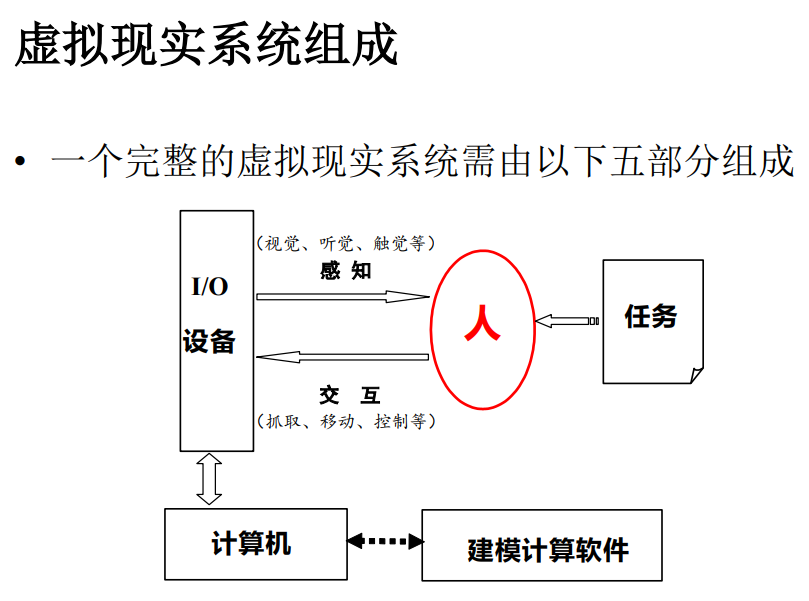
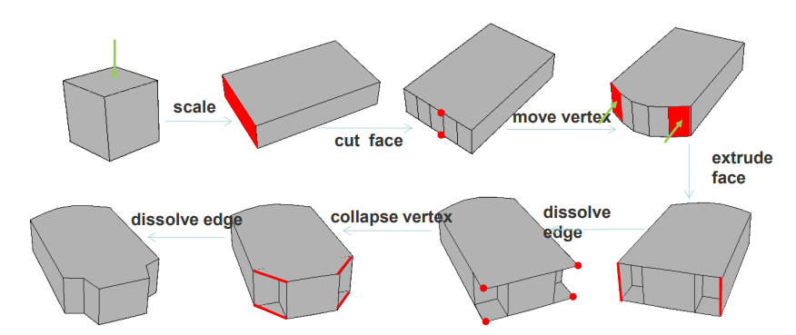

# 虚拟现实与数字娱乐

> 这期神了

## 虚拟现实系统组成

!!! note "VR 系统的 3I 特征"
    - 沉浸式 Immersion
    - 交互性 Interactivity 
    - 想象性 Imagination

## 多管道输入输出设备

### 立体显示设备

- 环幕
- 球幕
    - 原理：沉浸式大视角
- 立体眼镜
    - 原理：双目视差
- AR/VR头盔
- 3D立体显示器

### 触觉设备

力反馈手套：谁来了？

### 跟踪器

必备：头部跟踪器

## 建模简介

VR 中的建模：

- 在计算机内有效模拟、表示、构造、处理三维物体，完成各种模型的类似任务
- 几何建模、行为建模、物理建模

### 几何建模

!!! defination "多边形网格建模"

    由一个或多个基本体素开始，在通过对几何和拓扑不断修改，逐步构造复杂模型。

    

!!! defination "曲面造型"

    在曲面造型中，描述物体的三维模型有三种：

    - 线框模型（注重轮廓外形，运算简单）
    - 表面模型（注重几何描述，曲面）
    - 实体模型（注重几何体之间的拓扑关系）
        - 边界表示法（B-Rep）
        - 构造实体几何法（CSG）

!!! defination "过程式建模"

    从规则中程序化地生成模型

!!! defination "基于图像的建模"

    根据多幅实际拍摄的照片恢复其中的三维景物

!!! defination "基于点云的建模"

    从点云数据中构建模型

!!! defination "3D-AIGC"
    
    类比二维的文生图模型，结合3D/物理/规则等先验知识，从大量数据中“无中生有”地创建三维内容。

### 运动/行为建模

- 运动图：表达动画角色的运动能力的有向图；基本动作是动画角色运动的最小单位，一个基本动作对应有向图中的一个结点；有向边表示动作之间的衔接关系

### 物理建模

## 视觉计算

### 计算机图形学

数字图像 -> 画面

#### 渲染流水线

渲染流水线：它是图形图像从数据一步一步形成最终输出的画面所要经历的各种操作过程。数据经过一个操作后，被处理成下一个步骤需要的数据，最终一步一步整合成拼凑最终画面的元素。

#### 投影变换

#### 局部光照明

## 声觉计算

## 虚拟现实中的交互技术