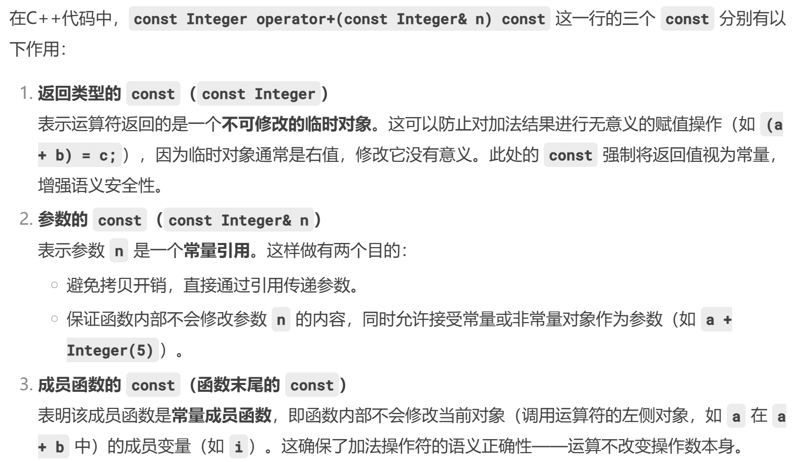

# 面向对象程序设计

> 任课教师：许威威

!!! note "Links"
    <https://tree.45gfg9.net/lcppthw/construct/>

## Lec1

c(onstruc)tor: 构造函数，函数名和类名相同

## Lec2


- 全局变量（Global Variable）：定义在函数外部的变量，使用 `extern` 关键字可以使用其他文件中定义的全局变量
    - 静态全局变量（Static Global Variable）：只能在当前文件中使用
- 局部变量（Local Variable）：定义在函数内部的变量，只能在函数内部使用
    - 静态局部变量（Static Local Variable）：其值在函数调用结束后不会改变，下次调用时仍然可以使用

### Pointer

```c++
std::string s;
```

创造了一个 `string` 类型的对象，调用了构造函数

```c++
std::string *p;
```

创造了一个指向 `string` 类型的指针，指向的 `string` 对象还没有被创建

### 动态分配内存

C++ uses `new` and `delete`

```c++
new <class_name>;
int* p = new int [10];
delete [] p;
```

返回申请内存的首地址（因此一般赋值给一个指针）（？）。和 `malloc` 不同的是，`new` 是创建了一个对象的实例，因此调用了其构造函数（`delete` 时也调用析构函数）

`a = new int [10]; delete [] a;` 释放 10 个 `int` 类型的内存，`delete a` 只释放一个 `int` 类型的内存

不同于 `free(NULL)`，`delete` 一个空指针是安全的

### Reference

```c++
char c;
char &r = c; // 并非取地址
```

Ref 定义时必须赋初值，且引用的对象不再改变（即后面如果出现给 `r` 赋值的操作，实际上是给 `c` 赋值）

- 不能 Ref Ref
- 不能存在指向 Ref 的指针（`char& *p // illegal`）
    - 可以有引用指针的 Ref（`char* &p // ok`）
- 没有 Ref 数组

### const

不允许修改

```c++
const int a = 10;
a = 20; // illegal
```

- Compile-time const: `const int a = 10;`，在编译时就确定了（是 symbol 的 entry）
- Run-time const: `cin >> x; const int a = x;`，在运行时才确定，例如接受用户输入

!!! note "Aggregates"
    `const int a[] = {1, 2, 3}; float f(a[1]);` 会报错，因为编译器在编译时不会深究 const 数组内部的东西


!!! note "Pointers"
    - `char * const q = "hello";` 指针 q 是 const，于是 `q++` 会报错，但是 `*q = 'x'` 不会
        - `char const* q` 大概率同理（可能因为不同编译器解释不同）
    - `const char* p = "hello";` `*p` 是一个 const char，于是 `*p = 'x'` 会报错

```c++
struct S {
  void f() { std::cout << "non-const\n"; }
  void f() const { std::cout << "const\n"; }
};

int main() {
  S a;
  const S b;

  a.f(); // non-const
  b.f(); // const

  const S *ps = &b;
  ps->f(); // const
}
// <https://tree.45gfg9.net/lcppthw/construct/#const>
```

`const` 出现在函数参数列表后说明这个函数影响 `this` 的类型，且不会改变任何成员变量:也不能调用该类中没有用const修饰的成员函数，只能调用常成员函数，这个规则也加于 const 对象上。

非常量对象也可以调用常成员函数，但是如果有重载的非常成员函数则会调用非常成员函数。


### Stash

- Typeless container
- 存储相同类型的对象
- 使用类型的大小初始化

### Deconstructor

当对象 Go out of scope 时，调用析构函数

!!! note "Initialization vs. assignment"
    - `Student::Student(string n) { name = n;}` : Assignment(Inside Constructor)
    - `Student::Student(string n) : name(n) {}` : Initialization(Before Constructor)

## Lec3

### Static

已知：当 static 修饰全局变量时，限制该变量的作用域为当前文件；当 static 修饰局部变量时，表示该变量的生命周期为整个程序运行期间。

static 还可以修饰成员变量，静态成员变量/函数由整个 Class 共享，非静态成员变量/函数由每个对象拥有，且静态成员变量必须在类外部被定义一次（类内部的 `static <type> <name>;` 只是声明）

```c++
struct rectangle {
  static int count;
  double width;
  double height;

  rectangle(double w, double h) : width {w}, height {h} {
    count++;
  }

  ~rectangle() {
    this->count--;
  }
};
int rectangle::count = 0; // must!

int main() {
  rectangle c1 {3, 4};
  std::cout << rectangle::count << "\n"; // 1
  rectangle c2 {5, 6};
  std::cout << c2.count << "\n"; // 2
}
// <https://tree.45gfg9.net/lcppthw/construct/#static>
```

### 拷贝构造函数

声明长这样：`T::T(const T& t);`

C++ 会提供一个默认的拷贝构造函数，拷贝对象的每个成员变量（memberwise copy），但是如果成员变量是指针类型，则只会拷贝指针的值（即地址），而不是指针所指向的内容
– Copies each member variable
    - Good for numbers, objects, arrays
– Copies each pointer
    - Data may become shared!

拷贝函数何时被调用？

- 在对象被 call by value 时，例如被传入函数参数时
- 在被赋值为另一个对象时
    - `T t2; T t1 = t2;`
- 在返回对象时，例如 `T rtsomething(){T t1("1"); return t1;} T whoami = rtsomething();`

### namespace

命名空间就是“更高级层面的”隔离，包含逻辑上的一组类、函数、变量

```c++
// Mylib.h
namespace MyLib {
    void foo();
    class Cat {
    public:
        void Meow();
    };
}
```

用 using namespace \<name\> 可以引入命名空间中的所有内容，但是可能导致命名冲突

可以用 `nameplace short = WhatALongNameplaceName;` 来 alias 一个很长的命名空间

!!! note "Nameplace Composition"
    用于合并命名空间，还可以解决命名冲突。

    ```c++
    namespace first { 
      void x(); 
      void y(); 
    } 
    namespace second { 
      void y(); 
      void z(); 
    }
    
    nameplace Mine {
        using namespace first;
        using namespace second;
        using first::y(); // 解决命名冲突
        ...
    }
    ```

可以在多个文件里给同一个命名空间添加内容

```c++
// lib1.h
namespace X {
    void foo();
}

// lib2.h
namespace X {
    void bar();
}

// 于是 X 有两个函数了
```

### 赋值兼容规则

- (1). 声明为指向基类对象的指针可以指向它的公有派生的对象，但不允许指向它的私有派生的对象。
- (2). 允许将一个声明为指向基类的指针指向其公有派生类的对象，但是不能将一个声明为指向派生类对象的指针指向其基类的一个对象。
- (3). 声明为指向基类对象的指针，当其指向公有派生类对象时，只能用它来直接访问派生类中从基类继承来的成员，而不能直接访问公有派生类中定义的成员。
- (4). 若想访问其公有派生类的特定成员，可以将基类指针用显示类型转换为派生类指针。

## 多态 Polymorphism

实现：函数重载、运算符重载、虚函数

### Binding 联编/绑定

把函数名与函数体的程序代码连接(联系)在一起的过程

- 静态联编：在编译阶段完成，实现编译时的多态，e.g. 函数重载、运算符重载，在编译时根据参数类型选择函数
- 动态联编：在运行阶段完成，实现运行时的多态，e.g. 虚函数

### 虚函数

虚函数是非 static 的成员函数，允许动态联编

派生类中对基类的虚函数进行重写时（这时的派生类中同名函数实则也称为**虚**函数，但是 virtual 可写可不写），要求派生类中说明的虚函数与基类中的被替换的虚函数之间满足如下条件：

- （1）与基类的虚函数有相同的参数个数；
- （2）其参数的类型与基类的虚函数的对应参数类型相同；
- （3）其返回值或者与基类虚函数的相同，或者都返回指针或引用，并且派生类虚函数所返回的指针或引用的基类型是基类中被替换的虚函数所返回的指针或引用的基类型的子类型。

如果派生类对象被 upcast 为基类对象（即将派生类对象的指针或引用转换为基类对象的指针或引用），那么在调用得到的基类对象的某个在派生类中被重写的普通成员函数时，只会调用基类中的函数，换句话说，派生类的一些信息被遗失了；这时如果需要这个基类对象保留对派生类成员函数的访问能力，就需要将基类中的成员函数声明为虚函数。

!!! note "usage of virtual func"
    在 delete 一个对象时，只会调用基类的析构函数，而不调用该对象所属派生类的析构函数，此时可以将基类的析构函数声明为 virtual

!!! warning "虚函数重写和普通函数重载的区别"
    在一个派生类中重新定义基类的虚函数是函数重载的另一种形式，但它不同于一般的函数重载。

    - 普通的函数重载时，其函数的参数个数或参数类型必须有所不同，函数的返回类型也可以不同。 
    - 当重载一个虚函数时，也就是说在派生类中重新定义虚函数时，要求**函数名、返回类型、参数个数、参数的类型和顺序**与基类中的虚函数原型完全相同。
    - 如果仅仅返回类型不同，其余均相同，系统会给出错误信息;
    - 若仅仅函数名相同，而参数的个数、类型或顺序不同，系统将它作为普通的函数重载，这时将丢失虚函数的特性。

    ```cpp
    #include<iostream.h>
    class Base
    {
    public：
        virtual void func1(); 
        virtual void func2();  
        virtual void func3();  
        void func4();          
    };
    class Derived：public Base 
    {
    public：
    virtual void func1(); // 标准的虚函数重写
    void func2(int x); //鉴定为重载
    char func3(); //鉴定为重载
    void func4(); //普通重载
    };
      void Base∷func1()
	{   cout<<"--Base func1--\n";	}
	void Base∷func2()
	{   cout<<"--Base func2--\n";	}
	void Base∷func3()
      { cout<<"--Base func3--\n"; }
	void Base∷func4()
	{   cout<<"--Base func4--\n"; }
	void Derived∷func1()
	{   cout<<"--Derived func1--\n";}
	void Derived∷func2(int x)
	{   cout<<"--Derived func2--\n";}
	void Derived∷func4()
	{   cout<<"--Derived func4--\n";}
	void main()
	{   Base d1，*bp;
	    Derived d2;
	    bp=&d2;
	    bp->func1();     	//调用Derived∷func1()
	    bp->func2();     	//调用Base∷func2()
	    bp->func4();     	//调用Base∷func4()
	}
    ```

### 纯虚函数

`virtual <type> <name>(<args>) = 0;`

- 抽象基类是一个至少包含一个纯虚函数的类，不能被实例化；派生类中必须重载基类中的纯虚函数，否则它仍将被看作一个抽象类。

```cpp
class  Shape {
public：
    virtual  void  rotateshape(int)=0;
    virtual  void  drawshape()=0;
    virtual  void  hiliteshape()=0;
    //…
};
Shape s1;         		//错误,不能建立抽象类的对象
Shape* ptr;       		//正确,可以声明指向抽象类的指针
Shape f();        		//错误,抽象类不能作为函数的返回类型
Shape g(shape s);		//错误,抽象类不能作为函数的参数类型
Shape& h(shape&); 	//正确,可以声明抽象类的引用
```

### 运算符重载

`+	-	*	/	%	^	&	|	~ =	<	>	+=	-=	*=	/=	%= ^=	&=	|=	<<	>>	>>=	<<=	== !=	<=	>=	!	&&	||	++	-- , ->*	->	()	[]` 可以重载

`.	.*	::	?: sizeof	typeid static_cast   dynamic_cast   const_cast  reinterpret_cast` 不行

()、[]、->、->* ，以及=等赋值运算符都必须被重载为成员函数，其余也可以选择重载为友元函数

```c++
class Integer { 
public: 
  Integer( int n = 0 ) : i(n) {} 
  const Integer operator+(const Integer& n) const{ 
      return Integer(i + n.i); 
  } 
  ...  
private: 
   int i; 
};

Integer x(1), y(5), z;
// z = x + y //ok
// z = x + 3 //ok
// z = 3 + x // illegal

// 前置：++a
const Integer& Integer::operator++() { 
    *this += 1;      // increment 
    return *this;    // fetch 
}  

// 后置：a++
const Integer Integer::operator++( int ){ 
    Integer old( *this );   // fetch 
    ++(*this);              // increment 
    return old;             // return  
}

```

!!! note "recall const"
    


全局写的有关一个类的运算符重载函数应当被设置为这个类的 friend，因为其要访问类的所有属性

!!! note "类型转换 ops 的重载"
    ```
    X::operator T ()
        –Operator name	is any type	descriptor
        –No	explicit arguments
        –No	return	type
        –Compiler will use it as a type conversion from X to T
    ```

重载函数的返回值不要求一定要和形参一致（例如重载分数类的加法，可以返回 double 类型的结果）

## Template

### 模板函数

在有多个函数声明和调用的函数函数名相同时，通过如下顺序选择调用的函数：

1. 参数完全匹配的普通函数
2. 参数完全匹配的模板函数
3. 可经过自动转化后参数类型匹配的普通函数
4. 若都找不到，Compile Error

### 模板类

```c++
template <typename T>

class Rmqc {
    ...
}
```

这样定义之后，注意 `Rmqc` 并不能算是一个**类**（只是一个模板），而 `Rmqc<int>` 才是一个（被实例化的）类

可以看出来模板是更高级别的一层抽象，类是模板的实例化，对象又是类的实例

这就解释了在继承时：

```c++
// 非模板类继承于模板类，需要实例化模板（确定typename）

template <typename T>
class Base {
    ...
}

class Derived : public Base<int> {
    ...
}

// 模板类继承于非模板类，直接继承

class Base {
    ...
}

template <typename T>
class Derived : public Base {
    
}

// 模板类继承于模板类，不用实例化模板，但要注明 typename T

template <typename T>
class Base {
    ...   
}

template <typename T>
class Derived : public Base<T> {
    ...
}
```

## Exception

通过 `throw` 和 `try-catch` 语句分离"异常的探测"和"异常的处理"

### 处理流程

异常处理的执行过程如下(from ljj ppt)：

- ①程序通过正常的顺序执行到达try语句，然后执行try块内的保护段。
- ②如果在保护段执行期间没有引起异常，那么跟在try块后的catch语句就不执行，程序从最后一个catch语句后面的语句继续执行下去。
- ③如果在保护段执行期间或在保护段调用的任何函数中(直接或间接的调用)有异常被抛掷，则从通过throw创建的对象中创建一个异常对象(隐含调用拷贝构造函数)，程序转到catch处理段 。
- ④如果匹配的catch处理器未找到，则terminate()将被自动调用，该函数的默认功能是调用abort终止程序。
- ⑤如果找到了一个匹配的catch处理程序，且它通过值进行捕获，则其形参通过拷贝异常对象进行初始化。在形参被初始化之后，“展开栈”的过程开始。这包括对那些在与catch处理器相对应的try块开始和异常丢弃地点之间创建的（但尚未析构的）所有局部对象的析构。 

可以在函数的声明中列出这个函数可能抛掷的所有异常类型，例如：`void fun() throw(A，B，C，D)`;

若无异常接口声明，则此函数可以抛掷任何类型的异常；

不抛掷任何类型异常的函数声明：`void fun() throw()`;

### 展开栈

在程序中，找到一个匹配的catch异常处理后，如果catch语句的异常类型声明是一个值参数，则其初始化方式是复制被抛掷的异常对象；如果catch语句的异常类型声明是一个引用，则其初始化方式是使该引用指向异常对象。

catch 传入的参数初始化结束后，开始展开栈，从 `try` 语句开始到**异常被抛出的地方**对构造但并未析构的对象进行析构（这一过程先于 catch 大括号块中的语句执行），且析构顺序与构造顺序相反。

`throw;` 可将当前正被处理的异常再次抛掷;

```cpp
try
{throwCSomeOtherException();}
catch(...)    //处理所有异常
{
   //对异常作出响应(也许仅仅是部分的)
   //...
   throw;   //将异常传给某个其它处理器
}
```

catch 不能单独使用，而 try 可以单独使用（只检查＆（可能地）抛出异常），解决逻辑（catch）或许会被放在别的函数中

### C++ 异常类