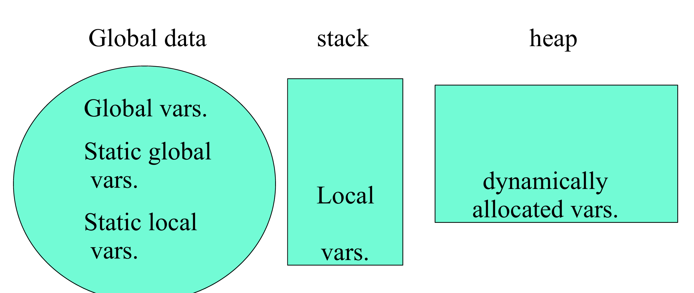

# 面向对象程序设计

> 任课教师：许威威

## Lec1

c(onstruc)tor: 构造函数，函数名和类名相同

## Lec2



- 全局变量（Global Variable）：定义在函数外部的变量，使用 `extern` 关键字可以使用其他文件中定义的全局变量
    - 静态全局变量（Static Global Variable）：只能在当前文件中使用
- 局部变量（Local Variable）：定义在函数内部的变量，只能在函数内部使用
    - 静态局部变量（Static Local Variable）：其值在函数调用结束后不会改变，下次调用时仍然可以使用

### Pointer

```c++
std::string s;
```

创造了一个 `string` 类型的对象，调用了构造函数

```c++
std::string *p;
```

创造了一个指向 `string` 类型的指针，指向的 `string` 对象还没有被创建

### 动态分配内存

C++ uses `new` and `delete`

```c++
new <class_name>;
int* p = new int [10];
delete [] p;
```

返回申请内存的首地址（因此一般赋值给一个指针）（？）。和 `malloc` 不同的是，`new` 是创建了一个对象的实例，因此调用了其构造函数（`delete` 时也调用析构函数）

`a = new int [10]; delete [] a;` 释放 10 个 `int` 类型的内存，`delete a` 只释放一个 `int` 类型的内存

不同于 `free(NULL)`，`delete` 一个空指针是安全的

### Reference

```c++
char c;
char &r = c; // 并非取地址
```

Ref 定义时必须赋初值，且引用的对象不再改变（即后面如果出现给 `r` 赋值的操作，实际上是给 `c` 赋值）

- 不能 Ref Ref
- 不能存在指向 Ref 的指针（`char& *p // illegal`）
    - 可以有引用指针的 Ref（`char* &p // ok`）
- 没有 Ref 数组

### const

不允许修改

```c++
const int a = 10;
a = 20; // illegal
```

- Compile-time const: `const int a = 10;`，在编译时就确定了（是 symbol 的 entry）
- Run-time const: `cin >> x; const int a = x;`，在运行时才确定，例如接受用户输入

!!! note "Aggregates"
    `const int a[] = {1, 2, 3}; float f(a[1]);` 会报错，因为编译器在编译时不会深究 const 数组内部的东西


!!! note "Pointers"
    - `char * const q = "hello";` 指针 q 是 const，于是 `q++` 会报错，但是 `*q = 'x'` 不会
        - `char const* q` 大概率同理（可能因为不同编译器解释不同）
    - `const char* p = "hello";` `*p` 是一个 const char，于是 `*p = 'x'` 会报错

### Stash

- Typeless container
- 存储相同类型的对象
- 使用类型的大小初始化

### Deconstructor

当对象 Go out of scope 时，调用析构函数

!!! note "Initialization vs. assignment"
    - `Student::Student(string n) { name = n;}` : Assignment(Inside Constructor)
    - `Student::Student(string n) : name(n) {}` : Initialization(Before Constructor)

## Lec3

### 拷贝