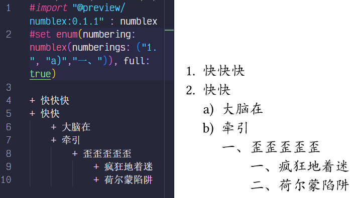
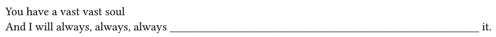

# Typst备忘录

!!! info "记录一下用typst写东西时碰到的问题"
    ~~天下苦LaTeX久矣~~

## 引用
`#import "a": b`相当于`import b from a`

## 画图
!!! info "注意"
    最好把`canvas`或者`diagram`包在一个`figure`里，既可以设置多个属性，又方便调整位置
### cetz
可看manual
```typst
#import "@preview/cetz:0.2.2"
#import cetz.draw: * //导入画画用的所有函数

#let graph = x => cetz.canvas(x) //创建画布，canvas接收一个大括号包起来的一堆绘画函数
//必须在画布上画，不然不会显示
#let node = (coord, name, location) => {
    circle(coord, name: name, radius: 0.5) //画圆，具体参数看manual
    content(coord, name, anchor: location) //写字，字的位置由location决定
} 
#let edge = (start, end) => line(start, end)
//缺点就在这，得自己定义函数
//Credit to Xecades，这几个函数是他写的
#graph({	
	node((0, 0), "A", "south")
	node((1, 1), "B", "north")
	edge("A", "B") //or edge((0, 0), (1, 1))
})
```
可用的anchor: `north`等四个，`north-west`等四个  

利用`set-style`设置各个函数的默认参数，比如`	set-style(line: (stroke:(thickness: 0.1pt)))`，这样就不用每次在`line`里单独设置了。（要在`canvas`里设置）
### fletcher
感觉比cetz更好用，把形状综合在了函数的参数里，可看manual
```typst
#import "@preview/fletcher:0.5.0": diagram, node, edge //几个函数
```
还在为cetz没法画两个点间方向相反的两条边，需要手动定义画点画边函数烦恼吗？
```typst
#diagram(
	let (a,b,c,d) = ((-2,0), (0.6,0), (-2,1.7), (0.6,1.7)),
	node(a, "A", stroke: 1pt), //stroke表示边框粗细
	node(b, [B], stroke: 1pt),
	node(c, [C], stroke: 1pt),
	node(d, [D], stroke: 1pt),
	edge(b, a, bend: -10deg,"-|>"), //bend表示弯曲程度，正负数弯的方向不同
	edge(a, b, bend: -10deg,"-|>"),
	edge(a, c, "-|>"),
	edge(b, d, "-|>", label: "WOW"), //label:边上的文字
	edge(d, a, "-|>"),

	node((2,3), [_Point to D_]),
	edge(d,[默认上一个node直接指向传入的node], "-|>"), 

	node((0,3), "Hello", stroke: 1pt),
	node-corner-radius: 10pt, //对整个diagram全局设置，不因为放在某个node前后而有所不同
	node((0,3.5), "Hello", stroke: 1pt),

	edge((4,0), (4,1), (5,1), (3,0), "-|>", `poly`), //一笔能拐好多弯
)
#diagram(
	node((0,5), "2nd Diagram", stroke: 1pt), 
	//另一个diagram中元素不会被其他diagram规定的style影响
	//位置会被其他diagram影响
)
```

## 排版
### numblex
导入：
```typst
#import "@preview/numblex:0.1.0": numblex //一般就用这个函数
```

在`enum`类中设置`numbering`属性可以设置列表的编号格式：  


但是如果想让外层不带括号，内层带括号（什么离散普物），就可以用numblex，做到给每一层都单独设置编号格式：  


### warp-content
这也有manual看的，嚯嚯嚯
```typst
#import "@preview/wrap-it:0.1.0": wrap-content
```
把图片塞进文字里，图文并茂啊嗯
```typst
#wrap-content(image("../docs/img/PP.png", fit: "stretch"),columns:(40%,50%))[
	My name is Pinkie Pie (Hello!)\
	And I am here to say (How ya doin'?)\
	I'm gonna make you smile and I will brighten up your day\
	It doesn't matter now (What's up?)\
	If you are sad or blue (Howdy!)\
	'Cause cheering up my friends is just what Pinkie's here to do\
	'Cause I love to make you smile, smile, smile\
	Yes I do\
	It fills my heart with sunshine all the while\
	Yes it does 
	From these happy friends of mine\
	I like to see you grin (Awesome!)\
	I love to see you beam (Rock on!)\
	The corners of your mouth turned up is always Pinkie's dream (Hoof bump!)\
	But if you're kind of worried\
	And your face has made a frown\
	I'll work real hard and do my best to turn that sad frown upside down
]
```
  
已知问题：会和`image`的`weight`,`height`冲突；脱离图片范围后换行会失效（如上图）  
用`columns:(a%,b%)`设置图片和文字的比例
## gentle-clues
```typst
#import "@preview/gentle-clues:1.0.0": *
```

预定义的块：  


看Manual！

## 杂
`repeat`函数返回一个无限重复，顶到页面最右侧的字符串，可以用来做填写处
```typst
#let answer = [#box(width: 1fr,repeat("_"))] //用box可以让它不换行
//如果后面还有内容就把内容顶到最右边
You have a vast vast soul \
And I will always, always, always #answer it.
```


`image`函数怎么用: 
```
image(
	str,
	format: autostr,
	width: autorelative,
	height: autorelative,
	alt: nonestr,
	fit: str,
) -> content
```

Table Decoration: https://typst.app/docs/guides/table-guide/