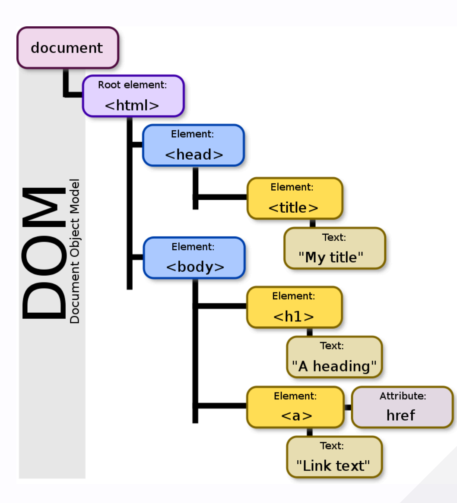

# HTML/CSS/JS, along with a series of WebDev, in CS571

## HTML

标签+闭合标签，也可以直接闭合：``

Document Object Model(DOM)：就是HTML的树形结构



## CSS

选择器：

| Example      | Description |
| -----------  | ----------- |
| #firstname   |Selects the element with **id** = "firstname"|
|.intro | Selects all elements with **class** = "intro"|
| p.intro | Selects \<p\> elements with **class** = "intro"|
| * | Selects all elements|
| p | Selects all \<p\> elements |
| div, p | Selects all \<div\> and \<p\> elements |

三种嵌入方式：

- 内联样式：`<element style="your-css-code"> </element>`
- 内部样式：`<head> <style> your-css-code </style> </head> <body> ...`
- 外部样式：`<head> <link rel="stylesheet" href="mystyle.css"> </head>`

## JavaScript
### 变量声明

| Keyword | Scope | Re-assignable? | Preferred? |
| ------- | ----- | -------------- | ---------- |
| var     | Function | Yes | No |
| let     | Block | Yes | Yes |
| const   | Block | No | Yes |

### 对象

对象类似于字典，键值对的集合。一样用`.`来访问对象的属性。

```javascript
let TeachingAssistant = {
    name: "Pinkie",
    age: 18,
};
console.log(TeachingAssistant);

// Output: { name: 'Pinkie', age: 18 }

// Two ways to access the property
console.log(TeachingAssistant.name);
console.log(TeachingAssistant["name"]);
```

这个键值对……就是 JSON 文件的由来（JavaScript Object Notation）。不过 JSON 里面的 Key 一定要用双引号括起来，由这种对应性就能知道 JS 对象里的键值实质上是字符串。

#### 数组

数组是对象的子集（神人语言）：键值对中的键是从 0 开始的 index，值是任意类型的数据。

Array 用中括号 `[]` 来声明，用索引来访问，类似 Python 有 `push` `pop` `shift` `unshift` 等方法。

### 函数

```javascript
// 传统派
function myFunction(p1, p2) {
    return p1 * p2;
} // 这种是全局函数，可以在任何地方调用（甚至在定义之前），有点6
// 下面两种就只能在定义之后调用了

// 维新派（Function Expression）
const myFunction = function(p1, p2) {
    return p1 * p2;
}

// 赛博派（Arrow Function）
const myFunction = (p1, p2) => {
    return p1 * p2;
}
```

一样是三种嵌入方式，可以在 `<head>` 里面写 `<script> your-js-code </script>`，也可以外部引入 `<script src="your-js-file.js"></script>`。

### How JS works

JS 操纵 DOM 这棵树，通过 `document` 对象来访问。比如 `document.getElementById("demo").innerHTML = "Hello World!";` 就是把 id 为 demo 的元素的内容改成 Hello World。

这里的 Element 指的是 HTML 元素。比如 `<p id="demo">Hello World!</p>`，那么这个元素就是一个 Element。

另一个重点是事件监听：`element.addEventListener("event", function);`，这里的`function`一般显示为`() => {so something}`，称为 Callback Function，只有在**事件触发**时才会执行。