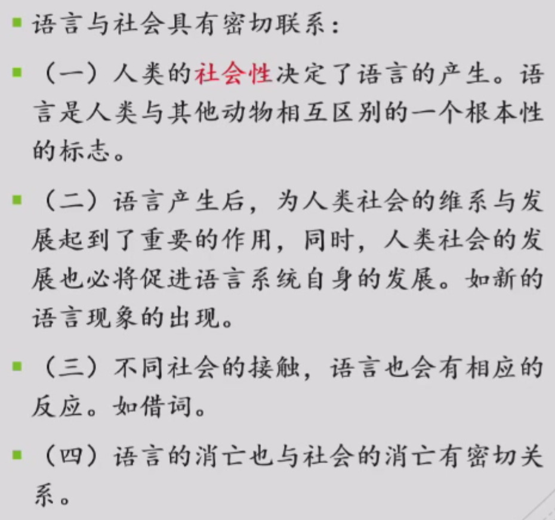
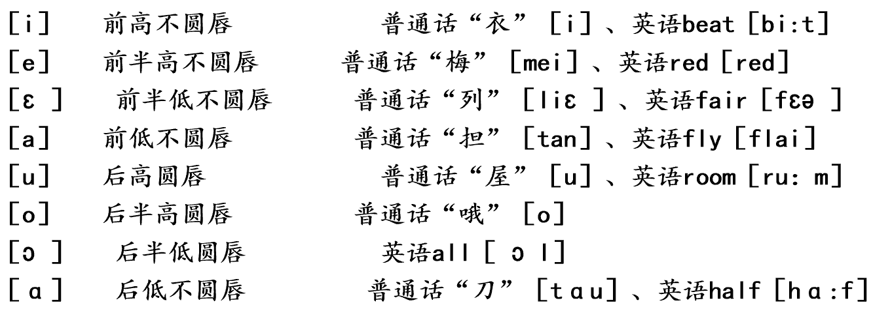

# 语言学基础

> 任课教师：彭利贞

!!! note "Link"
    <https://socralin.github.io/2025/02/12/Basic-Linguistics-Learning/>
    <https://file.cc98.org/v4-upload/d/2025/0116/eui35e2j.pdf>

!!! definition "语言学是什么"
    - 语音
    - 词汇
    - 语法
    - 语义
    - 语用
    - 文字（副产品）

!!! definition "什么是语言？"
    - 结构：语言是一种符号系统
        - 符号：用 A 表示 B，A 和 B 没有必然的联系（皮尔斯：图像、索引、象征）
    - 功能：语言是人类最重要的交际工具，是人类最重要的认知、思维工具
    - 基本符号：词
        - 发音+语义=符号<->现实中的对象
        - 语言=词＋规则

**口语**是语言的原始形式，**书面语**是在口语基础上产生并发展的。

- 语言的主要功能
    - 人类最重要的交际工具
    - 人类认知思维的工具
    - 传承文化的工具
- 语言的基本属性
    - 任意性
        - 语言符号的两个方面——声音和意义之间没有必然联系，音-义联系是由社会成员共同约定的
        - 像似性（iconicity）：部分符号意义的理解有迹可循，例如布谷（布谷鸟的叫声）
    - 线（条）性
        - 组成成分（一般为词）按照线性排列的方式表达含义
        - 口头上表现为只能以时间先后为序说出来
        - 书面上表现为只能以单向线状排列记录文字
    - 系统性
        - 符号处于一定关系之中
        - 语言符号可以分解
            - 篇章-句群-句子-短语-词-词素
        - 层次性：底层是音位，上层是音义结合的符号序列（语素-词-句子）
    - 社会性
        - 
    - 文化性
        - 不同的民族/地域对声音表达的意义有不同的理解
        - 对同一个对象，不同的民族/地域有不同的认识
        - 对某一个现象或主观认识，不同语言里的认识属性基本相同，但可能在附属色彩上有所不同
        - 表现在语言单位的组合手段上

## 语音

语音：由人发出的、表达语义的声音。语言的各种意义，语言符号的各级单位都必须通过具体的声音形式来表达。

- 物理属性：
    - 音高
    - 音强
        - 普通话里的轻声就与音强有关：哥哥、姐姐
    - 音长
    - 音质 
        - 声音的特色，取决于声波振动的形式。
        - 影响音色的主要因素：
            - 发音体：如，不同的乐器；人的发音器官的不同部位：声带：元音/浊辅音 | 清辅音；口音|鼻音
            - 发音方法：如，同一种乐器不同演奏方法：爆破音 –磨擦音；送气|不送气
- 生理属性
    - 肺、喉头、声带等
- 社会属性
    - 首先，语音是人类利用声音来传递复杂的意义的，这与其他动物简单地利用鸣叫来表示意图有根本的不同。 
    - 其次，人类语音在声音形式与意义的关联上没有必然性，而是随着民族或地域的不同而不同。 
    - 最后，不同民族语言里，语音单位的形式和数量及其作用是不完全相同的。   

### 音素
    
音素是从音质角度划分出来的最小的语音单位（感觉就是音标）

元音 vs 辅音，你知道吗？

| | 阻碍 | 声带振动 | 发音器官紧张 | 气流 |
|---|---|---|---|---|
| 元音 | 无 | 振动 | 均衡 | 弱 |
| 辅音 | 有 | 清辅音不振动浊辅音振动（也是区分清浊音的依据） | 局部 | 强 |

#### 元音分析

从舌位的高低、舌头的伸缩、唇形的圆展三个方面进行分析。

基本元音（作为元音的标准与定位）：

#### 辅音分析

从发音的部位、发音方法（（1）成阻与除阻（2）声带是否振动（3）是否送气）两个方面进行分析。

!!! note "发音部位"
    - 双唇：[p]、[p']、[m] 
    - 唇齿：[f]、[v] 
    - 齿间：[θ]、[ð] 
    - 舌尖：后[tʂ]、[tʂ']、[ʂ] ，前[ts]、[ts'] [s]，中[t]、[l]  
    - 舌面：[tɕ] 、[tɕ']、[ɕ]
    - 舌叶：[ʧ]、[ʃ]、[ʒ] 
    - 舌根：[k]、[k']、[x]
    - 小舌：[R]
    - 声门：[ʔ]

!!! note "发音方法"
    塞音：[p]、[b]
    擦音：[s]、[f]
    塞擦音：[ts]、[ts']、[s]
    鼻音：[m]、[n]、[ŋ]
    边音：[l]
    颤音：（滚音）[R]
    闪音：[ɾ]

清辅音 vs 浊辅音

### 音位

先补充一下音位和音素的区分：

音素是从音质角度划分出来的最小的语音单位，再小的声音都可以继续分成两个听起来不同的音素，

!!! note "Reference"
    对任何一个语音组合的片段进行切分，到最后都会得到一些不能再往更小的单位切分的最小的语音单位，切分出来的这种最小单位，只要从音色上看有区别，就是两个不同的音素。从这种意义上来说，一种语言系统的音素是无穷的。 

只要听起来不同就算不同的音素，这让人想起了什么？拼音，对于韵母可以说是不同声调对应不同音素；于是我们规定这四个音素 $\{\bar{a}, \acute{a}, \check{a}, \grave{a}\}$ 成为一个更大的单位——音位。

!!! definition "音位"
    把**不能相互区别意义**的音素归为一类，就得到了音位。

#### 语流音变

处于具体语音流中的音素以及声调等语音要素，会受到邻近音的影响

- 同化：
    - 两个相邻的音，后一个受前一个的影响，变得与前一个音相同或相近，称顺同化。（dogs [dɔg**z**], looked [lʊ:k**t**] 中末尾的清/浊音变为与前面相邻浊/清音一样的读音）
    - 后面的音同化前面的音：两个相邻的音，前一个受后一个的影响，变得与后一个音相同或相近，称逆同化。
        - 干嘛？gan ma? -> ga**m** ma？
        - be in poor health -> be [i**m**] poor health
- 异化：原本相近/相同的发音变为不同
    - 例如三声接二声，三声读作二声：选举（xu**á**n jǔ）
- 弱化：如普通话的轻声
- 脱落：语流中有些音在连读时因缩并等原因而不再发音或消失的现象。
    - 最简单如英文的缩写：I am -> I'm
    - 豆腐（dou f），这里 u 被省略了
- 增音：在多个音节或由多个音节构成的复杂语流连续发音时，有时候会增加原本没有的音素。这种现象多发生于句子中。
    - 英语中的连读
    - 你快看啊（a）->你快看 **n** 啊（读作 na）

## 词汇