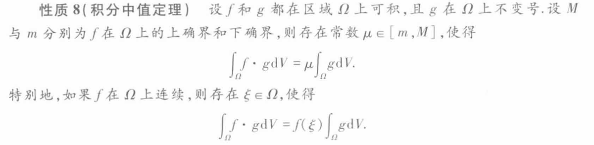
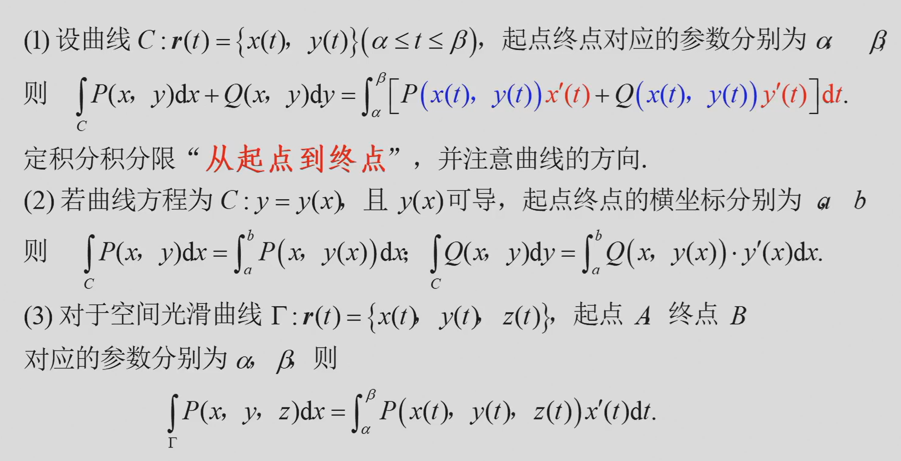
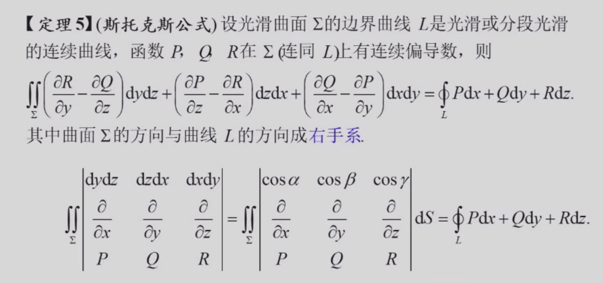
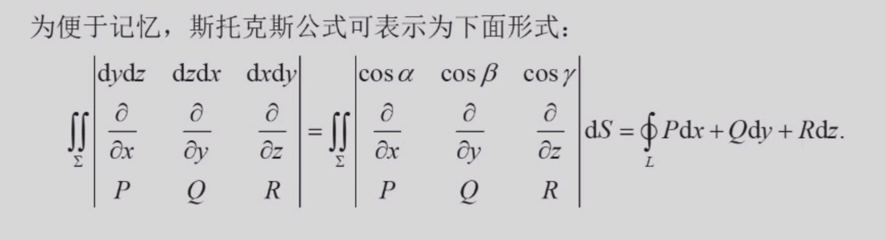

# 数学分析Ⅱ

> 任课教师：阮火军

!!! abstract "成绩组成"
    - 作业+点名 20%  
    - 小测 20%  
    - 期末 60%  
  
## 级数
### 重要级数
$$
\begin{align*}
&\sum_{n=1}^{\infty} q^{n-1} = \frac{1}{1-q} \\
&亦即等比级数，在-1<q<1时收敛，和为\frac{1}{1-q} \\
&\sum_{n=1}^{\infty} \frac{1}{n^p}收敛当且仅当p>1 \\
&亦即p级数 \\
\end{align*}
$$

### 级数性质
线性性：$\sum_{n=1}^{\infty} (\alpha x_n + \beta y_n) = \alpha \sum_{n=1}^{\infty} x_n + \beta \sum_{n=1}^{\infty} y_n$  
其中级数均**收敛**，$\alpha,\beta$为常数

结合性：**收敛**级数和中任意添加括号，其和不变  
这是因为新级数的部分和数列是原级数的部分和数列的子列  

一些充分/必要条件：

$$
\begin{align*}
&\sum_{n=1}^{\infty} x_n收敛 \Leftrightarrow \{S_n\}收敛 \\
&\Leftrightarrow (Cauthy准则) \forall \epsilon > 0, \exists N > 0, 当m>n>N时，有|S_m-S_n|<\epsilon \\
&\Leftrightarrow \forall \epsilon > 0, \exists N > 0, 当n>N时，有|\sum_{k=n+1}^{n+p} x_k|<\epsilon \\
&由此可见，增删改级数的有限项不影响收敛性\\
&取p=1，即得\{x_{n+1}\}<\epsilon，亦即\lim_{n \to \infty} x_n = 0(必要条件) \\
\end{align*}
$$

### 判别级数敛散的方法 
1. 定义法，判断${S_n}$是否收敛
2. 利用必要条件先判断${x_n}$是否收敛于0
3. 柯西收敛准则
4. 收敛+发散=发散，收敛+收敛=收敛
#### 正项级数专属：
由于$S_n$单调递增，所以$\sum_{n=1}^{\infty} x_n$收敛的充要条件是$\{S_n\}$有上界

1. 比较判别法（$A$为正数）：  
    - 若$\forall n \ge 1, 0 \le x_n \le Ay_n$，且$\sum_{n=1}^{\infty} y_n$收敛，则$\sum_{n=1}^{\infty} x_n$收敛  
    - 大的收敛，小的也收敛
    - 若$\forall n \ge 1, 0 \le x_n \le Ay_n$，且$\sum_{n=1}^{\infty} x_n$发散，则$\sum_{n=1}^{\infty} y_n$发散  
    - 小的发散，大的也发散  
    - 由于修改级数的有限项后级数敛散性不变，因此上述条件可以只对从某个$N_0$后开始的项成立，即$\forall n \ge 1$可以变为$\exists N_0 \ge 0, \forall n \ge N_0$

2. 比较判别法的极限形式：  
    - 若$\lim_{n \to \infty} \frac{x_n}{y_n} = l (0 \le l \le +\infty)$，则  
        - 若$0 < l < +\infty$，则$\sum_{n=1}^{\infty} x_n$与$\sum_{n=1}^{\infty} y_n$同敛散
        - 若$l=0$，则$x_n$趋于0的速度更快，充分大项后$x_n$更小，则$\sum_{n=1}^{\infty} y_n$收敛$\Rightarrow \sum_{n=1}^{\infty} x_n$收敛  
        - 若$l=+\infty$，则$x_n$趋于0的速度更慢，充分大项后$x_n$更大，则$\sum_{n=1}^{\infty} y_n$发散$\Rightarrow \sum_{n=1}^{\infty} x_n$发散

??? 例
    - 判断$\sum_{n=1}^{\infty} 2^n \sin \frac{\pi}{3^n}$的敛散性:  
        与收敛级数$\pi(\frac{2}{3})^n$比较  
        $\frac{2^n \sin \frac{\pi}{3^n}}{\pi(\frac{2}{3})^n} = \frac{\sin \frac{\pi}{3^n}}{\frac{\pi}{3^n}} \rightarrow 1 (n \rightarrow \infty)$  
        因此$\sum_{n=1}^{\infty} 2^n \sin \frac{\pi}{3^n}$收敛  
    - 判断$\sum {(\sqrt[n]{a} - 1)} (a > 1)$的敛散性：  
        对$a^x$泰勒展开：$a^x = 1 + x\ln a + o(x)$  
        因此$\sqrt[n]{a} - 1 = \frac{\ln a}{n}+o(\frac{1}{n})$  
        因此$\frac{\sqrt[n]{a} - 1}{n} \rightarrow \ln a (n \rightarrow \infty)$，而$\sum \frac{1}{n}$发散，因此$\sum {(\sqrt[n]{a} - 1)}$发散  
    - 变式：判断$\sum_{n=1}^{\infty} (a^\frac{1}{n}+a^{-\frac{1}{n}}-2)$的敛散性：  
        分别泰勒展开到二阶：    
        $a^\frac{1}{n} = 1 + \frac{\ln a}{n} - \frac{\ln^2 a}{2n^2} + o(\frac{1}{n^2})$  
        $a^{-\frac{1}{n}} = 1 - \frac{\ln a}{n} - \frac{\ln^2 a}{2n^2} + o(\frac{1}{n^2})$  
        因此$\frac{a^\frac{1}{n}+a^{-\frac{1}{n}}-2}{\frac{\ln^2 a}{n^2}} \rightarrow 1 (n \rightarrow \infty)$，因此$\sum_{n=1}^{\infty} (a^\frac{1}{n}+a^{-\frac{1}{n}}-2)$收敛

由比较判别法，可以得到下面两种判别法： 

3. 根式判别法：  
    - 若$\lim_{n \to \infty} \sqrt[n]{x_n} = q$，则  
        - 若$q<1$，$\sum_{n=1}^{\infty} x_n$收敛  
        - 若$q>1$，$\sum_{n=1}^{\infty} x_n$发散   
            - 此时$\lim_{n \to \infty} \sqrt[n]{x_n}>1$，有无穷多项$x_n$都大于1
            - 因此$x_n$不趋于0，级数发散。
        - 若$q=1$，无法判断

4. 比值判别法：  
    - 若$\lim_{n \to \infty} \frac{x_{n+1}}{x_n} = q$，则  
        - 若$q<1$，$\sum_{n=1}^{\infty} x_n$收敛  
        - 若$q>1$，$\sum_{n=1}^{\infty} x_n$发散  
        - 若$q=1$，无法判断

3和4实际上是同一个意思，考虑到$\lim_{n \to \infty} \frac{x_{n+1}}{x_n} = \lim_{n \to \infty} {\sqrt[n]{x_n}}$，所以两者是等价的  

??? 例
    - 判断$\sum_{n=1}^{\infty} n^{2}e^{-n}$的敛散性：  
        $\sqrt[n]{n^{2}e^{-n}} = \sqrt[n]{n^{2}}\sqrt[n]{e^{-n}} = e^{-1}n^{\frac{2}{n}} \rightarrow e^{-1} < 1 (n \rightarrow \infty)$，因此$\sum_{n=1}^{\infty} n^{2}e^{-n}$收敛
    - 判断$\sum_{n=1}^{\infty} \frac{n^n}{3^{n}n!}$的敛散性：  
        $\frac{x_{n+1}}{x_n} = \frac{(n+1)^{n+1}3^{n}n!}{3^{n+1}(n+1)!n^{n}} = \frac{(n+1)^{n}}{3n} \rightarrow \frac{1}{3} < 1 (n \rightarrow \infty)$，因此$\sum_{n=1}^{\infty} \frac{n^n}{3^{n}n!}$收敛
    - 由于3和4本质一样，注意就题目选择更简单的方法

5. 积分判别法：  
    - 若$f(x)$在$[1,+\infty)$上连续，且$f(x) \ge 0$，$f(x)$单调递减，则$\sum_{n=1}^{\infty} f(n)$与$\int_{1}^{\infty} f(x)dx$同敛散

#### 交错级数
定义：级数$\sum_{n=1}^{\infty} (-1)^{n+1}u_n$称为交错级数,其中$u_n \ge 0$  

1. 交错级数的$Leibniz$判别法：  
    - 若$\{u_n\}$单调递减，且$\lim_{n \to \infty} u_n = 0$，则$\sum_{n=1}^{\infty} (-1)^{n+1}u_n$收敛

??? 例
    - 下述四个级数均收敛，证明略
        - $\sum_{n=1}^{\infty} \frac{(-1)^{n+1}}{n^p}(p>0)$
        - $\sum_{n=2}^{\infty} \frac{(-1)^{n}}{(\ln n)^q}(q>0)$
        - $\sum_{n=2}^{\infty} \frac{(-1)^{n}\ln n}{n}$
        - $\sum_{n=1}^{\infty} \frac{(-1)^{n+1}n^2}{n^3+1}$

### 绝对收敛与条件收敛
定义：若$\sum_{n=1}^{\infty} |x_n|$收敛，则$\sum_{n=1}^{\infty} x_n$收敛，称后者绝对收敛（**超级收敛！**）。  
由$\sum_{k=n+1}^{n+p} x_k \le ||x_{n+1}|+\dots +|x_{n+p}|| \le \epsilon$既得。  
若$\sum_{n=1}^{\infty} x_n$收敛，而$\sum_{n=1}^{\infty} |x_n|$发散，则称前者条件收敛。  

??? 例
    - 判断$\sum_{n=1}^{\infty} \frac{x^{n}}{n^p}$的敛散性：  
      - 利用条件/绝对收敛，令$u_n = abs(\frac{x^{n}}{n^p}) = \frac{|x|^n}{n^p}$  
      - 利用根式判别法，$\sqrt[n]{u_n} = \frac{|x|}{n^{\frac{p}{n}}} \rightarrow |x| (n \rightarrow \infty)$
      - 因此，当$|x|<1$时，$\sum_{n=1}^{\infty} \frac{x^{n}}{n^p}$绝对收敛
      - 当$|x|>1$时，$\frac{x^n}{n^p}\rightarrow \infty$,$\sum_{n=1}^{\infty} \frac{x^{n}}{n^p}$发散
      - $x = 1$时，原级数为p级数，当$p>1$时绝对收敛，当$p \le 1$时发散
      - $x = -1$时，原级数为交错级数$\sum_{n=1}^{\infty} \frac{(-1)^{n}}{n^p}$
        - $p>1$时，级数的绝对值收敛，级数本身由$Liebniz$判别法收敛，因此绝对收敛。
        - $0< p \le 1$时，级数的绝对值发散，级数本身由$Liebniz$判别法发散，因此条件收敛。
        - $p \le 0$时，$\frac{(-1)^n}{n^p}$不趋向于0，级数发散

#### 有用的引论
$Abel变换$:对于数列$a_n$,$b_n$，记$A_n,B_n$分别为其前n项和，  
则$\sum_{k=1}^{n} a_k b_k = A_n B_n + \sum_{k=1}^{n-1} B_k(a_{k}-a_{k+1})$  

$Abel引理$:记$B^{\ast}=\max \{|B_k|,1 \le k \le n\}, a^{\ast} = \max \{|a_k|,1 \le k \le n\}$  
上个段落变换后的式子  
$\le |a_1-a_2||B_1|+|a_2-a_3||B_2|+\dots+|a_{n-1}-a_n||B_{n-1}|+|a_n||B_n|$  
$\le (|a_1-a_2|+|a_2-a_3|+\dots+|a_{n-1}-a_n|+|a_n|)B^{\ast}$  
当$a_n$单调时，$a_1 - a_2$,$a_2 - a_3$,$\dots$,$a_{n-1} - a_n$同号。  
**因此先取绝对值在求和等于先求和再取绝对值。**  
因此上式 $= (|a_1 - a_n|+|a_n|)B^{\ast} \le 3a^{\ast}B^{\ast}$  

得到引理: 若(1)$a_n$单调，(2)$B_n$为$b_n$前n项和  
记$B^{\ast}=\max \{|B_k|,1 \le k \le n\}, a^* = \max \{|a_k|,1 \le k \le n\}$，则$\sum_{k=1}^{n} a_k b_k \le 3a^{\ast}B^{\ast}$  

- 由引论可推出下述定理：
  + Dirichlet判别法：若$\{a_n\}$单调趋于0，$\sum b_n$有界（$b_n$的部分和数列有界），则$\sum_{n=1}^{\infty} a_n b_n$收敛
  + Abel判别法：若$\{a_n\}$单调有界，$\sum b_n$收敛，则$\sum_{n=1}^{\infty} a_n b_n$收敛  

??? 例
    + 若$a_n$单调递减且趋向于0，求证$\forall x \in [0,2\pi]$，$\sum_{n=1}^{\infty} a_n \sin nx$收敛  
        - 由$Dirichlet$判别法，只需证明$\sum \sin nx$有界  
        - (trick-积化和差)对形如$\sin kx$的数列求和，乘上一个$2\sin \frac{x}{2}$，得到$2\sin \frac{x}{2} \sin kx = \cos(k-\frac{1}{2})x-\cos(k+\frac{1}{2})x$  
        - 因此,$2\sin \frac{x}{2} \sum \sin kx = \sum (\cos (k-\frac{1}{2})x-\cos (k+\frac{1}{2})x) = \cos \frac{x}{2}- \cos (n+\frac{1}{2} )x$
        - 因此$\forall n \ge 1, |2 \sin \frac{x}{2}\sum \sin kx| = |\cos \frac{x}{2}- \cos (n+\frac{1}{2} )x| \le 2$
        - 因此$|\sum \sin kx| \le \frac{1}{|\sin \frac{x}{2}|}(有界)$    
        - 由Dirichlet判别法，$\sum_{n=1}^{\infty} a_n \sin nx$收敛
    + 若$\sum b_n$收敛，则下述级数都收敛： 
        - $\sum \frac{b_n}{n^p}$
        - $\sum \frac{b_n}{\sqrt{n+1}}$
        - $\sum b_n (1+\frac{1}{n})^n$

#### 绝对收敛与条件收敛的性质
若$\sum_{n=1}^{\infty} x_n$绝对收敛，则$\sum_{n=1}^{\infty} x_n^{+}$与$\sum_{n=1}^{\infty} x_n^{-}$均绝对收敛。  
若$\sum_{n=1}^{\infty} x_n$条件收敛，则$\sum_{n=1}^{\infty} x_n^{+}$与$\sum_{n=1}^{\infty} x_n^{-}$均发散。  

### 级数的重排
定义：设$\varphi$是$N^{\ast}$上的双射，称级数$\sum_{n=1}^{\infty} x_{\varphi(n)}$是级数$\sum_{n=1}^{\infty} x_n$的重排。  
亦即对级数进行加法交换律。  

定理：若$\sum_{n=1}^{\infty} x_n$绝对收敛，则$\sum_{n=1}^{\infty} x_{\varphi(n)}$也绝对收敛，且其和与原级数相同。  

$Riemann定理$:若$\sum_{n=1}^{\infty} x_n$条件收敛，则一定存在某个重排$\sum_{n=1}^{\infty} x_{\varphi(n)}$，使得其和为任意给定的实数。  

### 级数的乘积
1. $Cauchy$乘积：$\sum_{n=1}^{\infty} a_n \sum_{n=1}^{\infty} b_n = \sum_{n=1}^{\infty} (a_1 b_n + a_2 b_{n-1} + \dots + a_n b_1)$ (排成矩阵后的第n条对角线上的元素和)  
2. 正方形乘积：$\sum_{n=1}^{\infty} a_n \sum_{n=1}^{\infty} b_n = \sum_{n=1}^{\infty} (a_1 b_n + a_2 b_n + \dots + a_n b_n +a_n b_{n-1} + \dots + a_n b_1)$(排成矩阵后的第n列到第n行组成的直角上的元素和)  

#### Cauchy定理
设$\sum a_n$与$\sum b_n$绝对收敛于A,B，  
则对于由所有乘积$a_i b_j$任意排序再求和得到的级数也绝对收敛，  
且其和等于AB。 

## 函数列与函数项级数
定义：$f_1,f_2,\dots,f_n,\dots$是定义在$E$上的函数，  
则$\{f_n\}$为$E$上的一个函数列。
$\forall x \in E$，若$\{f_n(x)\}$收敛于$f(x)$，则称$\{f_n\}$收敛于$f$，记为$f_n \rightarrow f$

若$x_0 \in E$，所有$\{f_n(x_0)\}$都收敛于$f(x_0)$，则称$\{f_n\}$在$x_0$处收敛于$f(x_0)$，记为$f_n \rightarrow f(x_0)$  
点集$\{x \in E \mid \{f_n(x)\} 收敛\}$称为$\{f_n\}$的收敛域  

点态收敛：$\forall x \in D, \forall \epsilon > 0, \exists N(\epsilon ,x) > 0, 当n>N(\epsilon ,x)时，有|f_n(x)-f(x)|<\epsilon$  
一致收敛：$\forall \epsilon > 0, \exists N(\epsilon) > 0(与x无关), 当n>N(\epsilon)时，有|f_n(x)-f(x)|<\epsilon$，记为$f_n \rightrightarrows f$  
不一致收敛：$\exists \epsilon_0 > 0, \forall N > 0, \exists n>N, 使得|f_n(x)-f(x)| \ge \epsilon_0$
一致收敛必定点态收敛。

??? 例
    - 证明$f_n(x) = x^n 在[0,1]$不一致收敛  
        - $f(x) = \lim_{n \to \infty} x^n = \begin{cases} 0 & x \in [0,1) \\ 1 & x = 1 \end{cases}$
        - 取$\epsilon_0 = \frac{1}{2}$，则$\forall N > 0$, 令$n = N+1$, 令$x = \sqrt[n](\frac{1}{2})$
        - 则$|f_n(x)-f(x)| = \frac{1}{2} \ge \epsilon_0$
    - 而这个函数在$[0,1-\delta],\forall \delta \in (0,1)$上一致收敛
        - $\forall x \in [0,1-\delta], |f_n(x)-f(x)| = x^n \le (1-\delta)^n \le (1-\delta)^N = \epsilon (取N=\frac{\ln \epsilon}{\ln (1-\delta)})$

### 柯西收敛准则（典中典）
定义：$\{f_n\}$在$E$上一致收敛的充要条件是$\forall \epsilon > 0, \exists N(\epsilon) > 0, 当m,n>N(\epsilon)时，有|f_n(x)-f_m(x)|<\epsilon$  
由此可推出另一充要条件：记$\sup_{x \in E} |f_n(x)-f(x)| = M_{n}$，则$\{f_n\}$在$E$上一致收敛的充要条件是$\lim_{n \to \infty} M_{n} = 0$

??? 例
    - 判断$f_n(x) = nxe^{-nx^2}$在$R$上的一致收敛性
    - （配凑$nx^2$）$\lim_{n \to \infty} nxe^{-nx^2} = \frac{1}{x} \lim_{n \to \infty} \frac{nx^2}{e^{nx^2}} = \frac{1}{x} 0 = 0$
    - 因此极限函数$f(x) = 0$,$f_n(x)-f(x) = f_n(x)$  
    - 求导得$f_n'(x) = ne^{-nx^2}(1-2nx^2)$，令$f_n'(x) = 0$得$x = \frac{1}{\sqrt{2n}}$，此为最大值点
    - 则$M_n = f_n(\frac{1}{\sqrt{2n}})$，不趋于0.

### D-A判别法
函数项级数$\sum_{n=1}^{\infty} a_n b_n$满足以下两个条件之一时，其在$E$上一致收敛：

- $\{a_n(x)\}$对每一固定的$x \in E$关于$n$单调，且在$E$上一致有界，$\sum_{n=1}^{\infty}b_n(x)$在$E$上一致收敛。（Abel判别法）
- $\{a_n(x)\}$对每一固定的$x \in E$关于$n$单调，且在$E$上一致收敛于0，$\sum_{n=1}^{\infty}b_n(x)$的部分和数列$\sum_{k=1}^{n}b_k(x)$在$E$上一致有界。（Dirichlet判别法）

## 幂级数
定义：形如$\sum_{n=0}^{\infty} a_n(x-x_0)^n = a_0 + a_1(x-x_0)+ \cdots$的函数项级数称为幂级数  

只需研究$\sum a_n x$的性质。

- Abel第一定理：
    - 若上述幂级数在点$x=\xi$处收敛，则对于任意$|x|<|\xi|$，幂级数在点$x$处绝对收敛  

由此得到收敛半径的定义：

- 令$R = \sup \{ |x| \mid \sum_{n=0}^{\infty} a_n x^n 收敛 \}$，称$R$为幂级数的收敛半径
- $(-R,R)$称为幂级数的收敛区间
- 定理：若$\lim_{n \to \infty} \sqrt[n]{|a_n|} = A$，则$R = \frac{1}{A} = \begin{cases} 0 & A = +\infty \\ +\infty & A = 0 \\ \frac{1}{A} & 0 < A < +\infty \end{cases}$
- 推论：若$\lim_{n \to \infty} \frac{|a_{n+1}|}{|a_n|} = A$，则$R = \frac{1}{A}$
- 收敛域：单独探讨$x=R$与$x=-R$的收敛性后加到收敛区间内

- Abel第二定理：
    - 若幂级数$\sum_{n=0}^{\infty} a_n x^n$的收敛半径为$R>0$，则其在$(-R,R)$中内闭一致收敛
    - 若其在$x=R$处收敛，则其在$[0,R]$上一致收敛；若其在$x=-R$处收敛，则其在$[-R,0]$上一致收敛

性质：

- 连续性：幂级数在其收敛区间内连续
- 可积性：$\forall [a,b] \subset (-R,R)$，幂级数的和函数在$[a,b]$上可积，且$\int_{a}^{b} \sum_{n=0}^{\infty} a_n x^n dx = \sum_{n=0}^{\infty} a_n \int_{a}^{b} x^n dx$
    - 推论：取$a=0$, $b=x$，得$\int_{0}^{x} \sum_{n=0}^{\infty} a_n t^n dt = \sum_{n=0}^{\infty} \frac{a_n}{n+1} x^{n+1}$
        - 上面这个级数的收敛半径$\ge$原级数的收敛半径

??? 例
    $\sum_{n=0}^{\infty} x^n$的收敛域为$(-1,1)$  
    逐项积分得$\sum_{n=0}^{\infty} \frac{1}{n+1} x^{n+1}$的收敛域为$[-1,1)$

- 可微性：幂级数的和函数在其收敛区间内可导，且导函数为逐项求导，求导后收敛半径不变
    - 推论：取$a=0$, $b=x$，得$\sum_{n=0}^{\infty} a_n x^n$的和函数的导函数为$\sum_{n=0}^{\infty} a_n n x^{n-1}$

### 幂级数展开
设$f$是$\sum a_n (x-x_0)^n$在(x_0 - r,x_0 + r)上的和函数，则$f$在该区间任意阶可导，且$f^{(k)}(x) = n(n-1) \cdots (n-k+1)a_n(x-x_0)^{n-k}$    
代入$x = x_0$, 得到$f^{(k)}(x_0) = k!a_k$，因此$a_k = \frac{f^{(k)}(x_0)}{k!}$，这说明幂级数各项的系数由和函数在$x_0$的各阶导数决定  

得泰勒级数：$f(x) = \sum_{n=0}^{\infty} \frac{f^{(n)}(x_0)}{n!}(x-x_0)^n$，$x_0 = 0$时称为麦克劳林级数

- 此时有Lagrange余项：$R_n(x) = \frac{f^{(n+1)}(\xi)}{(n+1)!}x^{n+1}$，$\xi \in (0,x)$, 
- 积分型余项：$R_n(x) = \int_{0}^{x} \frac{(x-t)^n}{n!}f^{(n+1)}(t)dt$
- Cauchy余项：$R_n(x) = \frac{1}{n!} f^{(n+1)}(\theta x)(1-\theta)^n x^{n+1}$，$\theta \in (0,1)$

定理（判断和函数的存在性）：

- 若$\exists M > 0, \forall x \in (x_0 - r,x_0 + r)$, 当$n$充分大时有$|f^{(n)}(x)| \le M$，则$\forall x \in (x_0 - r,x_0 + r)$, $f(x) = \sum_{n=0}^{\infty} \frac{f^{(n)}(x_0)}{n!}(x-x_0)^n$

??? 常见幂级数展开
    - $(1+x)^{\alpha} = 1 + \sum \frac{\alpha(\alpha-1)\cdots(\alpha-n+1)}{n!}x^n$，$|x|<1$
    - 令$\alpha = -1$，得$\frac{1}{1+x} = \sum (-1)^n x^n$，$|x|<1$
    - 对上式逐项求积分，得$\ln(1+x) = \sum \frac{(-1)^{n}}{n+1}x^{n+1}$，$x \in (-1,1]$
    - 用$x^2$替换$x$，得$\frac{1}{1+x^2} = \sum (-1)^n x^{2n}$，$|x|<1$
    - 逐项积分得到$\arctan x = \sum \frac{(-1)^n}{2n+1}x^{2n+1}$，$|x| \le 1$
    - 令$\alpha = -\frac{1}{2}$，得$\frac{1}{\sqrt{1+x}} = 1+ \sum \frac{(-1)^n(2n-1)!!}{(2n)!!}x^n$，$|x|<1$
    - 用$-x^2$代替$x$，得$\frac{1}{\sqrt{1-x^2}} = 1+ \sum \frac{(2n-1)!!}{(2n)!!}x^{2n}$，$|x|<1$
    - 逐项积分得到$\arcsin x = \sum \frac{(2n-1)!!}{(2n)!!} \frac{x^{2n+1}}{2n+1}$，$|x| \le 1$

??? 例
    - 求$f(x) = \frac{1}{x^2}$在$x = 1$处展开
        - 注意到与$\frac{1}{x}$的关系
        - $\frac{1}{x} = \frac{1}{1+(x-1)} = \sum (-1)^n (x-1)^n$，$|x-1|<1$
        - 求导，$\frac{1}{x^2} = \sum_{n=1}^{\infty} (-1)^{n-1} n(x-1)^{n-1}$，$|x-1|<1$

## Fourier级数
### 三角级数
定义：形如$\frac{a_0}{2} + \sum_{n=1}^{\infty} (a_n \cos nx + b_n \sin nx)$的级数称为三角级数  

性质：(1)周期性：$T = \frac{2\pi}{n}$  
(2) 正交性：$\int_{-\pi}^{\pi} \cos nx \cos mx dx = \int_{-\pi}^{\pi} \sin nx \sin mx dx = \pi \delta_{nm} (\delta_{nm}=1,n=m;=0,n \ne m)$  

### Fourier
若$f$以$2\pi$为周期，傅里叶系数$a_n = \frac{1}{\pi} \int_{-\pi}^{\pi} f(x) \cos nx dx$，$b_n = \frac{1}{\pi} \int_{-\pi}^{\pi} f(x) \sin nx dx$  
以$a_n,b_n$为系数的三角级数称为$f$的Fourier级数    

奇函数的$a_n = 0$，偶函数的$b_n = 0$

Bessel不等式：$\frac{a_0^2}{2} + \sum_{n=1}^{\infty} (a_n^2 + b_n^2) \le \frac{1}{\pi} \int_{-\pi}^{\pi} f^2(x) dx$

一些推论：

- $f$在$[-\pi,\pi]$上可积, 则$\lim_{n \to \infty} a_n = \lim_{n \to \infty} b_n = 0$
- $f$在$[0,\pi]$上可积，则$\lim_{n \to \infty} \int_{0}^{\pi} f(x) \sin (n+\frac{1}{2}) x dx = 0$

#### Fourier级数的收敛性
**（最看不懂的一集）** 若$f$在$[-\pi, \pi]$按段光滑（有连续导数），则$\forall x \in [-\pi, \pi]$，Fourier级数收敛于$\frac{f(x+0)+f(x-0)}{2}$  

??? 例
    - 求$f(x) = \begin{cases} 1 & -\pi \le x < 0 \\ 0 & 0 \le x \le \pi \end{cases}$的Fourier级数与其和
        - $a_n = \frac{1}{\pi} \int_{-\pi}^{\pi} f(x) \cos nx dx = \frac{1}{\pi} \int_{-\pi}^{0} \cos nx dx = \begin{cases} 0 & n \ge 1 \\ 1 & n = 0 \end{cases}$
        - $b_n = \frac{1}{\pi} \int_{-\pi}^{\pi} f(x) \sin nx dx = \frac{(-1)^{n} - 1}{n \pi}$
        - 于是$f \sim \frac{1}{2} + \sum_{n=1}^{\infty} \frac{(-1)^{n} - 1}{n \pi} \sin nx$
        - 由于$f$在$[-\pi,\pi]$上按段光滑，因此$x \in (-\pi, 0)$时级数收敛于1，$x \in (0, \pi)$时级数收敛于0，$x = 0, \pm \pi$时级数收敛于$\frac{f(x+0)+f(x-0)}{2} = 0$

#### 变式
对于周期为$2T$的函数，令$x = \frac{T}{\pi} t$, 则$a_n = \frac{1}{T} \int_{-T}^{T} f(x) \cos \frac{n \pi}{T} x dx$，$b_n = \frac{1}{T} \int_{-T}^{T} f(x) \sin \frac{n \pi}{T} x dx$  
$a_0 = \frac{1}{T} \int_{-T}^{T} f(x) dx$，$f(x) \sim \frac{a_0}{2} + \sum_{n=1}^{\infty} (a_n \cos \frac{n \pi}{T} x + b_n \sin \frac{n \pi}{T} x)$

性质：$\frac{a_0}{2} + \sum_{n=1}^{\infty} (a_n \cos \frac{n \pi}{T} x + b_n \sin \frac{n \pi}{T} x)$是某个在$[-T,T]$上可积函数的Fourier级数的必要条件是$\sum_{n=1}^{\infty} (a_n^2 + b_n^2)$收敛

## 内积空间
定义：$x$是$E$的

- 内点：$\exists \delta > 0, s.t. U(x,\delta) \subset E$, 内点必属于E
- 外点：$\exists \delta > 0, s.t. U(x,\delta) \cap E = \emptyset$, 外点必不属于E
- 边界点：$\forall \delta > 0, U(x,\delta) \cap E \ne \emptyset, U(x,\delta) \cap E^c \ne \emptyset$, 边界点可能属于E，可能不属于E
- 聚点：$\forall \delta > 0, \mathring{U}(x,\delta) \cap E \ne \emptyset$($U(x,\delta)$中有E的无穷个点), 聚点可能属于E，可能不属于E
- 孤立点：$\exists \delta > 0, s.t. U(x,\delta) \cap E = \{x\}$, 孤立点必属于E且不是聚点

$E$的内点集记为$E^{\circ}$(E的**内部**)，边界点集记为$\partial E$(E的**边界**)，聚点集记为$E'$，$E$的闭包记为$\bar{E}$，$E$的补集记为$E^c$

??? 例
    - 在$R$上探讨$E = [0,1)$的各种点集
        - $E^{\circ} = (0,1)$，$\partial E = \{0,1\}$，$E' = [0,1]$

开集：$E$的每一点都是$E$的内点，即$E = E^{\circ}$  
闭集：$E$的每一个聚点都属于$E$，即$E = \bar{E}$  
闭包：$E$与其边界的并集，即$\bar{E} = E \cup \partial E$

定理：

- $E$是闭集的充要条件是$E^c$是开集
- $R^n$中任意邻域均为开集
- 满足既为开集又为闭集的$R^n$子集有且仅有$R^n$和空集
- 任意多个开集的并集是开集，任意有限个开集的交集是开集
- 任意多个闭集的交集是闭集，任意有限个闭集的并集是闭集

闭区域套定理：若$\{E_m\}$是$R^n$中的一列闭集，且满足以下两个条件，则$\exists ! x_0 \in R^n, s.t. x_0 \in \bigcap_{m=1}^{\infty} E_m$

- $\forall m \ge 1, E_{m+1} \subset E_m$
- $\lim_{m \to \infty} \text{diam} E_m = 0$($\text{diam} E_m = \sup \{ |x-y| \mid x,y \in E_m \}$)

开覆盖：若$E$的每一点都在开集的并集中，则称开集的并集为$E$的开覆盖  
紧集：若$E$的任意开覆盖都有有限子覆盖，则称$E$为紧集

## 多元函数
重极限：类似极限，此时点$x$落在点$x_0$附近的邻域内，每个分量都在各个方向上对应分量的邻域内

??? 例
    - 试证$f(x,y) = \begin{cases} \frac{xy(x^2 - y^2)}{x^2+y^2} & (x,y) \ne (0,0) \\ 0 & (x,y) = (0,0) \end{cases}$在$(0,0)$处极限为0
        - $|f(x,y)-0| \le |xy| \le \frac{x^2+y^2}{2}$
        - 因此取$\delta = \sqrt{\epsilon}$即可

### 全微分
$f(x_0 + \Delta x, y_0 + \Delta y) - f(x_0, y_0) = A \Delta x + B \Delta y + o(\sqrt{\Delta x^2 + \Delta y^2}), (\Delta x,\Delta y) \to (0,0)$  
$A \Delta x + B \Delta y$称为$f$在$(x_0,y_0)$处的全微分，记为$df(x_0,y_0)$，$A$称为$f$在$(x_0,y_0)$处的偏导数$\frac{\partial f}{\partial x}$，$B$称为$f$在$(x_0,y_0)$处的偏导数$\frac{\partial f}{\partial y}$  

- $\frac{\partial f}{\partial x} = \lim_{\Delta x \to 0} \frac{f(x_0 + \Delta x, y_0) - f(x_0, y_0)}{\Delta x}$
- $\frac{\partial f}{\partial y} = \lim_{\Delta y \to 0} \frac{f(x_0, y_0 + \Delta y) - f(x_0, y_0)}{\Delta y}$  
- 可微必要条件：$f$在$(x_0,y_0)$处可微，则$f$在$(x_0,y_0)$处连续
- 可微充分条件：$f$在$(x_0,y_0)$处偏导数存在且连续，则$f$在$(x_0,y_0)$处可微

复合函数链式求导：$\frac{\partial z}{\partial x} = \frac{\partial z}{\partial u} \frac{\partial u}{\partial x} + \frac{\partial z}{\partial v} \frac{\partial v}{\partial x}$，$\frac{\partial z}{\partial y} = \frac{\partial z}{\partial u} \frac{\partial u}{\partial y} + \frac{\partial z}{\partial v} \frac{\partial v}{\partial y}$

??? 例
    - $z = \arctan (xy), y = e^{x}$, 求$\frac{dz}{dx}$
        - $\frac{dz}{dx} = \frac{\partial z}{\partial x} \frac{dx}{dx} + \frac{\partial z}{\partial y} \frac{dy}{dx}$

### Taylor公式
命$\rho = \sqrt{(\Delta x)^2 + (\Delta y)^2}$，则$f(x,y) = f(x_0,y_0) + (\Delta x \frac{\partial}{\partial x} + \Delta y \frac{\partial}{\partial y})f(x_0,y_0) + \frac{1}{2!} (\Delta x \frac{\partial}{\partial x} + \Delta y \frac{\partial}{\partial y})^2 f(x_0,y_0) + \cdots + \frac{1}{n!} (\Delta x \frac{\partial}{\partial x} + \Delta y \frac{\partial}{\partial y})^n f(x_0,y_0) + 0(\rho^n)$

### 中值定理
$f(x_0 + h, y_0 + k) - f(x_0, y_0) = h \frac{\partial f}{\partial x} (x_0 + \theta h, y_0 + \theta k) + k \frac{\partial f}{\partial y} (x_0 + \theta h, y_0 + \theta k)$，$\theta \in (0,1)$

### 方向导数
若$\vec{v}$为单位向量，$\vec{v}=(v_1,v_2)$, 定义$f$在$(x_0,y_0)$处沿$\vec{v}$方向的方向导数为$\frac{\partial f}{\partial \vec{v}} = \lim_{t \to 0+} \frac{f(x_0 + tv_1, y_0 + tv_2) - f(x_0,y_0)}{t}$

对于$\forall \vec{v} = (v_1,v_2) \ne (0,0)$，对其进行单位化，得到$\vec{v'} = \frac{\vec{v}}{|\vec{v}|} = (v_1',v_2')$，则$\frac{\partial f}{\partial \vec{v}} = \frac{\partial f}{\partial x} v_1' + \frac{\partial f}{\partial y} v_2'$

注意到上述表达式$\frac{\partial f}{\partial \vec{v}} = (f_x (x_0,y_0), f_y (x_0,y_0)) \cdot (v_1,v_2) = (f_x (x_0, y_0), f_y (x_0, y_0) \cdot \vec{v})$，记向量$(f_x (x_0, y_0), f_y (x_0, y_0))$为$f$在该点的**梯度** $(\text{grad} f(x_0, y_0))$

### 计算极值/最值
1. 先求驻点：$\frac{\partial f}{\partial x} = 0, \frac{\partial f}{\partial y} = 0$
2. 求二阶导数矩阵：$H = \begin{bmatrix} f_{xx} & f_{xy} \\ f_{xy} & f_{yy} \end{bmatrix}$
3. 代入各个驻点的$x$, $y$，求$det H = f_{xx} f_{yy} - f_{xy} f_{xy}$
   1. 若$det H > 0$，$f_{xx} > 0$，则为极小值
   2. 若$det H > 0$，$f_{xx} < 0$，则为极大值
   3. 若$det H < 0$，则不为极值点
   4. 若$det H = 0$，则无法判断，需要令某个变量固定于某点或某条直线，对驻点周围的函数值正负进行分析
4. 若要求最值，还需考虑边界上的取值，此时一般化为单元函数
5. 若$f$在$D$上连续，$D$为闭区域，$f$在$D$上有界，则$f$在$D$上有最大值和最小值

### 隐函数
存在定理：$F(x_0,y_0) = 0$，$F_x, F_y$连续，$F_y(x_0,y_0) \neq 0$，则在$(x_0,y_0)$的小邻域内，有$y=f(x)$，且$\frac{dy}{dx} = -\frac{F_x}{F_y}$  

!!! note "$dy/dx$和$\partial y / \partial x$的区别"
    前者表示y的自变量只有x，后者对应多元函数

??? 例
    - 有方程组$\begin{cases} u = f(ux, v+y) \\ v = g(u-x, v^{2}y) \end{cases}$，求其确定的隐函数的偏导$\frac{\partial u}{\partial x}$, $\frac{\partial v}{\partial x}$
        - 在两个方程两侧对$x$求导，得到$\frac{\partial u}{\partial x} = f_1 (\frac{\partial u}{\partial x} x + u) + f_2 (\frac{\partial v}{\partial x})$, $\frac{\partial v}{\partial x} = g_1 (\frac{\partial u}{\partial x} - 1) + g_2 (2vy \frac{\partial v}{\partial x})$
        - 解方程组得到$\frac{\partial u}{\partial x}$, $\frac{\partial v}{\partial x}$

### 隐函数在几何中的运用
#### 曲线
曲线$\begin{cases} F(x,y,z) = 0 \\ G(x,y,z) = 0 \end{cases}$在$P_0 = (x_0, y_0, z_0)$处的切线为$\frac{x-x_0}{\frac{\partial (F, G)}{\partial (y,z)}(P_0)} = \frac{y-y_0}{\frac{\partial (F, G)}{\partial (z,x)}(P_0)} = \frac{z-z_0}{\frac{\partial (F, G)}{\partial (x,y)}(P_0)}$, 其中$\frac{\partial (F, G)}{\partial (y,z)} = \left |\begin{array}{cccc}
\frac{\partial F}{\partial y} & \frac{\partial F}{\partial z} \\
\frac{\partial G}{\partial y} & \frac{\partial G}{\partial z} \\
\end{array}\right|$，若某个行列式为0，则单独有一方程令其对应位置的变量为$i_0, i = x,y,z$即可

法平面方程为$(x-x_0) \frac{\partial (F, G)}{\partial (y,z)}(P_0) + (y-y_0) \frac{\partial (F, G)}{\partial (z,x)}(P_0) + (z-z_0) \frac{\partial (F, G)}{\partial (x,y)}(P_0) = 0$

对于平面曲线$F(x,y) = 0$，切向量为$(F_y (x_0, y_0), -F_x (x_0, y_0))$，外侧法向量为$(F_x (x_0, y_0), F_y (x_0, y_0))$，内侧在两个分量前加负号  

切线为$F_x (x_0, y_0) (x-x_0) + F_y (x_0, y_0) (y-y_0) = 0$，
法线方程为$F_y (x_0, y_0) (x-x_0) - F_x (x_0, y_0) (y-y_0) = 0$

特别的，若曲线可被表示为$\begin{cases} y = y(x) \\ z = z(x) \end{cases}$，则切向量为$(1, y'(x), z'(x))$，切线为$\frac{x-x_0}{1} = \frac{y-y_0}{y'(x_0)} = \frac{z-z_0}{z'(x_0)}$，法平面方程为$(x-x_0) + (y-y_0) y'(x_0) + (z-z_0) z'(x_0) = 0$

#### 曲面
曲面$F(x,y,z)=0$在$P_0 = (x_0, y_0, z_0)$处的

- 切平面：$F_x (x_0, y_0, z_0) (x-x_0) + F_y (x_0, y_0, z_0) (y-y_0) + F_z (x_0, y_0, z_0) (z-z_0) = 0$
- 法向量：$\lambda = (F_x (x_0, y_0, z_0), F_y (x_0, y_0, z_0), F_z (x_0, y_0, z_0)) = grad F(x_0, y_0, z_0)$
- 法线方程：$\frac{x-x_0}{F_x (x_0, y_0, z_0)} = \frac{y-y_0}{F_y (x_0, y_0, z_0)} = \frac{z-z_0}{F_z (x_0, y_0, z_0)}$
    - 若$F_i (P_0) = 0$,$i = x,y,z$，则单独有一方程$i = i_0$

## 重积分

!!! note "积分中值定理"
    

使用累次积分计算：$\iint_{D} f(x,y) dxdy = \int_{a}^{b} (\int_{c}^{d} f(x,y) dy) dx$  
也就是先对$y$积分，再对$x$积分，次序可以颠倒

- 推论：一元函数$f(x), g(y)$分别在$[a, b]$, $[c,d]$可积，则$\iint_{[a,b]\times [c,d]} f(x)g(y) dxdy = \int_{a}^{b} f(x) dx \cdot \int_{c}^{d} g(y) dy$

??? 例
      
    $\Omega$为球体$x^2 + y^2 + z^2 \le R^2$，$x^2 + y^2 + z^2 \le 2Rz$的公共部分，求$\iiint_{\Omega} z^2 dxdydz$  
    先对与$xy$平面平行的圆积分，得到原式等于$\int_{0}^{R} z^2 dz \iint_{\Omega_{z}} dxdy$，其中$\Omega_{z}$为交集部分被平行于$xy$的平面所截的圆  
    由于$\Omega_{z}$为圆，因此$\iint_{\Omega_{z}} dxdy = \pi (x^2 + y^2)$，在$z \in [0,\frac{R}{2}]$时，$x^2 + y^2 \le 2Rz - z^2$，在$z \in [\frac{R}{2}, R]$时，$x^2 + y^2 \le R^2 - z^2$，因此$\int_{0}^{R} z^2 dz \iint_{\Omega_{z}} dxdy = \int_{0}^{\frac{R}{2}} z^2 \pi (2Rz - z^2) dz + \int_{\frac{R}{2}}^{R} z^2 \pi (R^2 - z^2) dz$
因此对更高维度的积分，可以先对某一维度积分，再对下一维度积分，以此类推，并且视简便情况调整积分次序  

- Lebesgue定理（弱化ver. : $f$是$[a,b]\times [c,d]$上的有界函数，$f$的间断点集的面积为0，则$f$在$[a,b]\times [c,d]$上可积）

### 二重积分的换元
$D$为$uv$平面上的区域，$D^*$为$xy$平面上的区域，$x = \varphi(u,v)$, $y = \psi(u,v)$，则$\iint_{D^*} f(x,y) dxdy = \iint_{D} f(\varphi(u,v), \psi(u,v)) |\frac{\partial (x,y)}{\partial (u,v)}| dudv$ （注意这里Jacobi行列式外面套了层绝对值）

特别的，命$x = r \cos \theta$, $y = r \sin \theta$，则$\iint_{D^*} f(x,y) dxdy = \iint_{D} f(r \cos \theta, r \sin \theta) r dr d\theta$

??? 例
    - 求$\iint_{D} (x+y) dxdy$，其中$D$为$x^2 + y^2 = x + y$的内部
        - 圆心为$(\frac{1}{2}, \frac{1}{2})$，半径为$\frac{\sqrt{2}}{2}$，因此令$x = \frac{1}{2} + r \cos \theta$, $y = \frac{1}{2} + r \sin \theta$, $r \in [0, \frac{\sqrt{2}}{2}]$, $\theta \in [0, 2\pi]$
        - 原式 $= \int_{0}^{2\pi} d \theta \int_{0}^{\frac{\sqrt{2}}{2}} (1 + r \cos \theta +r \sin \theta) r dr$

!!! note "球坐标变换"
    球坐标：$\begin{cases} x = r \sin \varphi \cos \theta \\ y = r \sin \varphi \sin \theta \\ z = r \cos \varphi \end{cases}$，$r \in [0, +\infty)$, $\theta \in [0, 2\pi]$, $\varphi \in [0, \pi]$  
    此时$dx dy dz = r^2 \sin \varphi dr d\varphi d\theta$（总是先对$r$积分，再对$\varphi$积分，最后对$\theta$积分）

!!! note "柱坐标变换"
    柱坐标：$\begin{cases} x = r \cos \theta \\ y = r \sin \theta \\ z = z \end{cases}$，$r \in [0, +\infty)$, $\theta \in [0, 2\pi]$, $z \in (-\infty, +\infty)$  
    此时$dx dy dz = r dr d\theta dz$（总是先对$r$积分，再对$\theta$积分，最后对$z$积分）
## 曲线积分（快速补天）
第一类曲线积分（对弧长积分）：形如$\int_{L} f(x,y) ds$，若$f(x,y)=1$，则为曲线的长度  
弧微分$ds = \sqrt{dx^2 + dy^2} = \sqrt{1 + y'(x)^2} dx$  
第二类曲线积分（对坐标积分）：形如$\int_{L} P(x,y,z) dx + Q(x,y,z) dy + R(x,y,z) dz$  

### 第一类

- 参数方程：$x = x(t), y = y(t), z = z(t)$，$a \le t \le b$，则$\int_{L} f(x,y,z) ds = \int_{a}^{b} f(x(t), y(t), z(t)) \sqrt{x'(t)^2 + y'(t)^2 + z'(t)^2} dt$ （先参数化后划为定积分）
- 平面曲线$y=y(x)$，$a \le x \le b$ ：$\int_{L} f(x,y) ds = \int_{a}^{b} f(x, y(x)) \sqrt{1 + y'(x)^2} dx$,要求$y(x)$在$[a,b]$连续可导
- 平面曲线$r = r(\theta)$，$\alpha \le \theta \le \beta$：$\int_{L} f(x,y) ds = \int_{\alpha}^{\beta} f(r(\theta) \cos \theta, r(\theta) \sin \theta) \sqrt{r'(\theta)^2 + r(\theta)^2} d\theta$
- 对称性与轮换性

### 第二类
对向量值函数在曲线某一方向上的积分（ref：变力做功）（因此被积函数是向量，积分变元也是向量）,形如$\int_{C} \overrightarrow{A} d \overrightarrow{s}$，其中$\overrightarrow{A} = P \overrightarrow{i} + Q \overrightarrow{j} + R \overrightarrow{k}$

- 与第一类的关系：$| \int_{C} \overrightarrow{A} d \overrightarrow{s} | = | \int_{C} \overrightarrow{A} \cdot \overrightarrow{T} ds |$，其中$\overrightarrow{T}$为曲线的单位切向量
- 
- 在$d$谁的时候，就把前面式子里所有其他的变量都换成用谁表示的形式，然后分段定积分，对应上下界为谁的起点和终点
- Green公式：$P(x,y),Q(x,y)$在$D$上**有一阶连续偏导数**，则$\int_{C} Pdx + Qdy = \iint_{D} (\frac{\partial Q}{\partial x} - \frac{\partial P}{\partial y}) dxdy$，$C$为$D$的边界，方向为正向
    - 定义正向：沿边界行走时，区域在左侧，对于一般的类多边形区域，为逆时针
- 曲线积分与路径无关：
- 若与路径无关，则有Newton-Leibniz公式：$\int_{C} Pdx + Qdy = u(B) - u(A)$，其中$u$为$P$的一个原函数，积分为第二类曲线积分

## 曲面积分
第一类曲面积分：形如$\iint_{\Sigma} f(x,y,z) dS$，$f=1$时为曲面的面积  
第二类曲面积分：形如$\iint_{\Sigma} P(x,y,z) dydz + Q(x,y,z) dzdx + R(x,y,z) dxdy$

### 第一类
光滑曲面$\Sigma$由参数方程$\overrightarrow{r}(u,v) = (x(u,v), y(u,v), z(u,v))$定义

- 若$f$在$\Omega$连续，则$\iint_{\Sigma} f(x,y,z) dS = \iint_{D} f(x(u,v), y(u,v), z(u,v)) |\overrightarrow{r}_u \times \overrightarrow{r}_v| dudv$，注意等号后面这个积分是二重积分，在$uv$平面上
- 若$\Sigma$由$z = z(x,y)$定义，则$\iint_{\Sigma} f(x,y,z) dS = \iint_{D} f(x,y,z(x,y)) \sqrt{1 + z_x^2 + z_y^2} dxdy$
    - $D$为$\Sigma$在$xy$平面上的投影区域

??? 例
    - 求$\iint_{\Sigma} \sqrt{\frac{x^2}{a^4} + \frac{y^2}{b^4} +\frac{z^2}{c^4}} dS$, $\Sigma$为$\frac{x^2}{a^2} + \frac{y^2}{b^2} + \frac{z^2}{c^2} = 1$
        - 利用球坐标变换，$x = a \sin \varphi \cos \theta$, $y = b \sin \varphi \sin \theta$, $z = c \cos \varphi$，$0 \le \varphi \le \pi$, $0 \le \theta \le 2\pi$
        - $\overrightarrow{r_{\varphi}} \times \overrightarrow{r_{\theta}} = \bigg| \begin{array}{ccc} \overrightarrow{i} & \overrightarrow{j} & \overrightarrow{k} \\ a \cos \varphi \cos \theta & b \cos \varphi \sin \theta & -c \sin \varphi \\ -a \sin \varphi \sin \theta & b \sin \varphi \cos \theta & 0 \end{array} \bigg| = abc \sin \varphi \sqrt{\frac{\cos^2 \theta \sin^2 \varphi}{a^2} + \frac{\sin^2 \theta \sin^2 \varphi}{b^2} + \frac{\cos^2 \varphi}{c^2}}$
        - 原式 $= \int_{0}^{2\pi} d \theta \int_{0}^{\pi} abc \sin \varphi \sqrt{\frac{\cos^2 \theta \sin^2 \varphi}{a^2} + \frac{\sin^2 \theta \sin^2 \varphi}{b^2} + \frac{\cos^2 \varphi}{c^2}} d \varphi$

### 第二类
曲面$\Sigma : z = z(x,y)$单位化后的法向量（向上）为$\overrightarrow{n} = \frac{(-z_x, -z_y, 1)}{\sqrt{1 + z_x^2 + z_y^2}}$，向下则取负

法向量的三个分量记作$\cos \alpha, \cos \beta, \cos \gamma$  
得计算公式：$\iint_{\Sigma} Pdydz + Qdzdx + Rdxdy = \iint_{\Sigma} (P \cos \alpha + Q \cos \beta + R \cos \gamma) dS$，等号右侧为第一类曲面积分

球面外法向量为$\overrightarrow{n} = (\frac{x}{r}, \frac{y}{r}, \frac{z}{r})$

??? 例
    计算$\iint_{\Sigma} xdydz + ydzdx + zdxdy$，其中$\Sigma : x^2 + y^2 + z^2 = a^2 (a > 0)$方向向外  
    外法向量为$\overrightarrow{n} = (\frac{x}{a}, \frac{y}{a}, \frac{z}{a})$，则$\cos \alpha = \frac{x}{a}, \cos \beta = \frac{y}{a},\cos \gamma = \frac{z}{a}$，原式 $= \frac{1}{a}\iint_{\Sigma} (x^2 + y^2 + z^2) dS = \frac{1}{a} \iint_{\Sigma} a^2 dS = a \iint_{\Sigma} dS = a \cdot 4 \pi a^2 = 4 \pi a^3$

对形如$\iint_{\Sigma} R(x,y,z)dxdy$的第二类曲面积分（$\Sigma : z = z(x,y)$），可投影到xy平面上积分，即$\iint_{\Sigma} R(x,y,z)dxdy = \pm \iint_{D_{xy}} R(x,y,z(x,y)) dxdy$，$\Sigma$为上侧时取正，下侧时取负

同理，投到zx平面时，取右侧为正，左侧为负，投到yz平面时，取前侧为正，后侧为负

参数平面：

转为单面积：

Stokes公式：  

等号左侧为第二类曲面积分，右侧为第二类曲线积分

Gauss公式：空间闭区域$\Omega$由分片光滑的闭曲面$\Sigma$围成，$\Sigma$取外侧，函数$P(x,y,z),Q(x,y,z),R(x,y,z)$在$\Omega$上有连续一阶偏导，则有  
$\iint_{\Sigma} Pdydz + Qdzdx + Rdxdy = \iiint_{\Omega} (\frac{\partial P}{\partial x} + \frac{\partial Q}{\partial y} + \frac{\partial R}{\partial z}) dxdydz$