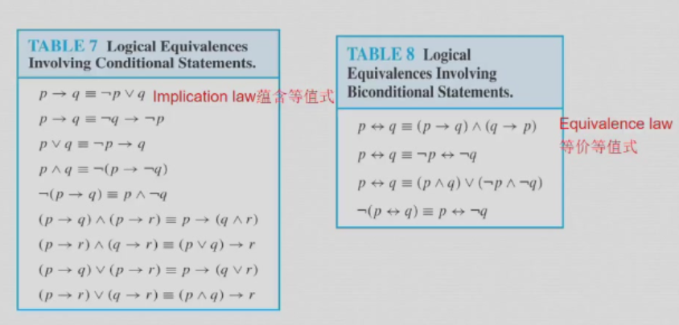

# 离散数学

> 任课教师：郑文庭

!!! abstract "Overview"
	- 数学推理
		- 数理逻辑与证明
		- 归纳法
	- 数论基础
	- 组合分析
		- 计数方法
	- 离散结构
		- 基本结构
		- 关系
		- 图
		- 树
	- 算法思维
		- 算法
		- 递归  

## 逻辑
逻辑运算符优先级  
  
taulogy: 恒真，如`p∨¬p`  
contradiction: 恒假，如`p∧¬p`  
contingency: “可能发生的”，既非taulogy又非contradiction，如`p`   
dual（对偶）: 将逻辑表达式中的`∧`和`∨`互换，`T`和`F`互换，`¬`不变  

- s与t等价，当且仅当s的dual与t的dual等价    

p NOR($\downarrow$) q: is true when both are false, otherwise false.（对$\vee$取反）  
p NAND($\mid$) q: is true when either or both are false（有假为假，其余情况为真）

### De Morgan's Law:  
- `¬(p∧q)` = `¬p∨¬q`
- `¬(p∨q)` = `¬p∧¬q`

### Other laws:  
- 交换律：`p∧q` = `q∧p`，`p∨q` = `q∨p`  
- 结合律：`p∧(q∧r)` = `(p∧q)∧r`，`p∨(q∨r)` = `(p∨q)∨r`  
- 分配律：`p∧(q∨r)` = `(p∧q)∨(p∧r)`，`p∨(q∧r)` = `(p∨q)∧(p∨r)`  
- 吸收律：`p∧(p∨q)` = `p`，`p∨(p∧q)` = `p`  

### 逻辑恒等式：

??? 例  
	对数独方框进行坐标划分

  	- 共9列9行，每个格子可填1-9的数字  
  	- 以$p(i,j,n)$表示第i行第j列的格子中填入数字n  
  	- 假设在第3行第4列的格子中填入数字5，则$p(3,4,5)$为真，$\forall 1 \le j \le 3 以及5\le j\le 9，p(3,j,5)$为假  
  	- 于是检索每行：$\bigwedge_{i=1}^9 \bigwedge_{n=1}^9 \bigvee_{j=1}^9 p(i,j,n)$  
  	- 检索每列：$\bigwedge_{j=1}^9 \bigwedge_{n=1}^9 \bigvee_{i=1}^9 p(i,j,n)$