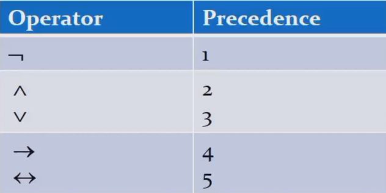
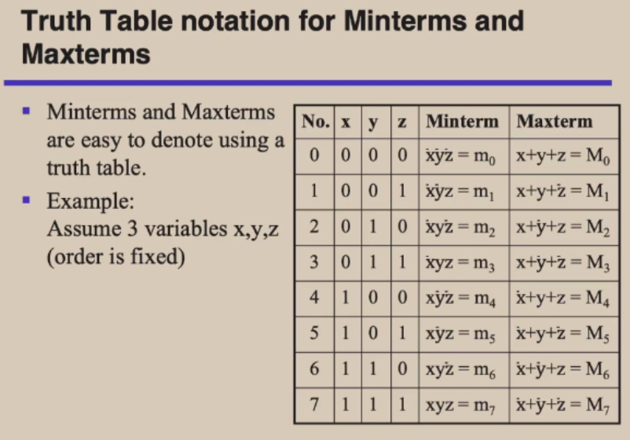

# 离散数学

> 任课教师：郑文庭

!!! abstract "Overview"
	- 数学推理
		- 数理逻辑与证明
		- 归纳法
	- 数论基础
	- 组合分析
		- 计数方法
	- 离散结构
		- 基本结构
		- 关系
		- 图
		- 树
	- 算法思维
		- 算法
		- 递归  

## 逻辑
逻辑运算符优先级  
  
taulogy: 恒真，如`p∨¬p`  
contradiction: 恒假，如`p∧¬p`  
contingency: “可能发生的”，既非taulogy又非contradiction，如`p`   
dual（对偶）: 将逻辑表达式中的`∧`和`∨`互换，`T`和`F`互换，`¬`不变  

- s与t等价，当且仅当s的dual与t的dual等价    

### De Morgan's Law:  
- `¬(p∧q)` = `¬p∨¬q`
- `¬(p∨q)` = `¬p∧¬q`

### Other laws:  
- 交换律：`p∧q` = `q∧p`，`p∨q` = `q∨p`  
- 结合律：`p∧(q∧r)` = `(p∧q)∧r`，`p∨(q∨r)` = `(p∨q)∨r`  
- 分配律：`p∧(q∨r)` = `(p∧q)∨(p∧r)`，`p∨(q∧r)` = `(p∨q)∧(p∨r)`  
- 吸收律：`p∧(p∨q)` = `p`，`p∨(p∧q)` = `p`  

### 逻辑恒等式：
$p \leftrightarrow q \equiv (p \rightarrow q) \wedge (q \rightarrow p) \equiv (p \wedge q) \vee (\neg p \wedge \neg q)$  

??? 例  
	对数独方框进行坐标划分

  	- 共9列9行，每个格子可填1-9的数字  
  	- 以$p(i,j,n)$表示第i行第j列的格子中填入数字n  
  	- 假设在第3行第4列的格子中填入数字5，则$p(3,4,5)$为真，$\forall 1 \le j \le 3 以及5\le j\le 9，p(3,j,5)$为假  
  	- 于是检索每行：$\bigwedge_{i=1}^9 \bigwedge_{n=1}^9 \bigvee_{j=1}^9 p(i,j,n)$  
  	- 检索每列：$\bigwedge_{j=1}^9 \bigwedge_{n=1}^9 \bigvee_{i=1}^9 p(i,j,n)$

p NOR($\downarrow$) q: is true when both are false, otherwise false.（对$\vee$取反）  
p NAND($\mid$) q: is true when either or both are false（有假为假，其余情况为真）（对$\wedge$取反）  
亦即$p\downarrow q \equiv \neg(p\vee q)$，$p\mid q \equiv \neg(p\wedge q)$  

### 范式
- 合取范式(Conjunctive Form)：将一个命题公式写成若干个(有限项)合取式的析取式，如$(p∧q)∨(¬p∧q)∨(p∧¬q)∨(¬p∧¬q)$  
- 析取范式(Disjunctive Form)：将一个命题公式写成若干个(有限项)析取式的合取式，如$(p∨q)∧(¬p∨q)∧(p∨¬q)∧(¬p∨¬q)$
- 最小项(minterm):所有逻辑变量在各个表达式中出现且只出现一次，再合取
	- Each minterm is true for exactly **one** assignment.
	- 性质: 
    	- $m_1∨m_2∨···∨m_n = True$
    	- $\forall i,j, m_i \wedge m_j = False$
    	- 给定$x,y,z$三个变量，$j$为$m_j$对应的下标（十进制），二进制记为$b_j$，则$b_j$中的1对应的位置不变，0对应的位置取反，最后合取即可得到$m_j$
			（梗来源：系统1）

- 最大项(maxterm):所有逻辑变量在各个表达式中出现且只出现一次，再析取
	- Each maxterm is false for exactly **one** assignment.
	- 性质: 
		- $M_1∧M_2∧···∧M_n = False$
		- $\forall i,j, M_i \vee M_j = True$
		- 类似的，这里是1对应的位置取反，0对应的位置不变，最后析取即可得到$M_j$
			（梗来源：系统1）

## Propositional Functions
- The statement $P(x)$ is the value of the** Propositional Function** $P$ at $x$.
    - e.g. P(x)表示$x>0$, 则$P(1)$为$T$，$P(-1)$为$F$, $P(10) \rightarrow P(-1)$为$T$

### Quantifiers
$\forall x P(x)$: for all x in the domain, P(x) is true.  
$\exists x P(x)$: there exists an x in the domain such that P(x) is true.  

- If $P(x)$ denotes the statement $x>0$ and the domain $U$ is all integers, then $\forall x P(x)$ is false, but $\exists x P(x)$ is true.
-  Given the domain as $\{x_1, x_2, x_3, \cdots, x_n\}$
    -  $\forall x P(x) = P(x_1) \wedge P(x_2) \wedge P(x_3) \wedge \cdots \wedge P(x_n)$
    -  $\exists x P(x) = P(x_1) \vee P(x_2) \vee P(x_3) \vee \cdots \vee P(x_n)$

两个量词的优先级高过其他逻辑运算符，如$\forall x P(x) \rightarrow Q(x)$表示$\forall x (P(x) \rightarrow Q(x))$  

$\neg \forall x P(x) \equiv \exists x \neg P(x)$  
$\neg \exists x P(x) \equiv \forall x \neg P(x)$

## 0-1矩阵
对0-1矩阵(只含0,1的矩阵)A,B，有如下定义  
矩阵并/交：要求大小一样，得到矩阵的每一元素都是A和B中对应位置元素的并/交  
矩阵的Boolean product: $A \odot B = \{c_{ij}\}$  

- 其中要求A的列数等于B的行数（和矩阵乘法一样）
- 假设$A_{m \times k} = \{a_{ij}\}，B_{k \times n} = \{b_{ij}\}，则C_{m \times n} = \{c_{ij}\}$
- $c_{ij} = (a_{i1} \wedge b_{1j}) \vee (a_{i2} \wedge b_{2j}) \vee \cdots \vee (a_{ik} \wedge b_{kj})$

Boolean power: $A^{[k]} = A \odot A \odot \cdots \odot A$  
定义：$A^{[0]} = E$

## 算法
[停机程序(Halting Problem)：判断一个程序是否会停机](https://www.zhihu.com/question/20081359)  

- 大O: $f = O(g)$, 则$f<kg$ (kg为f上限（最差情况）)
- 大$\Omega$: $f = \Omega(g)$, 则$f>kg$ (kg为f下限（最好情况）)

## 数论
### 同余
$a \equiv b \pmod{m} \Leftrightarrow m|(a-b) \Leftarrow \exists k \in \mathbb{Z}, a-b=mk$  
(不带括号的mod) $a \mod b =$ a除以b的余数  

### 进制转换
- 十进制转n进制：除n取余数，商再除以n，直到商为0，然后逆序排列余数
- n进制转十进制：$a_na_{n-1} \cdots a_1a_0 = a_n \times n^n + a_{n-1} \times n^{n-1} + \cdots + a_1 \times n + a_0$
- 八进制转二进制：将每一位八进制数转化为三位的二进制数，然后拼接就行
    - 如: $3_8 = 011_2$,$(276)_8 = (010 \space 111 \space 110)_2$
- 十六进制转二进制：将每一位十六进制数转化为四位的二进制数，然后拼接就行
	- 如: $A_{16} = 1010_2$,$(A7F)_{16} = (1010 \space 0111 \space 1111)_2$
- 二进制转八进制：从右起三位三位分段，最左端不足三位在左边补0，接着拼接对应的八进制数
	- 如: $(1001111111)_2 = (001 \space 001 \space 111 \space 111)_2 = (1177)_8$
- 二进制转十六进制：与上面类似，不过要分段为4位
	- 如: $(10101110100)_2 = (0101 \space 0111 \space 0100)_2 = (574)_{16}$

### GCD(最大公约数)
  
$ab = gcd(a,b) \times lcm(a,b)$  
辗转相除法：$gcd(a,b) = gcd(b,a \mod b)$