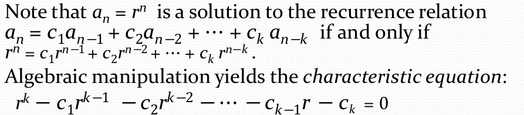
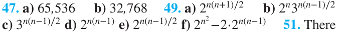
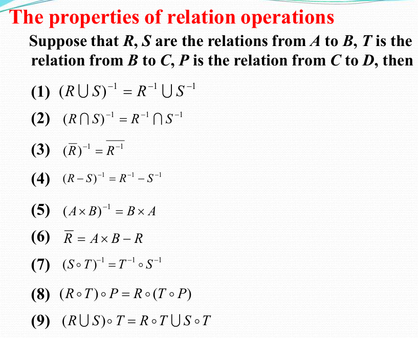

# 离散数学

> 任课教师：郑文庭

!!! abstract "Overview"
	- 数学推理
		- 数理逻辑与证明
		- 归纳法
	- 数论基础
	- 组合分析
		- 计数方法
	- 离散结构
		- 基本结构
		- 关系
		- 图
		- 树
	- 算法思维
		- 算法
		- 递归  

## 逻辑
逻辑运算符优先级  
  
taulogy: 恒真，如`p∨¬p`  
contradiction: 恒假，如`p∧¬p`  
contingency: “可能发生的”，既非taulogy又非contradiction，如`p`   
dual（对偶）: 将逻辑表达式中的`∧`和`∨`互换，`T`和`F`互换，`¬`不变  

- s与t等价，当且仅当s的dual与t的dual等价    

### De Morgan's Law:  
- `¬(p∧q)` = `¬p∨¬q`
- `¬(p∨q)` = `¬p∧¬q`

### Other laws:  
- 交换律：`p∧q` = `q∧p`，`p∨q` = `q∨p`  
- 结合律：`p∧(q∧r)` = `(p∧q)∧r`，`p∨(q∨r)` = `(p∨q)∨r`  
- 分配律：`p∧(q∨r)` = `(p∧q)∨(p∧r)`，`p∨(q∧r)` = `(p∨q)∧(p∨r)`  
- 吸收律：`p∧(p∨q)` = `p`，`p∨(p∧q)` = `p`  

### 逻辑恒等式：
$p \leftrightarrow q \equiv (p \rightarrow q) \wedge (q \rightarrow p) \equiv (p \wedge q) \vee (\neg p \wedge \neg q)$  


??? 例  
	对数独方框进行坐标划分

  	- 共9列9行，每个格子可填1-9的数字  
  	- 以$p(i,j,n)$表示第i行第j列的格子中填入数字n  
  	- 假设在第3行第4列的格子中填入数字5，则$p(3,4,5)$为真，$\forall 1 \le j \le 3 以及5\le j\le 9，p(3,j,5)$为假  
  	- 于是检索每行：$\bigwedge_{i=1}^9 \bigwedge_{n=1}^9 \bigvee_{j=1}^9 p(i,j,n)$  
  	- 检索每列：$\bigwedge_{j=1}^9 \bigwedge_{n=1}^9 \bigvee_{i=1}^9 p(i,j,n)$

p NOR($\downarrow$) q: is true when both are false, otherwise false.（对$\vee$取反）  
p NAND($\mid$) q: is true when either or both are false（有假为假，其余情况为真）（对$\wedge$取反）  
亦即$p\downarrow q \equiv \neg(p\vee q)$，$p\mid q \equiv \neg(p\wedge q)$  

### 范式
- 析取范式(Disjunctive Form)：将一个命题公式写成若干个(有限项)合取式的析取式，如$(p∧q)∨(¬p∧q)∨(p∧¬q)∨(¬p∧¬q)$  
- 合取范式(Conjunctive Form)：将一个命题公式写成若干个(有限项)析取式的合取式，如$(p∨q)∧(¬p∨q)∧(p∨¬q)∧(¬p∨¬q)$
- 最小项(minterm):所有逻辑变量在各个表达式中出现且只出现一次，再合取
	- Each minterm is true for exactly **one** assignment.
	- 性质: 
    	- $m_1∨m_2∨···∨m_n = True$
    	- $\forall i,j, m_i \wedge m_j = False$
    	- 给定$x,y,z$三个变量，$j$为$m_j$对应的下标（十进制），二进制记为$b_j$，则$b_j$中的1对应的位置不变，0对应的位置取反，最后合取即可得到$m_j$
			（梗来源：系统1）

- 最大项(maxterm):所有逻辑变量在各个表达式中出现且只出现一次，再析取
	- Each maxterm is false for exactly **one** assignment.
	- 性质: 
		- $M_1∧M_2∧···∧M_n = False$
		- $\forall i,j, M_i \vee M_j = True$
		- 类似的，这里是1对应的位置取反，0对应的位置不变，最后析取即可得到$M_j$
			（梗来源：系统1）

## Propositional Functions
- The statement $P(x)$ is the value of the** Propositional Function** $P$ at $x$.
    - e.g. P(x)表示$x>0$, 则$P(1)$为$T$，$P(-1)$为$F$, $P(10) \rightarrow P(-1)$为$T$

### Quantifiers
$\forall x P(x)$: for all x in the domain, P(x) is true.  
$\exists x P(x)$: there exists an x in the domain such that P(x) is true.  

- If $P(x)$ denotes the statement $x>0$ and the domain $U$ is all integers, then $\forall x P(x)$ is false, but $\exists x P(x)$ is true.
-  Given the domain as $\{x_1, x_2, x_3, \cdots, x_n\}$
    -  $\forall x P(x) = P(x_1) \wedge P(x_2) \wedge P(x_3) \wedge \cdots \wedge P(x_n)$
    -  $\exists x P(x) = P(x_1) \vee P(x_2) \vee P(x_3) \vee \cdots \vee P(x_n)$

两个量词的优先级高过其他逻辑运算符，如$\forall x P(x) \rightarrow Q(x)$表示$\forall x (P(x) \rightarrow Q(x))$  

$\neg \forall x P(x) \equiv \exists x \neg P(x)$  
$\neg \exists x P(x) \equiv \forall x \neg P(x)$

## 0-1矩阵
对0-1矩阵(只含0,1的矩阵)A,B，有如下定义  
矩阵并/交：要求大小一样，得到矩阵的每一元素都是A和B中对应位置元素的并/交  
矩阵的Boolean product: $A \odot B = \{c_{ij}\}$  

- 其中要求A的列数等于B的行数（和矩阵乘法一样）
- 假设$A_{m \times k} = \{a_{ij}\}，B_{k \times n} = \{b_{ij}\}，则C_{m \times n} = \{c_{ij}\}$
- $c_{ij} = (a_{i1} \wedge b_{1j}) \vee (a_{i2} \wedge b_{2j}) \vee \cdots \vee (a_{ik} \wedge b_{kj})$

Boolean power: $A^{[k]} = A \odot A \odot \cdots \odot A$  
定义：$A^{[0]} = E$

## 算法
[停机程序(Halting Problem)：判断一个程序是否会停机](https://www.zhihu.com/question/20081359)  

- 大O: $f = O(g)$, 则$f<kg$ (kg为f上限（最差情况）)
- 大$\Omega$: $f = \Omega(g)$, 则$f>kg$ (kg为f下限（最好情况）)

## 数论
### 同余
$a \equiv b \pmod{m} \Leftrightarrow m|(a-b) \Leftarrow \exists k \in \mathbb{Z}, a-b=mk$  
(不带括号的mod) $a \mod b =$ a除以b的余数  
于是有

- $a \equiv b \pmod{m} \Leftrightarrow a \mod m = b \mod m$
- 若$a \equiv b \pmod{m}$，则$a^k \equiv b^k \pmod{m}$

#### 线性同余方程
$ax \equiv b \pmod{m}$  
定义 inverse of a modulo m: $\overline{a} a \equiv 1 \pmod{m}$，则$\overline{a}$ is the inverse of a modulo m  

- 若$a$与$m$互质且$m>1$，则$a$模$m$的逆元存在

??? note "例(Finding inverses)"
	- Find an inverse of 7 modulo 234 
		- $234 = 33 \times 7 + 3$
		- $7 = 2 \times 3 + 1$
		- $1 = 7 - 2 \times 3 = 7 - 2 \times (234 - 33 \times 7) = 67 \times 7 - 2 \times 234$(这一步要把所有出现过的余数用上一行式子带进去，把1表示为7和234的线性组合)
		- 则上一步中7的裴蜀系数$67$即为7模234的逆元
		- 与此同时所有与67模234同余的数都是7的逆元，如$67+234k$

求解方程$ax \equiv b \pmod{m}$

- 若$d = gcd(a,m)$不整除$b$，则无解
- First find an inverse of $a$ modulo $m$ (using the Euclidean algorithm)
- 等式两边乘上该逆元，得到$x \equiv \overline{a}b \pmod{m}$

??? note "例(Solving linear congruences)"
	- 解$4x \equiv 5 \pmod{9}$
    	- Find inverse of 4 modulo 9:
        	- $9 = 2 \times 4 + 1$
        	- $1 = 9 - 2 \times 4$
        	- 因此逆元为-2
      	- Solve the equation:
        	- $-2 \times 4x \equiv -2 \times 5 \pmod{9}$
        	- $x \equiv -10 \pmod{9}$

1. 中国剩余定理(CRT)：若$m_1, m_2, \cdots, m_k$两两互质，则同余方程组$x \equiv a_1 \pmod{m_1}, x \equiv a_2 \pmod{m_2}, \cdots, x \equiv a_k \pmod{m_k}$有唯一解

	??? 例
		- Solve the system of congruences:
			- $x \equiv 1 \pmod{5}$
			- $x \equiv 2 \pmod{6}$
			- $x \equiv 3 \pmod{7}$
     	- 首先有$x = 5k+1$
     	- 则$5k+1 = 2 \pmod{6}$
     	- 两边加4，$5k+5 = 0 \pmod{6}$
     	- 于是$k = -1 \pmod{6} = 6j-1$
     	- 代入$x = 5(6j-1)+1 = 30j-4 = 3 \pmod{7}$
     	- 则$30j = 0 \pmod{7}$, $j =  7r$
     	- 代入得$x = 30(7r)-4 = 210r-4$
     	- 即$x \equiv -4 \pmod{210}$

2. 费马小定理：若$p$为素数，$a$与$p$互质，则$a^{p-1} \equiv 1 \pmod{p}$
    1. 更进一步，$\forall a \in \mathbb{Z}, a^p \equiv a \pmod{p}$ 
3. 伪素数：若一个合数$n$满足$a^{n-1} \equiv 1 \pmod{n}$，则称$n$为伪素数
### 进制转换
- 十进制转n进制：除n取余数，商再除以n，直到商为0，然后逆序排列余数
- n进制转十进制：$a_na_{n-1} \cdots a_1a_0 = a_n \times n^n + a_{n-1} \times n^{n-1} + \cdots + a_1 \times n + a_0$
- 八进制转二进制：将每一位八进制数转化为三位的二进制数，然后拼接就行
    - 如: $3_8 = 011_2$,$(276)_8 = (010 \space 111 \space 110)_2$
- 十六进制转二进制：将每一位十六进制数转化为四位的二进制数，然后拼接就行
	- 如: $A_{16} = 1010_2$,$(A7F)_{16} = (1010 \space 0111 \space 1111)_2$
- 二进制转八进制：从右起三位三位分段，最左端不足三位在左边补0，接着拼接对应的八进制数
	- 如: $(1001111111)_2 = (001 \space 001 \space 111 \space 111)_2 = (1177)_8$
- 二进制转十六进制：与上面类似，不过要分段为4位
	- 如: $(10101110100)_2 = (0101 \space 0111 \space 0100)_2 = (574)_{16}$

### GCD(最大公约数)
  
$ab = gcd(a,b) \times lcm(a,b)$  
辗转相除法：$gcd(a,b) = gcd(b,a \mod b)$
```python
def gcd(a, b):
	while b:
		a, b = b, a % b
	return a
```
??? 例
	- Find the gcd of 252 and 105
		- $252 = 2 \times 105 + 42$
		- $105 = 2 \times 42 + 21$
		- $42 = 2 \times 21 + 0$
		- So, gcd(252, 105) = 21

## 计数方法
### 鸽巢原理
- 如果n个物品放入m个盒子，且$n>m$，则至少有一个盒子中至少有两个物品
- Generalized Pigeonhole Principle: 如果n个物品放入k个盒子，至少有一个盒子中至少有$\lceil \frac{n}{k} \rceil$个物品
### 排列组合
- 排列(permutation): 从n个元素中取r个元素，有$P(n,r) = \frac{n!}{(n-r)!}$种排列
- 组合(combination): 从n个元素中取r个元素，有$C(n,r) = \frac{n!}{r!(n-r)!}$种组合

Pascal's Identity: $C(n,k) = C(n-1,k-1) + C(n-1,k)$

??? note "find the next greater permutation of a string"
	1. Find the greatest index i such that s[i] < s[i+1]. If no such index exists, the permutation is the last permutation.
	2. Find the greatest index j > i such that s[j] > s[i]. Such a j must exist, since i+1 is such an index.
	3. Swap s[i] with s[j].
	4. Reverse the order of all of the elements after index i (not including i) till the last element.  
	https://stackoverflow.com/questions/1622532/algorithm-to-find-next-greater-permutation-of-a-given-string/  
	https://math.stackexchange.com/questions/4421688/what-is-the-next-permutation-of-1342

??? note "find the next greater r-permutation"
	给定的原集合和r-permutation从小到大排列，记为二进制形式$n_0 n_1 \cdots n_{r-1}$，其中若r-permutation中的元素为原集合中的第i个元素，则$n_i = 1$，否则为0。next greater r-permutation的二进制形式就是上述二进制数加1，然后将其转化为集合形式即可。  
	例：Find the next 5-combination of the set $\{1, 2, 3, 4, 5, 6, 7, 8, 9\}$ after $\{1, 3, 5, 7, 9\}$.  
	二进制形式为$101010101$，加1得到$101010110$，转化为集合形式即为$\{1, 3, 5, 7, 8\}$  
	(Credit to Way2Hungry)

## Advanced Counting Techniques

### 特征根法求解递推序列
（类似[高阶线性齐次常微分方程](https://shrike505.cc/notes/MathematicsAndPhysics/ODE/#ode_6)）

#### 一阶齐次
$a_n = c_1 a_{n-1} + \cdots + c_k a_{n-k}$  

- 求解特征方程  
- 单根$r_1, r_2, \cdots, r_k$，则通解中含有$\alpha_1 r_1^n + \cdots + \alpha_k r_k^n$, $\alpha_1, \cdots, \alpha_k$由初始条件决定(任意常数)
- k重根$r$，则通解中含有$\alpha_1 r^n + \alpha_2 n r^n + \cdots + \alpha_k n^{k-1} r^n$, $\alpha_1, \cdots, \alpha_k$由初始条件决定(任意常数)

#### 一阶非齐次
$a_n = c_1 a_{n-1} + \cdots + c_k a_{n-k} + f(n)$

- 求解齐次版本的特征方程，求出齐次通解，再求出（猜出）一个特解，通解就是齐次通解加上特解

### 生成函数
${a_0, a_1, a_2, \cdots}$的生成函数为$f(x) = a_0 + a_1x + a_2x^2 + \cdots = \sum_{i=0}^{\infty} a_ix^i$  
${a_0, a_1, a_2, \cdots , a_n}$的生成函数为$f(x) = a_0 + a_1x + a_2x^2 + \cdots + a_nx^n$ (记$a_{n+1} = a_{n+2} = \cdots = 0$)

??? 常见生成函数
	  
	

??? 利用生成函数解决问题
	  
	

### Inclusion-Exclusion Principle
$|A_1 \cup A_2 \cup \cdots \cup A_n| = \sum_{i=1}^{n} |A_i| - \sum_{1 \le i < j \le n} |A_i \cap A_j| + \sum_{1 \le i < j < k \le n} |A_i \cap A_j \cap A_k| - \cdots + (-1)^{n-1} |A_1 \cap A_2 \cap \cdots \cap A_n|$

!!! eg "常用：k=2, 3"
	- $|A \cup B| = |A| + |B| - |A \cap B|$
	- $|A \cup B \cup C| = |A| + |B| + |C| - |A \cap B| - |A \cap C| - |B \cap C| + |A \cap B \cap C|$

## Relations
### 二元关系
集合A上有$2^{|A|^2}$个二元关系

??? note "一道逆天小测/作业"
	  
	

- Reflexive: $\forall a \in A, (a,a) \in R$
    - e.g. $R_1 = \{(a, b)|a \le b\}$, $R_2 = \{(a, b)|a = b\}$
- Symmetric: $\forall a, b \in A, (a, b) \in R \rightarrow (b, a) \in R$
	- e.g. $R_1 = \{(a, b)|a + b \le 3\}$, $R_2 = \{(a, b)|a = b\}$
- Antisymmetric: $\forall a, b \in A, (a, b) \in R \wedge (b, a) \in R \rightarrow a = b$
	- e.g. $R_1 = \{(a, b)|a \le b\}$, $R_2 = \{(a, b)|a = b\}$
- Transitive: $\forall a, b, c \in A, (a, b) \in R \wedge (b, c) \in R \rightarrow (a, c) \in R$
	- e.g. $R_1 = \{(a, b)|a \le b\}$, $R_2 = \{(a, b)|a = b\}$
	- $R$是传递的当且仅当$R^n \subseteq R$

关系的复合：$R \circ S = \{(a, c)|\exists b \in A, (a, b) \in R \wedge (b, c) \in S\}$，类似复合函数，可将第一个分量看作自变量，第二个分量看作因变量

??? 例
	- $R = \{(1, 2), (2, 3), (3, 4)\}, S = \{(2, 3), (3, 4), (4, 5), (3,8)\}$
	- $S \circ R = \{(1, 3), (2, 4), (3, 5), (2, 8)\}$（就是找R的第二个分量和S的第一个分量相等的元素再拼接）

### 关系的表达
- 关系矩阵：$R = \{(a, b)|a \in A, b \in B\}$，$R$的关系矩阵是一个$|A| \times |B|$的矩阵，$r_{ij} = 1$表示$(a_i, b_j) \in R$，$r_{ij} = 0$表示$(a_i, b_j) \notin R$
    - $R$是自反的当且仅当对角线上的元素都是1
    - $R$是对称的当且仅当$r_{ij} = r_{ji}$
    - $R$是反对称的当且仅当当$i \ne j$时$r_{ij} = 0$或$r_{ji} = 0$
    - $R_2 \circ R_1$的关系矩阵是$M_1 \odot M_2$, $odot$为矩阵的Boolean product
    - 关系取并/交，矩阵对应位置取并/交；关系取反，矩阵取反
- 关系图：有向图$R$中顶点$a_i$到$a_j$有一条边当且仅当$(a_i, a_j) \in R$
    - $R$是自反的当且仅当每个顶点有一条边指向自己
    - $R$是对称的当且仅当若$a_i$到$a_j$有一条边，则$a_j$到$a_i$也有一条边
    - $R$是反对称的当且仅当若$a_i \ne a_j$且$a_i$到$a_j$有一条边，则$a_j$到$a_i$没有边
    - $R$是传递的当且仅当若$a_i$到$a_j$和$a_j$到$a_k$有边，则$a_i$到$a_k$有边

定义关系的逆：$R^{-1} = \{(b, a)|(a, b) \in R\}$

!!! note "求逆与逆的性质"
	  
	

### 偏序

- 偏序：关系$R$是偏序的当且仅当$R$是自反、反对称、传递的，表示为弯一点的$\le$
    - 可比性：在一个偏序关系下，若$a \le b$或$b \le a$，则称$a$和$b$是可比的，e.g. $(\mathbb{Z^+}, \mid)$中，$2 \nmid 3$，$3 \nmid 2$，则$2$和$3$不可比
- 全序：关系$R$是全序的当且仅当$R$是偏序且每个元素都可比
- 良序：关系$R$是良序的当且仅当$R$是全序且每个非空子集都有最小元素

## 图
一堆概念：https://oi-wiki.org/graph/concept/  
一个节点到自身的自环，若为无向图，贡献两个度；若为有向图，贡献一个出度和一个入度。  

- 无向图中，$2|E| = \sum_{v \in V} deg(v)$
- 有向图中，$\sum_{v \in V} deg^-(v) = \sum_{v \in V} deg^+(v) = |E|$

- 对任意图$G$，度数为奇数的顶点数为偶数
-  the degree of a vertex in a simple graph is at most 1 less than the number of vertices

Complete graph($K_n$): 每对不同的顶点之间都有且仅有一条边。

- n个顶点的完全图有$\frac{n(n-1)}{2}$条边
- 每个顶点的度为$n-1$

圈(cycle)($C_n$): $\{(v_1, \cdots , v_n),(v_1, v_2), (v_2, v_3), \cdots, (v_{n-1}, v_n), (v_n, v_1)\}$  

Wheel($W_n$): $\{Cycle, v_{new}, (v_{new}, v_1), (v_{new}, v_2), \cdots, (v_{new}, v_n)\}$  

n-Cube($Q_n$): 顶点集为所有n位二进制数（$Q_n$有$2^n$个顶点），两个顶点之间有边当且仅当它们的二进制表示有且仅有一位不同

Bipartite graph: 顶点集可以分为两个互不相交的子集，使得每条边的两个端点分别属于这两个子集。

- 也就意味着任何一个子集中的顶点互不相连
- 定理：简单图是Bipartite的当且仅当有可能对其顶点进行染色，使得任意一条边的两个端点都颜色不同

Complete bipartite graph: 分成的两个顶点子集中，对一个子集中任何一个顶点，另一个子集中的所有顶点都与之相连。

- 记作$K_{m,n}$，其中$m$和$n$分别为两个子集的顶点数

正则(Regular)图：每个顶点的度都相同，n-正则图即每个顶点的度为n

- 注意到$K_{m,n}$在$m = n$时是正则图

### Matching
- Matching: 一个边集，其中任意两条边都不邻接（没有共同顶点）
    - Maximum matching: 边数最多的匹配
    - 完全匹配(Complete matching): 对于二分为$(V_1, V_2)$的二分图，若每个$V_1$中的顶点都是匹配$M$中的一个顶点，则称$M$为完全匹配（从$V_1$到$V_2$）

Hall's theorem: 二分图$G = (V ,E)$二分为$(V_1, V_2)$有一个从$V_1$到$V_2$的完全匹配当且仅当对于$V_1$的任意子集$A$，$|N(A)| \ge |A|$，其中$N(A)$元素为$A$中的顶点的邻居

### 子图
$G= (V, E) , H= (W, F)$

- 子图(Subgraph)($H \subseteq G$): $W \subseteq V, F \subseteq E$
- Proper subgraph: $G \ne H, H \subseteq G$
- 生成图(Spanning subgraph): $W = V, F \subseteq E$ (端点不变，边集缩小)
- $G$关于端点集$W$的诱导子图(Induced subgraph): 图$U = (W, F)$，其中$F$包含的边是$E$中连接$W$中的两个顶点的边

### 图的表示
- 邻接矩阵
    - 对多边图，$a_{ij}$表示顶点$v_i$到$v_j$的边数
- incidence matrix: 行为顶点，列为边，$a_{ij} = 1$表示顶点$v_i$与边$e_j$相连
    - 无向图的每一列中1成对出现代表边，单独一个1就是该点处的自环

### Isomorphism
同构：存在双射使得映射前后顶点的相邻关系不变

- 同构中的不变量（可用于判断非同构）
    - 顶点数，边数，对应点的度、路径
    - 是否为环、轮、完全图、二分图
    - 同构当且仅当有相同长度的环路

### 路径
- 定理：从$v_i$到$v_j$的长度为$r$的路径数量为$A^r_{ij}$，其中$A^r_{ij}$为邻接矩阵的第$r$次幂$(i,j)$位置上的元素（这里的幂就是普通矩阵乘法）

- cut vertex(ariculation point): 从图中去掉这个点后，图不再连通（导致更多连通部分的出现）
- cut edge(bridge): 从图中去掉这条边后，图不再连通

- 强连通：有向图中任意两个顶点$a,b$之间都有从$a$到$b$和从$b$到$a$的路径
- 弱连通：有向图中去掉所有边的方向后，得到的无向图是连通的

!!! note "欧拉回路与欧拉路径"
	- 欧拉回路(Eulerian circuit): 通过图中每条边一次且仅一次的回路（一笔画，起点终点相同）
	- 欧拉路径(Eulerian path): 通过图中每条边一次且仅一次的路径（一笔画）
	- 无向连通（多）图有欧拉circuit当且仅当每个顶点的度数都是偶数
	- 连通（多）图有非欧拉circuit的欧拉path当且仅当有且仅有两个顶点的度数是奇数，且这两个顶点就是路径的起点和终点
	??? extra "有向图的情况"
		

!!! note "哈密顿回路与哈密顿路径"
	- 哈密顿回路(Hamiltonian circuit): 通过图中每个顶点一次且仅一次的回路（除了起始点，也就是终点）
	- 哈密顿路径(Hamiltonian path): 通过图中每个顶点一次且仅一次的路径（有点儿不一样的一笔画）
    	- Dirac's theorem: 若$G$是一个简单图，$|V| \ge 3$，且$G$中每个顶点的度数都至少为$\frac{|V|}{2}$，则$G$有哈密顿回路
    	- Ore's theorem: 若$G$是一个简单图，$|V| \ge 3$，且$\forall v, u \in V(G)$且$v$,$u$不相邻，有$deg(u)+deg(v) \ge |V|$，则$G$有哈密顿回路