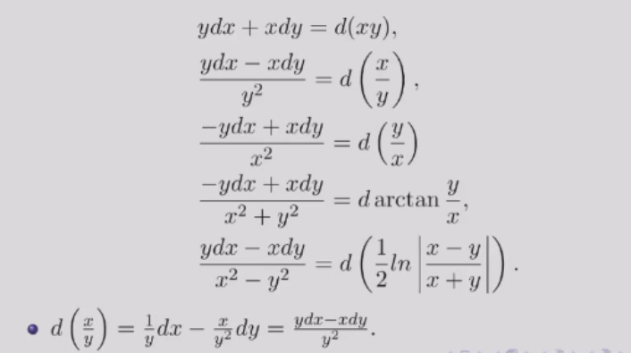

# 常微分方程

> 任课教师：王伟
> 这课讲的很浅，好像难度也不大

!!! note "UsefulLinks"
    [Cheatsheet by Xecades](https://note.xecades.xyz/math/ma/cheatsheet/)  
    [jhc学长的笔记](https://github.com/16-39/Mathematics/blob/main/ODE%20review.pdf)

!!! abstract "成绩组成"
    - 平时成绩：50%，包括作业30%和小测20%
    - 期末考试：50%

## 基本概念
含有**未知数、所求的未知函数、未知函数的导数**的方程，称为微分方程。  
最高阶导数的阶数称为微分方程的阶数。  

n阶微分方程的一般形式：$F(x, y, y', y'', \cdots, y^{(n)}) = 0$  

- 其中$y^{(n)}$必须出现，其他变量不要求。如 $y^{(n)} = 1$  

使微分方程成为恒等式的$y = y(x)$称为微分方程的解，这就是定义中的“未知函数”。  
若解中含有任意常数且常数的个数与方程阶数相等，则称为微分方程的通解，不含有常数则为特解。  

为了求解方程的特解，需要提供一些初始条件，如$y(x_0) = y_0, y'(x_0) = y_0'$等。  

## 一阶ode
一般形式：$f(x, y) = \frac{dy}{dx}$  
### 可分离变量的ode解法
即可化为$\frac{dy}{dx} = \varphi (x)\psi (y)$的形式。  
解法：分离变量，两边积分。  

??? 例
    - 求解$\frac{dy}{dx} = 2xy$  
        - 分离变量，得$\frac{dy}{y} = 2xdx$  
        - 两边积分，得$\ln |y| = x^2 + C$  
        - 代回$x$,$y$,得$y = Ce^{x^2}$
    - 求解略复杂的可分离形式的ode:$\frac{dy}{dx} = \sin ^2 (x-y+1)$  
        - (想办法取出sin中的东西)令$u=x-y+1$,则$\frac{du}{dx} = 1-\frac{dy}{dx}$  
        - 代入原式，得$\frac{du}{dx} = 1 - \sin ^2 u = \cos ^2 u$  
        - 分离变量，得$\frac{du}{\cos ^2 u} = dx$
        - 两边积分，得$\tan u = x + C$
        - 代回$x$,$y$,得$\tan (x-y+1) = x + C$  

### 未知量齐次ode解法
即可由一般形式化为$\frac{dy}{dx} = \varphi (\frac{y}{x})$的形式。 
只要注意到等号两侧$y$与$x$的次数相同，就可以尝试变形后用$u = \frac{y}{x}或\frac{x}{y}$的形式进行变换。

解法：令$y = ux$,则$\frac{dy}{dx} = u + x\frac{du}{dx}$，再代入原方程。  

??? 例
    - 求解齐次ode:$(y^2-2xy)dx+x^{2}dy=0$（注意$x$,$y$的次数相同）  
        - 先变形，得$\frac{dy}{dx} = 2\frac{y}{x} - (\frac{y}{x})^2$
        - 令$u = \frac{y}{x}$,则$y = ux$,$\frac{dy}{dx} = u + x\frac{du}{dx}$  
        - 代入原方程，得$u + x\frac{du}{dx} = 2u - u^2$
        - 分离变量，得$\frac{du}{u(1-u)} = \frac{dx}{x}$
        - 两边积分，得$\ln |u| - \ln |1-u| = \ln |x| + C$

### 一阶线性ode解法
一般形式：$\frac{dy}{dx} + P(x)y = Q(x)$  
当$Q(x) = 0$时，称为齐次线性方程；否则称为非齐次线性方程。  

解法：类似于线性代数中（非）齐次线性方程组的解法  

- Step 1: 求齐次线性方程的通解（分离变量）  
    - $\frac{dy}{dx} + P(x)y = 0$
    - $\Rightarrow \frac{dy}{y} = -P(x)dx$  
    - $\Rightarrow \ln |y| = -\int P(x)dx + C$
    - $\Rightarrow y = Ce^{-\int P(x)dx}$
- Step 2: 常数变易法求非齐次线性方程的通解
    - $C$为常数时，$y = Ce^{-\int P(x)dx}$是齐次线性方程的通解  
    - $C = u(x)$时，假设$y = u(x)e^{-\int P(x)dx}$是非齐次线性方程的通解  
    - 代入$\frac{dy}{dx} + P(x)y = Q(x)$
    - 得$u'(x)e^{-\int P(x)dx} = Q(x)$  
    - 由此得$u(x) = \int Q(x)e^{\int P(x)dx}dx + C$  
    - 因此非齐次线性方程的通解为$y = e^{-\int P(x)dx}(\int Q(x)e^{\int P(x)dx}dx + C)$

??? 例
    - 求解非齐次线性ode:$\frac{dy}{dx} = \frac{1}{x+y}$
        - 解法1: 取倒数化为非齐次一般形式
            - $\frac{dx}{dy} = x+y$
            - 将$x$看作因变量: $\frac{dx}{dy} - x = y$
            - 代入公式，于是$P(y) = -1$, $Q(y) = y$
            - 得$x = e^{y}(\int y e^{-\int dy}dy + C)$
            - 积分化简得$x = Ce^{y} - y - 1$
        - 解法2: 也可以用未知量齐次的换元+分离方法
            - 令$u = x+y$,则$\frac{dy}{dx} = \frac{du}{dx} - 1$
            - 代回方程得$\frac{du}{dx} - 1 = \frac{1}{u}$
            - 分离变量得$\frac{du}{1+\frac{1}{u}} = dx$
            - 两边积分得$u - ln|u+1| = x + C$
            - 代回$u = x+y$,得$y - ln|x+y+1| + C = 0$

### 伯努利方程
形式：$\frac{dy}{dx} + P(x)y = Q(x)y^n$  

解法: 两边同时除以$y^n$，既得$\frac{1}{y^n}\frac{dy}{dx} + P(x)y^{1-n} = Q(x)$，  
观察到第一项恰好等于$\frac{d(y^{1-n})}{(1-n)dx}$， 
于是令$z = y^{1-n}$，则$\frac{dz}{dx} + (1-n)P(x)z = (1-n)Q(x)$  
这就化为了一阶线性ode，套用公式解出$z$，再代回$y$即可。

??? 例
    - 求解伯努利方程:$\frac{dy}{dx} + \frac{y}{x} = a(\ln x)y^2$
        - 令$z = y^{1-2} = y^{-1}$,则$\frac{dz}{dx} - \frac{z}{x} = -a\ln x$
        - 于是$P(x) = -\frac{1}{x}$, $Q(x) = -a\ln x$
        - 代入公式得$z = e^{\int \frac{1}{x}dx}(-\int a\ln x e^{-\int \frac{1}{x}dx}dx + C)$
        - 积分化简后得到$z = -\frac{1}{2} ax(\ln x)^2 + Cx$
        - 代回,得$y = \frac{1}{-\frac{1}{2} ax(\ln x)^2 + Cx}$

## 全微分方程
（我没看懂，很多都是多元函数和偏导的东西，可能会在数分上讲到）  

将微分方程化为$M(x,y)dx + N(x,y)dy = 0$的形式，若$\exists u(x,y)$使得$du(x,y) = M(x,y)dx + N(x,y)dy$，则称为全微分方程。  
则$u(x,y) = C$即为微分方程的通解。  

例如 $xdx+ydy = 0$，等号左侧为 $d(\frac{1}{2}x^2 + \frac{1}{2}y^2)$，因此$\frac{1}{2}x^2 + \frac{1}{2}y^2 = C$ 即为通解。  

$M(x,y)dx + N(x,y)dy = 0$是全微分方程 $\leftrightarrow \frac{\partial M(x,y)}{\partial y} = \frac{\partial N(x,y)}{\partial x}$  
(dx的系数对y求导 = dy的系数对x求导) 
而$u(x,y) = \int_{(0,0)}^{(x,y)} M(x,y)dx + N(x,y)dy$即为微分方程的特解。  

- 解法1：
    - 求解$u(x,y)$: 从$(0,0)$先积分到$(x,0)$, 再从$(x,0)$积分到$(x,y)$
    - (路径积分)
- 解法2:
    - 凑全微分（技巧性较强）

!!! note "凑全微分"
    我估计不久后会搬到数分Ⅱ笔记里
    

??? 例
    - 求解$(3x^{2}+6xy^{2})dx + (6x^{2}y+4y^{3})dy = 0$
        - 解法1: 直接求解
            - 此处$M = 3x^{2}+6xy^{2}$, $N = 6x^{2}y+4y^{3}$
            - 而$\frac{\partial M}{\partial y} = 12xy = \frac{\partial N}{\partial x}$, 因此为全微分方程
            - $u(x,y) = \int_{(0,0)}^{(x,y)} (3x^{2}+6xy^{2})dx + (6x^{2}y+4y^{3})dy$ 
            - $= \int_{0}^{x} 3t^{2}dt + \int_{0}^{y} (6x^{2}s+4s^{3})ds$
            - $= x^{3} + 3x^{2}y^{2} + y^{4}$
            - 通解就是$u(x,y) = C$, 即$x^{3} + 3x^{2}y^{2} + y^{4} = C$
        - 解法2: 凑全微分
            - 改写方程为$3x^{2}dx + 4y^{3}dy + 6xy(ydx + xdy) = 0$
            - 凑微分得$d(x^{3} + y^{4}) + 6xyd(xy) = 0$
            - 也就是$d(x^{3} + y^{4} + 3x^{2}y^{2}) = 0$
            - 得通解$x^{3} + y^{4} + 3x^{2}y^{2} = C$
    - 求解$(\cos x + \frac{1}{y})dx + (\frac{1}{y} - \frac{x}{y^{2}})dy = 0$
        - 分离一下，得$\cos x dx + \frac{1}{y}dy + \frac{ydx-xdy}{y^{2}} = 0$
        - 凑微分得$d(\sin x + \ln |y| - \frac{x}{y}) = 0$
        - 得通解$\sin x + \ln |y| - \frac{x}{y} = C$

- 解法3: 积分因子
    - 若微分方程不是全微分方程，可以乘以一个函数$\mu(x,y)$，使得$\mu(x,y)M(x,y)dx + \mu(x,y)N(x,y)dy = 0$是全微分方程
    - 之后在按照解全微分方程的方法来解
    - 不过找积分因子较有技巧性，看看例子

??? 例
    - 求解$ydx+(x+x^2 y^2 )dy = 0$
    - 改写为$ydx+xdy+x^2 y^2 dy = 0$
    - 两边同乘$\mu(x,y) = (xy)^{-2}$（我不到怎么发现的）
    - 得$\frac{d(xy)}{(xy)^2} + dy = 0$
    - $\rightarrow d(-\frac{1}{xy} + y) = 0$

## 高阶ode
### 可降阶的二阶ode
1. $y^n = f(x)$
   - 解法：直接积分n次
   - 较为简单，注意每次积分都要加上常数

2. $y'' = f(x,y')$ (无$y$)
   - 解法：令$y' = p$, 则$y'' = p'$, 于是原方程化为一阶方程$p' = f(x,p)$

??? 例
    - 求解$(1+x^2)y'' = 2xy'$  
        - 令$y' = p$, 则$y'' = p'$, 于是原方程化为一阶方程$p' = \frac{2xp}{1+x^2}$
        - 分离变量得$\frac{dp}{p} = \frac{2xdx}{1+x^2}$
        - 两边积分得$\ln |p| = \ln |1+x^2| + C$
        - 代回得$p = C(1+x^2)$
        - 再**对x积分**一次得$y = C_1(x+\frac{1}{3} x^3) + C_2$

3. $y'' = f(y,y')$ (无$x$)
   - 解法：令$y' = p$, 则$y'' = \frac{dp}{dx} = \frac{dp}{dy} \frac{dy}{dx} = p\frac{dp}{dy}$, 于是原方程化为一阶方程$p\frac{dp}{dy} = f(y,p)$
   - 这里将p看作y的函数，也即自变量是y，因变量是p

??? 例
    - 求解$yy'' - (y')^2 = 0$
        - 令$y' = p$, 则$y'' = p \frac{dp}{dy}$
        - 原方程化为$yp \frac{dp}{dy} - p^2 = 0$
        - 分离变量得$\frac{dp}{p} = \frac{dy}{y}$
        - 两边积分得$\ln |p| = \ln |y| + C$
        - 代回得$p = y' = \frac{dy}{dx} = C_1 y$
        - 注意这个是关于$y$和$x$的ode，分离变量得$\frac{dy}{y} = C_1 dx$
        - 积分化简得到$y=C_2 e^{C_1 x}$