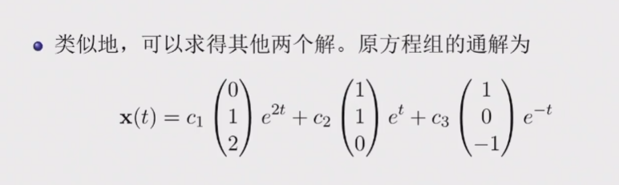

# 常微分方程

> 任课教师：王伟  
> ~~这课讲的很浅，好像难度也不大~~  
> 疑似小测后开始上强度了（  

!!! note "UsefulLinks"
    [Cheatsheet by Xecades](https://note.xecades.xyz/math/ma/cheatsheet/)  
    [jhc学长的笔记](https://github.com/16-39/Mathematics/blob/main/ODE%20review.pdf)

!!! abstract "成绩组成"
    - 平时成绩：50%，包括作业30%和小测20%
    - 期末考试：50%

## 基本概念
含有**未知数、所求的未知函数、未知函数的导数**的方程，称为微分方程。  
最高阶导数的阶数称为微分方程的阶数。  

n阶微分方程的一般形式：$F(x, y, y', y'', \cdots, y^{(n)}) = 0$  

- 其中$y^{(n)}$必须出现，其他变量不要求。如 $y^{(n)} = 1$  

使微分方程成为恒等式的$y = y(x)$称为微分方程的解，这就是定义中的“未知函数”。  
若解中含有任意常数且常数的个数与方程阶数相等，则称为微分方程的通解，不含有常数则为特解。  

为了求解方程的特解，需要提供一些初始条件，如$y(x_0) = y_0, y'(x_0) = y_0'$等。  

## 一阶ode
一般形式：$f(x, y) = \frac{dy}{dx}$  
### 可分离变量的ode解法
即可化为$\frac{dy}{dx} = \varphi (x)\psi (y)$的形式。  
解法：分离变量，两边积分。  

??? 例
    - 求解$\frac{dy}{dx} = 2xy$  
        - 分离变量，得$\frac{dy}{y} = 2xdx$  
        - 两边积分，得$\ln |y| = x^2 + C$  
        - 代回$x$,$y$,得$y = Ce^{x^2}$
    - 求解略复杂的可分离形式的ode:$\frac{dy}{dx} = \sin ^2 (x-y+1)$  
        - (想办法取出sin中的东西)令$u=x-y+1$,则$\frac{du}{dx} = 1-\frac{dy}{dx}$  
        - 代入原式，得$\frac{du}{dx} = 1 - \sin ^2 u = \cos ^2 u$  
        - 分离变量，得$\frac{du}{\cos ^2 u} = dx$
        - 两边积分，得$\tan u = x + C$
        - 代回$x$,$y$,得$\tan (x-y+1) = x + C$  

### 未知量齐次ode解法
即可由一般形式化为$\frac{dy}{dx} = \varphi (\frac{y}{x})$的形式。 
只要注意到等号两侧$y$与$x$的次数相同，就可以尝试变形后用$u = \frac{y}{x}或\frac{x}{y}$的形式进行变换。

解法：令$y = ux$,则$\frac{dy}{dx} = u + x\frac{du}{dx}$，再代入原方程。  

??? 例
    - 求解齐次ode:$(y^2-2xy)dx+x^{2}dy=0$（注意$x$,$y$的次数相同）  
        - 先变形，得$\frac{dy}{dx} = 2\frac{y}{x} - (\frac{y}{x})^2$
        - 令$u = \frac{y}{x}$,则$y = ux$,$\frac{dy}{dx} = u + x\frac{du}{dx}$  
        - 代入原方程，得$u + x\frac{du}{dx} = 2u - u^2$
        - 分离变量，得$\frac{du}{u(1-u)} = \frac{dx}{x}$
        - 两边积分，得$\ln |u| - \ln |1-u| = \ln |x| + C$

### 一阶线性ode解法
一般形式：$\frac{dy}{dx} + P(x)y = Q(x)$  
当$Q(x) = 0$时，称为齐次线性方程；否则称为非齐次线性方程。  

解法：类似于线性代数中（非）齐次线性方程组的解法  

- Step 1: 求齐次线性方程的通解（分离变量）  
    - $\frac{dy}{dx} + P(x)y = 0$
    - $\Rightarrow \frac{dy}{y} = -P(x)dx$  
    - $\Rightarrow \ln |y| = -\int P(x)dx + C$
    - $\Rightarrow y = Ce^{-\int P(x)dx}$
- Step 2: 常数变易法求非齐次线性方程的通解
    - $C$为常数时，$y = Ce^{-\int P(x)dx}$是齐次线性方程的通解  
    - $C = u(x)$时，假设$y = u(x)e^{-\int P(x)dx}$是非齐次线性方程的通解  
    - 代入$\frac{dy}{dx} + P(x)y = Q(x)$
    - 得$u'(x)e^{-\int P(x)dx} = Q(x)$  
    - 由此得$u(x) = \int Q(x)e^{\int P(x)dx}dx + C$  
    - 因此非齐次线性方程的通解为$y = e^{-\int P(x)dx}(\int Q(x)e^{\int P(x)dx}dx + C)$

??? 例
    - 求解非齐次线性ode:$\frac{dy}{dx} = \frac{1}{x+y}$
        - 解法1: 取倒数化为非齐次一般形式
            - $\frac{dx}{dy} = x+y$
            - 将$x$看作因变量: $\frac{dx}{dy} - x = y$
            - 代入公式，于是$P(y) = -1$, $Q(y) = y$
            - 得$x = e^{y}(\int y e^{-\int dy}dy + C)$
            - 积分化简得$x = Ce^{y} - y - 1$
        - 解法2: 也可以用未知量齐次的换元+分离方法
            - 令$u = x+y$,则$\frac{dy}{dx} = \frac{du}{dx} - 1$
            - 代回方程得$\frac{du}{dx} - 1 = \frac{1}{u}$
            - 分离变量得$\frac{du}{1+\frac{1}{u}} = dx$
            - 两边积分得$u - ln|u+1| = x + C$
            - 代回$u = x+y$,得$y - ln|x+y+1| + C = 0$

### 伯努利方程
形式：$\frac{dy}{dx} + P(x)y = Q(x)y^n$  

解法: 两边同时除以$y^n$，既得$\frac{1}{y^n}\frac{dy}{dx} + P(x)y^{1-n} = Q(x)$，  
观察到第一项恰好等于$\frac{d(y^{1-n})}{(1-n)dx}$， 
于是令$z = y^{1-n}$，则$\frac{dz}{dx} + (1-n)P(x)z = (1-n)Q(x)$  
这就化为了一阶线性ode，套用公式解出$z$，再代回$y$即可。

??? 例
    - 求解伯努利方程:$\frac{dy}{dx} + \frac{y}{x} = a(\ln x)y^2$
        - 令$z = y^{1-2} = y^{-1}$,则$\frac{dz}{dx} - \frac{z}{x} = -a\ln x$
        - 于是$P(x) = -\frac{1}{x}$, $Q(x) = -a\ln x$
        - 代入公式得$z = e^{\int \frac{1}{x}dx}(-\int a\ln x e^{-\int \frac{1}{x}dx}dx + C)$
        - 积分化简后得到$z = -\frac{1}{2} ax(\ln x)^2 + Cx$
        - 代回,得$y = \frac{1}{-\frac{1}{2} ax(\ln x)^2 + Cx}$

## 全微分方程
（我没看懂，很多都是多元函数和偏导的东西，可能会在数分上讲到）  

将微分方程化为$M(x,y)dx + N(x,y)dy = 0$的形式，若$\exists u(x,y)$使得$du(x,y) = M(x,y)dx + N(x,y)dy$，则称为全微分方程。  
则$u(x,y) = C$即为微分方程的通解。  

例如 $xdx+ydy = 0$，等号左侧为 $d(\frac{1}{2}x^2 + \frac{1}{2}y^2)$，因此$\frac{1}{2}x^2 + \frac{1}{2}y^2 = C$ 即为通解。  

$M(x,y)dx + N(x,y)dy = 0$是全微分方程 $\leftrightarrow \frac{\partial M(x,y)}{\partial y} = \frac{\partial N(x,y)}{\partial x}$  
(dx的系数对y求导 = dy的系数对x求导) 
而$u(x,y) = \int_{(0,0)}^{(x,y)} M(x,y)dx + N(x,y)dy$即为微分方程的特解。  

- 解法1：
    - 求解$u(x,y)$: 从$(0,0)$先积分到$(x,0)$, 再从$(x,0)$积分到$(x,y)$
    - (路径积分)
- 解法2:
    - 凑全微分（技巧性较强）

!!! note "凑全微分"
    我估计不久后会搬到数分Ⅱ笔记里
    

??? 例
    - 求解$(3x^{2}+6xy^{2})dx + (6x^{2}y+4y^{3})dy = 0$
        - 解法1: 直接求解
            - 此处$M = 3x^{2}+6xy^{2}$, $N = 6x^{2}y+4y^{3}$
            - 而$\frac{\partial M}{\partial y} = 12xy = \frac{\partial N}{\partial x}$, 因此为全微分方程
            - $u(x,y) = \int_{(0,0)}^{(x,y)} (3x^{2}+6xy^{2})dx + (6x^{2}y+4y^{3})dy$ 
            - $= \int_{0}^{x} 3t^{2}dt + \int_{0}^{y} (6x^{2}s+4s^{3})ds$
            - $= x^{3} + 3x^{2}y^{2} + y^{4}$
            - 通解就是$u(x,y) = C$, 即$x^{3} + 3x^{2}y^{2} + y^{4} = C$
        - 解法2: 凑全微分
            - 改写方程为$3x^{2}dx + 4y^{3}dy + 6xy(ydx + xdy) = 0$
            - 凑微分得$d(x^{3} + y^{4}) + 6xyd(xy) = 0$
            - 也就是$d(x^{3} + y^{4} + 3x^{2}y^{2}) = 0$
            - 得通解$x^{3} + y^{4} + 3x^{2}y^{2} = C$
    - 求解$(\cos x + \frac{1}{y})dx + (\frac{1}{y} - \frac{x}{y^{2}})dy = 0$
        - 分离一下，得$\cos x dx + \frac{1}{y}dy + \frac{ydx-xdy}{y^{2}} = 0$
        - 凑微分得$d(\sin x + \ln |y| - \frac{x}{y}) = 0$
        - 得通解$\sin x + \ln |y| - \frac{x}{y} = C$

- 解法3: 积分因子
    - 若微分方程不是全微分方程，可以乘以一个函数$\mu(x,y)$，使得$\mu(x,y)M(x,y)dx + \mu(x,y)N(x,y)dy = 0$是全微分方程
    - 之后在按照解全微分方程的方法来解
        - 若$M(x,y)dx + N(x,y)dy = 0$满足$\frac{1}{N} (\frac{\partial M}{\partial y} - \frac{\partial N}{\partial x}) = f(x)$(只和x有关)
        - 则积分因子$\mu(x) = e^{\int f(x)dx}$
        - 若$M(x,y)dx + N(x,y)dy = 0$满足$\frac{1}{M} (\frac{\partial N}{\partial x} - \frac{\partial M}{\partial y}) = g(y)$
        - 则积分因子$\mu(y) = e^{\int g(y)dy}$

??? 例
    - 求解$ydx+(x+x^2 y^2 )dy = 0$
    - 改写为$ydx+xdy+x^2 y^2 dy = 0$
    - 两边同乘$\mu(x,y) = (xy)^{-2}$（我不到怎么发现的）
    - 得$\frac{d(xy)}{(xy)^2} + dy = 0$
    - $\rightarrow d(-\frac{1}{xy} + y) = 0$

## 高阶ode
### 可降阶的二阶ode
1. $y^n = f(x)$

   - 解法：直接积分n次
   - 较为简单，注意每次积分都要加上常数

2. $y'' = f(x,y')$ (无$y$)

   - 解法：令$y' = p$, 则$y'' = p'$, 于是原方程化为一阶方程$p' = f(x,p)$
   - 注意这里的p仍然是x的函数，即$p' = \frac{dp}{dx}$

??? 例
    - 求解$(1+x^2)y'' = 2xy'$  
        - 令$y' = p$, 则$y'' = p'$, 于是原方程化为一阶方程$p' = \frac{2xp}{1+x^2}$
        - 分离变量得$\frac{dp}{p} = \frac{2xdx}{1+x^2}$
        - 两边积分得$\ln |p| = \ln |1+x^2| + C$
        - 代回得$p = C(1+x^2)$
        - 再**对x积分**一次得$y = C_1(x+\frac{1}{3} x^3) + C_2$

3. $y'' = f(y,y')$ (无$x$)

   - 解法：令$y' = p$, 则$y'' = \frac{dp}{dx} = \frac{dp}{dy} \frac{dy}{dx} = p\frac{dp}{dy}$, 于是原方程化为一阶方程$p\frac{dp}{dy} = f(y,p)$
   - 这里将p看作y的函数，也即自变量是y，因变量是p

??? 例
    - 求解$yy'' - (y')^2 = 0$
        - 令$y' = p$, 则$y'' = p \frac{dp}{dy}$
        - 原方程化为$yp \frac{dp}{dy} - p^2 = 0$
        - 分离变量得$\frac{dp}{p} = \frac{dy}{y}$
        - 两边积分得$\ln |p| = \ln |y| + C$
        - 代回得$p = y' = \frac{dy}{dx} = C_1 y$
        - 注意这个是关于$y$和$x$的ode，分离变量得$\frac{dy}{y} = C_1 dx$
        - 积分化简得到$y=C_2 e^{C_1 x}$

### 二阶线性ode
定义函数的线性相关性：  
若存在不全为零的常数$k_1,k_2,\cdots,k_n$使得$k_1y_1(x) + k_2y_2(x) + \cdots + k_ny_n(x) = 0$，则称$y_1,y_2,\cdots,y_n$线性相关。  
n = 2时，若$\frac{y_2(x)}{y_1(x)}$是常数，则线性相关。  

一般形式：$y'' + P(x)y' + Q(x)y = f(x)$（$f(x)=0$时为齐次，否则为非齐次）  
有如下性质：

1. 若$y_1(x),y_2(x)$是齐次方程的两个解，则$C_1y_1(x) + C_2y_2(x)$也是齐次方程的解
2. 若$y_1(x),y_2(x)$是齐次方程的两个特解，且线性无关，则齐次方程的通解为$y = C_1y_1(x) + C_2y_2(x)$
    1. 推论：n阶齐次线性ode的n个特解的线性组合是通解

??? 例
    $y'' + y = 0$的特解为$y_1 = \sin x, y_2 = \cos x$  
    则$y = C_1\sin x + C_2\cos x$是通解

3. 若$y^* (x)$是（非齐次）$y'' + P(x)y' + Q(x)y = f(x)$的一个特解，$Y(x)$是（对应的齐次方程）$y'' + P(x)y' + Q(x)y = 0$的通解，则$y = Y(x) + y^* (x)$是非齐次方程的通解

??? 例
    $y''+y=x$特解为$y^* = x$, 而$Y = C_1\sin x + C_2\cos x$  
    则$y = C_1\sin x + C_2\cos x + x$是通解

4. (叠加原理) $y_1^{*}$和$y_2^{*}$是$y'' + P(x)y' + Q(x)y = f_1(x)$和$y'' + P(x)y' + Q(x)y = f_2(x)$的特解，则$y_1^{*} + y_2^{*}$是$y'' + P(x)y' + Q(x)y = f_1(x) + f_2(x)$的特解

#### 常系数齐次解法
一般形式：$y'' + py' + qy = 0$(p,q为常数)  
注意到这表示$y,y',y''$的线性组合为0，考虑指数函数$y = e^{rx}$，代入方程得$r^2 + pr + q = 0$，即对应的特征方程，只需取满足该方程的r.  

1. $p^2 - 4q>0$ 时，有两根$r_1 \neq r_2$
    1. 则两特解$y_1 = e^{r_1 x}, y_2 = e^{r_2 x}$
    2. 通解为$y = C_1 e^{r_1 x} + C_2 e^{r_2 x}$
2. $p^2 - 4q = 0$ 时，有两根$r_1 = r_2 = r$
    1. 通解为$y = (C_1 + C_2 x) e^{r x}$
3. $p^2 - 4q < 0$ 时，有两复根$r_{1,2} = \alpha \pm i\beta$
    1. 通解为$y = e^{\alpha x}(C_1 \cos \beta x + C_2 \sin \beta x)$
4. 推论：$y^{(n)} + p_1 y^{(n-1)} + \cdots + p_n y = 0$的特征方程为$r^n + p_1 r^{n-1} + \cdots + p_n = 0$
    1. 在复数范围内有n个根，把下面的几个对应通解加起来
    2. $k$重实根$r$对应$e^{rx} (C_0 + C_1 x + \cdots + C_{k-1} x^{k-1})$
    3. $k$对虚根$\alpha \pm \beta i$对应$[(a_0 + a_1 x + \cdots + a_{k-1} x^{k-1})\cos \beta x + (b_0 + b_1 x + \cdots + b_{k-1} x^{k-1})\sin \beta x]e^{\alpha x}$
    4. 上述$a_i, b_i, C_i$为任意常数
??? 例
    - 求解$y'' - 2y' - 3y = 0$
        - 特征方程为$r^2 - 2r - 3 = 0$, 解得$r_1 = 3, r_2 = -1$
        - 通解为$y = C_1 e^{3x} + C_2 e^{-x}$
    - 求解$y'' - 4y' + 4y = 0$
        - 特征方程为$r^2 - 4r + 4 = 0$, 解得$r = 2$
        - 通解为$y = (C_1 + C_2 x) e^{2x}$
    - 求解$y^{(4)} - 2y''' + 5y'' = 0$
        - 特征方程为$r^4 - 2r^3 + 5r^2 = 0$, 解得$r = 0, 0, 1 \pm 2i$
        - 通解为$y = C_1 + C_2 x + e^x(C_3 \cos 2x + C_4 \sin 2x)$

#### 常系数非齐次解法
非齐次通解 = 齐次通解 + 非齐次特解  
一般形式：$y'' + py' + qy = f(x)$, 特征方程依旧是$r^2 + pr + q = 0$  
探讨如下两类$f(x)$  

1. $f(x) = e^{\lambda x} P_m(x)$, $P_m(x)$是m次多项式
    1. $\lambda$不是特征根时，$Q(x)$为m次多项式，特解为$y^* = e^{\lambda x} q_m(x)$
    2. $\lambda$为特征方程的单根，$Q(x)$为$(m+1)$次多项式，特解为$y^* = xe^{\lambda x} q_m(x)$
    3. $\lambda$为特征方程的重根，$Q(x)$为$(m+2)$次多项式，特解为$y^* = x^2 e^{\lambda x} q_m(x)$

??? 例
    - 求$y'' + 4y' +3y = x$的一个特解  
        - 特征方程为$r^2 + 4r + 3 = 0$, 解得$r_1 = -1, r_2 = -3$  
        - 此时$f(x) = x = xe^{0x}$, 即$P_m(x) = x, \lambda = 0$
        - $\lambda$不是特征根，$Q(x)$为一次多项式（与$P_m(x)$次数一样），设$y^* = b_0 x + b_1$
        - 代入方程得$4b_0 + 3b_0 x + 3b_1 = x$, 比较系数有$b_0 = \frac{1}{3}, b_1 = -\frac{4}{9}$
        - 因此特解为$y^* = \frac{1}{3} x - \frac{4}{9}$
    - 求解$y'' -4y' +4y = (6x-2)e^{2x}$
        - 特征方程为$r^2 - 4r + 4 = 0$, 解得$r = 2$
        - 于是齐次方程通解为$Y = (C_1 + C_2 x) e^{2x}$
        - 此时$f(x) = (6x-2)e^{2x}$, $P_m(x) = 6x-2, \lambda = 2$
        - $\lambda$是二重根，$Q(x)$次数比$f(x)$高两次，设特解为$y^* = x^2 (b_0 + b_1 x)e^{2x}$
        - 代入原方程化简得$6b_0 x + 2b_1 = 6x-2$, 比较系数得$b_0 = 1, b_1 = -1$
        - 特解为$y^* = x^2 (x - 1)e^{2x}$
        - 于是通解为$y = （C_1 + C_2 x）e^{2x} + x^2 (x - 1)e^{2x}$

2. $f(x) = e^{\lambda x}[P_l (x) \cos \omega x + P_n (x) \sin \omega x]$
    1. 设特解为$y^* = x^k e^{\lambda x}[Q_m (x) \cos \omega x + R_m (x) \sin \omega x]$(推导过程略)
    2. 其中$m = \max(l,n)$
    3. 若$\lambda \pm i\omega$不是特征根, 则$k = 0$
    4. 若$\lambda \pm i\omega$是(一对)特征根, 则$k = 1$

??? 例
    - 求$y'' - y = 10e^{2x} \cos x$的一个特解
        - 则$P_l (x) = 10, P_n (x) = 0, \lambda = 2, \omega = 1, m = \max(l,n) = 0$
        - 且$\lambda \pm i\omega = 2 \pm i$显然不是特征根，因此$k = 0$
        - 设特解为$y^* = e^{2x} (a \ cos x + b \ sin x)$
        - 代入原方程化简得$(2a+4b) \ cos x + (2b-4a) \ sin x = 10 \ cos x$, 比较系数得$a = 1, b = 2$
        - 特解为$y^* = e^{2x} (cos x + 2 sin x)$
    - 求$y'' + y = x \cos 2x$的一个特解
        - 则$P_l (x) = x, P_n (x) = 0, \lambda = 0, \omega = 2, m = \max(l,n) = 1$
        - 且$\lambda \pm i\omega = \pm 2i$显然不是特征根，因此$k = 0$
        - 设特解为$y^* = (ax + b)\cos 2x + (cx + d)\sin 2x$
        - 代入原方程化简得$(-3ax-3b+4c) \cos 2x + (-3cx-3d-4a) \sin 2x = x \cos 2x$, 比较系数得$a = -\frac{1}{3}, b = c = 0, d = \frac{4}{9}$
        - 则特解为$y^* = -\frac{1}{3} x \cos 2x + \frac{4}{9} \sin 2x$

### Euler方程
形式：$x^n y^{(n)} + p_1 x^{n-1} y^{(n-1)} + \cdots + p_{n-1} x y' + p_n y = f(x)$  
解法：令$x = e^t$，$D=\frac{d}{dt}$，可得$x^k y^{(k)} = D(D-1)\cdots(D-k+1)y$, 代入原方程化为常系数线性ode  

??? 例
    - 求解$x^2 y'' - 2xy' + 2y = \ln^2 x -2\ln x$
        - 令$x = e^t$, 方程化为$D(D-1)y-2Dy+2y = t^2 - 2t$
        - 即$D^2 y - 3Dy + 2y = t^2 - 2t$
        - 即$\frac{d^2y}{dt^2} - 3\frac{dy}{dt} + 2y = t^2 - 2t$
        - 特征方程为$r^2 - 3r + 2 = 0$, 解得$r = 1, 2$
        - 齐次方程通解为$y = C_1 e^t + C_2 e^{2t}$
        - $\lambda = 0$不是特征根，设特解为$y^* = at^2 + bt + c$
        - 代入原方程对比系数得$a = b =\frac{1}{2}$,$c = \frac{1}{4}$
        - 特解为$y^* = \frac{1}{2} t^2 + \frac{1}{2} t + \frac{1}{4}$
        - 原方程通解为$y = C_1 e^t + C_2 e^{2t} + \frac{1}{2} t^2 + \frac{1}{2} t + \frac{1}{4}$
        - 代回$t = \ln x$得$y = C_1 x + C_2 x^2 + \frac{1}{2} (\ln x)^2 + \frac{1}{2} \ln x + \frac{1}{4}$
    - 求解$y'' -\frac{y'}{x}+\frac{y}{x^2} = \frac{2}{x}$
        - 化为Euler方程$x^2 y'' - xy' + y = 2x$
        - 令$x = e^t$, 方程化为$(D^2 - 2D + 1)y = 2e^t$
        - 特征方程为$r^2 - 2r + 1 = 0$, 解得$r = 1$
        - 齐次方程通解为$y = C_1 e^t + C_2 te^t$
        - $\lambda = 1$是二重特征根，设特解为$y^* = At^2 e^t$

## 常数变易法
1. 已知齐次方程通解求非齐次方程通解  
    + 设$Y = C_1 y_1 + C_2 y_2$是$y'' + py' + qy = 0$的通解  
    + 令$y = v_1 y_1 + v_2 y_2$是$y'' + py' + qy = f(x)$的通解
    + 有$y' = v_1' y_1 + v_2' y_2 + v_1 y_1' + v_2 y_2'$, 令$v_1' y_1 + v_2' y_2 = 0$
    + 于是$y' = v_1 y_1' + v_2 y_2'$
    + 有$y'' = v_1' y_1' + v_2' y_2' + v_1 y_1'' + v_2 y_2''$
    + 于是$y'' + py' + qy = v_1' y_1' + v_2' y_2' + (y_1'' + py_1' + qy_1)v_1 + (y_2'' + py_2' + qy_2)v_2 = f(x)$
    + 由于$y_1,y_2$是通解，因此等号左边后两项为0，于是$v_1' y_1' + v_2' y_2' = f(x)$
    + 得到方程组$\begin{cases} v_1' y_1 + v_2' y_2 = 0 \\ v_1' y_1' + v_2' y_2' = f(x) \end{cases}$
    + Wronsky行列式$W = \begin{vmatrix} y_1 & y_2 \\ y_1' & y_2' \end{vmatrix} = y_1 y_2' - y_2 y_1' \neq 0$
    + 由克莱姆法则解得$v_1' = -\frac{y_2 f(x)}{W}, v_2' = \frac{y_1 f(x)}{W}$
    + 再积分就能得到$v_1, v_2$，从而得到$y$

??? 例
    - 已知$(x-1)y'' - xy' + y = 0$的通解为$y = C_1 x + C_2 e^x$，求$(x-1)y'' - xy' + y =(x-1)^2$的通解
        - 待解方程化为$y'' - \frac{xy'}{x-1} + \frac{y}{x-1} = x-1$
        - 设$y = v_1 x + v_2 e^x$是通解
        - 得到方程组$\begin{cases} v_1' x + v_2' e^x = 0 \\ v_1' + v_2' e^x = x-1 \end{cases}$
        - 解得$v_1' = -1, v_2' = x e^{-x}$ 
        - 则$v_1 = -x+C_1, v_2 = -e^{-x} (x+1)+C_2$
        - 于是通解$y = (-x+C_1)x + (-e^{-x} (x+1)+C_2)e^x$

2. 已知齐次方程的一个特解求非齐次方程的通解
    + 设$y_1(x)$是$y'' + py' + qy = 0$的一个非0特解
    + 求$y'' + py' + qy = f(x)$的通解
    + 设$y = uy_1$是通解
    + 有$y' = u'y_1 + uy_1'$, $y'' = u''y_1 + 2u'y_1' + uy_1''$
    + 代入原方程得$u''y_1 + (2y_1' + py_1)u' + (y_1'' + py_1' + qy_1)u = f(x)$
    + 由于$y_1$为特解，等号左边最后一项为0，得到$u'' + \frac{2y_1' + py_1}{y_1}u' = \frac{f(x)}{y_1}$
    + 这就化为了关于$u'$的一阶线性ode，解出$u$再乘上$y_1$即可

??? 例
    - 求$x^2 y'' - (x+2)(xy' - y) = x^4$的通解
        - 齐次方程为$x^2 y'' - (x+2)(xy' - y) = 0$
        - **观察知**特解为$y_1 = x$
        - 设$y = ux$是通解
        - 则$y' = u'x + u$, $y'' = u''x + 2u'$
        - 代入原方程并化简得$u'' - u' = x$
        - 令$u' = p$, 则$u'' = p'$
        - 即$p' - p = x$
        - 代入公式解得$p = C_1 e^x - x - 1$
        - 代回得$u = -\frac{1}{2} x^2 - x + C_1 e^x + C_2$
        - $y = ux = -\frac{1}{2} x^3 - x^2 + C_1 x e^x + C_2 x$

### 一种特殊方程
  

??? 例
    

## 常系数线性ode组
### 消元法
??? 例
    - 求解$\begin{cases} \frac{dy}{dx} = 3y-2z ① \\ \frac{dz}{dx} = 2y-z ② \end{cases}$
        - 由②得$y = \frac{1}{2}(\frac{dz}{dx} + z)$
        - 代入①消去y得$\frac{1}{2} (\frac{d^2z}{dx^2} + \frac{dz}{dx}) = \frac{3}{2}(\frac{dz}{dx} + z) - 2z$
        - 化简得$\frac{d^2z}{dx^2} - 2\frac{dz}{dx} + z = 0$
        - 特征方程为$r^2 - 2r + 1 = 0$, 解得$r = 1$
        - 通解为$z = C_1 e^x + C_2 x e^x$
        - 代回②得$y = \frac{1}{2}(\frac{dz}{dx} + z) = \frac{1}{2}C_2 e^x + C_1 e^x + C_2 x e^x$
        - 注意最后代入时只能代入②, 不能代入①，否则会引入新的不确定常数

### 特征根
一般形式：$\frac{d\bold{x}}{dt} = A\bold{x}$, 其中$\bold{x} = \begin{bmatrix} x_1 \\ x_2 \\ \vdots \\ x_n \end{bmatrix}$, $A$为$n \times n$矩阵  
特征方程为$|A - \lambda I| = 0$，解得$\lambda_1, \lambda_2, \cdots, \lambda_n$  
而$(A - \lambda_i I)\bold{x_i} = \bold{0}$, 解得$\bold{x_1}, \bold{x_2}, \cdots, \bold{x_n}$
则$\bold{x} = C_1 \bold{x_1} e^{\lambda_1 t} + C_2 \bold{x_2} e^{\lambda_2 t} + \cdots + C_n \bold{x_n} e^{\lambda_n t}$是通解

??? 例
    
    
    

!!! 若特征根为复数
    Euler公式：$e^{i\theta} = \cos \theta + i \sin \theta$
    

??? 例
    
    
    

### 定理
设$\bold{x_1}(t), \bold{x_2}(t), \cdots, \bold{x_n}(t)$是齐次线性方程组$\frac{d\bold{x}}{dt} = A\bold{x}$的解，则$\bold{x}(t) = \sum_{i=1}^{n} C_i \bold{x_i}(t)$是通解