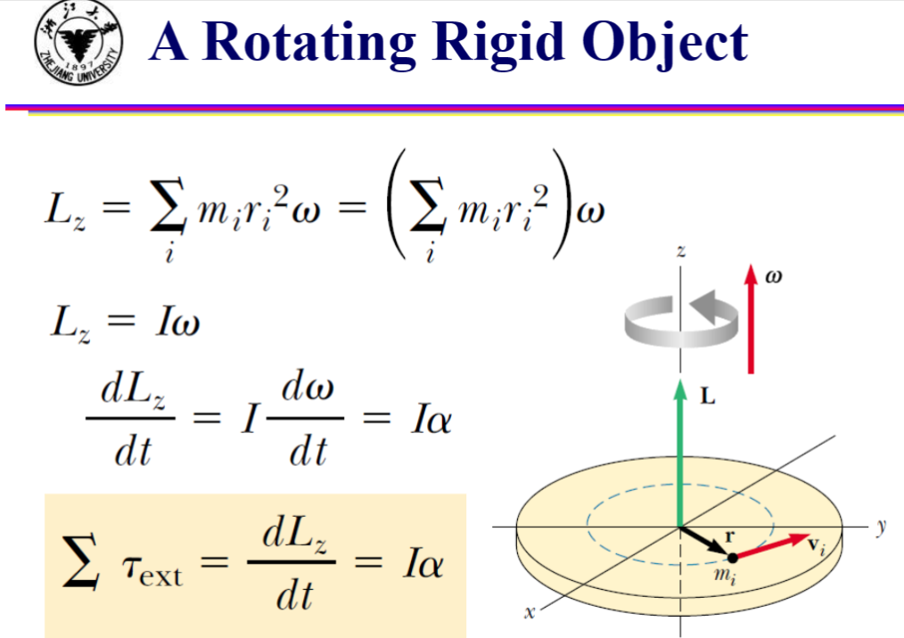
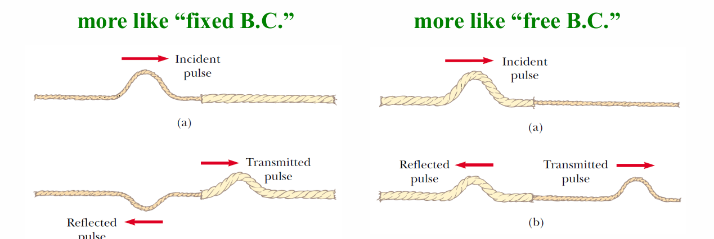

# 普通物理学Ⅰ

> 任课教师：路欣

## Solving problems in the view of **vectors**
### Dimension
类似单位，但是以具体的量表述，如$m(米) \rightarrow [length]$,$s(秒) \rightarrow [time]$,$kg(千克) \rightarrow [mass]$  
!!! warning "向量的单位/Dimension"
    向量的单位/Dimension就是其对应标量（module）的单位/Dimension。  
    因此单位向量的Dimension等于一般向量的Dimension除以其module的单位，也就是1  
    [So unit vectors are **dimensionless**.](https://physics.stackexchange.com/questions/172829/is-a-vector-and-a-unit-vector-dimensionless)  

## Work-Kinetic Energy/Momentum Principle
### Conservative Force
保守力：做功大小与路径/过程无关，只与初末位置/状态有关的力，如重力、弹力、电场力。  
保守力的做功等于对应势能的增量，即$W = -\Delta U$
### Center of Mass(CM)
$x_{cm} = \frac{m_1x_1 + m_2x_2 + \cdots + m_nx_n}{m_1 + m_2 + \cdots + m_n}$  

对于含有大量微粒的系统，其质心由求和转变为积分  
$x_{cm} = \lim_{\Delta m \to 0} \frac{\sum x_i \Delta m_i}{M} = \frac{\int xdm}{M}$

### CM Frame(质心系)
质心系是一个特殊的惯性系，质心系中的物体的总动量为0。质心可视为虚拟的质点。质心的质量为质点系所有质点质量之和。  
$\vec{v}_{cm} = \frac{\sum m_i\vec{v}_i}{\sum m_i}$  
$\vec{a}_{cm} = \frac{\sum m_i\vec{a}_i}{\sum m_i}$

#### 质心动量
质点系总动量等于质心动量，即$\sum m_i\vec{v}_i = (\sum m_i)\frac{\sum m_i\vec{v}_i}{\sum m_i} = (\sum m_i)\vec{v}_{cm}$  
因此质心动量的改变量等于质点系合外力的冲量。

#### 质心动能
柯尼希定理：质点系的动能等于质心动能加上每个质点**相对**质心的动能之和，即$E = E_{cm} + \sum E_{k,i-cm}$

## Rotational Motion
$\tau = I\alpha$(类比$F = ma$)  
其中$\tau$为力矩，$I$为转动惯量，$\alpha$为角加速度  
$I = \sum m_i r_i^2 = \int r^2 dm$, 与物体旋转轴的位置有关  
将刚体看作许多质点集合  

由此可表示转动物体的动能：$E_k = \frac{1}{2}I\omega^2$($\omega$为角速度)  
与动能定理：$\sum W = \int_{\theta_i}^{\theta_f} \sum \tau d\theta = \int_{\omega_i}^{\omega_f} I\omega d\omega = \frac{1}{2}I\omega_f^2 - \frac{1}{2}I\omega_i^2$  

平行轴定理：$I = I_{cm} + Mh^2$

### 角动量
$L = I\omega = r \times p$  

## 简谐运动
定义$\omega = \sqrt{\frac{k}{m}}$

则$x = Acos(\omega t + \phi)$

### 阻尼振动
$F_{\text{damping}} = -bv$  
$x = Ae^{-\frac{b}{2m}t}cos(\omega t + \phi)$
$\omega = \sqrt{\frac{k}{m} - \frac{b^2}{4m^2}}$  

### 受迫振动
$x = A'e*{-\frac{b}{2m}t}cos(\omega' t + \phi') + Acos(\omega t + \phi)$

## 波动

- 横波：波动方向与波传播方向垂直
- 纵波：波动方向与波传播方向平行

透射与反射：

$f(x,t) = f(x-vt)$或$f(x,t) = f(x+vt)$，正号代表波向右传播，负号代表波向左传播
波动方程：$\frac{\partial^2 u}{\partial t^2} = v^2\frac{\partial^2 u}{\partial x^2}$，其中$v$为波速，$u$为波函数，$x$为波传播方向，$t$为时间

### 声波
$I = \frac{P}{A} = \frac{1}{2}\rho v (\omega s_{max})^2$($\rho$为介质密度，$v$为声速，$\omega$为角频率，$s_{max}$为最大位移  
$I$为声强，$P$为声功率，$A$为声波通过的面积