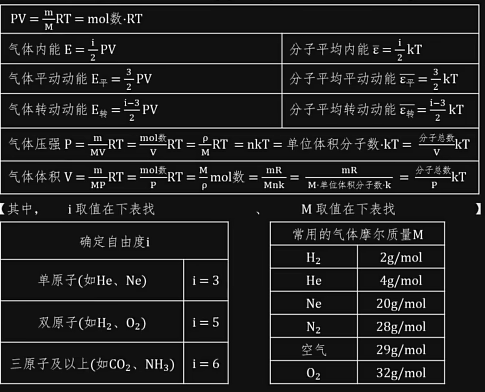

# 普通物理学Ⅰ（H）

> 任课教师：路欣

## Solving problems in the view of **vectors**
### Dimension
类似单位，但是以具体的量表述，如$m(米) \rightarrow [length]$,$s(秒) \rightarrow [time]$,$kg(千克) \rightarrow [mass]$  
!!! warning "向量的单位/Dimension"
    向量的单位/Dimension就是其对应标量（module）的单位/Dimension。  
    因此单位向量的Dimension等于一般向量的Dimension除以其module的单位，也就是1  
    [So unit vectors are **dimensionless**.](https://physics.stackexchange.com/questions/172829/is-a-vector-and-a-unit-vector-dimensionless)  

## Work-Kinetic Energy/Momentum Principle
### Conservative Force
保守力：做功大小与路径/过程无关，只与初末位置/状态有关的力，如重力、弹力、电场力。  
保守力的做功等于对应势能的增量，即$W = -\Delta U$
### Center of Mass(CM)
$x_{cm} = \frac{m_1x_1 + m_2x_2 + \cdots + m_nx_n}{m_1 + m_2 + \cdots + m_n}$  

对于含有大量微粒的系统，其质心由求和转变为积分  
$x_{cm} = \lim_{\Delta m \to 0} \frac{\sum x_i \Delta m_i}{M} = \frac{\int xdm}{M}$

### CM Frame(质心系)
质心系是一个特殊的惯性系，质心系中的物体的总动量为0。质心可视为虚拟的质点。质心的质量为质点系所有质点质量之和。  
$\vec{v}_{cm} = \frac{\sum m_i\vec{v}_i}{\sum m_i}$  
$\vec{a}_{cm} = \frac{\sum m_i\vec{a}_i}{\sum m_i}$

#### 质心动量
质点系总动量等于质心动量，即$\sum m_i\vec{v}_i = (\sum m_i)\frac{\sum m_i\vec{v}_i}{\sum m_i} = (\sum m_i)\vec{v}_{cm}$  
因此质心动量的改变量等于质点系合外力的冲量。

#### 质心动能
柯尼希定理：质点系的动能等于质心动能加上每个质点**相对**质心的动能之和，即$E = E_{cm} + \sum E_{k,i-cm}$

## Rotational Motion
$\tau = I\alpha$(类比$F = ma$)  
其中$\tau$为力矩，$I$为转动惯量，$\alpha$为角加速度  
$I = \sum m_i r_i^2 = \int r^2 dm$, 与物体旋转轴的位置有关  
将刚体看作许多质点集合  

??? 常见几何体转动惯量
    

由此可表示转动物体的动能：$E_k = \frac{1}{2}I\omega^2$($\omega$为角速度)  
与动能定理：$\sum W = \int_{\theta_i}^{\theta_f} \sum \tau d\theta = \int_{\omega_i}^{\omega_f} I\omega d\omega = \frac{1}{2}I\omega_f^2 - \frac{1}{2}I\omega_i^2$  

平行轴定理：$I = I_{cm} + Mh^2$，其中$I_{cm}$为以质心为轴的转动惯量，$h$为质心到新转轴的距离

### 角动量
$L = I\omega = r \times p$  
  
角动量守恒：要求外力矩为0，即$\tau_{\text{ext}} = 0$

## 简谐运动
定义$\omega = \sqrt{\frac{k}{m}}$，其中$k$为弹簧的劲度系数

则$x = Acos(\omega t + \phi)$  
$v = -A\omega sin(\omega t + \phi)$ 
$a = -A\omega^2 cos(\omega t + \phi)$

### 阻尼振动
$F_{\text{damping}} = -bv$  
$x = Ae^{-\frac{b}{2m}t}cos(\omega t + \phi)$
$\omega = \sqrt{\frac{k}{m} - \frac{b^2}{4m^2}}$  

### 受迫振动
$x = A'e^{-\frac{b}{2m}t}cos(\omega' t + \phi') + Acos(\omega t + \phi)$

## 波动

- 横波：波动方向与波传播方向垂直
- 纵波：波动方向与波传播方向平行

透射与反射：

Destructive Interference: $\Delta x = (n + \frac{1}{2})\lambda$  
Constructive Interference: $\Delta x = n\lambda$  
（$\Delta x$为定点到两波源的距离差）

$f(x,t) = f(x-vt)$或$f(x,t) = f(x+vt)$，正号代表波向左传播，负号代表波向右传播
波动方程：$\frac{\partial^2 u}{\partial t^2} = v^2\frac{\partial^2 u}{\partial x^2}$，其中$v$为波速，$u$为波函数，$x$为波传播方向，$t$为时间  

通解为$y(x,t) = Acos(kx - \omega t + \phi)$，其中$k = \frac{2\pi}{\lambda}$，$\omega = 2\pi f$，$\phi$为初相位

波速：$v = \frac{\lambda}{T} = \lambda f = \sqrt{\frac{F}{\sigma}}$($\lambda$为波长，$T$为周期，$f$为频率，$F$为张力，$\sigma$为线密度（单位长度的质量）)  

驻波：两个波源频率相同，波长相同，波速相同，波源间距为半波长的整数倍

### 声波
$I = \frac{P}{A} = \frac{1}{2}\rho v (\omega s_{max})^2$($\rho$为介质密度，$v$为声速，$\omega$为角频率，$s_{max}$为最大位移  
$I$为声强，$P$为声功率，$A$为声波通过的面积

#### 多普勒效应
观测者靠近声源，频率增大；远离声源，频率减小

- 声源运动，观测者静止：$f = \frac{f_0}{1 \pm \frac{v_s}{v}}$，其中$f$为观测到的频率，$f_0$为声源发出的频率，$v_s$为声源速度，$v$为声速
- 声源静止，观测者运动：$f = f_0(1 \pm \frac{v_o}{v})$，其中$v_o$为观测者速度
## 相对论
### Lorentz Transformation
B关于A的速度为$v$.对于某个事件，A系中的坐标为$(x,t)$，B系中的坐标为$(x',t')$  
则$x' = \frac{x-vt}{\sqrt{1-\frac{v^2}{c^2}}}$,$t' = \frac{t-\frac{v}{c^2}x}{\sqrt{1-\frac{v^2}{c^2}}}$  
注意到当$v \ll c$时，Lorentz Transformation 退化为 Galilean Transformation: $x' = x - vt$,$t' = t$

### 速度变换
令$\Delta x = x_2 - x_1$,$\Delta t = t_2 - t_1$  
则$\Delta x' = \frac{\Delta x - v\Delta t}{\sqrt{1-\frac{v^2}{c^2}}}$,$\Delta t' = \frac{\Delta t - \frac{v}{c^2}\Delta x}{\sqrt{1-\frac{v^2}{c^2}}}$  
定义

- $v = \frac{\Delta x}{\Delta t}$ 为物体在A系中的速度
- $w = \frac{\Delta x'}{\Delta t'}$ 为物体在B系中的速度
- $u$ 为B相对于A的速度  

则$\frac{\Delta x'}{\Delta t'} = \frac{\Delta x - v\Delta t}{\Delta t - \frac{v}{c^2}\Delta x} \underrightarrow{\Delta t \to 0} \frac{dx}{dt} = w = \frac{v - u}{1 - \frac{uv}{c^2}}$

则也可得到$v = \frac{u + w}{1 + \frac{uw}{c^2}}$

长度收缩：$L' = L_0 \sqrt{(1-\frac{u^2}{c^2})}$

时间膨胀：$\Delta t' = \frac{\Delta t_0}{\sqrt{(1-\frac{u^2}{c^2})}}$

#### 能量与动量
质速关系：$m = \frac{m_0}{\sqrt{1-\frac{v^2}{c^2}}}$

$K = \frac{mc^2}{\sqrt{1-\frac{v^2}{c^2}}} - mc^2$（动能）

$K_1 = m_0 c^2$ （静止能量）  

总能量：$E = K + K_1 = \frac{m_0c^2}{\sqrt{1-\frac{v^2}{c^2}}} = mc^2$

$p = \frac{m_0 u}{\sqrt{1-\frac{u^2}{c^2}}}$

## 热
均方根速率：$v_{rms} = \sqrt{\frac{3kT}{m}}$，其中$k$为玻尔兹曼常数，$T$为温度，$m$为质量

最概然速率：$v_{mp} = \sqrt{\frac{2kT}{m}}$

平均速率：$v_{avg} = \sqrt{\frac{8kT}{\pi m}}$

$R = 8.31J/(mol \cdot K)$

$k_B = \frac{R}{N_A} = 1.38 \times 10^{-23} J/K$  
于是$PV = nRT = Nk_BT$

线性膨胀：$\Delta L = \alpha L \Delta T$  
体积膨胀：$\Delta V = \beta V \Delta T$  
$\beta = 3\alpha$

对于真实情况下的气体，van der Waals方程：$(P + \frac{aN^2}{V^2})(V - Nb) = Nk_BT$，其中$a$为分子间吸引力系数，$b$为分子体积

两个温度分别为T1，T2的热库通过截面积为S的细杆热传递（T1>T2），热传递速率$\frac{dQ}{dT} = -kS \frac{T1-T2}{L}$，$k$为杆材料的热传导率，$T1 \rightarrow T2$时有$\frac{dQ}{dT} = -kS \frac{dT}{dx}$

分子动能$E_k = \frac{1}{2} m v^2 = \frac{3}{2} k_B T$，对于大量处于某一温度的分子（宏观上已被视为气体），其速度不全为v，而是服从麦克斯韦-玻尔兹曼分布：$f(v) = 4\pi (\frac{m}{2\pi k_B T})^{3/2} v^2 e^{-\frac{mv^2}{2k_B T}}$

平均碰撞次数：$z = n_v \pi d^2 vt$  
平均自由程：$l = \frac{k_B T}{\sqrt{2} \pi d^2 p}$
### 热力学第一定律
$dU = \Delta Q - PdV$

功：$W = \int_{V_i}^{V_f} PdV$    
气体从$(P_1, V_1)$到$(P_2, V_2)$的功（等温）：$W = \int_{V_1}^{V_2} PdV = \int_{V_1}^{V_2} \frac{nRT}{V}dV = nRTln\frac{V_2}{V_1}$

定义$c = \frac{dQ}{dT}$  
等容摩尔热容：$C_v = \frac{i}{2}R$，其中$i$为自由度  
等压摩尔热容：$C_p = C_v + R$  
则定义：$\gamma = \frac{C_p}{C_v} = \frac{i+2}{i}$

绝热过程中：$PV^{\gamma} = C$，$W_{A\rightarrow B} = \frac{P_A V_A - P_B V_B}{\gamma - 1}$

卡诺热机效率：$\eta = 1 - \frac{T_2}{T_1}$，其中$T_1$为高温，$T_2$为低温  
制冷系数：$\frac{1}{\eta} - e = 1$

### Entropy
$ds = \frac{dQ}{T}$，要求$Q$是可逆过程中的热量

等温过程$S_2 - S_1 = nR \ln \frac{V_2}{V_1}$