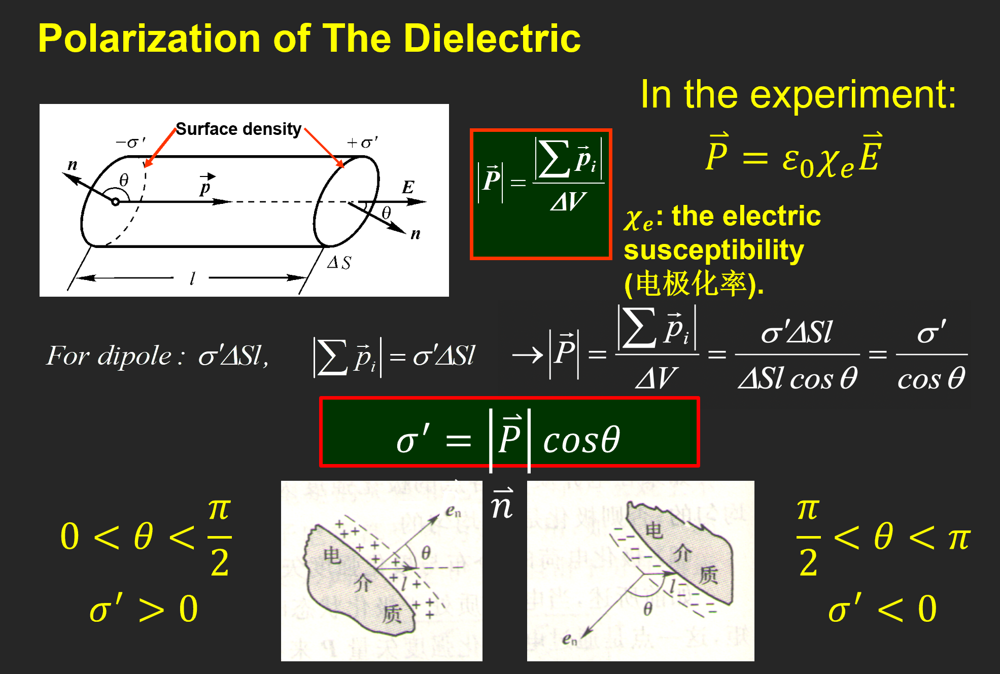
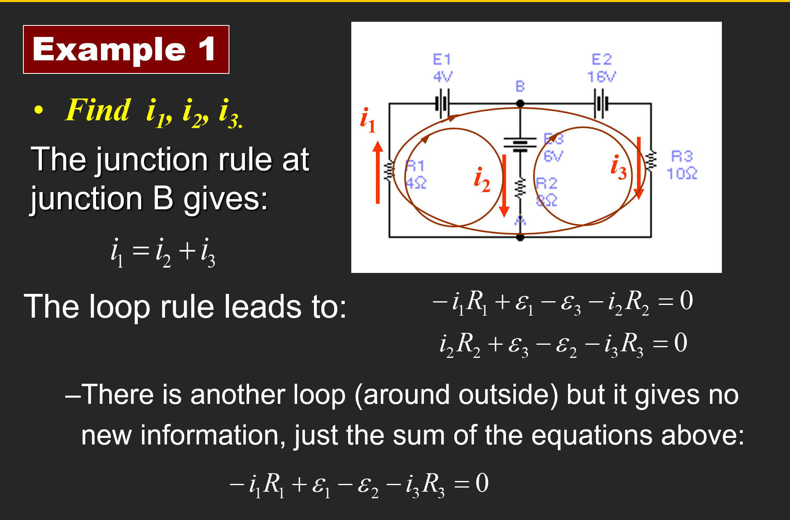
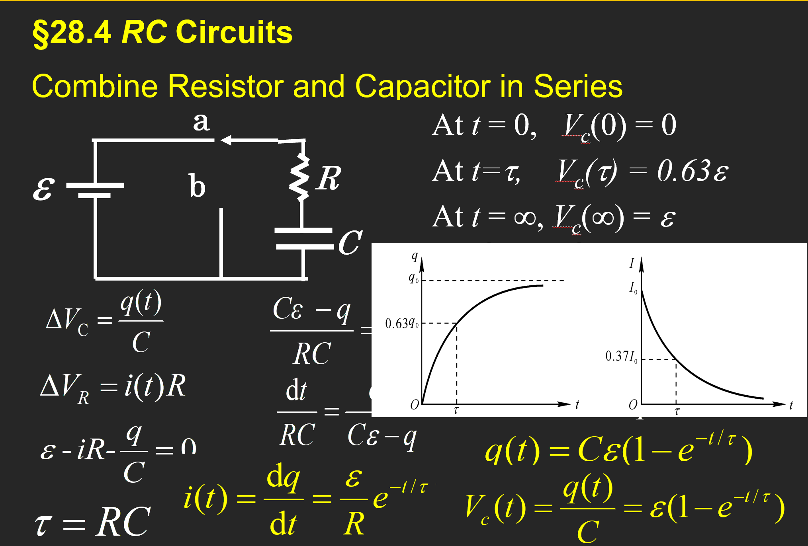
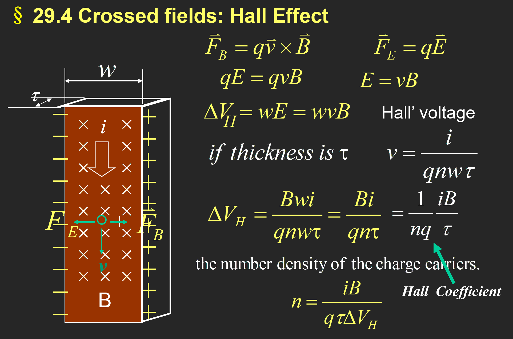

> 唯二真史

# 普通物理学Ⅱ（H）

> 任课教师：王业伍

## 电磁学
电偶极子：一对间距为$d$，电荷量为$q$的异号电荷构成的偶极子。  
电偶极矩：$\overrightarrow{p}=q \overrightarrow{d}$。

### Flux 通量

立体角：$d\overrightarrow{A} = r^2 d\Omega$，等号左侧为面积微元，也等于 $dA \cdot \overrightarrow{n}$，其中 $\overrightarrow{n}$ 为单位法向量。

#### Gauss 定理
电通量：$\Phi = \int \overrightarrow{E} \cdot d\overrightarrow{A} = \frac{\Sigma q}{\varepsilon_0}$，其中$q$为闭合曲面内包含的电荷量。

!!! example "例"
    1. 无限长均匀带电线（$L \gt \gt R$的圆柱），线密度为$\lambda$，求距其轴心$r$处的电场强度。  
          
        选取r处长为$h$的圆柱面，此时所有面积微元处的电场强度大小是一样的，则有$E \cdot 2\pi rh = \frac{\lambda h}{\varepsilon_0}$，所以$E = \frac{\lambda}{2\pi \varepsilon_0 r}$。
    2. 无限大带电平面
        
    3. 均匀带电球壳
        

Gauss 定理和库仑定律求电场强度：

!!! note "小测题！"
    

### 电势

半径为R，带电量q的均匀带电球壳（r>R）：$U(r) = \int_r^{\infty} \frac{kq}{r^2} dr = \frac{kq}{r}$。

TBD

### 电容
半径为$r$的孤立球形导体：$C = \frac{q}{U} = 4\pi \varepsilon_0 r$。

- 平行板：
  - 
- 圆柱形电容：
  - 
- 球状电容：
  - 

并联总电容：$C = \Sigma C_i$。串联总电容：$\frac{1}{C} = \Sigma \frac{1}{C_i}$。

!!! example "例"
    

介电体处于电场中时，会在内部产生极化电荷，从而减小电场强度。极化电场$E_p = \frac{E}{k_e}$。$k_e$称为相对介电常数（Relative dielectric constant）。

有了介电体后，电容变为$C = k_e \varepsilon_0 \frac{S}{d}$。

考虑真空中两个由无数电偶极子组成的平行圆板，如上图所示，定义$\overrightarrow{P} = \frac{\Sigma \overrightarrow{p}}{V}$（$\overrightarrow{p}$为电偶极矩，$\Delta V$ 为囊括的体积），则有$\overrightarrow{P} = \varepsilon_0 \chi_e \overrightarrow{E}$，其中$\chi_e$为电极化率。

#### 介电质中的Gauss 定理
TBD，以及电位移矢量的内容。

!!! example "例"
      
    求这个具有两层介电体的电容以及表面的电荷密度。

### 电流
电流定义：$I = \frac{dq}{dt}$。

电流密度：$\overrightarrow{j} = \frac{dI}{dS} \overrightarrow{n}$。

得到电荷守恒：

若 $\frac{dq}{dt} = 0$，则上式为0.

平均而言，电流中电子以**漂移速度**$v_d$运动，$I = neSv_d$，则有$\overrightarrow{j} = - ne\overrightarrow{v_d}$。

#### 欧姆定律

这里的$\sigma$为电导率，$\rho$为电阻率，$\sigma = \frac{1}{\rho}$。

#### 基尔霍夫定律

- Junction定律：$i = \Sigma i_k$。
- Loop定律：在闭合回路中， $\Sigma U_k = \Sigma \epsilon_k + \Sigma i R_k = 0$。

!!! example "例"
      
    注意这里i1 i2 i3的方向是自己假设的，然后运用基尔霍夫定律进行计算就行了。

#### RC电路
结合了电容和电阻的电路。

- 充电时：
- 放电时：

### 磁场

高中就不会的霍尔效应：

