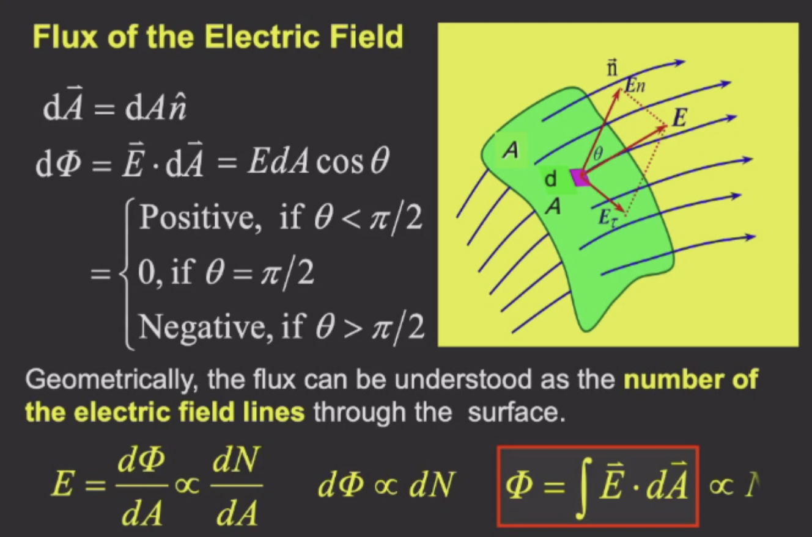
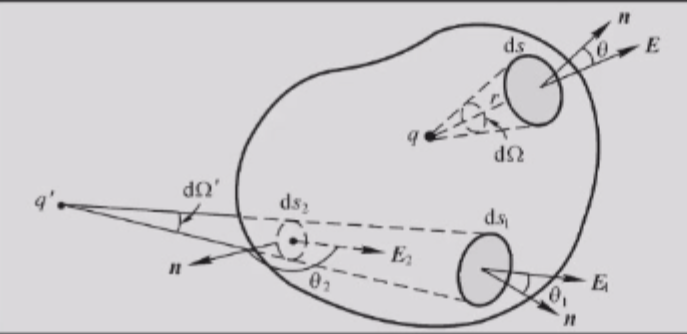
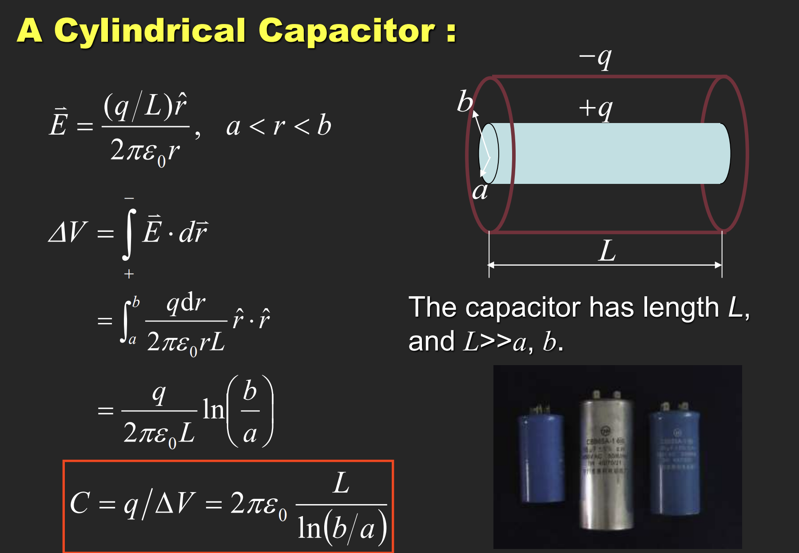
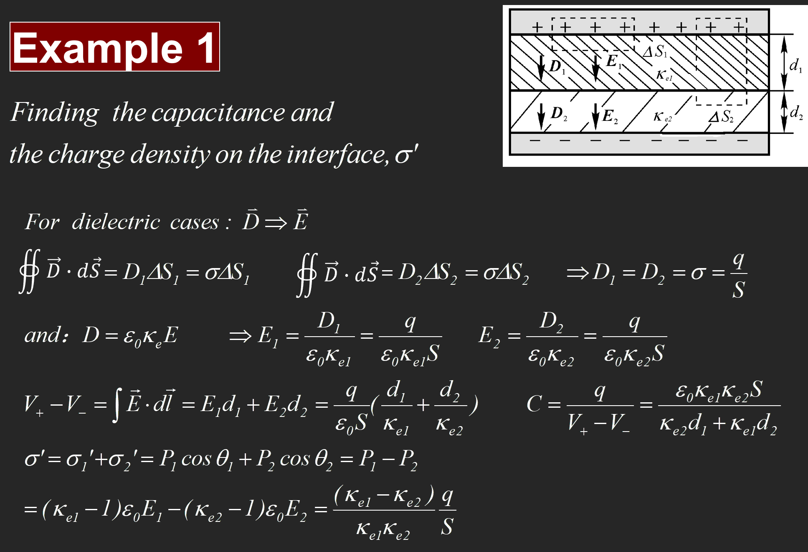
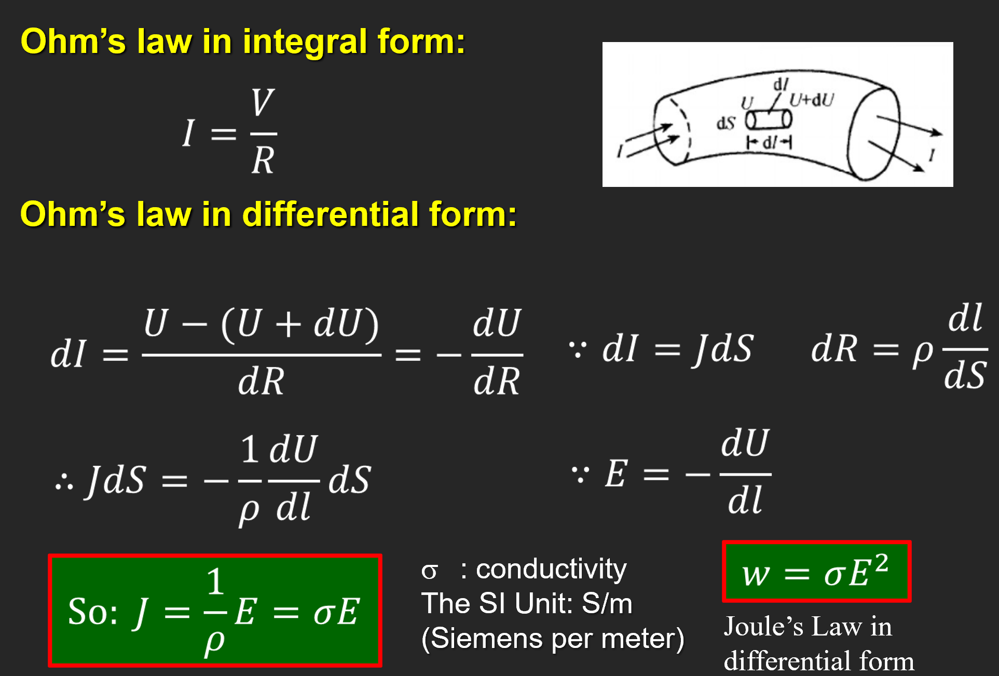
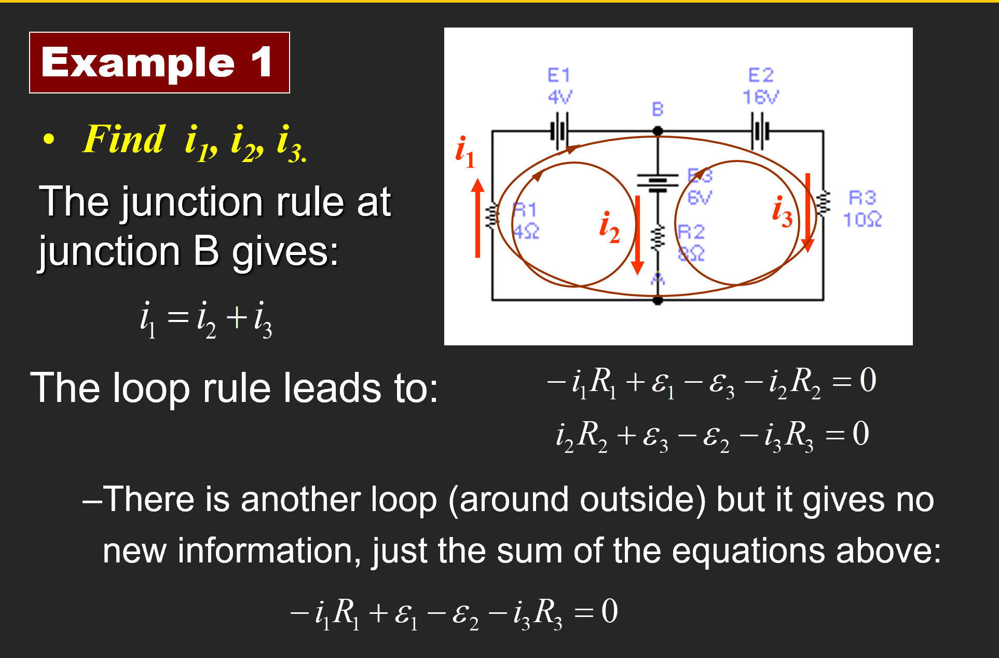
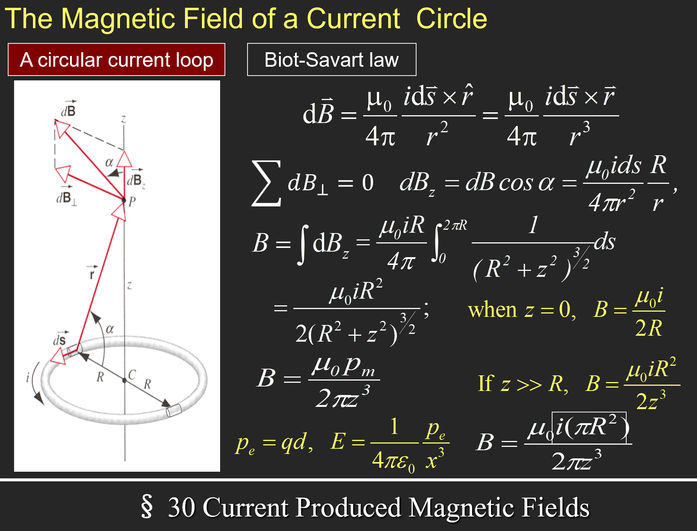

> 这辈子有了

# 普通物理学Ⅱ（H）

> 任课教师：王业伍

!!! note "Links"
    不好，有神：https://www.kailqq.cc/NOTE/Physics/

## 电磁学
电偶极子：一对间距为$d$，电荷量为$q$的异号电荷构成的偶极子。  
电偶极矩：$\overrightarrow{p}=q \overrightarrow{d}$。

### Flux 通量

立体角：$d\overrightarrow{A} = r^2 d\Omega$，等号左侧为面积微元，也等于 $dA \cdot \overrightarrow{n}$，其中 $\overrightarrow{n}$ 为单位法向量。

#### Gauss 定理
电通量：$\Phi = \int \overrightarrow{E} \cdot d\overrightarrow{A} = \frac{\Sigma q}{\varepsilon_0}$，其中$q$为闭合曲面内包含的电荷量。

!!! example "例"
    1. 无限长均匀带电线（$L \gt \gt R$的圆柱），线密度为$\lambda$，求距其轴心$r$处的电场强度。  
          
        选取r处长为$h$的圆柱面，此时所有面积微元处的电场强度大小是一样的，则有$E \cdot 2\pi rh = \frac{\lambda h}{\varepsilon_0}$，所以$E = \frac{\lambda}{2\pi \varepsilon_0 r}$。
    2. 无限大带电平面
        
    3. 均匀带电球壳
        

Gauss 定理和库仑定律求电场强度：

    

### 电势

半径为R，带电量q的均匀带电球壳（r>R）：$U(r) = \int_r^{\infty} \frac{kq}{r^2} dr = \frac{kq}{r}$。

TBD

### 电容
半径为$r$的孤立球形导体：$C = \frac{q}{U} = 4\pi \varepsilon_0 r$。

- 平行板：
  - 
- 圆柱形电容：
  - 
- 球状电容：
  - 

并联总电容：$C = \Sigma C_i$。串联总电容：$\frac{1}{C} = \Sigma \frac{1}{C_i}$。

!!! example "例"
    

介电体处于电场中时，会在内部产生极化电荷，从而减小电场强度。极化电场$E_p = \frac{E}{k_e}$。$k_e$称为相对介电常数（Relative dielectric constant）。

有了介电体后，电容变为$C = k_e \varepsilon_0 \frac{S}{d}$。

考虑真空中两个由无数电偶极子组成的平行圆板，如上图所示，定义$\overrightarrow{P} = \frac{\Sigma \overrightarrow{p}}{V}$（$\overrightarrow{p}$为电偶极矩，$\Delta V$ 为囊括的体积），则有$\overrightarrow{P} = \varepsilon_0 \chi_e \overrightarrow{E}$，其中$\chi_e$为电极化率。

#### 介电质中的Gauss 定理
TBD，以及电位移矢量的内容。

!!! example "例"
      
    求这个具有两层介电体的电容以及表面的电荷密度。

### 电流
电流定义：$I = \frac{dq}{dt}$。

电流密度：$\overrightarrow{j} = \frac{dI}{dS} \overrightarrow{n}$。

得到电荷守恒：

若 $\frac{dq}{dt} = 0$，则上式为0.

平均而言，电流中电子以**漂移速度**$v_d$运动，$I = neSv_d$，则有$\overrightarrow{j} = - ne\overrightarrow{v_d}$。

#### 欧姆定律

这里的$\sigma$为电导率，$\rho$为电阻率，$\sigma = \frac{1}{\rho}$。

#### 基尔霍夫定律

- Junction定律：$i = \Sigma i_k$。
- Loop定律：在闭合回路中， $\Sigma U_k = \Sigma \epsilon_k + \Sigma i R_k = 0$。

!!! example "例"
      
    注意这里i1 i2 i3的方向是自己假设的，然后运用基尔霍夫定律进行计算就行了。

#### RC电路
结合了电容和电阻的电路。

- 充电时：
- 放电时：

### 磁场

高中就不会的霍尔效应：

磁场是非保守场，所以没有势能的概念。

#### Biot-Savart 定律
定义电流元$Id\overrightarrow{l}$，则该电流元产生的磁场大小为$d\overrightarrow{B} = \frac{\mu_0}{4\pi} \frac{Id\overrightarrow{l} \times \overrightarrow{r}}{r^3}$。

则有$\overrightarrow{B} = \int d\overrightarrow{B} = \frac{\mu_0}{4\pi} \int \frac{Id\overrightarrow{l} \times \overrightarrow{r}}{r^3}$。

$\mu_0 = 4\pi \times 10^{-7} \mathrm{T \cdot m/A}$。

只适用于恒定电流。

- 真空直导线：$B = \frac{\mu_0 I}{2\pi d}$，其中$d$为导线到点的距离。
  - 
- 电流圆环：$B = \frac{\mu_0 I R^2}{2(R^2 + z^2)^{3/2}}$。
  - 

<https://blog.csdn.net/weixin_45864618/article/details/106672456>

#### 安培环路定理
$\oint \overrightarrow{B} \cdot d\overrightarrow{l} = \mu_0 I$。

在恒定电流的磁场中，磁感应强度沿任何闭合路径一周的线积分（即环路积分），等于闭合路径内所包围并穿过的电流的代数和的$\mu_0$倍

<https://zhuanlan.zhihu.com/p/142376701>

### 法拉第电磁感应定律

定义磁通量：$\Phi = \int \overrightarrow{B} \cdot d\overrightarrow{A}$。

TBD
### 电感
TBD

## 小测部分

### 第一次小测

[实心带电球体静电能](https://chiichen.github.io/notes/College-Physics/Formula-Derivation/Electrostatic-energy-of-a-solid-charged-sphere.html#_3-%E9%9D%99%E7%94%B5%E8%83%BD)

### 第二次小测

已知这样的一对非平行极板，求其电容，其中上板横向纵向长度 $a, b$, 上板最低点与下板距离 $d$，最高点与下板距离 $d+h$ 已知，$h<<d$

??? note "解"
    先定义一下上板倾角为 $\theta$，下板横向长为 $x$。则由于 $d$ 很小，倾角趋于0，有近似 $\tan \theta = \sin \theta = \frac{h}{a}$，那么取下板沿 $x$ 方向很小的一截 $dx$，这一截的下板面积是 $bdx$，且近似与上板平行（上板平行重合的这一小截也视作面积是 $bdx$，则由平行极板电容公式 $C = \frac{\epsilon_0 A}{d}$，得到$dC=\frac{\epsilon_0 bdx}{d+\tan \theta x}$  
    直接对 $x$ 从0到 $a$ 积分，  
    得到 $C = \int_0^a \frac{\epsilon_0 bdx}{d+\frac{h}{a} x} = \frac {\epsilon_0 a b}{h} \cdot \ln \frac{h+d}{d}$