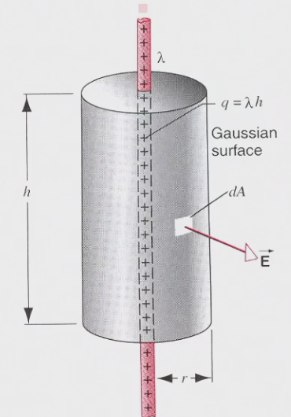
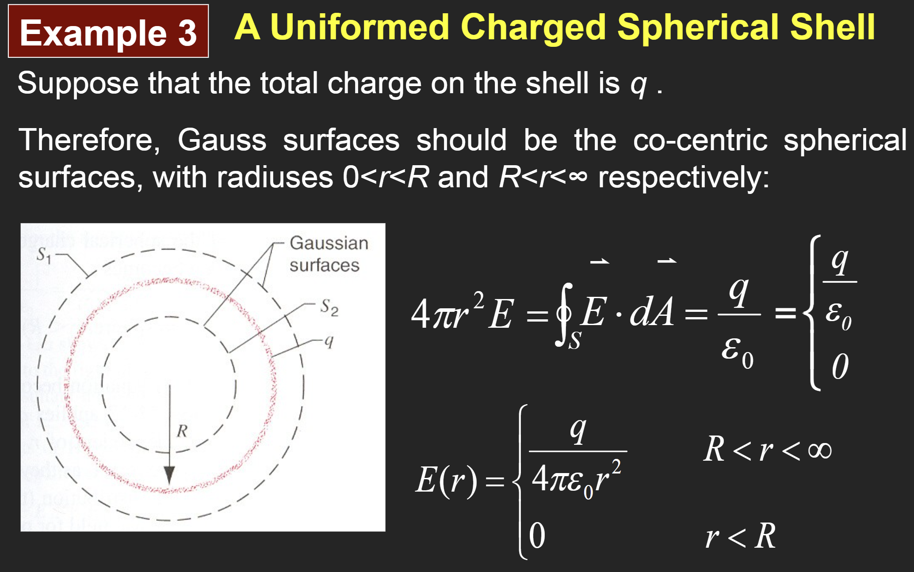
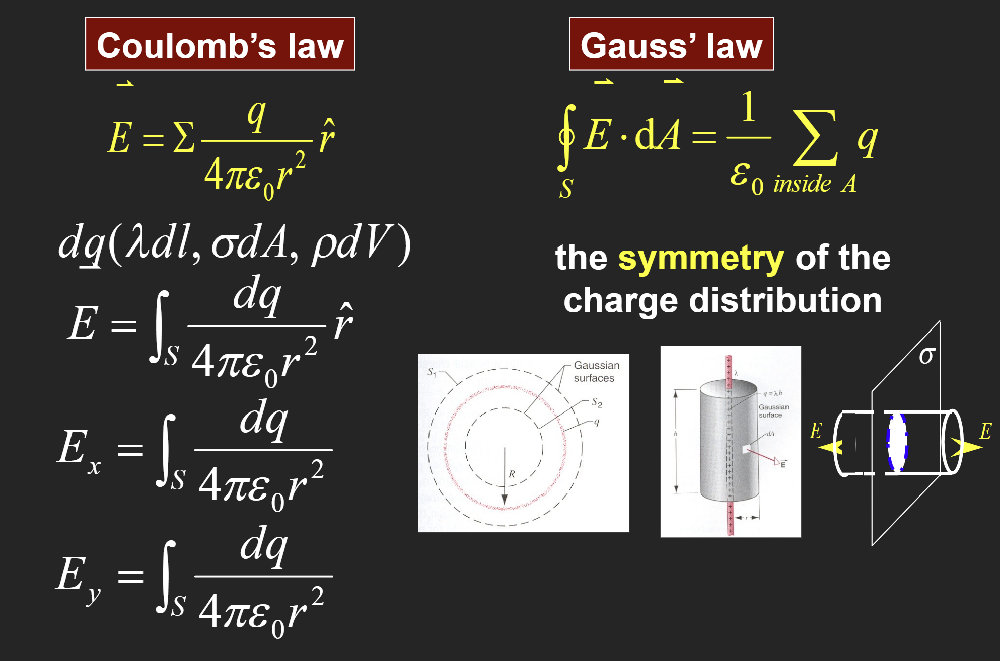
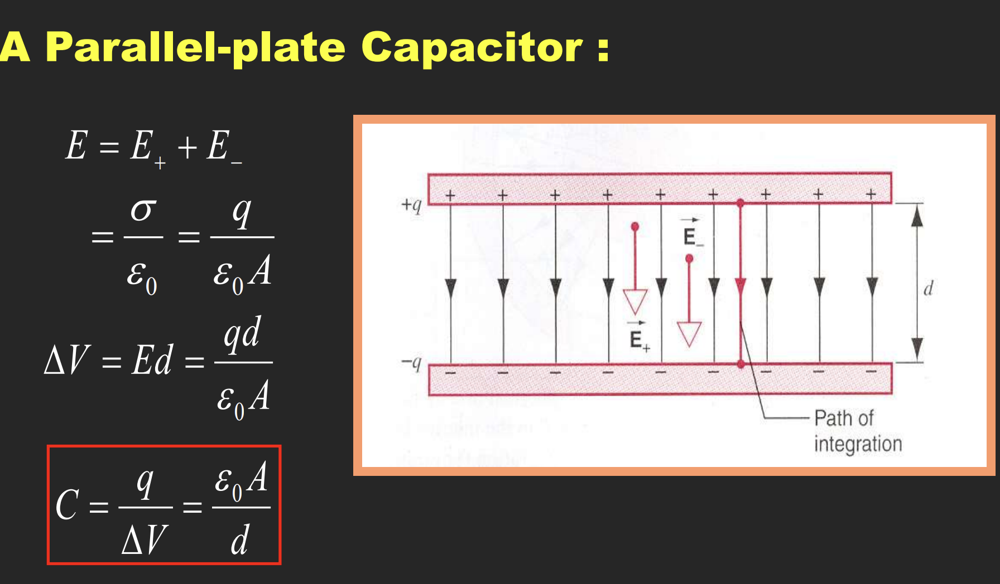
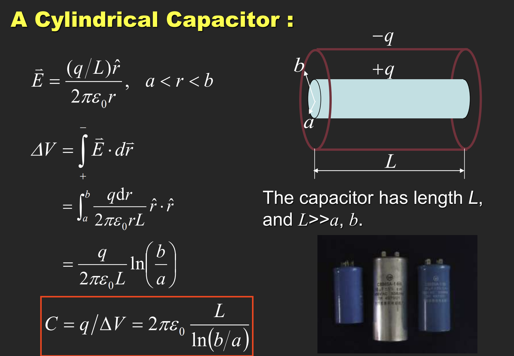
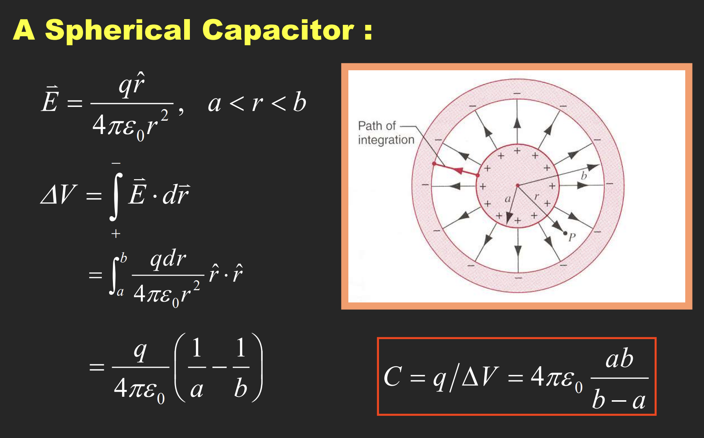

> 唯二真史

# 普通物理学Ⅱ（H）

> 任课教师：王业伍

## 电磁学
电偶极子：一对间距为$d$，电荷量为$q$的异号电荷构成的偶极子。  
电偶极矩：$\overrightarrow{p}=q \overrightarrow{d}$。

### Flux 通量

立体角：$d\overrightarrow{A} = r^2 d\Omega$，等号左侧为面积微元，也等于 $dA \cdot \overrightarrow{n}$，其中 $\overrightarrow{n}$ 为单位法向量。

#### Gauss 定理
电通量：$\Phi = \int \overrightarrow{E} \cdot d\overrightarrow{A} = \frac{\Sigma q}{\varepsilon_0}$，其中$q$为闭合曲面内包含的电荷量。

!!! example "例"
    1. 无限长均匀带电线（$L \gt \gt R$的圆柱），线密度为$\lambda$，求距其轴心$r$处的电场强度。  
          
        选取r处长为$h$的圆柱面，此时所有面积微元处的电场强度大小是一样的，则有$E \cdot 2\pi rh = \frac{\lambda h}{\varepsilon_0}$，所以$E = \frac{\lambda}{2\pi \varepsilon_0 r}$。
    2. 无限大带电平面
        
    3. 均匀带电球壳
        

Gauss 定理和库仑定律求电场强度：

!!! note "小测题！"
    

### 电势

半径为R，带电量q的均匀带电球壳（r>R）：$U(r) = \int_r^{\infty} \frac{kq}{r^2} dr = \frac{kq}{r}$。

TBD

### 电容
$C = \frac{q}{U} = 4\pi \varepsilon_0 r$。

- 平行板：
  - 
- 圆柱形电容：
  - 
- 球状电容：
  - 

并联总电容：$C = \Sigma C_i$。串联总电容：$\frac{1}{C} = \Sigma \frac{1}{C_i}$。

!!! example '例'
    