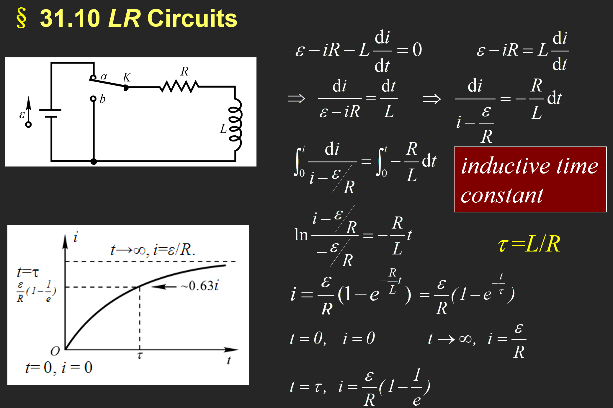

> 全家丝光的课

# 普通物理学Ⅱ（H）

> 任课教师：王业伍

!!! note "Ref & Credit"
    不好，有神：https://www.kailqq.cc/NOTE/Physics/  
    配享太庙：https://savia7582.github.io/Exterior/Physics/2/  
    一天入门半学期：https://space.bilibili.com/522385498/upload/video/

## 电磁学
电偶极子：一对间距为$d$，电荷量为$q$的异号电荷构成的偶极子。  
电偶极矩：$\overrightarrow{p}=q \overrightarrow{d}$。

### Flux 通量

立体角：$d\overrightarrow{A} = r^2 d\Omega$，等号左侧为面积微元，也等于 $dA \cdot \overrightarrow{n}$，其中 $\overrightarrow{n}$ 为单位法向量。

#### Gauss 定理
电通量：$\Phi = \int \overrightarrow{E} \cdot d\overrightarrow{A} = \frac{\Sigma q}{\varepsilon_0}$，其中$q$为闭合曲面内包含的电荷量。

!!! example "例"
    1. 无限长均匀带电线（$L \gt \gt R$的圆柱），线密度为$\lambda$，求距其轴心$r$处的电场强度。  
          
        选取r处长为$h$的圆柱面，此时所有面积微元处的电场强度大小是一样的，则有$E \cdot 2\pi rh = \frac{\lambda h}{\varepsilon_0}$，所以$E = \frac{\lambda}{2\pi \varepsilon_0 r}$。
    2. 无限大带电平面
        
    3. 均匀带电球壳
        

Gauss 定理和库仑定律求电场强度：

    

### 电势

半径为R，带电量q的均匀带电球壳（r>R）：$U(r) = \int_r^{\infty} \frac{kq}{r^2} dr = \frac{kq}{r}$。

### 电容
半径为$r$的孤立球形导体：$C = \frac{q}{U} = 4\pi \varepsilon_0 r$。

- 平行板：
  - 
- 圆柱形电容：
  - 
- 球状电容：
  - 

并联总电容：$C = \Sigma C_i$。串联总电容：$\frac{1}{C} = \Sigma \frac{1}{C_i}$。

!!! example "例"
    

### 极化

介电体处于电场中时，会在内部产生极化电荷，从而减小电场强度。极化电场$E_p = \frac{E}{k_e}$。$k_e$称为相对介电常数（Relative dielectric constant）。

有了介电体后，电容变为$C = k_e \varepsilon_0 \frac{S}{d}$。

考虑真空中两个由无数电偶极子组成的平行圆板，如上图所示，定义极化强度矢量$\overrightarrow{P} = \frac{\Sigma \overrightarrow{p}}{V}$（$\overrightarrow{p}$为电偶极矩，$\Delta V$ 为囊括的体积），则有$\overrightarrow{P} = \varepsilon_0 \chi_e \overrightarrow{E}$，其中$\chi_e$为电极化率。

$\chi_e + 1 = k_e$

有$\iint P dA = \Sigma_{out} q' = -\Sigma_{in} q'$

极化强度矢量与闭合曲面的内积积分等于该曲面表面的束缚电荷，等于该曲面内部电荷的相反数(外面有多少正的，里面就有多少负的)

这里的$q'$是极化电荷！所以这个不是高斯定理。

同时有面电荷密度$\sigma' = P \cdot n$，等于极化强度矢量在法向上的分量；由夹角来控制正负。

#### 介电质中的 Gauss 定理

（照抄<kailqq.cc>）

考虑一个正电荷$q_0$放在电介质中，其周围会产生极化电荷$q'$

由正宗的高斯定理得到 $\iint E d A = \frac{q_0 + q'}{\epsilon_0}$ 

而由极化电荷和强度矢量的性质有 $\iint P d A = -q'$

代入得到$\epsilon_0 \iint E dA = q_0 - \iint P d A$

尝试表示$q_0$：$q_0 = \iint (\epsilon_0 E + P) dA$

于是定义$D = \epsilon_0 E + P$为电位移矢量

这说明电位移矢量与闭合曲面内积面积分等于该曲面内的**自由电荷**（非极化）之和

!!! example "例"
      
    求这个具有两层介电体的电容以及表面的电荷密度。

#### 电容器中的能量

考虑一个平行板电容器，其电容为 $C$，电压为 $V$ ，则其具有的能量相当于从负极板不断将电荷移动到正极板，这样的过程中克服电场力所做的功

$W = \int_0^Q V dq = \frac{1}{2} C V^2$

考虑到平行板电容 $C = \frac{\epsilon_0 A}{d}$，$V = ED$

得到能量$E = W = \frac{1}{2} \epsilon_0 E^2 A d$

注意到$Ad$是夹在两板之间的体积，定义能量密度$\mu = \frac{1}{2} \epsilon_0 E^2$

### 电流
电流定义：$I = \frac{dq}{dt}$。

电流密度：$\overrightarrow{j} = \frac{dI}{dS} \overrightarrow{n}$。

得到电荷守恒：

若 $\frac{dq}{dt} = 0$，则上式为0.

平均而言，电流中电子以**漂移速度**$v_d$运动，$I = neSv_d$，则有$\overrightarrow{j} = - ne\overrightarrow{v_d}$。

#### 欧姆定律

这里的$\sigma$为电导率，$\rho$为电阻率，$\sigma = \frac{1}{\rho}$。

#### 基尔霍夫定律

- Junction定律：$i = \Sigma i_k$。
- Loop定律：在闭合回路中， $\Sigma U_k = \Sigma \epsilon_k + \Sigma i R_k = 0$。

!!! example "例"
      
    注意这里i1 i2 i3的方向是自己假设的，然后运用基尔霍夫定律进行计算就行了。

#### RC电路
结合了电容和电阻的电路。

- 充电时：
- 放电时：

### 磁场

高中就不会的霍尔效应：

磁场是非保守场，所以没有势能的概念。

#### Biot-Savart 定律
定义电流元$Id\overrightarrow{l}$，则该电流元产生的磁场大小为$d\overrightarrow{B} = \frac{\mu_0}{4\pi} \frac{Id\overrightarrow{l} \times \overrightarrow{r}}{r^3}$。

则有$\overrightarrow{B} = \int d\overrightarrow{B} = \frac{\mu_0}{4\pi} \int \frac{Id\overrightarrow{l} \times \overrightarrow{r}}{r^3}$。

$\mu_0 = 4\pi \times 10^{-7} \mathrm{T \cdot m/A}$。

只适用于恒定电流。

- 真空直导线：$B = \frac{\mu_0 I}{2\pi d}$，其中$d$为导线到点的距离。
  - 
- 电流圆环：$B = \frac{\mu_0 I R^2}{2(R^2 + z^2)^{3/2}}$。
  - 

<https://blog.csdn.net/weixin_45864618/article/details/106672456>

#### 安培环路定理
$\oint \overrightarrow{B} \cdot d\overrightarrow{l} = \mu_0 I$。

在恒定电流的磁场中，磁感应强度沿任何闭合路径一周的线积分（即环路积分），等于闭合路径内所包围并穿过的电流的代数和的$\mu_0$倍

<https://zhuanlan.zhihu.com/p/142376701>

#### Gauss 定理（磁场Ver.）
$\iint B dA = 0$，$A$为真空中一个闭合曲面。

#### 磁偶极矩

$\overrightarrow{P_m} = I \overrightarrow{S}$，其中$I$为电流，$\overrightarrow{S}$平面单回路围起来的面积矢量。

### 法拉第电磁感应定律

定义磁通量：$\Phi = \int \overrightarrow{B} \cdot d\overrightarrow{A}$。

感生电动势：$\varepsilon = -\frac{d\Phi}{dt} = -\iint_S \frac{d\overrightarrow{B}}{dt} \cdot d\overrightarrow{A}$。

动生电动势：$\varepsilon = \int_a^b (\overrightarrow{v} \times \overrightarrow{B}) \cdot d\overrightarrow{l}$。

发电机：$\Phi = BLS \cos \omega t$，$\varepsilon = \omega BLS \sin \omega t$。

### 电感
#### 自感

一圈匝数为$N$，横截面$S$的线圈通过电流$i$时会感应出磁场$B$，则有自感系数$L = \frac{N\Phi}{i}$，单位为亨利（1 Henry = 1 T $\cdot$ m$^2$/A）。

由电磁感应得到自感电动势：$\varepsilon = - \frac{d N \Phi}{dt} = -L \frac{di}{dt}$。

!!! example "例：通电螺线管"
    

!!! example "例：矩形螺绕环"
    

???+ LR回路
    开关连接电源：注意利用回路中总电势变化为0即可，这里定义了自感时间常数$\tau = L/R$  
      
    开关不连电源：同理，这次类似放电  
    

功率：$dW=−εdq=−εidt=Lidi$

存储能量：$E = \frac{1}{2} L i^2$

#### 互感

考虑两个共轴（轴长为$l$）的，匝数分别为$N_1, N_2$的，横截面半径都为$r$的线圈，通过线圈1的电流$i_1$产生的磁通量为$\mu_0 \frac{N_1}{l} i_1 \pi r^2$

则通过线圈2的磁通量为$\Phi_{21} = \mu_0 \frac{N_1 N_2}{l} i_1 \pi r^2$

线圈2产生的互感电动势为$\varepsilon_{21} = -\frac{d\Phi_{21}}{dt} = -\mu_0 \frac{N_1 N_2}{l} \pi r^2 \frac{di_1}{dt}$

将此式写成$\varepsilon_{21} = -M_{21} \frac{di_1}{dt}$，其中$M_{21} = \mu_0 \frac{N_1 N_2}{l} \pi r^2$为互感系数。

同理，可得线圈1产生的互感电动势为$\varepsilon_{12} = -M_{12} \frac{di_2}{dt}$，其中$M_{12} = \mu_0 \frac{N_1 N_2}{l} \pi r^2$。

也就是说，$M_{12} = M_{21} = M$，也就是互感系数。

#### 磁化

通电螺线管中插入铁磁材料，可以使得自感系数增大：$L = k_m L_0$，其中$k_m$被称为磁导率。

原本杂乱无章的分子磁矩会受到磁场的作用，使得磁矩方向趋于一致，朝向磁场方向，在宏观上相当于在材料外围产生了一个电流$i'$

定义磁化强度矢量$M$为单位体积内磁矩矢量和$M = \frac{\Sigma \mu}{V}$

类比电学中的极化，其满足$\int M dl = \Sigma_{in} i'$

则由环路定理 $\int B dl = \mu_0 \Sigma (i_0 + i') = \mu_0 \Sigma i_0 + \mu_0 \int M dl$

也就是$\int (\frac{B}{\mu_0} - M) dl = \Sigma i_0$

定义磁场强度：$H = \frac{B}{\mu_0} - M$

### 麦克斯韦方程组

## 光学

!!! note "notation"
    - $p$：原物体大小
    - $I$：像大小
    - $c$：光速
    - $\lambda'$：波长
    - $\theta_i$：入射角
    - $\theta_r$：反射角
    - $u$：物距
    - $v$：像距
    - $r$：（球面镜）半径

### Intro: 光的本质

- 波动性：$d \sin \theta = m \lambda$，此时相长干涉。
- 粒子性：$\frac{c'}{c} = \frac{p'}{p} = \frac{\lambda'}{\lambda} = \frac{\sin \theta_i}{\sin \theta_r}$（折射时）

- 反射定律：$\theta_i = \theta_r$
- 折射定律：$n_1 \sin \theta_i = n_2 \sin \theta_r$
- 折射率：$n = \frac{c}{v}$

全内反射：$n_1 \sin \theta_c = n_2 \sin 90^\circ$，得到$\sin \theta_c = \frac{n_2}{n_1}$，其中$\theta_c$为临界角，此时折射光线全部消失，只有反射光线。

### 费马原理

简单理解为 $\frac{dt}{dx} = 0$

- 反射定律的证明：

- 折射定律证明：

!!! note "球面镜反射等式"
    

    - 通过焦点的光线反射后平行于平面
    - 平行于平面的光线反射后通过焦点
    - 通过曲率中心（Center of Curvature）的光线原路反射回去
    - 射向平面与球面镜交点的光线满足**反射定律**

!!! note "球面镜折射等式"
    

!!! example "例子"
    一个物体在物距为$u$处沿轴向一个球面反射镜以$V_0$速度运动，球面镜半径为$R$，求像的运动速度$V$。

    - 由$\frac{1}{u} + \frac{1}{v} = \frac{1}{f} = \frac{2}{R}$，得到$v = \frac{1}{\frac{2}{R} - \frac{1}{u}}$（注意这个是小写$v$是像距！）
    - 于是有$V = \frac{dv}{dt} = \frac{dv}{du} \frac{du}{dt} = - \frac{\frac{1}{u^2}}{(\frac{2}{R} - \frac{1}{u})^2} \frac{du}{dt} = -(\frac{R}{2u-R})^{2} V_0$

### 惠更斯原理

- 波前（Wavefront）：相位相同的点的集合
- 子波（Wavelet）：波前上的每一点都可以看作是一个次波源，次波源发出的波称为子波

可以解释点光源以球面发散，从而解释了光的衍射

!!! definition "prequisite"
    如果光波在介质中传播时，波长为$\lambda$，传播距离为$r$，则其相位等于$\phi = 2 \pi \frac{r}{\lambda}$    
    介质中波长 $\lambda_n = \frac{\lambda}{n}$，期中$n$为介质折射率，于是上式变为$\phi = 2 \pi \frac{nr}{\lambda}$    
    定义光程（Optical Path）：$L = nr$，则有$\phi = \frac{2\pi}{\lambda} L$ （于是$r$为光在介质中传播的几何距离） 
    则光程差（Optical Path Difference）：$\Delta L = n_1 r_1 - n_2 r_2$，则有相位差 $\Delta \phi = \frac{2\pi}{\lambda} \Delta L$  

### 干涉（Interference）

两束光 $I_1, I_2$ 相遇，总强度为$I = I_1 + I_2 + 2 <E_1 \cdot E_2>$

- 干涉时，$2 <E_1 \cdot E_2> = 0$
- 不干涉时，$2 <E_1 \cdot E_2> \neq 0$

这三种情况下不干涉：

于是得到相干条件：

1. 频率相同
2. 振动方向相同
3. 相位差恒定

!!! example "双缝干涉"
    note：光强与振幅的平方成正比  
    

杨式双缝干涉中的常用公式：

（这是什么？我打算直接默写）$I = I_0 \frac{sin^2 \alpha}{\alpha^2} cos^2 \beta$，其中$\alpha = \frac{\pi a \sin \theta}{\lambda}, \beta = \frac{\pi d \sin \theta}{\lambda}$

这里第 $n$ 级明纹就代 $k = n$，第 $n$ 级暗纹就代 $k = n - 1$（只有这里要取 $k = n - 1$，其他所有涉及 $k$ 的地方都是 $k = n$）

!!! example "例1"
      

#### 半波损失

> Credit to <https://zhuanlan.zhihu.com/p/550675894>

- $\delta = \delta_0 + \frac{\lambda}{2}$，原光程加上半波损失
- $\Delta \phi = \frac{2\pi}{\lambda} \Delta \delta = \pi$
- 当光从光疏到光密质，正入射及掠入射时反射光均有半波损。
- 当光从光密到光疏质，正入射时反射光无半波损（掠入射时发生全反射） 。
- 

#### 薄膜干涉

经过一系列推导，①②两束光的光程差 $\delta' = 2 n_2 d \cos \gamma + (\frac{\lambda}{2})$

考虑半波损失后，根据 $n_1, n_2,n_3$ 的相对大小，对①②光的光程选择加不加 $\frac{\lambda}{2}$（$n_1 > n_2 > n_3$ 或者 $n_1 < n_2 < n_3$ 的时候，光程差不加半波损失；$n_1 > n_2 < n_3$ 或者 $n_1 < n_2 > n_3$ 的时候，光程差加半波损失）

这里的波长指的是真空中波长，如果要用介质中波长要换算：$\lambda = n \lambda_n$

#### 等厚干涉

公式和薄膜干涉是一样的，考虑 $n > 1$ 的劈尖，劈棱处（最薄的地方）的光程差为 $\delta = 2 n d \cos \gamma + \frac{\lambda}{2}$，这里 $d = 0$，由于近似垂直入射所以 $\cos \gamma = 1$，所以 $\delta = \frac{\lambda}{2}$，是半波长奇数倍，因此劈尖处是暗纹。

- 第 $k$ 级暗纹处的厚度
    - 对于第 $k$ 级暗纹，其厚度记为 $d_k$，则 $\delta = 2 n d_k + \frac{\lambda}{2} = (2k + 1) \frac{\lambda}{2}$，解得 $d_k = \frac{k \lambda}{2n}$
- 相邻暗纹的厚度差
    - $\Delta d = d_{k+1} - d_k = \frac{\lambda}{2n}$
- 相邻条纹间距（在劈尖上表面）
    - $L = \frac{\Delta d}{\sin \theta} = \frac{\lambda}{2 n \sin \theta} = \frac{\lambda}{2 n \theta}$
    - 由此得到 $\theta = \frac{\lambda}{2 n L}$
- 劈尖上表面移动（或旋转）时，$d_k$ 的大小不变

#### 牛顿环

依旧利用 $\delta = 2 n d + \frac{\lambda}{2} = 明暗纹公式$ 推导，过程见：<https://www.kailqq.cc/NOTE/Physics/light/?h=%E7%89%9B%E9%A1%BF#_22>

- 第 $k$ 级明/暗环处的半径
    - 记圆凸镜半径为 $R$
    - 暗环：$r_k = \sqrt{\frac{k \lambda R}{n_2}}$，$n_2$ 为圆凸镜和底下长方题之间的介质折射率，一般是空气，取 $n_2 = 1$
    - 明环：$r_k = \sqrt{\frac{(k - \frac{1}{2}) \lambda R}{n_2}}$

### 衍射（Diffraction）
#### 夫琅和费衍射

这里采用菲涅尔半波带法判断得到的是明纹还是暗纹

- 两个波源的光程差：$\delta = a \sin \theta$，可分为偶数个半波带时为暗纹，奇数个半波带时为明纹
- **和干涉是反过来的**！因此中央是明纹（Bright fringe），其宽度为 $\frac{2 \lambda f}{a}$，$f$ 为透镜到右侧屏幕的距离（一般就是焦距）
- 第 $k$ 级暗纹距离中央的距离为 $x_k = k \frac{\lambda f}{a}$（$\delta = a \sin \theta = a \tan \theta = a \frac{x_k}{f} = k \lambda$）
- 

!!! note "圆孔衍射"
    - 第一级暗纹衍射角 $\theta_1 = 1.22 \frac{\lambda}{D}$，$D$为圆孔直径
        - 于是第一级暗纹距中央：$x = f \theta_1 = 1.22 f \frac{\lambda0}{D}$

#### 光栅

- 光栅常数：$d = a + b$，$a$ 为光栅上的透光缝宽度，$b$ 为光栅上的不透光缝宽度
- 光栅的每个缝形成各自的单缝衍射
- 缝与缝之间形成多缝干涉
- 相邻两缝的光程差：$\delta = (a+b) \sin \theta$
    - 明纹条件：$\delta = k \lambda$
    - 暗纹条件（暗纹由各缝射出的衍射光因干涉相消形成）
        - $Nd \sin \theta = k' \lambda$，$k'$不为$N$的整数倍

!!! note "缺级"
    - 由于衍射影响，在该出现明纹的地方不再出现明纹
        - 在干涉导致的明纹处：$(a+b) \sin \phi = k \lambda$
        - 在衍射导致的暗纹(min)处：$a \sin \phi = k' \lambda$
    - 联立得到 $k = \frac{a+b}{a} k'$，此时缺级

Dispersion: $D = \frac{\Delta \theta}{\Delta \lambda} = \frac{k}{d \cos \theta}$

分辨本领（在某级恰好能分辨的两条谱线的平均波长$\lambda$与其波长差$\Delta \lambda$的比值）：$R = \frac{\lambda}{\Delta \lambda} = kN$（此时波长差是最小的！）

光强：$I = I_0 \frac{sin^2 \alpha}{\alpha^2} \frac{\sin^2 N \beta}{\sin^2 \beta}$，这里依旧是$\alpha = \frac{\pi a \sin \theta}{\lambda}, \beta = \frac{\pi d \sin \theta}{\lambda}$

- 于是此时可以由这个推出明暗纹公式
    - 

Width of the maximum: $\delta \theta = \frac{\lambda}{Nd \cos \theta}$

!!! note "晶体衍射 Brag 公式"
    $2d \sin \theta = nλ$  
    其中d是晶格常数，θ是入射角，

### 偏振(Polarization)

马吕斯定律：$I = I_0 \cos^2 \theta$，电矢量 $E = E_0 \cos \theta$，其中$\theta$为光的偏振角，例如说检偏器和偏振片的夹角

布儒斯特角：入射角和反射角和为$90^{\circ}$时，**反射光**为完全偏振光。（折射光是部分偏振光）

即 $tan \theta_{入射} = \frac{n_2}{n_1}$

## 量子力学
### 黑体辐射

- 单色辐出度 Spectral emittance
    - 单位时间、单位表面积上发射的波长在$\lambda$ 到$λ +d \lambda$范围内的辐射能为$dM_λ$ ，则 $M_{\lambda}(T) = \frac{d M_{\lambda}}{d \lambda}$（$T$ 和 $\lambda$ 的函数）
- 辐射出射度 total intensity
    - 单位时间、单位表面积上发射全波长范围内的辐射能
    - $M(T) = \int_0^{\inf} M_{\lambda}(T)d \lambda$
- Stefan-Boltzmann 定律
    - $M_B(T) = \sigma T^4$，$\sigma = 5.67 \times 10^{-8} W/(m^2 K^4)$
- Wien 位移定律
    - $T \lambda_m = b$，其中 $\lambda_m$ 是某温度下单色辐出度最大对应的波长（曲线峰值），$b = 2.898 \times 10^{-3} m K$
- 普朗克辐射定律：$M(\lambda, T) = \frac{2 \pi h c^2}{\lambda^5} \frac{1}{e^{\frac{h \nu}{k T}} - 1}$
    - 两种特殊情况：
        - 

### 光电效应

- $p = \frac{h}{\lambda}$, $E = h \nu, m = \frac{h \nu}{c^2}$
- 光电效应：光照射到金属表面，金属表面会发射电子
- $h \nu = E_{km} + A = \frac{1}{2} m v^2 + A$，其中$A$为金属的逸出功
- 即，携带能量为$h \nu$的光子，击中金属后转化为电子，没有时间延迟。
- 遏制电压（加遏止电压时光电流为0）：$U = \frac{E_{km}}{e} = \frac{h \mu - A}{e}$
- 截止频率：$h \nu_0 = A$
- 

### 康普顿散射

推导过程如下

- 光子与电子碰撞后，光子的波长会变长，电子的动能会增加
    - 光子：$E = h \nu$, $p = \frac{h \nu}{c} = \frac{h}{\lambda}$
    - 电子：$E = m_{0}c^2$, $p = mv$
- 碰撞时，能量守恒：$h \nu + m_{0}c^2 = mc^2 + hf'$
- 动量守恒：
    - X: $\frac{h \nu}{c} = \frac{hf'}{c} \cos \phi + mv \cos \theta$
    - Y: $0 = \frac{h \nu}{c} \sin \phi - mv \sin \theta$
- 由此可以解出$\lambda' - \lambda = \frac{h}{m_{0}c}(1 - \cos \phi)$
- $\phi$为光子偏离原方向的散射角，$\theta$为电子偏离原方向的散射角

### 物质波

同样有$E = h \nu$, $p = \frac{h \nu}{c} = \frac{h}{\lambda}$

!!! note "不确定性关系"
    $\Delta x \Delta p_x \ge \frac{h}{4 \pi}$  
    $\Delta E \Delta t \ge \frac{h}{4 \pi}$

### 波函数和概率密度

- 约化普朗克常数：$\hbar = \frac{h}{2 \pi}$

$\Psi (x,t) = \psi_0 e^{i(kx-\omega t)}$  
$\Psi^* (x,t) = \psi_0^* e^{-i(kx-\omega t)}$  
$P(x) = \Psi \Psi^*$

!!! note "算符定义"
    - 动量算符：$p = -i \hbar \frac{\partial}{\partial x}$
    - 能量算符：$E = i \hbar \frac{\partial}{\partial t}$

!!! note "薛定谔方程"
    - 一维含时：$E \Psi = i \hbar \frac{\partial \Psi}{\partial t} = -\frac{\hbar^2}{2m} \frac{\partial^2 \Psi}{\partial x^2} + U \Psi$，其中$U$为势能
    - 若势能不随时间变化，则可以化为一维定态：
        - 

!!! note "一维势阱"
    - 
    - $ P(x) = \frac{2}{a} \sin^2 \frac{n \pi}{a} x$
    - 

### 氢原子结构

- 能量量子化：$E_n = \frac{E_1}{n^2} = - \frac{1}{n} \frac{me^4}{8 \epsilon_0^2 h^2}$
- 电子跃迁：
    - 
- 三个量子数：
    - 

## 小测部分

### 第一次小测

[实心带电球体静电能](https://chiichen.github.io/notes/College-Physics/Formula-Derivation/Electrostatic-energy-of-a-solid-charged-sphere.html#_3-%E9%9D%99%E7%94%B5%E8%83%BD)

### 第二次小测

已知这样的一对非平行极板，求其电容，其中上板横向纵向长度 $a, b$, 上板最低点与下板距离 $d$，最高点与下板距离 $d+h$ 已知，$h<<d$

??? note "解"
    先定义一下上板倾角为 $\theta$，下板横向长为 $x$。则由于 $d$ 很小，倾角趋于0，有近似 $\tan \theta = \sin \theta = \frac{h}{a}$，那么取下板沿 $x$ 方向很小的一截 $dx$，这一截的下板面积是 $bdx$，且近似与上板平行（上板平行重合的这一小截也视作面积是 $bdx$，则由平行极板电容公式 $C = \frac{\epsilon_0 A}{d}$，得到$dC=\frac{\epsilon_0 bdx}{d+\tan \theta x}$  
    直接对 $x$ 从0到 $a$ 积分，  
    得到 $C = \int_0^a \frac{\epsilon_0 bdx}{d+\frac{h}{a} x} = \frac {\epsilon_0 a b}{h} \cdot \ln \frac{h+d}{d}$