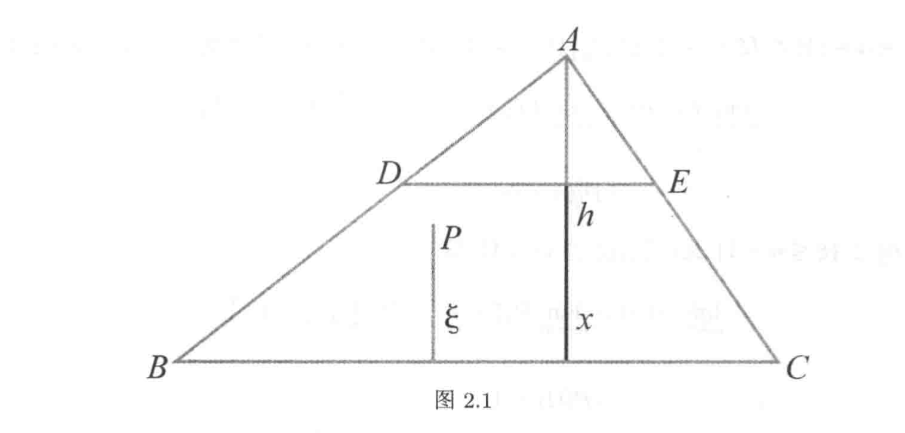
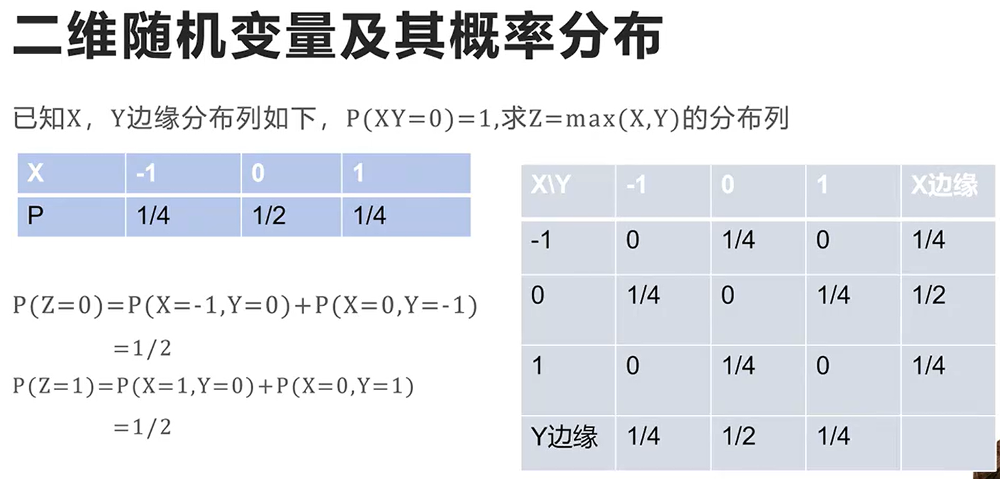
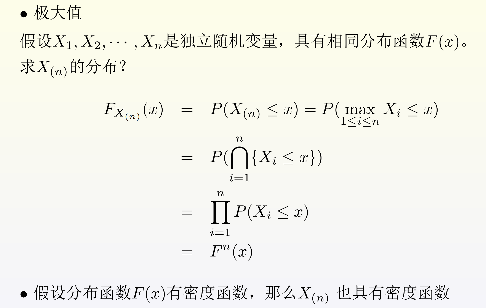
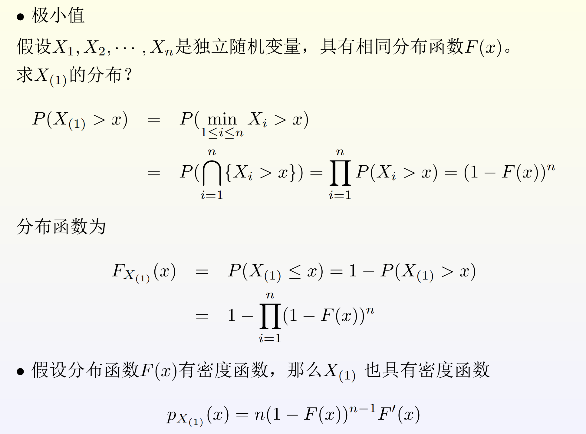
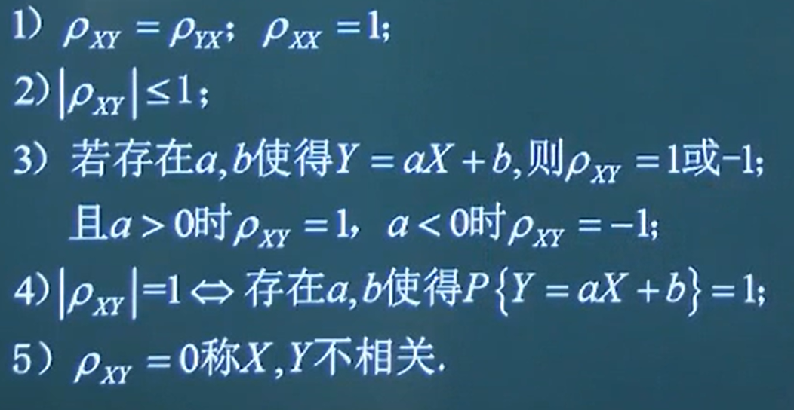
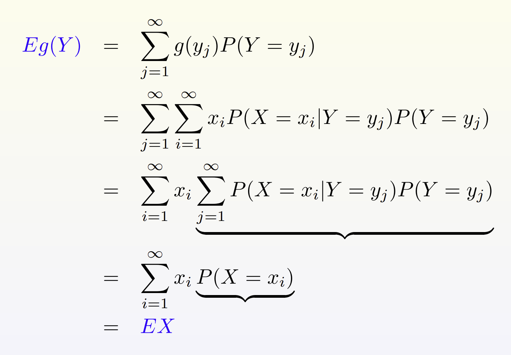
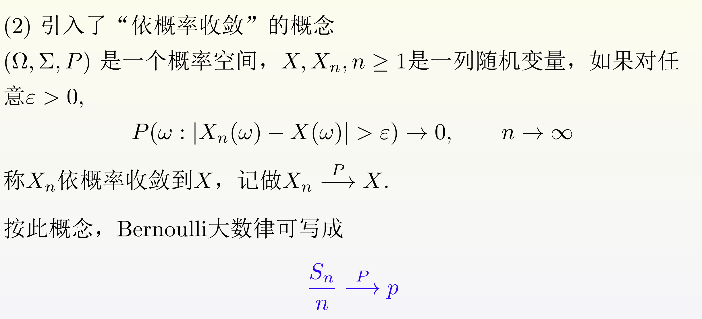

> 绝版史课来了

# 概率论（H）

> 任课教师：苏中根

!!! note "成绩组成"
    - 点名+作业：20%
    - 小测：20%
    - 期末：60%

!!! success "Ref"
    <https://www.kailqq.cc/NOTE/Probability/>

## 几何概型

样本空间$\Omega$含有不可数个基本事件的结果，每个事件的概率为0。同时$\Omega$是$R^n$的可测区域，事件$A$是$\Omega$的可测子集。

$P(A)= \frac{m(A)}{m(\Omega)}$，其中$m(A)$是$A$的测度。

!!! note "Buffon 投针"
    - 一根长度为$l$的针，投在一张画满间距为$d$的平行线的平面上（$l<d$）。求针与线相交的概率。
        - 以针的任意位置为样本点，该点可由针的中点与最接近的线的距离$x$，以及针的倾斜角$\theta$确定。
        - 样本空间$\Omega = \{(x,\theta)|0\leq x\leq \frac{d}{2},0\leq \theta \leq \pi\}$为一矩形。
        - 其中，与线相交的事件$A = \{(x,\theta)|x\leq \frac{l}{2}\sin\theta\}$。
        - 则$P(A) = \frac{2l}{\pi d}$。（面积比）
## 概率空间

$P(\bigcup_{i=1}^{m}A_i) \leq \sum_{i=1}^{m}P(A_i)$

$LHS = \sum_{i=1}^{m}P(A_i) - \sum_{i \ne j}^{m}P(A_i \cap A_j)+\cdots + (-1)^{m-1}P(\bigcap_{i=1}^{m}A_i)$

!!! defination "全概率公式"
    若$B_1,B_2,\cdots,B_n$是样本空间$\Omega$的一个划分，即$B_i \cap B_j = \emptyset$，$\bigcup_{i=1}^{n}B_i = \Omega$，则对任意事件$A$有$P(A) = \sum_{i=1}^{n}P(A|B_i)P(B_i)$。

!!! defination "贝叶斯公式"
    若$B_1,B_2,\cdots,B_n$是样本空间$\Omega$的一个划分，即$B_i \cap B_j = \emptyset$，$\bigcup_{i=1}^{n}B_i = \Omega$，则对任意事件$A$有$P(B_i|A) = \frac{P(A|B_i)P(B_i)}{\sum_{j=1}^{n}P(A|B_j)P(B_j)}$。

## 随机变量
### 离散型随机变量

- Possion分布
    - $X$取非负整数，$P(X=k) = \frac{\lambda^k}{k!}e^{-\lambda}$
    - 用于描述单位时间内某事件发生的次数
- 下面两种分布都在成功概率为$p$的伯努利试验中使用
- 二项分布
    - $X$取非负整数，$P(X=k) = C_n^k p^k(1-p)^{n-k}$
    - 用于描述$n$次独立重复试验中成功次数的分布
- 几何分布
    - $X$取非负整数，$P(X=k) = p(1-p)^{k-1}$
    - 用于描述$n$次伯努利试验中第$k$次才得到第一次成功的概率

### 连续型随机变量
分布列$X$的概率密度函数$f(x)$满足：

1. $f(x) \geq 0$
2. $\int_{-\infty}^{+\infty}f(x)dx = 1$
3. $P(X \in B) = \int_{B}f(x)dx$

!!! defination "分布函数"
    称 $F(x) = P(\xi \leq x)$ 为随机变量$\xi(\omega)$的分布函数。

    - 具有以下性质：
        - $P(a \leq \xi \leq b) = F(b) - F(a)$
        - 单调不减性：$a \leq b \Rightarrow F(a) \leq F(b)$
        - $F(-\infty) = 0, F(+\infty) = 1$
        - 右连续性：$\lim_{x \to x_0^+}F(x) = F(x_0)$
        - $F(x)=\int_{-\infty}^{x}f(t)dt$
    ??? example "example"
        
        - 在三角形$ABC$内任取一点$P$，$P$到$BC$的距离为$\xi$，求$\xi$的分布函数。
            - 设BC边上高为$h$，$x \leq 0$时，$F(x) = 0$；$0 \leq x \leq h$时，在三角形内作平行于BC的DE，其与BC的距离为$x$，则$\{\xi \leq x\}$表示点P落在梯形DECB内。
            - 
            - $P(\xi \leq x) = \frac{S_{DECB}}{S_{ABC}} = 1 - (1-\frac{x}{h})^2$
            - $x \geq h$时，$F(x) = 1$
            - 则$F(x) = \begin{cases} 0 & x \leq 0 \\ 1-(1-\frac{x}{h})^2 & 0 \leq x \leq h \\ 1 & x \geq h \end{cases}$

- 常见的连续型随机变量：
    - 均匀分布
        - 向$(a,b)$区间内随机取点
        - 每一点是等可能的，即$P(X = x) = 0$
        - 则$P(X \in A) = \frac{m(A)}{m(\Omega)} = \frac{|A|}{b-a}$
    - 指数分布
        - $X$取非负实数，$f(x) = \begin{cases} \lambda e^{-\lambda x} & x \geq 0 \\ 0 & x < 0 \end{cases}$
        - $P(X \gt x) = e^{-\lambda x}$
        - 通常用于描述使用寿命等（使用寿命大于x的概率是$e^{-\lambda x}$）
        - 无记忆性：$P(X \gt s+t|X \gt s) = P(X \gt t)$
    - 正态分布
        - $X$取实数，$f(x) = \frac{1}{\sqrt{2\pi}\sigma}e^{-\frac{(x-\mu)^2}{2\sigma^2}}$
        - 记为$N(\mu,\sigma^2)$
        - 对标准正态分布，$\mu = 0, \sigma = 1$，则$P(X \leq x) = \Phi(x)$
        - 对于一般的$\xi$ ~ $N(\mu,\sigma^2)$，记$Z = \frac{\xi - \mu}{\sigma}$，则$Z$ ~ $N(0,1)$, $P(\xi \leq x) = \Phi(\frac{x-\mu}{\sigma})$

### 一般随机变量

??? example "example"
    $P(X=0) = \frac{1}{2}$  
    $P(X>x) = \frac{1}{2} e^{-x}, x \geq 0$

## 随机向量

给定概率空间$(\Omega, \mathcal{F}, P)$，定义在其上的随机向量$\xi = (\xi_1,\xi_2,\cdots,\xi_n)$，其中$\xi_i$是定义在$(\Omega, \mathcal{F}, P)$上的随机变量。

### 离散型随机向量

假定$X$取值为$x_1,x_2,\cdots,x_n$，$Y$取值为$y_1,y_2,\cdots,y_m$，则记$P(X=x_i,Y=y_j) = p_{ij}, i,j = 1,2...$。

有$\Sigma p_{ij} = 1$，$p_{ij} \geq 0$。

#### 联合分布

$P(X<x,Y<y) = \Sigma_{i:x_i<x,j:y_j<y}p_{ij}$

#### 边际分布

$X,Y$的分布可由$p_{ij}$得到。

$P(X=x_i) = p_{i\cdot} = \Sigma_{j=1}^{\infty}p_{ij}$，且$\Sigma p_{i\cdot} = 1$

类似可得Y

!!! note "联合分布与边际分布"
    - 联合分布：$P(X=x_i,Y=y_j) = p_{ij}$
    - 边际分布：$P(X=x_i) = p_{i\cdot}$
    - 边际分布由联合分布唯一确定，但边际分布不能唯一决定联合分布。

!!! note "卷积公式"
    假设$X,Y$相互独立，密度函数分别为$f_X(x),f_Y(y)$，则$Z = X+Y$的密度函数为$f_Z(z) = \int_{-\infty}^{+\infty}f_X(x)f_Y(z-x)dx$

!!! note "e.g."
    

#### 条件分布
给定$X=x_i$的情况下，$Y$可取值$y_1,y_2,\cdots$

概率为$P(Y=y_j|X=x_i) = \frac{P(X=x_i,Y=y_j)}{P(X=x_i)} = \frac{p_{ij}}{p_{i\cdot}}$

条件分布列$Y|X = x_i ~ \begin{cases} y_1 & y_2 & \cdots \\ \frac{p_{i1}}{p_{i\cdot}} & \frac{p_{i2}}{p_{i\cdot}} & \cdots \end{cases}$

类似可得$X|Y = y_j$

#### 独立性

假设$(X,Y)$是如上所述的独立性随机向量，若$\forall i,j$有$P(X=x_i,Y=y_j) = P(X=x_i)P(Y=y_j)$，则称$(X,Y)$是独立的。

### 连续型随机向量

给定概率空间$(\Omega, \mathcal{F}, P)$，$(X,Y)$是定义在其上的随机向量，若存在$p(x,y) \ge 0$使得$\int_{-\infty}^{+\infty}\int_{-\infty}^{+\infty}p(x,y)dxdy = 1$，且对于任何Borel集$A,B$有$P(X \in A, Y \in B) = \int_{A}\int_{B}p(x,y)dxdy$，则称$(X,Y)$是连续型随机向量，具有密度函数$p(x,y)$。

特别的，对任意$x,y \in R$，$P(X<x,Y<y) = \int_{-\infty}^{x}\int_{-\infty}^{y}p(u,v)dudv$。

#### 边际分布

显然，若$(X,Y)$是连续型随机向量，则$X,Y$也是连续型随机变量，其边际分布为$p_X(x) = \int_{-\infty}^{+\infty}p(x,y)dy$，$p_Y(y) = \int_{-\infty}^{+\infty}p(x,y)dx$。

同样也有，联合分布唯一决定边际分布，但边际分布不能唯一决定联合分布。

!!! note "例"
    - 矩形上的均匀分布
        - 假设矩形$(a,b) \times (c,d)$，如果随机向量$(X,Y)$具有密度函数$p(x,y) = \begin{cases} \frac{1}{(b-a)(d-c)} & a \leq x \leq b, c \leq y \leq d \\ 0 & \text{其他} \end{cases}$，则称$(X,Y)$在矩形上服从均匀分布。
        - 于是有$P(X<x) = P(X<x,Y<\infty) = \int_{-\infty}^{x}\int_{-\infty}^{+\infty}p(u,v)dudv = \int_{a}^{x}\int_{c}^{d}\frac{1}{(b-a)(d-c)}dudv = \begin{cases} 0 & x \leq a \\ \frac{x-a}{b-a} & a \leq x \leq b \\ 1 & x \geq b \end{cases}$
        - 因此$X$是$(a,b)$上的均匀分布，$Y$是$(c,d)$上的均匀分布。
    - 联合正态分布
        - 若$(X,Y)$具有密度函数$p(x,y) = \frac{1}{2\pi\sigma_1\sigma_2\sqrt{1-\rho^2}}e^{-\frac{1}{2(1-\rho^2)}[\frac{(x-\mu_1)^2}{\sigma_1^2}-2\rho\frac{(x-\mu_1)(y-\mu_2)}{\sigma_1\sigma_2}+\frac{(y-\mu_2)^2}{\sigma_2^2}]}$，则称$(X,Y)$服从联合正态分布。$(X,Y)$~$N(\mu_1,\mu_2,\sigma_1^2,\sigma_2^2,\rho)$
        - 边际分布：经过计算，$X$~$p_X(x) = \int_{-\infty}^{+\infty}p(x,y)dy = \frac{1}{\sqrt{2\pi}\sigma_1}e^{-\frac{(x-\mu_1)^2}{2\sigma_1^2}}$，$Y$同理。

#### 条件分布
TBD
### 随机向量的计算与变换
TBD

### 极值随机变量
假设$X_1,X_2,\cdots,X_n$是随机变量，对$\omega \in \Omega$，将$X_1(\omega),X_2(\omega),\cdots,X_n(\omega)$进行排序，得到$X_{(1)}(\omega) \leq X_{(2)}(\omega) \leq \cdots \leq X_{(n)}(\omega)$，则称$X_{(1)},X_{(2)},\cdots,X_{(n)}$是次序随机变量，其中$X_{(1)}$称为极小值，$X_{(n)}$称为极大值，$X_{(k)}$称为第k小值。
#### 极值分布

## 数学期望
- 离散型随机变量：$E(X) = \sum_{i=1}^{\infty}x_i P(X=x_i)$
    - 退化分布：$E(X) = x_0$
    - 两点分布：$E(X) = p$
    - 二项分布：$E(X) = np$
    - Possion分布：$E(X) = \lambda$
    - 几何分布($P(X=k) = p(1-p)^{k-1}$)：$E(X) = \frac{1}{p}$
- 连续型随机变量：$E(X) = \int_{-\infty}^{+\infty}xf(x)dx$
    - 均匀分布：$E(X) = \frac{a+b}{2}$
    - 指数分布：$E(X) = \frac{1}{\lambda}$
    - 正态分布：$E(X) = 0$

### 数学期望性质

- $E(aX+b) = aE(X)+b$
- $E(X+Y) = E(X) + E(Y)$
- 对于独立的$X,Y$，其乘积期望等于期望乘积：$E(XY) = E(X)E(Y)$

## 方差

$Var(X) = E((X-E(X))^2)$（定义）$= E(X^2) - E^2 (X)$（平方的期望-期望的平方）

- 由此可以得到一种计算“平方的期望”的方法：$E(X^2) = E^2 (X) + Var(X)$

!!! example "例题"
    - 证明：如果$X,Y$独立，那么$Var(XY) = Var(X)Var(Y) + Var(X)E^2 (Y) + Var(Y)E^2 (X)$
        - $Var(XY) = E(X^2 Y^2) - E^2(XY)$
        - $= E(X^2)E(Y^2)$（由于$X,Y$独立，其平方也独立）$- E^2(X)E^2(Y)$
        - $= (E^2 (X) + Var(X))(E^2 (Y) + Var(Y)) - E^2(X)E^2(Y)$
        - $= Var(X)Var(Y) + Var(X)E^2 (Y) + Var(Y)E^2 (X)$

- 二项分布：$Var(X) = np(1-p)$
- 几何分布：$Var(X) = \frac{1-p}{p^2}$
- Possion分布：$Var(X) = \lambda$
- 均匀分布：$Var(X) = \frac{(b-a)^2}{12}$
- 指数分布：$Var(X) = \frac{1}{\lambda^2}$
- 正态分布：$Var(X) = \sigma^2$

### 方差性质

- $Var(aX+b) = a^2Var(X)$
- $Var(X+Y) = Var(X) + Var(Y) + 2Cov(X,Y)$，其中$Cov(X,Y) = E(XY) - E(X)E(Y)$（协方差）
- 对于独立的$X,Y$，$Cov(X,Y) = 0$，于是和的方差等于方差之和$Var(X+Y) = Var(X) + Var(Y)$

!!! note "Chebyshev不等式"
    对任意随机变量$X$，有$P(|X-E(X)| \gt \varepsilon) \leq \frac{Var(X)}{\varepsilon^2}$

## 协方差和相关系数

都是对于两个随机变量的概念

- 定义均值向量：$\vec{\mu} = (EX, EY)$
- 协方差：$Cov(X,Y) = E[(X-E(X))(Y-E(Y))] = E(XY) - E(X)E(Y)$
    - $Cov(X,X) = Var(X)$
    - $Cov(X,c) = 0$
    - $Cov(aX,bY) = abCov(X,Y)$
    - $Cov(X_1 + X_2, Y) = Cov(X_1,Y) + Cov(X_2,Y)$
- 相关系数：$\rho_{XY} = \frac{Cov(X,Y)}{\sqrt{Var(X)Var(Y)}}$
    - 性质：
    - 

!!! note "柯西施瓦兹不等式"
    $E[|X-E(X)||Y-E(Y)|] \leq \sqrt{E^2 [X-E(X)] E^2 [Y-E(Y)]}$

### 协方差矩阵

若$X,Y$的方差存在，定义$\Sigma = \begin{pmatrix}Var(X) \space Cov(X,Y)\\Cov(X,Y) \space Var(Y)\end{pmatrix}$为协方差矩阵

我们知道如果$X,Y$独立，那么$Cov(X,Y) = 0$，但是反过来就不成立了，那么如果反过来，$Cov(X,Y) = 0$，称$X,Y$不相关。

### 全期望公式

$E(E(X|Y)) = E(X)$，以及$E(E(Y|X)) = E(Y)$

证明：

## 矩

- $k$阶原点矩：$E(X^k)$
- $k$阶中心矩：$E((X-E(X))^k)$

常见的一些分布的矩：

- $X$ ~ $N(0,\sigma^2): E(x^{2k}) = (2k-1)!!\sigma^{2k}$
- $X$ ~ $P(\lambda): E(X^k) = \lambda^k$

## 特征函数

- 定义：$\varphi(t) = E(e^{itX}) = E \cos(tX) + iE \sin(tX), t \in R$
- 若$X$ ~ $F(x)$，则$\varphi(t) = \int_{-\infty}^{+\infty}e^{itx}f(x)dx = \int_{-\infty}^{+\infty}e^{itx}dF(x)$

### 性质

- $\varphi(0) = 1$
- $|\varphi(t)| \leq 1 = \varphi(0)$
- $\varphi(-t) = \overline{\varphi(t)}$
- $\varphi(t)$在$R$上一致连续

令$\varphi_X(t) = E(e^{itX})$，则有：$E(e^{it(aX+c)}) = e^{itc}\varphi_X(at)$

若$X,Y$独立，则$Z = X+Y$的特征函数为$\varphi_Z(t) = \varphi_X(t)\varphi_Y(t)$，可推广到N个独立随机变量。

## 概率极限理论

以下三个定理（伯努利大数定律，中心极限定理，Poisson 极限定理）只涉及伯努利试验：

### 伯努利大数定律

!!! definition "大数律"
    若$S_n$ ~ $B(n,p)$，则$n \to \infty$时，$\frac{S_n}{n} \to p$。

伯努利大数律：$P(\omega: |\frac{S_n(\omega)}{n} - p| \gt \varepsilon) \to 0, n \to \infty$

- 这解释了频率接近概率的现象
- 引入了依概率收敛的概念
    - 

### 拉普拉斯中心极限定理

### Poisson 极限定理

