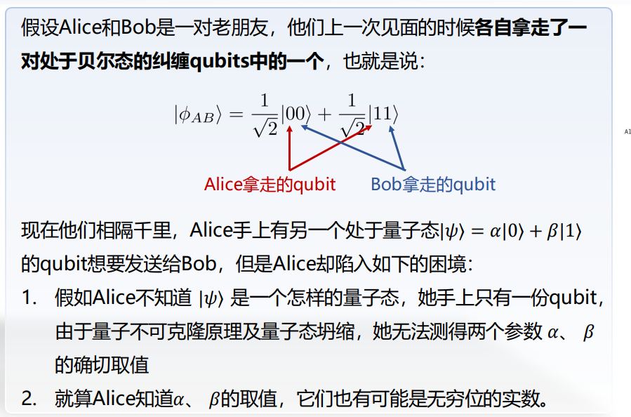
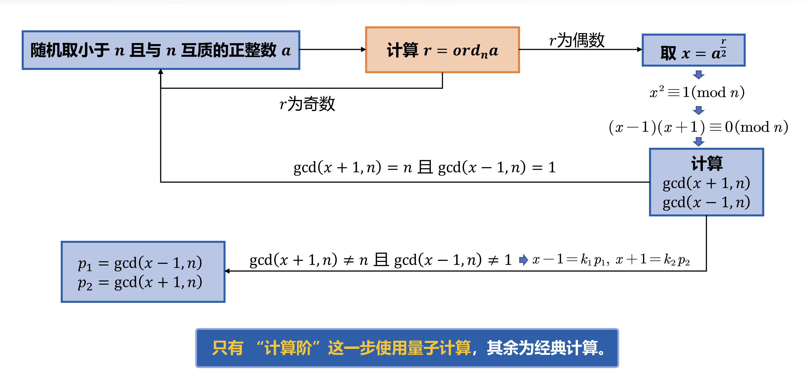

> 谁来了？

# 量子计算理论基础与软件系统

> 任课教师：卢丽强

!!! note "Ref"
    https://note.hobbitqia.cc/Quan/

!!! note "作业"
    - [hw1](./assets/QuantumComputation/hw/hw1.pdf)
    - [hw2](./assets/QuantumComputation/hw/hw2.pdf)

!!! note "实验报告"
    - [lab1](./assets/QuantumComputation/lab/lab1.pdf)
    - [lab2](./assets/QuantumComputation/lab/lab2.pdf)

## 量子态与量子门

!!! note "量子计算机的 DiVincenzo 判据"
    1. 具有可操控的量子比特，并具有可扩充性
    2. 能够将量子比特的状态初始化为简单基准状态（$|0\rangle$ or $|1\rangle$）
    3. 具有长相干退相干时间（在量子比特消亡前完成计算）
    4. 具有一组通用量子门
    5. 能够测量特定量子比特（完成量子信息到经典信息的转换）

### 量子态

经典比特具有 0 和 1 两种状态，而量子比特具有 $|0\rangle$ 和 $|1\rangle$ 两种基态，且可以这之外的状态：表示为基态的线性组合 $|\varphi\rangle = \alpha|0\rangle + \beta|1\rangle$

任意两个单位正交基都可以作为量子态的基矢态，如另一组常用的单位正交基为 $|+\rangle = \frac{1}{\sqrt{2}}(|0\rangle + |1\rangle)$ 和 $|-\rangle = \frac{1}{\sqrt{2}}(|0\rangle - |1\rangle)$

$|0\rangle$ 和 $|1\rangle$ 可以用向量形式表示，即 $|0\rangle = \begin{pmatrix}1 \\ 0\end{pmatrix}$，$|1\rangle = \begin{pmatrix}0 \\ 1\end{pmatrix}$，则 $|\varphi\rangle = \begin{pmatrix}\alpha \\ \beta\end{pmatrix}$，此时 $\alpha$ 和 $\beta$ 称为复系数（振幅）

### 内积

当我们测量量子态时，会发生量子态的坍缩（又称为量子态的投影），得到 $|0\rangle$ 的概率为 $|\alpha|^2$，得到 $|1\rangle$ 的概率为 $|\beta|^2$，且有 $|\alpha|^2 + |\beta|^2 = 1$（归一化条件）

量子比特的状态用二维复向量空间中的向量表示时，其表示必须满足以下性质：

1. 欧几里得范数为 1，即 $\langle \varphi|\varphi\rangle = 1$，其中 $\langle \varphi|$ 是 $|\varphi\rangle$ 的共轭转置
2. 向量的各分量为复数

### 量子比特的几何表示

Bloch 球可以可视化单个量子比特的状态，由极坐标可得到某个量子态 $|\varphi\rangle = c_0 |0\rangle + c_1 |1\rangle$，系数可表示为 $c_0 = \cos(\theta/2)$，$c_1 = e^{i \phi}\sin(\theta/2)$，$\theta$ 和 $\phi$ 视为球坐标系中的分量，即该量子态表示为 Bloch 球上的某个点 $(x,y,z)$，其中 $x = \sin \theta \cos \phi$，$y = \sin \theta \sin \phi$，$z = \cos \theta$

其中 $\theta$ 是极角，$\phi$ 是方位角，当系数（振幅）为实数时，$\phi = 0$

### 张量积

张量积将两个向量空间的向量合并成一个更大的向量空间，可表示为 $|\varphi\rangle \otimes |\psi\rangle$。张量积可以获得多个量子态的复合量子态。记 $\varphi\rangle = \alpha|0\rangle + \beta|1\rangle$，$|\psi\rangle = \gamma|0\rangle + \delta|1\rangle$，则 $|\varphi\rangle \otimes |\psi\rangle = \alpha\gamma|00\rangle + \alpha\delta|01\rangle + \beta\gamma|10\rangle + \beta\delta|11\rangle = \begin{pmatrix}\alpha\gamma \\ \alpha\delta \\ \beta\gamma \\ \beta\delta\end{pmatrix}$

对于两个量子比特，其基态即为 00、01、10、11 四种状态，表示为 $|00\rangle = |0\rangle \otimes |0\rangle$，$|01\rangle = |0\rangle \otimes |1\rangle$，$|10\rangle = |1\rangle \otimes |0\rangle$，$|11\rangle = |1\rangle \otimes |1\rangle$，且双量子比特表示为 $|\varphi\rangle = \alpha_{00}|00\rangle + \alpha_{01}|01\rangle + \alpha_{10}|10\rangle + \alpha_{11}|11\rangle$，其中 $\sum |\alpha_{ij}|^2 = 1$。

### 贝尔态

贝尔态是两个量子比特的重要纠缠态，定义为：

$|\Phi^+\rangle = \frac{1}{\sqrt{2}}(|00\rangle + |11\rangle)$

$|\Phi^-\rangle = \frac{1}{\sqrt{2}}(|00\rangle - |11\rangle)$

$|\Psi^+\rangle = \frac{1}{\sqrt{2}}(|01\rangle + |10\rangle)$

$|\Psi^-\rangle = \frac{1}{\sqrt{2}}(|01\rangle - |10\rangle)$

四个贝尔状态构成的集合称为贝尔基，任何两个量子比特的量子态向量都可以表示为贝尔基的线性组合。

### 单量子门

- 量子非门：
    - $X = \begin{pmatrix}0 & 1 \\ 1 & 0\end{pmatrix}$
    - 即使 $\varphi\rangle = \alpha|0\rangle + \beta|1\rangle$ 经过非门处理后复系数互换，$X|\varphi\rangle = \alpha|1\rangle + \beta|0\rangle$
    - 易推知，单量子比特的任意量子门均可表示为 $2 \times 2$ 的矩阵

- Hadamard 门：
    - $H = \frac{1}{\sqrt{2}}\begin{pmatrix}1 & 1 \\ 1 & -1\end{pmatrix}$
    - 当 H 门作用于 $|0\rangle$ 和 $|1\rangle$ 时，可得到叠加态：$H|0\rangle = \frac{1}{\sqrt{2}}(|0\rangle + |1\rangle) = |+\rangle$，$H|1\rangle = \frac{1}{\sqrt{2}}(|0\rangle - |1\rangle) = |-\rangle$
- 泡利矩阵
    - 上面的量子非门 X 门也称为泡利 X 矩阵，另外还有泡利 Y 矩阵和泡利 Z 矩阵
    - $Y = \begin{pmatrix}0 & -i \\ i & 0\end{pmatrix}$，$Z = \begin{pmatrix}1 & 0 \\ 0 & -1\end{pmatrix}$，对应的门分别称为 Y 门和 Z 门
    - 在 Bloch 球上，X、Y、Z 门分别对应绕 X、Y、Z 轴旋转 $\pi$ 弧度

量子计算本质是**酉矩阵**计算，即只有酉矩阵才能作为量子门对应的矩阵——酉矩阵保证了其作用于量子态后得到的结果依旧是一个合法的量子态。N 比特量子门对应的矩阵为 $2^N \times 2^N$ 的酉矩阵。

酉矩阵：酉矩阵的逆等于它的共轭转置

厄米矩阵：厄米矩阵等于其自身的共轭转置

共轭：$a_{ij} = m + ni$，则共轭为 $a_{ij}^* = m - ni$

转置：矩阵的行列互换

共轭转置：矩阵的每个元素取共轭后再转置

（我去，不早说！）

### 多量子门

先介绍两个概念

纠缠判定：如果一个多量子比特系统可以被分解为多个单量子比特的张量积，则该系统是可分的、无关的；否则是不可分的、纠缠的。

复合系统：量子比特可以做张量积，量子门也可以。对一个多量子比特系统施加量子门时可看作是该量子门分解后的结果施加于每个单量子比特上，最后再复合。

- CNOT 门（受控非门）
    - CNOT 门是一个两量子比特门，作用于控制量子比特和目标量子比特上，当控制量子比特为 $|1\rangle$ 时，目标量子比特做非运算，否则保持不变
    - 矩阵表示为 $CNOT_{HIGH} = \begin{pmatrix}1 & 0 & 0 & 0 \\ 0 & 1 & 0 & 0 \\ 0 & 0 & 0 & 1 \\ 0 & 0 & 1 & 0\end{pmatrix}$（控制量子比特为高位），$CNOT_{LOW} = \begin{pmatrix}1 & 0 & 0 & 0 \\ 0 & 0 & 0 & 1 \\ 0 & 0 & 1 & 0 \\ 0 & 1 & 0 & 0\end{pmatrix}$（控制量子比特为低位）
    - CNOT 门可以将两个量子比特纠缠起来，如 $CNOT_{HIGH}(H|0\rangle \otimes |0\rangle) = \frac{1}{\sqrt{2}}(|00\rangle + |11\rangle) = |\Phi^+\rangle$
- SWAP 门
    - SWAP 门是一个两量子比特门，作用于两个量子比特上，交换它们的状态
    - 矩阵表示为 $SWAP = \begin{pmatrix}1 & 0 & 0 & 0 \\ 0 & 0 & 1 & 0 \\ 0 & 1 & 0 & 0 \\ 0 & 0 & 0 & 1\end{pmatrix}$
    - $SWAP|00\rangle = |00\rangle$，$SWAP|01\rangle = |10\rangle$，$SWAP|10\rangle = |01\rangle$，$SWAP|11\rangle = |11\rangle$
    - CSWAP 门是受控 SWAP 门，当控制量子比特为 $|1\rangle$ 时，交换另外两个量子比特的状态，否则保持不变
- Toffoli 门（CCNOT 门）
    - Toffoli 门是一个三量子比特门，作用于两个控制量子比特和一个目标量子比特上，当两个控制量子比特均为 $|1\rangle$ 时，目标量子比特做非运算，否则保持不变

### 量子隐形传态

100 年之内没人看得懂这几页 PPT

### 量子计算的并行性

Deutsch问题：利用最少且足够的计算次数，判断 $f: \{0,1\}^n \to \{0,1\}^n$ 是平衡函数（$f(x) = 0$ 的数量等于 $f(x) = 1$ 的数量）还是常数函数（$f(x) \equiv 0$ 或 $f(x) \equiv 1$），经典计算机需要计算 $\frac{2^n}{2} + 1$ 次才能确定，而量子计算机只需一次。

Oracle: TBD

!!! note "Oracle 电路简化"
    $HH = I$，$XHX = Z$，$(H \otimes H) CNOT_{low} (H \otimes H) = CNOT_{high}$

## 量子测量

### 线性代数回顾

谱分解：$n$ 阶复数域正规矩阵 $A = Q \Lambda Q^{\dagger} = \Sigma_i^n \lambda_i |e_i\rangle \langle e_i|$，其中 $Q$ 是酉矩阵，$\Lambda$ 是对角矩阵，对角线上的元素（$\lambda_i$）为 $A$ 的特征值，$Q = [|v_1\rangle, |v_2\rangle, ..., |v_n\rangle]$，$|v_i\rangle$ 是 $A$ 的特征向量，$|e_i\rangle$ 是标准正交基

完备性方程：$\Sigma_i |e_i\rangle \langle e_i| = I$

对于 $k$ 个基向量，定义 $k$ 个投影算符 $P_i = |e_i\rangle \langle e_i|$，则有：

- $\Sigma_i P_i = I$
- $P_i P_j = 0$ for $i \neq j$
- $P_i^2 = P_i = P_i P_i^{\dagger}$

### Measurement

投影测量采用一个可观测量矩阵 $A$ 来表示，是一个待观测系统的状态空间上的厄米算子，可被谱分解为 $A = \Sigma_i \lambda_i P_i$，其中 $\lambda_i$ 是 $A$ 的特征值，$P_i$ 是对应的投影算符；在对结果 $|\psi\rangle$ 测量后，得到结果 $i$ 的概率为 $p_i = p(\lambda = \lambda_i) = \langle \psi|P_i|\psi\rangle$，测量后系统状态坍缩为 $\frac{P_i |\psi\rangle}{\sqrt{p_i}}$

观测量的平均值为 $\langle A \rangle = \langle \psi|A|\psi\rangle = \Sigma_i \lambda_i p(\lambda = \lambda_i)$；标准差为 $\Delta A = \sqrt{\langle A^2 \rangle - \langle A \rangle^2}$

#### 单比特测量

对单量子比特 $|\psi\rangle = \alpha|0\rangle + \beta|1\rangle$ 进行测量，使用投影算子 $P_0 = |0\rangle \langle 0| = \begin{pmatrix}1 & 0 \\ 0 & 0\end{pmatrix}$ 和 $P_1 = |1\rangle \langle 1| = \begin{pmatrix}0 & 0 \\ 0 & 1\end{pmatrix}$，作用于态矢量时，得到 0 态的概率为 $p_0 = \langle \psi|P_0|\psi\rangle = |\alpha|^2$，测量后状态为 $\frac{\alpha}{|\alpha|} |0\rangle$；得到 1 态的概率为 $p_1 = \langle \psi|P_1|\psi\rangle = |\beta|^2$，测量后状态为 $\frac{\beta}{|\beta|} |1\rangle$

### 量子图灵机

## 量子算法

### Quantum Fourier Transform

使用 $n$ 给量子比特进行量子傅里叶变换，共有 $2^n$ 个基态，量子傅里叶变换将基态 $|j\rangle$ 映射为：
$$QFT|j\rangle = \frac{1}{\sqrt{2^n}} \sum_{k=0}^{2^n-1} e^{\frac{2\pi i}{2^n}jk} |k\rangle$$

基态 $|j\rangle$ 可表示为 $|\overline{j_1 j_2 ... j_n}\rangle$，其中 $j_1$ 是高位，$j_n$ 是低位，即 $j = j_1 2^{n-1} + j_2 2^{n-2} + ... + j_n 2^0$；同时小数 $2^{-1} j_1 + 2^{-2} j_2 + ... + 2^{-n} j_n$ 可表示为 $\overline{0.j_1 j_2 ... j_n}$，则 QFT 可表示为张量积形式：

$$ QFT|\overline{j_1 j_2 ... j_n}\rangle = \frac{1}{\sqrt{2^n}} (|0\rangle + e^{2\pi i \overline{0.j_n}} |1\rangle) (|0\rangle + e^{2\pi i \overline{0.j_{n-1} j_n}} |1\rangle) ... (|0\rangle + e^{2\pi i \overline{0.j_1 j_2 ... j_n}} |1\rangle) $$

#### 单比特系统下的 QFT

#### 双比特系统下的 QFT

### 量子相位估计 QPE

用于估计给定量子态的相位信息，基本目标是：**对于一个酉矩阵 $U$，已知其本征态 $|\mu\rangle$，对应本征值为 $e^{2\pi i \phi}$，那么有 $U|\mu\rangle = e^{2\pi i \phi} |\mu\rangle$：给定 $U$ 和 $|\mu\rangle$，估计相位 $\phi$ 的值，其中 $\phi \in (0,1]$**

算法流程：

- 初始化：准备两个量子寄存器，一个存储相位估计结果，另一个存储本征态 $|\mu\rangle$
- 作用 H 门：对用于存储相位的量子比特施加 H 门
- 作用受控 U 门：对每个量子比特执行受控 U 门操作（第 𝑗 个量子比特执行受控 $U^{2^{j-1}}$ 门）
- 逆 QFT：对相位寄存器进行逆 QFT 操作，将相位信息转为位信息
- 测量：获得相位估计值

TBD

### Shor 算法

- 同余：若整数 $a$ 和 $b$ 除以正整数 $m$ 后余数相同，则称 $a$ 与 $b$ 对模 $m$ 同余，记作 $a \equiv b \mod m$
- 欧拉函数：对于正整数 $n$，小于等于 $n$ 且与 $n$ 互质的正整数的个数，记作 $\varphi(n)$
    - 如果 $n$ 为质数，则 $\varphi(n) = n - 1$
    - 若 $a, b$ 互质，则 $\varphi(ab) = \varphi(a) \varphi(b)$
    - 若 $ab \equiv 1 (\mod m)$，则称 $a$ 是 $b$ 关于模 $m$ 的乘法逆元
    - 令 $a^r \equiv 1 (\mod n)$ 成立的最小正整数 $r$ 称为 $a$ 关于模 $n$ 的阶
- RSA 非对称加密
    - 获得两个大质数 $p_1, p_2$，计算 $n = p_1 p_2$ 和 $\varphi(n) = (p_1 - 1)(p_2 - 1)$
    - 取和 $\varphi(n)$ 互质的整数 $e$，满足 $e \neq p_1, p_2$
    - 求 $e$ 模 $\varphi(n)$ 的乘法逆元 $d$，即满足 $ed \equiv 1 (\mod \varphi(n))$ 的整数 $d$
    - 公钥为 $(e, n)$，私钥为 $(d)$
    - 因此，要破解 RSA，就先要分解 $n$，得到 $p_1, p_2$，再计算 $\varphi(n)$，最后求出 $d$

Shor Algorithm: 

### Grover 算法

找出未排序数据库中的特定元素，经典计算机需要 $O(N)$ 次查询（遍历），而 Grover 算法只需 $O(\sqrt{N})$ 次查询。（例如找 N 的所有因子）

## 量子纠错

### 基本概念

### 基础量子纠错码

### 稳定子框架与主流量子纠错码

### 容错量子计算

## 量子编译