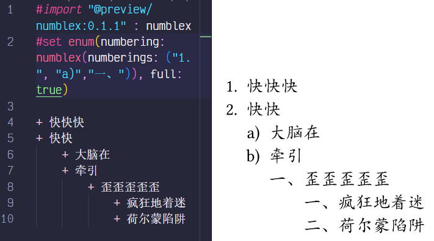

# Typst备忘录

!!! info "记录一下用typst写东西时碰到的问题"
    ~~天下苦LaTeX久矣~~

## 引用
`#import "a": b`相当于`import b from a`

## numblex
导入：
```typst
#import "@preview/numblex:0.1.0": numblex //一般就用这个函数
```

在`enum`类中设置`numbering`属性可以设置列表的编号格式：  


但是如果想让外层不带括号，内层带括号（什么离散普物），就可以用numblex，做到给每一层都单独设置编号格式：  
