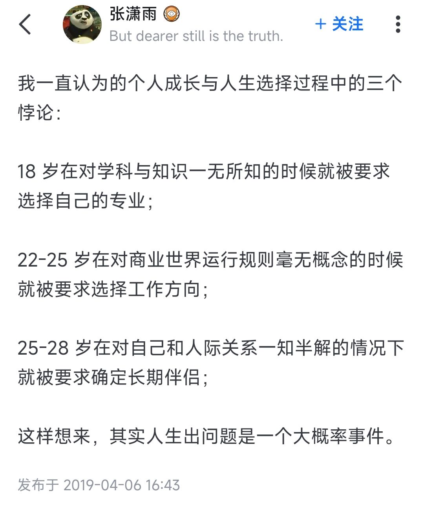

# 如果你高考完暑假里没事干了怎么办

> 这篇文章是我写给母校，即青海油田第一中学2024届的学弟学妹的高考后指南，旨在推荐一些暑假闲暇时可做可感的事项。如果你是其他学校的学生，也可参考本文构思你高考后的暑假生活！

!!! key-point "引言"
    这是我第一次撰写指南类的文章，碍于笔者所见所感片面，观点仅是一孔之见/我自己踩过的坑，可能包含一些自认为正确的无稽之谈，望你多多甄别，选择对自己胃口的内容消化。  
    （正也因此，本文也脱离了老生常谈的“预习大学内容”“打好大学基础”的窠臼，cover了少数笔者自己觉得十分有价值的方面）  
    **Anyway, enjoy your summer!**

## 玩个痛快！

**永远的首选项！**战斗，爽！遥想我当初考完后的第一个周末就完成了人生中第一次通宵（最接近这一成就的经历还是高二熬夜打元气骑士到四点半）（不过也因此重创了身体），好好释放一下是很有必要的，痛快玩吧！  

也毫无必要急匆匆地翻开b站提前找高数or编程的网课看，等大学考试周再看也不急（x。上大学后前两节课讲的就足够把你在暑假里勤苦看了好几p的视频全涵盖了，因此痛快玩吧！  

我唯一推荐的学习内容就是**英语**。高中还未露端倪，在以后的学习生涯中，无论你选择什么样的专业学习怎样的知识，大部分国外的资源/教程/网站远比国内的要来得清晰有效——也不奇怪，毕竟某些技术的起源地就在那边嘛。在你想办法接触到那些知识之前（这是pong都不能pong的滑梯x），先突破语言上的障碍更为优先。现在也有[沉浸式翻译](https://immersivetranslate.com/)等类似的插件，不过机翻总归是没有直接认读好的。Anyway，痛快玩吧！  

## Find an Interest/Hobby

这一点可能是全文中最多余的一部分，这是因为我推测你有很大概率从小就在父母的要求下学过一两门乐器/才艺，也有可能从小就修炼了几个得心应手的电子游戏。有一个属于自己的兴趣爱好几乎会**成千上万**倍地提高你的大学生活——至少在第一个学期里，对家人故乡的思念、面对艰涩课程的无奈、对新地界的无所适从，都可以用你自己的这些喜欢的手艺活排遣疏散。打游戏、读书、弹钢琴吉他、盘核桃、写小说、唱歌、看直播、剪视频、远足，这些老生常谈的活计都有无比巨大的作用。如果你和我一样，早就放弃了小时候学过的某个技艺，建议你重拾起来。

## 考虑考虑以后想学什么

每次看到这段话都很无奈：除非自幼便决心于某个方面矢志不渝，要么是在父母某一方的强烈推动下了解过某个方向，抑或是凭自己的了解对某个学科有着无比浓厚的兴趣（这种兴趣不同于上一个板块的Interest，而是足以支撑其对这个方向不断砥砺向前的精神力量）（这也是为什么某些时候我很羡慕竞赛生：无论出发点如何，他们都在某一领域积攒了足够深厚的基础与兴趣），否则在专业选取时，一个普通孩子只能在父母+亲戚+选专业视频+道听途说来的就业情况等等因素的共同撺掇下敲定，兼之以“不亏高考分”的顾虑，至于学科本身涉及的知识与技术，一概不提，九霄云外——笔者便如此。我常无奈，可能这就是高考选拔这一制度最愚蠢的地方。  

因此，不必太过长远，有完全确定的方向，只在心里大致地、模模糊糊地感受一下，在过去的岁月中，生活中的哪个方面对你有着最浓厚的兴趣吸引力，你觉得花点时间研究它挺好的，最好把这些也加载到未来你考虑专业时的因素中。

??? not-advice "不推荐做的事"
    - **学车**。就个人体验而言，考驾照几乎占去了我大半个暑假+一整个寒假的时间，并且作用时间还在增加（写到这里时我刚刚挂了科目三考试）。你需要牺牲数十个中午与下午，寻求诸多亲戚朋友的接送，将这些时间精力全耗在戈壁滩上的驾校/考试场地，与此同时还要接受喷着敦煌话的教练/考官/车管所工作人员趾高气扬的指挥，这是高中生涯后你第一次有被当成佣人使来唤去的感觉（PS. 大学开学后的军训估计是第二次）。个人感觉把暑假时间放在这上面十分暴殄天物（有时我觉得敦煌的驾校相比外地只有两个好处——花钱少，并且科目三路程简单）。就实际价值而言，我真心感觉“开车是一项生存必备的技能”这句话过于夸张——至少在未来几年内，你绝对没有多少亲自驾车的机会，即便有也能被打车/地铁/公交等完美代替。如果很远的未来后有需求，到时再学也不迟。不过这一点见仁见智，或许你一直渴望驾车驰骋马路的快感——只是希望你不要仅仅因为父母的撺掇与安排就踏上考驾照这条路。
    - **仅就“毕业前景”“专业热门”等考虑专业**。遥想我告知我妈可选的三个专业（计算机科学与技术，人工智能，信息安全）后，我妈隔天激动地告诉我：我上网查了，说信息安全毕业后年薪上百万！——只能说毕业后的薪资待遇，与个人能力有很大关系，同时距离现在而言也很遥远。与之相比，从网上或学长学姐那要来一张心仪/热门专业的课程表/培养方案看看更有参考价值。上b站搜一下那些稀奇古怪的课程都是教什么内容的，在这之后再考虑考虑你对它的热情与学习欲望是否依旧。（不然就会像我一样，天天对着一堆数学的玩意懊悔，当时怎么就走上这条道了）

填报志愿时可参考[这个网站](https://colleges.chat/)的内容，十分详细  

如果你确认了工科专业，也可以参考我同专业学长组的[指南](https://turing2023.tonycrane.cc/summer_study/)

## 一些碎碎念 ＆ 创作初衷

关山难越，冯唐易老。落笔本文时刚刚跨过2024的门槛，距高考结束亦逾半年。二者相比，竟是后者更令笔者怅然惊异。考前的颓唐无力，考时的沉稳乏味，考后的狂欢无拘，出成绩时的意外之喜，奔走填报志愿时的疲劳无语，均已碾入时间滚动的车轮。由此回望，一路走来，暑假期间无比惬意享受，初入大学第一个学期时则艰难跋涉，不得不挣扎于某些痛苦的时刻。  

也就是在这些时刻我萌生了为学弟学妹们创作这一篇指南的想法：我的母校坐落在祁连山和当金山的夹角，青海省与甘肃省两大**GDP巨鳄**的交锋处。学校狭小，设施欠佳，实验物资匮乏，网络媒体的建设无比落后：名气和曝光度都小的惊人，没有公众号，没有官方网站，没有dy和bilibili上的官方账号发表高质量记录视频（不过近年来在@沙漠老师和一众同学的努力下有所改观）。全校最有活力的校友论坛甚至可能是“油田一中万能墙”的QQ号（笑）。闭塞的资源获取渠道，佐之以惨淡的教育资源，就是这样一所学校每年源源不断地着向国土东部胞吐着一届又一届“来自大山深处的孩子”。  

这些只是我对小小母校的诸多不满，和本文的主要内容没有多大关系。在大一上半学期的中旬，每当我怅然无助地缩进寝室被窝时，我就会想，如果当时能有一位前辈写下这样一篇指南（譬如我的大学学长们搭建的[网站](https://turing2023.tonycrane.cc/)），我绝不会经历那么多怆然否定自己的悲伤时刻。因此我希望，这篇文章能够为你们起到一些帮助的作用。不用很多，一丁点也够了。

**言尽于此，祝身心康健，思维活泼，未来明朗！**