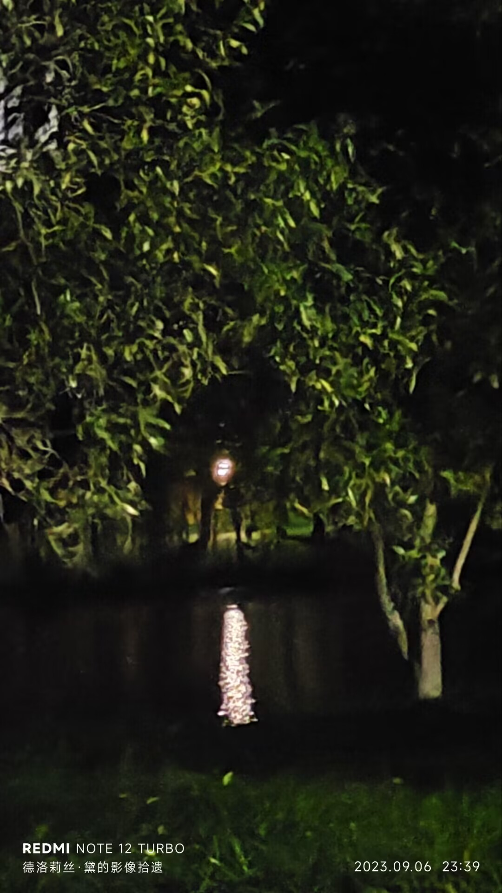

# 故乡

“故乡”听起来正式、文艺、悠扬，但你更喜欢\*家乡\*——面对“家”这个字，你不得不变回一个幼稚的男孩。在阳台、门廊、街道上，来自家乡的风穿透你，指挥几万亿细胞一齐发出嘶鸣。风浪摇动你的双眼，敦促你远望四方。

## 北边有什么？

亚热带气候炮制出的林海荡漾，于你而言是亘古未见的奇观。北方，连霍高速出鞘，纵横贯穿国土的咽喉。你出生在这条高速的一个出口里，因此你坚信应当是“连霍高速”而不是“秦岭淮河”这四个字扮演国家南北的分界线。江苏，安徽，河南，陕西，甘肃，新疆。在强弩之末的甘肃，大名鼎鼎的河西走廊裹挟着连霍，如面包夹着香肠。

由省会向西，经济如绿植般逐渐萎缩消弭，你熟悉的那些老土地名接踵而至，车牌号上的字母却越来越大——\*甘F\*粉墨登场，昭示着它代表的城市从此接管了整个西部。千百年前某位将军恣意抛洒的美酒早已发酵，奔腾流泻在庙堂间利欲熏心的下水道。游客蹒跚于连绵沙山下，叫嚷声早已盖过沙砾愉悦的噎鸣。

初中老师曾说，当年在罗布泊的原子弹残留了不少糟心玩意，放射性元素随风沙迁徙至此，斩钉截铁地植入本地人的基因。从此，爱掉头发的毛病如影随形，幽灵般萦绕在每个敦煌人的头顶。

哦，不，不是敦煌，是\*七里镇\*——青海油田生活基地。油田盘踞于小镇，宝石花物业公司寄宿于油田，组成一条记叙时代的食物链。镇上唯一的高中内，悠扬悦耳的铃声哇哇大叫。学校对面，学生低声咒骂着陈姐小面不知天高地厚的价目表。远处，东坪油苑错落有致，家与沙子被一齐吸入你的肺。更远处，敦格铁路的骨骼沉眠于戈壁……

> __回乐烽前［成功］__：大脑糜烂的深沟中，这是你能找到的最接近\*家乡\*的地方。

## 西边有什么？

寒冷。潮湿。青海湖没有边际。曼妙的雾气自湖面堂堂升起，让人恍惚间忘记它冰凉的体温。雾气上方，怨声载道的乌云盘剥着所剩无几的天空，势必将太阳与星星掖死在苍穹之上。

\*户籍\*显示，你的家乡就在这里。青海。海西。茫崖。直到现在，你都不清楚这劳什子*户籍*是什么鬼东西——青海油田天才般的选址让无数和你一样的孩子在精神上背井离乡，无\*根\*可依。你五六次踏上青海的土地，它像一块木头做的精美雕塑，在户口本上栩栩如生，却对你的来访板起冷硬的面孔。与此相比，户籍、户口、生源地，看起来都如青海湖上的水汽一般模糊渺远。西部，大片大片的荒地憋屈地蜷缩在冷空气下，你看不见哪怕一株草木抬头。看似平原的大地上，海拔正缓慢而坚定地爬升，转眼一瞬间就拔起几百米，宛如被温水一度一度汤镬至死的青蛙。

> __游弋从心［成功］__：这里让你感到的只有陌生。一个陌生的故乡。

## 东边有什么？

在黄土高原与秦岭茏葱交织的地带，赫赫有名的“西北第一城”无奈地拔地而起。很久以前，这里尚且是世上最伟大的城市，百姓如沙漏般灌入长安，把衙门里的公差们润泽得个个脑满肥肠。也是在那个时候，李卫公牵着红拂的手快步逃出了城门，留下一道蚯蚓般的脚印。更早时，王仙客走进宣阳坊，高声打听着无双的去向。还有一段时间里，写着“闯”字的大旗高高飘扬在城楼上方，比如今的赛格购物广场还要高出几个头。

长安街贯穿碑林与雁塔，繁华的街区铸成一把串串香。回民街里，或良心或歹毒的商家错落有致，亟待游客慧眼识珠的挑剔。街道上满是人群，半空中漂浮着陕西话的旋律。你会说陕西话吧？第一条，把“我”换成\*额\*，四声，带鼻音。第二条，把“u”换成“i”。第三条，二声后跟的字变成三声。你只会这么多了，来试试：我去南稍门——\*额七南少门\*。蹩脚的方言无力出口，你更没有勇气宣布这是你的家乡。

>__食髓知味［成功］__：你爱她。你爱这座城市。她的心脏、肺叶、面颊、足弓，与你自己的一样熟悉。

>__逆形忠心［失败］__：而她是背信弃义的爱人，撕毁船票的游轮，不辞而别的朋友。你投入她的怀抱，全心全意希冀着这里成为你的家乡。她却用城墙般僵硬的皮肤否决。

## 南边有什么？

爬山虎与电线杆热烈相拥，静默在通往北教学楼的路上，如自然与机械不惧世俗的联姻。你抬头，太阳在鸟雀背后高悬，把它们的羽毛衬成焦黑一片。在你很小的时候，你曾好奇过为什么鸟端端站在电线上却安然无恙。此时此刻，本应葬身于此的黑色鸟儿死而复生，从电网上空向你投来鄙夷的目光。

南门外，银泰城楼顶被格格不入地塞进天空，如方榫捅进圆卯。雨云在天际汇聚，有时掉下一点碎屑，有时吸纳一些水汽，忒修斯之船般行驶到你的头顶。但是雨悬而未下，如同上天开的小小玩笑——云笼罩着，却把热气也困在地表，令人心生怨怒。

这热气即使在天黑后也如依依不舍的恋人般不肯离去，而这时远处鳞次栉比的高楼上亮起无数矩形的灯光。如果你眼里噙着泪水望去，这些矩形就会被摧毁重塑，膨胀成不规则的一摊鸡蛋清，蛋清外还围绕着一圈又一圈的光的波涛，它们随着你哀伤的呼吸涟漪般扩散，重又激荡着你的心脏，如海浪拍打着礁石。

> __天人感应［成功］__：思念折叠成细若游丝的电波，而后登上万维网，迁徙百万公里，直达你的心际。

__2023年9月__

